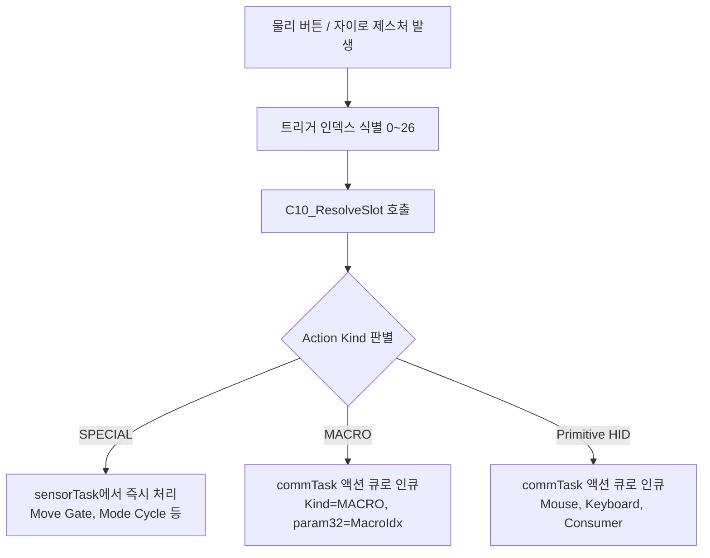

# 웹 기반 사용자 개별화 고도화 — 통합 구현 계획서 (v0410)

## 0. 관련 요구사항 문서
- [[10.ReqDoc_0410_02.md]]

---

## 1. 요구사항 정리 및 결정 요약

| 축 | 확정 사항 | 상세 내용 |
|---|---|---|
| **A. 프로파일 세트** | 다중 설정 환경 (최대 5개) | 상황별/사용자별 독립 설정 (Office, Gaming, Present, TV, Custom) |
| **B. 매크로** | 다단 액션 시퀀스 (최대 8개) | 프로파일당 8개 매크로, 매크로당 최대 8 step, 각 delay ≤ 2000ms |
| **D1. UI 자유도** | 3-View 통합 제공 | Option 1(Slot 중심) + Option 2(Action 중심) + Option 3(Macro Editor) |
| **D2. 트리거 라이브러리** | 확정 27개 (Tier A) | 물리 버튼 15개 + 자이로 제스처 8개 + Tilt 4개 (임계값은 프로파일 전역 관리) |
| **D3. 슬롯 구조** | Global + Mode별 Override | 공통 설정은 Global 슬롯에, Mode별 차이만 overrideMask(비트마스크)로 관리 |
| **D4. 안전 잠금** | 4대 필수 슬롯 잠금 | S1(좌클릭), S5(Move Gate), S12(Mode 전환), S13(페어링) UI 편집 차단 |
| **D5. 실시간 테스트** | Live Test (안전 다이얼로그) | 단일 액션 및 매크로 즉시 전송 테스트 (오작동 방지 확인 팝업 포함) |
| **D6 / R10. 마이그레이션** | 레거시 파일 직접 삭제 (Clean Setup) | 펌웨어 내 불필요한 감지/삭제 로직 없이, 기존 `config_0410.json` 파일 직접 삭제 후 v5 프로파일 시스템만 직접 운용 |

**핵심 설계 목표:**  
프로파일 시스템 × (Global + Mode Override 슬롯) × 매크로 시퀀서 × 3-View Web UI가 **동일한 단일 소스 데이터(Single Source of Truth)의 상호 변환 가능한 표현**으로 일관되게 동작해야 함.

---

## 2. 아키텍처 결정 (4대 핵심 축)

### 2-1. 데이터 계층 구조 (3-Tier Layer)

```
[Profile Layer]          최대 5개 (Office / Gaming / Present / TV / Spare)
   │
   ├─ [Global Slots]     27개 트리거 × Action (모든 Mode의 기본 상속값)
   │
   ├─ [Mode Overrides]   Mode 1, 2, 3별 예외 슬롯 (overrideMask로 필터링)
   │
   ├─ [Macro Library]    Profile별 매크로 시퀀스 (최대 8개, 각 8 step)
   │
   ├─ [E10 Params]       DPI, 가속도, 제스처 임계값, Bias, Sleep 등 전역 튜닝값
   │
   └─ [WiFi Config]      AP / STA / mDNS 네트워크 설정
```

- **설계 원칙:** 프로파일이 펌웨어의 완전한 독립 설정 단위이며, 프로파일 전환은 모든 런타임 파라미터와 슬롯 매트릭스를 원자적으로 스왑(Swap)함을 의미함.

---

### 2-2. Global + Override 슬롯 표현 (D3)

- **문제점:** Mode 3개 × 트리거 27개 = 총 81개 슬롯. 그러나 대부분의 트리거 동작은 모드 간에 동일하므로 중복 데이터가 발생하고 동기화 관리가 어려움.
- **해결책:** Global 슬롯 배열(27개) + Mode별 Override 배열(3×27개) + 32-bit `overrideMask` 조합.

```cpp
struct ST_C10_ProfileSlots_t {
    ST_C20_ActionSlot_t global[27];                      // 27 × 8B = 216B (기본 상속)
    ST_C20_ActionSlot_t modes[3][27];                    // 3 × 27 × 8B = 648B (오버라이드 값)
    uint32_t            overrideMask[3];                 // Mode별 27비트 플래그 (3 × 4B = 12B)
};  // 총 876 Bytes
```

- **런타임 슬롯 해석 규칙 ($O(1)$ 복잡도):**
```
slot(mode, trig) = (overrideMask[mode - 1] & (1 << trig)) ? modes[mode - 1][trig] : global[trig]
```

---

### 2-3. 매크로 자료구조 (B)

- 매크로 시퀀스 내에서는 무한 재귀 및 스택 오버플로를 방지하기 위해 **Primitive 액션(Kind 1~9)만 허용**하며 `MACRO (Kind 10)`의 중첩을 엄격히 금지함.

```cpp
#define MAX_MACRO_STEPS   8
#define MAX_MACROS        8

struct ST_C10_MacroStep_t {
    uint8_t  kind;       // 1~9 (Primitive 액션만 허용, 10=MACRO 금지)
    uint8_t  holdMode;   // 0=NONE, 1=PRESS (홀드 유지), 2=REPEAT
    uint16_t delayMs;    // 액션 실행 전 대기 시간 (0~2000 ms)
    uint16_t param16;    // 키 코드, Usage ID, 마우스 마스크 등
    uint16_t _pad;       // 4바이트 정렬 패딩
    uint32_t param32;    // Modifier 키, Consumer 마스크 등
};  // 정확히 16 Bytes

struct ST_C10_Macro_t {
    char     name[16];                       // 매크로 식별 이름 (UTF-8, null-terminated)
    uint8_t  stepCount;                      // 1~8
    uint8_t  _pad[3];                        // 4바이트 정렬 패딩
    ST_C10_MacroStep_t steps[MAX_MACRO_STEPS]; // 8 × 16B = 128B
};  // 16 + 4 + 128 = 148 Bytes

struct ST_C10_MacroLib_t {
    uint8_t        count;                    // 등록된 매크로 수 (0~8)
    uint8_t        _pad[3];                  // 정렬 패딩
    ST_C10_Macro_t macros[MAX_MACROS];       // 8 × 148B = 1184B
};  // 4 + 1184 = 1188 Bytes
```

---

### 2-4. Action Kind 확장

기존 `ST_C20_ActionSlot_t` (8 Bytes 구조체)의 레이아웃을 그대로 보존하면서 `EN_C20_ACT_MACRO`를 추가:

```cpp
enum EN_C20_ActionKind_t : uint8_t {
    EN_C20_ACT_NONE            = 0,
    EN_C20_ACT_MOUSE_CLICK     = 1,   // p16 = 마우스 버튼 마스크
    EN_C20_ACT_MOUSE_HOLD      = 2,   // p16 = 마우스 버튼 마스크
    EN_C20_ACT_MOUSE_WHEEL     = 3,   // p16 = 휠 방향/스텝
    EN_C20_ACT_KB_TAP          = 4,   // p16 = Usage ID, p32 = Modifier
    EN_C20_ACT_KB_COMBO        = 5,   // p32 = Mod | u1<<8 | u2<<16 | u3<<24
    EN_C20_ACT_KB_REPEAT       = 6,   // p16 = Usage ID, p32 = Modifier
    EN_C20_ACT_CONSUMER_TAP    = 7,   // p32 = Consumer Usage
    EN_C20_ACT_CONSUMER_REPEAT = 8,   // p32 = Consumer Usage
    EN_C20_ACT_SPECIAL         = 9,   // p16 = EN_C20_Special_t
    EN_C20_ACT_MACRO           = 10,  // [v0410 신규] param32 = 매크로 인덱스 (0~7)
    EN_C20_ACT_MAX
};
```

---

## 3. Config 스키마 (v5 통합 사양)

### 3-1. LittleFS 파일 구조

```
/json/
├── boot_state_0410.json         (SafeBoot 부팅 상태 추적)
├── active_profile.json          (현재 활성 프로파일 index 및 총 개수)
└── profiles/
    ├── profile_0.json           ("Office" 기본 프로파일)
    ├── profile_1.json           ("Gaming" 프로파일)
    ├── profile_2.json           ("Present" 프로파일)
    ├── profile_3.json           ("TV" 프로파일)
    └── profile_4.json           ("Custom" 프로파일)
```

> **[정책 반영]** 기존 `config_0410.json`은 파일 자체를 직접 삭제하여 정리함. 펌웨어는 레거시 파일 감지/삭제 로직을 구현하지 않고, `/json/profiles/` 디렉토리와 `active_profile.json`, `profile_0.json`으로 구성된 v5 스키마만 직접 처리함.

---

### 3-2. Profile JSON 스키마 (`profile_N.json`)

```json
{
  "ver": 500,
  "name": "Office",

  "wifi": {
    "mode": 0,
    "sta": { "ssid": "", "pass": "" },
    "ap": { "ssid": "EliteAirMouse", "pass": "12345678" },
    "mdns": { "host": "elite-airmouse" }
  },

  "e10_params": {
    "dpi_level": 2,
    "hard_click_lock": true,
    "scale_base": [0.55, 0.75, 1.0],
    "accel_gain": [0.35, 0.55, 0.85],
    "accel_threshold": 8.0,
    "scroll_cursor_damp": 0.25,
    "wheel": { "threshold_deg": 90.0, "step_max": 6 },
    "gesture": { "flick_deg": 200.0, "cooldown_ms": 600 },
    "precision": {
      "mode": 0, "deadzone": 0.5, "gain": 0.5, "accel": 1.0,
      "max_step": 10, "smooth": 0.2, "entry_ms": 150, "exit_ms": 100,
      "entry_still_deg": 1.5, "exit_move_deg": 5.0, "profile": 0
    },
    "led_brightness": 128,
    "battery_adc_enabled": true,
    "gyro_bias": { "still_th": 2.0, "still_win_ms": 250, "alpha": 0.001 },
    "linear": { "th": 0.3, "impulse_th": 0.5, "window_ms": 300 },
    "flick": { "p2p_th": 400.0, "window_ms": 200, "cooldown_ms": 600 },
    "tilt_hold": { "angle_deg": 15.0, "hold_ms": 300, "repeat_hz": 3 },
    "sleep_idle_timeout_ms": 60000,
    "active_mode": 1,
    "active_peer_index": 0
  },

  "global_slots": [
    { "k": 2, "h": 1, "p16": 1,  "p32": 0 },
    { "k": 4, "h": 0, "p16": 43, "p32": 4 },
    { "k": 0, "h": 0, "p16": 0,  "p32": 0 }
  ],

  "modes": {
    "1": {
      "override_mask": 0,
      "slots": []
    },
    "2": {
      "override_mask": 2,
      "slots": [
        { "trig": 1, "slot": { "k": 4, "h": 0, "p16": 75, "p32": 0 } }
      ]
    },
    "3": {
      "override_mask": 0,
      "slots": []
    }
  },

  "macros": [
    {
      "name": "Copy-Paste",
      "steps": [
        { "k": 4, "h": 0, "delayMs": 0,   "p16": 6,  "p32": 1 },
        { "k": 4, "h": 0, "delayMs": 100, "p16": 25, "p32": 1 }
      ]
    }
  ]
}
```

### 3-3. 활성 프로파일 인덱스 JSON (`active_profile.json`)

```json
{
  "active_index": 0,
  "profile_count": 5
}
```

---

## 4. 트리거 라이브러리 및 잠금 정책 (27개)

### 4-1. 인덱스 매핑 및 잠금 정의

- **1-based 표기 (S1~S15, G1~G8, T1~T4):** 사용자 매뉴얼 및 Web UI 레이블
- **0-based 인덱스 (0~26):** C/C++ 내부 enum, 배열 인덱스, 비트마스크 오프셋

| 0-based Idx | 1-based Label | 트리거명 | 분류 | 잠금 여부 | 고정/기본 기능 |
|:---:|:---:|---|---|:---:|---|
| **0** | **S1** | Top L Click | Button | 🔒 **잠금** | Mouse Left Hold (필수 드래그/선택) |
| **1** | **S2** | Top L Double | Button | | KB Tap: Alt+Tab |
| **2** | **S3** | Top L Long | Button | | NONE |
| **3** | **S4** | Top M Click | Button | | Mouse Middle Click |
| **4** | **S5** | Top M Hold | Button | 🔒 **잠금** | Special: Move Gate (포인터 활성화) |
| **5** | **S6** | Top R Click | Button | | Mouse Right Click |
| **6** | **S7** | Top R Double | Button | | NONE |
| **7** | **S8** | Top R Long | Button | | NONE |
| **8** | **S9** | Side F Click | Button | | Consumer: Volume Up |
| **9** | **S10** | Side F Long | Button | | Consumer: Volume Down |
| **10** | **S11** | Side C Click | Button | | NONE |
| **11** | **S12** | Side C Double | Button | 🔒 **잠금** | Special: Mode Cycle (PC ↔ PPT ↔ TV) |
| **12** | **S13** | Side C 2s Hold | Button | 🔒 **잠금** | Special: BLE Pairing (페어링 모드 진입) |
| **13** | **S14** | Side R Click | Button | | Consumer: Mute |
| **14** | **S15** | Side R Long | Button | | Special: Gyro Recalibration |
| **15** | **G1** | Flick Left | Gesture | | Browser/Page Back |
| **16** | **G2** | Flick Right | Gesture | | Browser/Page Forward |
| **17** | **G3** | Flick Up | Gesture | | KB Tap: Page Up |
| **18** | **G4** | Flick Down | Gesture | | KB Tap: Page Down |
| **19** | **G5** | Linear Left | Gesture | | NONE |
| **20** | **G6** | Linear Right | Gesture | | NONE |
| **21** | **G7** | Linear Up | Gesture | | NONE |
| **22** | **G8** | Linear Down | Gesture | | NONE |
| **23** | **T1** | Tilt Left | Gesture | | TV Ch Down (Mode 3 전용) |
| **24** | **T2** | Tilt Right | Gesture | | TV Ch Up (Mode 3 전용) |
| **25** | **T3** | Tilt Up | Gesture | | TV Vol Up (Mode 3 전용) |
| **26** | **T4** | Tilt Down | Gesture | | TV Vol Down (Mode 3 전용) |

> **안전 잠금 규칙:** 0, 4, 11, 12번 트리거는 펌웨어 유효성 검사에서 수정을 거부하며, Web UI에서도 컨트롤이 비활성화(Disabled + 🔒 배지)됨.

---

## 5. Global + Override 메커니즘

### 5-1. 저장 및 직렬화 최적화
1. 모든 기본 동작은 `global_slots[27]`에 저장됨.
2. 특정 Mode(1, 2, 3)에서 동작을 변경하고자 할 때만 해당 모드의 `override_mask` 해당 비트를 `1`로 세팅하고 `modes[mode-1].slots[trig]`에 값을 기록함.
3. Web UI에서 "Global 상속으로 복귀" 버튼을 누르면 `override_mask`의 비트가 `0`으로 클리어되고 슬롯이 초기화됨.

### 5-2. 런타임 슬롯 해석 ($O(1)$)
```cpp
static inline ST_C20_ActionSlot_t C10_ResolveSlot(
    const ST_C10_ProfileSlots_t& p_slots, uint8_t p_mode, uint8_t p_trig)
{
    if (p_mode < 1 || p_mode > C10_DEF::MODE_COUNT) p_mode = 1;
    if (p_trig >= EN_C10_TRIG_MAX) {
        ST_C20_ActionSlot_t v_none = { EN_C20_ACT_NONE, EN_C20_HOLD_NONE, 0, 0 };
        return v_none;
    }
    const uint8_t m = (uint8_t)(p_mode - 1);
    if (p_slots.overrideMask[m] & (1u << p_trig)) {
        return p_slots.modes[m][p_trig];
    }
    return p_slots.global[p_trig];
}
```

### 5-3. UI 시각적 피드백
- **Global 상속 슬롯:** 은은한 그레이 배경 + `[G]` 텍스트 배지 표시.
- **Mode Override 슬롯:** 강조 블루/보라 배경 + `[M1]`/`[M2]`/`[M3]` 배지 표시 + [Reset to Global] 버튼 활성화.
- **잠금 슬롯:** 자물쇠 🔒 아이콘 + 읽기 전용 처리.

---

## 6. 실행 흐름 (Runtime Flow)

### 6-1. 이벤트 디스패치 파이프라인



### 6-2. commTask 매크로 시퀀서 및 안전 취소

```cpp
void _runMacro(uint8_t p_macroIdx) {
    if (p_macroIdx >= _macroLib.count) return;
    const ST_C10_Macro_t& m = _macroLib.macros[p_macroIdx];

    _macroAbort = false;

    for (uint8_t i = 0; i < m.stepCount; i++) {
        if (_macroAbort) break;

        const ST_C10_MacroStep_t& s = m.steps[i];
        if (s.delayMs > 0) {
            const uint32_t t0 = millis();
            while ((millis() - t0) < s.delayMs) {
                if (_macroAbort) break;
                vTaskDelay(pdMS_TO_TICKS(10));
            }
        }
        if (_macroAbort) break;

        ST_C20_ActionSlot_t slot = { s.kind, s.holdMode, s.param16, s.param32 };
        _execPrimitive(slot, true);
    }
}
```

- **자동 취소 트리거 (R7):**
  1. Side C 더블클릭에 의한 Mode Cycle 발생 시
  2. BLE Disconnect 또는 통신 단절 감지 시
  3. Web API ForceRelease (`/api/control`) 호출 시
  4. SafeMode 또는 OTA Guard 진입 시  
  즉시 `_macroAbort = true` 플래그가 설정되고 `_actExec.releaseAll()`이 실행됨.

### 6-3. 프로파일 전환 시퀀스
1. 실행 중인 모든 HID 상태 및 Repeat 타이머 강제 해제 (`_actExec.releaseAll()`).
2. 매크로 중단 플래그 설정 (`_macroAbort = true`).
3. 버튼 디스패처 및 제스처 인식 상태 머신 초기화.
4. 요청된 프로파일(`profile_N.json`)을 LittleFS에서 비동기 안전하게 로드.
5. 런타임 E10 파라미터 및 슬롯 매트릭스 갱신.
6. `active_profile.json`에 활성 인덱스 영구 기록.
7. LED를 통해 프로파일 전환 완료 알림 (화이트 3회 점멸).

---

## 7. Web UI 3-View 통합 설계

```
┌────────────────────────────────────────────────────────────────────────┐
│ Profile: [ Office (기본) ▼ ]  [➕ 추가] [📋 복제] [✏️ 이름변경] [🗑️ 삭제] │
│ Tabs: [ 1. 슬롯 맵 (Mode) ]  [ 2. 액션 역방향 맵 ]  [ 3. 매크로 에디터 ]   │
└────────────────────────────────────────────────────────────────────────┘
```

### 7-1. View 1: Slot-centric View (트리거 중심)
- 상단 모드 탭: `[ Global 기본값 ] | [ Mode 1: PC ] | [ Mode 2: PPT ] | [ Mode 3: TV ]`
- 27개 트리거 목록이 테이블 형태로 나열됨.
- 각 행: 트리거명, 현재 배정 액션 선택 드롭다운, 상속 상태 배지(`[G]` vs `[M1]`), [Global 복귀] 버튼.
- 잠금 트리거는 회색 음영 처리 및 툴팁 제공.

### 7-2. View 2: Action-centric View (기능 중심 역방향 매핑)
- 액션 검색창 제공 (예: "Volume", "Alt+Tab", "매크로").
- 시스템에 정의된 모든 액션(프리셋 및 등록된 매크로)을 카드/테이블로 표시.
- 각 액션 카드 우측에 현재 할당된 트리거 목록을 태그 형태로 표시: `[S1 (Global)]`, `[S9 (Mode 2)]`.
- `[+ 트리거 할당]` 버튼을 눌러 모달 창에서 원하는 트리거로 즉시 바인딩 가능.

### 7-3. View 3: Macro Editor (매크로 시퀀스 편집기)
- 좌측: 등록된 매크로 목록 (최대 8개) 및 [새 매크로 생성] 버튼.
- 우측: 선택된 매크로의 상세 Step 편집기 (최대 8 Step).
  - Step별: Action Kind 선택, 키/마우스 파라미터 지정, 선행 딜레이 입력(0~2000ms), [삭제] 버튼, 드래그 순서 변경.
  - 하단 액션 바: `[저장]` | `[삭제]` | `[⚡ Live Test (확인 팝업)]`.

---

## 8. Web REST API 명세 (확장)

### 8-1. 프로파일 관리 API

| Method | Endpoint | 설명 및 파라미터 |
|---|---|---|
| `GET` | `/api/profiles` | 프로파일 목록, 활성 인덱스, 최대 개수 반환 |
| `POST` | `/api/profiles/switch` | Body: `{"index": 1}` — 런타임 전환 및 영구 저장 |
| `POST` | `/api/profiles/create` | Body: `{"name": "Gaming"}` — 기본값으로 새 프로파일 생성 |
| `POST` | `/api/profiles/duplicate`| Body: `{"srcIndex": 0, "name": "Office2"}` — 프로파일 복제 |
| `POST` | `/api/profiles/rename` | Body: `{"index": 1, "name": "NewName"}` — 이름 변경 |
| `DELETE`| `/api/profiles/{idx}` | 프로파일 삭제 (단, 0번 기본 프로파일 및 현재 활성 프로파일은 삭제 불가) |
| `GET` | `/api/profiles/{idx}` | 특정 프로파일 전체 설정 JSON 조회 |
| `POST` | `/api/profiles/{idx}` | 특정 프로파일 전체 설정 JSON 저장 |

### 8-2. 매크로 및 액션 API

| Method | Endpoint | 설명 및 파라미터 |
|---|---|---|
| `GET` | `/api/triggers` | 27개 트리거 메타데이터 (id, name, group, locked) 반환 |
| `GET` | `/api/actions/macros` | 현재 활성 프로파일의 매크로 목록 반환 |
| `POST` | `/api/actions/macros` | Body: `ST_C10_Macro_t` JSON — 새 매크로 추가 |
| `POST` | `/api/actions/macros/{idx}` | 특정 매크로 수정 |
| `DELETE`| `/api/actions/macros/{idx}` | 특정 매크로 삭제 |
| `POST` | `/api/action/test` | 단일 액션 Live Test (Body: `{kind, p16, p32}`) |
| `POST` | `/api/action/test_macro` | 매크로 Live Test (Body: `{steps: [...]}`) |

### 8-3. 슬롯 편집 및 레거시 API 정책
- `POST /api/slots/global/{trig}`: 특정 Global 슬롯 업데이트.
- `POST /api/slots/mode/{mode}/{trig}`: 특정 Mode의 Override 슬롯 설정.
- `DELETE /api/slots/mode/{mode}/{trig}`: Override 해제 (Global 상속으로 복귀).
- **레거시 `/api/ppt` 폐기 (R9):** 프로파일 중심 API로 일원화하여 코드 용량 절감 및 아키텍처 혼선 방지.

---

## 9. 검증 및 안전장치 (Validation & Safety)

### 9-1. 유효성 검사 규칙 (서버 사이드)
1. **잠금 슬롯 보호:** `p_trig`가 `G_C10_TRIG_LOCKED`에 해당하는 경우 슬롯 수정 요청 즉시 `403 Forbidden` 거절.
2. **매크로 중첩 차단:** 매크로 Step의 `kind`는 `1 <= kind <= 9` 범위만 허용. `kind == 10 (MACRO)` 전달 시 `400 Bad Request`.
3. **매크로 파라미터 경계:** `stepCount <= 8`, `delayMs <= 2000`, 매크로 수 `<= 8`.
4. **프로파일 안전 보장:** 프로파일 수 `1 <= count <= 5`, `activeIndex < count`, 이름 길이 `<= 15자`.
5. **동시성 잠금:** 프로파일 전환 처리 중(`_profileSwitchInProgress == true`)에는 저장/로드/테스트 API 요청 거부 (`503 Service Unavailable`).

### 9-2. Live Test 안전 다이얼로그 (R6)
- Web UI에서 [Live Test] 클릭 시 확인 모달 표시:
  > **"PC로 HID 입력 신호(키/마우스/매크로)가 즉시 전송됩니다. 계속하시겠습니까?"**
- 엔터키 또는 [실행] 클릭 시에만 실제 API 호출 진행.

---

## 10. 마이그레이션 및 기존 Config 처리 정책 (D6, R10)

- **결정: 레거시 파일 직접 삭제 (펌웨어 로직 미구현, Clean Setup)**
- **처리 원칙:**
  - 펌웨어 내부에 레거시 `config_0410.json` 감지 및 삭제 로직(`_cleanLegacyConfig()` 등)을 두지 않음 (불필요한 코드 및 Flash 용량 낭비 방지).
  - 프로젝트/배포 단계에서 `data_v0410/json/config_0410.json` 파일을 직접 삭제 완료.
  - 펌웨어는 v5 프로파일 체계만 처리:
    1. `/json/profiles/` 디렉토리가 없으면 생성 (`LittleFS.mkdir`).
    2. `active_profile.json`이 없으면 기본값(`{ "active_index": 0, "profile_count": 1 }`) 생성.
    3. `profile_0.json`이 없으면 기본 프로파일("Office") 생성 및 저장.

---

## 11. 시스템 자원 예산 분석

| 리소스 | 현재 소비량 | 신규 기능 추가 시 예상 증감 | 최종 수치 | 안전 마진 / 한도 |
|---|---|---|---|---|
| **Flash (ROM)** | 1.42 MB (45%) | +18 KB (코드, 유효성 검사, JSON) | ~1.44 MB (46%) | 3.14 MB 파티션 대비 54% 여유 |
| **SRAM (Static)** | 131 KB (40%) | +3.2 KB (매크로 버퍼, 활성 프로파일 캐시) | ~134.2 KB (41%) | 320 KB 대비 59% 여유 |
| **Heap (Dynamic)** | 120 KB 가용 | 프로파일 로드/저장 시 순간 +6 KB 피크 | ~114 KB 가용 | 메모리 단편화 위험 없음 |
| **LittleFS 저장소**| ~10 KB 사용 | 5개 프로파일 × 4 KB = 20 KB 추가 | ~30 KB | 1.5 MB 파티션 대비 98% 여유 |
| **HTTP Body Max** | 8192 Bytes | 단일 프로파일 JSON 크기: 약 4.5~6.5 KB | 8192 Bytes 유지 | 버퍼 오버플로 없음 |

---

## 12. 전체 개발 Phase 분할

| Sub-Phase | 세부 개발 범위 | 예상 LOC | 선행 의존성 |
|:---:|---|:---:|:---:|
| **P-A** | Config 스키마 v5 (`C10_Def_0410.h`, `C20_Action_0410.h`, `C10_Config_0410.h/cpp`) | ~800 | - |
| **P-B** | Profile 로드/저장/전환 원자적 처리 및 SafeBoot 연동 | ~350 | P-A |
| **P-C** | commTask 매크로 시퀀서 실행기 및 비동기 취소 메커니즘 | ~250 | P-A |
| **P-D** | E10 모션 및 버튼 디스패처의 Global+Override 해석기 연동 | ~150 | P-A, P-B |
| **P-E** | Web REST API 신규 핸들러 구현 (Profile, Macro, Slot, Test) | ~450 | P-B, P-C |
| **P-F** | Web UI — View 1 (Slot-centric 개편 및 상속 배지) | ~350 | P-E |
| **P-G** | Web UI — View 2 (Action-centric 역방향 매핑 신규) | ~300 | P-E |
| **P-H** | Web UI — View 3 (Macro Editor 신규 탭) | ~450 | P-E |
| **P-I** | Live Test 모달 및 안전장치 통합 | ~150 | P-E, P-H |
| **P-J** | 잠금 슬롯 및 서버/클라이언트 이중 유효성 검증 체계 확립 | ~150 | 전체 |
| **P-K** | 하드웨어 실기 통합 검증 및 회귀 테스트 | - | 전체 |

---

## 13. 핵심 설계 결정 사항 (R1~R10 확정)

| # | 항목 | 확정값 | 결정 이유 및 구현 반영 사항 |
|:---:|---|:---:|---|
| **R1** | 매크로 최대 개수 | **8개** | LittleFS 용량 및 UI 복잡도 최소화, 실사용 시나리오 충분 커버 |
| **R2** | 매크로 Step 수 | **8 Step** | 평균 매크로 길이(2~4 Step)를 상회하며 스크롤 지옥 방지 |
| **R3** | Step Delay 최대치 | **2000 ms** | 앱 로딩 대기 등 현실적 시나리오 수용 (5000ms는 지연 과다로 배제) |
| **R4** | 프로파일 최대 수 | **5개** | Office, Gaming, Present, TV, Custom의 5대 핵심 시나리오 커버 |
| **R5** | 프로파일 전환 트리거 | **Web UI 전용** | 버튼 조합 오입력 사고 방지 (하드웨어 제스처 조합은 v5.1에서 검토) |
| **R6** | Live Test 안전장치 | **확인 다이얼로그** | 의도치 않은 단축키/클릭 오동작 방지를 위한 2단계 확인 |
| **R7** | 매크로 실행 취소 | **자동 취소만** | 모드 변경, 연결 해제, ForceRelease 발생 시 즉시 중단하여 Stuck 방지 |
| **R8** | 슬롯 상속 UI 표시 | **배지 + 배경색** | Global: 회색+`[G]`, Override: 파랑+`[M#]`, 잠금: 어두운 회색+🔒 |
| **R9** | 레거시 `/api/ppt` | **폐기** | 프로파일 중심 API로 완전히 일원화하여 유지보수성 극대화 |
| **R10**| 레거시 config 파일 | **파일 직접 삭제** | 로직 미구현, 레거시 파일 직접 삭제 완료 후 v5 프로파일 단독 운용 |

---

## 14. Phase P-A 구현 명세 및 헤더 초안

### 14-1. `src/v0410/C20_Action_0410.h` 패치 (MACRO kind 추가)

```cpp
// ======================================================
// EN_C20_ActionKind_t 변경 사항
// ======================================================
enum EN_C20_ActionKind_t : uint8_t {
    EN_C20_ACT_NONE            = 0,
    EN_C20_ACT_MOUSE_CLICK     = 1,
    EN_C20_ACT_MOUSE_HOLD      = 2,
    EN_C20_ACT_MOUSE_WHEEL     = 3,
    EN_C20_ACT_KB_TAP          = 4,
    EN_C20_ACT_KB_COMBO        = 5,
    EN_C20_ACT_KB_REPEAT       = 6,
    EN_C20_ACT_CONSUMER_TAP    = 7,
    EN_C20_ACT_CONSUMER_REPEAT = 8,
    EN_C20_ACT_SPECIAL         = 9,
    EN_C20_ACT_MACRO           = 10,  // [v0410 신규] param32 = 매크로 인덱스 (0~7)
    EN_C20_ACT_MAX
};

// 매크로 액션 슬롯 생성 헬퍼
static inline ST_C20_ActionSlot_t C20_MakeMacro(uint8_t p_macroIdx) {
    ST_C20_ActionSlot_t s = { EN_C20_ACT_MACRO, EN_C20_HOLD_NONE, 0, (uint32_t)p_macroIdx };
    return s;
}
```

---

### 14-2. `src/v0410/C10_Def_0410.h`

```cpp
// =======================================================
// File: src/v0410/C10_Def_0410.h
// =======================================================
#pragma once
/*
 * ------------------------------------------------------
 * 소스명 : C10_Def_0410.h
 * 모듈약어 : C10
 * 모듈명 : Config Definitions (v0410 프로파일 + 매크로 + Global/Override)
 * ------------------------------------------------------
 * 기능 요약
 *  - 스키마 v5 (프로파일 × 매크로 × Global+Override 슬롯)
 *  - 트리거 라이브러리 (27개) + 잠금 플래그 (4개)
 *  - 매크로 자료구조 (8×8, delay ≤ 2000ms)
 *  - Profile 슬롯 매트릭스 (Global + Mode별 Override)
 *  - E10 파라미터 (modes 제외, 프로파일 단위 관리)
 * ------------------------------------------------------
 */

#include <Arduino.h>
#include <string.h>
#include <stdio.h>

#include "C20_Action_0410.h"

static constexpr uint16_t G_C10_CFG_VER = 500;

namespace C10_DEF {
    static constexpr uint8_t TRIG_COUNT  = 27;
    static constexpr uint8_t MODE_COUNT  = 3;
    static constexpr uint8_t PROFILE_MAX = 5;

    static constexpr uint8_t  MACRO_MAX          = 8;
    static constexpr uint8_t  MACRO_STEP_MAX     = 8;
    static constexpr uint16_t MACRO_DELAY_MAX_MS = 2000;
    static constexpr uint8_t  MACRO_NAME_LEN     = 16;
    static constexpr uint8_t  PROFILE_NAME_LEN   = 16;

    static constexpr const char* PROFILES_DIR       = "/json/profiles";
    static constexpr const char* PROFILE_ACTIVE     = "/json/active_profile.json";
    static constexpr const char* PROFILE_ACTIVE_TMP = "/json/active_profile.json.tmp";
    static constexpr const char* BOOT_PATH          = "/json/boot_state_0410.json";
    static constexpr const char* BOOT_TMP_PATH      = "/json/boot_state_0410.json.tmp";

    static constexpr uint8_t SAFE_FAIL_THRESHOLD = 2;

    static constexpr size_t STA_SSID_MAX = 32;
    static constexpr size_t STA_PASS_MAX = 64;
    static constexpr size_t AP_SSID_MAX  = 32;
    static constexpr size_t AP_PASS_MAX  = 64;
    static constexpr size_t MDNS_MAX     = 32;

    static inline bool makeProfilePath(char* p_dst, size_t p_dstSize, uint8_t p_idx) {
        if (!p_dst || p_dstSize < 32) return false;
        const int v_n = snprintf(p_dst, p_dstSize, "%s/profile_%u.json", PROFILES_DIR, (unsigned)p_idx);
        return (v_n > 0 && (size_t)v_n < p_dstSize);
    }

    static inline bool makeProfileTmpPath(char* p_dst, size_t p_dstSize, uint8_t p_idx) {
        if (!p_dst || p_dstSize < 40) return false;
        const int v_n = snprintf(p_dst, p_dstSize, "%s/profile_%u.json.tmp", PROFILES_DIR, (unsigned)p_idx);
        return (v_n > 0 && (size_t)v_n < p_dstSize);
    }
}

// 27개 트리거 enum (0~26)
enum EN_C10_Trigger_t : uint8_t {
    EN_C10_TRIG_TOP_L_CLICK      = 0,
    EN_C10_TRIG_TOP_L_DOUBLE     = 1,
    EN_C10_TRIG_TOP_L_LONG       = 2,
    EN_C10_TRIG_TOP_M_CLICK      = 3,
    EN_C10_TRIG_TOP_M_HOLD       = 4,
    EN_C10_TRIG_TOP_R_CLICK      = 5,
    EN_C10_TRIG_TOP_R_DOUBLE     = 6,
    EN_C10_TRIG_TOP_R_LONG       = 7,
    EN_C10_TRIG_SIDE_F_CLICK     = 8,
    EN_C10_TRIG_SIDE_F_LONG      = 9,
    EN_C10_TRIG_SIDE_C_CLICK     = 10,
    EN_C10_TRIG_SIDE_C_DOUBLE    = 11,
    EN_C10_TRIG_SIDE_C_HOLD_2S   = 12,
    EN_C10_TRIG_SIDE_R_CLICK     = 13,
    EN_C10_TRIG_SIDE_R_LONG      = 14,
    EN_C10_TRIG_FLICK_LEFT       = 15,
    EN_C10_TRIG_FLICK_RIGHT      = 16,
    EN_C10_TRIG_FLICK_UP         = 17,
    EN_C10_TRIG_FLICK_DOWN       = 18,
    EN_C10_TRIG_LINEAR_LEFT      = 19,
    EN_C10_TRIG_LINEAR_RIGHT     = 20,
    EN_C10_TRIG_LINEAR_UP        = 21,
    EN_C10_TRIG_LINEAR_DOWN      = 22,
    EN_C10_TRIG_TILT_LEFT        = 23,
    EN_C10_TRIG_TILT_RIGHT       = 24,
    EN_C10_TRIG_TILT_UP          = 25,
    EN_C10_TRIG_TILT_DOWN        = 26,
    EN_C10_TRIG_MAX
};

// 잠금 트리거 플래그 (0: Top L Click, 4: Top M Hold, 11: Side C Double, 12: Side C 2s Hold)
static constexpr bool G_C10_TRIG_LOCKED[EN_C10_TRIG_MAX] = {
    true,  false, false, false, true,
    false, false, false, false, false,
    false, true,  true,  false, false,
    false, false, false, false,
    false, false, false, false,
    false, false, false, false
};

static inline const char* C10_TriggerName(uint8_t p_trig) {
    switch ((EN_C10_Trigger_t)p_trig) {
        case EN_C10_TRIG_TOP_L_CLICK:    return "Top L Click";
        case EN_C10_TRIG_TOP_L_DOUBLE:   return "Top L Double";
        case EN_C10_TRIG_TOP_L_LONG:     return "Top L Long";
        case EN_C10_TRIG_TOP_M_CLICK:    return "Top M Click";
        case EN_C10_TRIG_TOP_M_HOLD:     return "Top M Hold";
        case EN_C10_TRIG_TOP_R_CLICK:    return "Top R Click";
        case EN_C10_TRIG_TOP_R_DOUBLE:   return "Top R Double";
        case EN_C10_TRIG_TOP_R_LONG:     return "Top R Long";
        case EN_C10_TRIG_SIDE_F_CLICK:   return "Side F Click";
        case EN_C10_TRIG_SIDE_F_LONG:    return "Side F Long";
        case EN_C10_TRIG_SIDE_C_CLICK:   return "Side C Click";
        case EN_C10_TRIG_SIDE_C_DOUBLE:  return "Side C Double";
        case EN_C10_TRIG_SIDE_C_HOLD_2S: return "Side C 2s Hold";
        case EN_C10_TRIG_SIDE_R_CLICK:   return "Side R Click";
        case EN_C10_TRIG_SIDE_R_LONG:    return "Side R Long";
        case EN_C10_TRIG_FLICK_LEFT:     return "Flick Left";
        case EN_C10_TRIG_FLICK_RIGHT:    return "Flick Right";
        case EN_C10_TRIG_FLICK_UP:       return "Flick Up";
        case EN_C10_TRIG_FLICK_DOWN:     return "Flick Down";
        case EN_C10_TRIG_LINEAR_LEFT:    return "Linear Left";
        case EN_C10_TRIG_LINEAR_RIGHT:   return "Linear Right";
        case EN_C10_TRIG_LINEAR_UP:      return "Linear Up";
        case EN_C10_TRIG_LINEAR_DOWN:    return "Linear Down";
        case EN_C10_TRIG_TILT_LEFT:      return "Tilt Left";
        case EN_C10_TRIG_TILT_RIGHT:     return "Tilt Right";
        case EN_C10_TRIG_TILT_UP:        return "Tilt Up";
        case EN_C10_TRIG_TILT_DOWN:      return "Tilt Down";
        default:                         return "?";
    }
}

static inline const char* C10_TriggerGroup(uint8_t p_trig) {
    if (p_trig <= 14) return "button";
    if (p_trig <= 22) return "gesture";
    return "tilt";
}

enum EN_C10_WIFI_MODE_t : uint8_t {
    EN_C10_WIFI_AUTO = 0,
    EN_C10_WIFI_AP   = 1,
    EN_C10_WIFI_STA  = 2
};

struct ST_C10_WiFiConfig_t {
    uint8_t mode;
    char sta_ssid[33];
    char sta_pass[65];
    char ap_ssid[33];
    char ap_pass[65];
    char mdns_host[33];
};

enum EN_C10_E10PrecisionMode_t : uint8_t {
    EN_C10_E10_PREC_OFF  = 0,
    EN_C10_E10_PREC_LOW  = 1,
    EN_C10_E10_PREC_MED  = 2,
    EN_C10_E10_PREC_HIGH = 3,
    EN_C10_E10_PREC_PPT  = 4,
    EN_C10_E10_PREC_MAX
};

struct ST_C10_E10Config_t {
    uint8_t dpi_level;
    bool    hard_click_lock;

    float scale_base[3];
    float accel_gain[3];
    float accel_threshold;

    float   wheel_threshold_deg;
    uint8_t wheel_step_max;

    float    gesture_flick_deg;
    uint16_t gesture_cooldown_ms;

    float scroll_cursor_damp;

    uint8_t  precision_mode;
    float    precision_deadzone;
    float    precision_gain;
    float    precision_accel;
    uint8_t  precision_max_step;
    float    precision_smooth;
    uint16_t prec_entry_ms;
    uint16_t prec_exit_ms;
    float    prec_entry_still_deg;
    float    prec_exit_move_deg;
    uint8_t  prec_profile;

    uint8_t led_brightness;
    bool    battery_adc_enabled;

    struct {
        float    still_th;
        uint16_t still_win_ms;
        float    alpha;
    } gyro_bias;

    struct {
        float    th;
        float    impulse_th;
        uint16_t window_ms;
    } linear;

    struct {
        float    p2p_th;
        uint16_t window_ms;
        uint16_t cooldown_ms;
    } flick;

    struct {
        float    angle_deg;
        uint16_t hold_ms;
        uint8_t  repeat_hz;
    } tilt_hold;

    uint32_t sleep_idle_timeout_ms;
    uint8_t  active_mode;
    uint8_t  active_peer_index;
};

// 매크로 Step (16 Bytes)
struct ST_C10_MacroStep_t {
    uint8_t  kind;       // 1~9 (Primitive만 허용)
    uint8_t  holdMode;   // 0=NONE, 1=PRESS, 2=REPEAT
    uint16_t delayMs;    // 0~2000 ms
    uint16_t param16;
    uint16_t _pad;
    uint32_t param32;
};

// 매크로 개별 정의 (148 Bytes)
struct ST_C10_Macro_t {
    char     name[C10_DEF::MACRO_NAME_LEN];
    uint8_t  stepCount;
    uint8_t  _pad[3];
    ST_C10_MacroStep_t steps[C10_DEF::MACRO_STEP_MAX];
};

// 프로파일 매크로 라이브러리 (1188 Bytes)
struct ST_C10_MacroLib_t {
    uint8_t  count;
    uint8_t  _pad[3];
    ST_C10_Macro_t macros[C10_DEF::MACRO_MAX];
};

// 슬롯 매트릭스 (876 Bytes)
struct ST_C10_ProfileSlots_t {
    ST_C20_ActionSlot_t global[EN_C10_TRIG_MAX];
    ST_C20_ActionSlot_t modes [C10_DEF::MODE_COUNT][EN_C10_TRIG_MAX];
    uint32_t            overrideMask[C10_DEF::MODE_COUNT];
};

// 런타임 슬롯 해석 인라인 함수
static inline ST_C20_ActionSlot_t C10_ResolveSlot(
    const ST_C10_ProfileSlots_t& p_slots, uint8_t p_mode, uint8_t p_trig)
{
    if (p_mode < 1 || p_mode > C10_DEF::MODE_COUNT) p_mode = 1;
    if (p_trig >= EN_C10_TRIG_MAX) {
        ST_C20_ActionSlot_t v_none = { EN_C20_ACT_NONE, EN_C20_HOLD_NONE, 0, 0 };
        return v_none;
    }
    const uint8_t m = (uint8_t)(p_mode - 1);
    if (p_slots.overrideMask[m] & (1u << p_trig)) {
        return p_slots.modes[m][p_trig];
    }
    return p_slots.global[p_trig];
}

// Profile 통합 구조체 (~2.4 KB)
struct ST_C10_ProfileConfig_t {
    uint16_t ver;
    char     name[C10_DEF::PROFILE_NAME_LEN];

    ST_C10_WiFiConfig_t   wifi;
    ST_C10_E10Config_t    e10;
    ST_C10_ProfileSlots_t slots;
    ST_C10_MacroLib_t     macros;
};

struct ST_C10_ProfileIndex_t {
    uint8_t activeIndex;
    uint8_t profileCount;
};

struct ST_C10_BootState_t {
    bool     safe_mode;
    uint8_t  fail_count;
    bool     pending;
    uint32_t boot_ms;
    uint8_t  last_reset_reason;
};
```

---

### 14-3. `src/v0410/C10_Config_0410.h`

```cpp
// =======================================================
// File: src/v0410/C10_Config_0410.h
// =======================================================
#pragma once
/*
 * ------------------------------------------------------
 * 소스명 : C10_Config_0410.h
 * 모듈약어 : C10
 * 모듈명 : Config Manager (v0410 프로파일 + 매크로)
 * ------------------------------------------------------
 * 기능 요약
 *  - 멀티 프로파일 CRUD 및 활성 프로파일 영구 전환
 *  - Global + Override 슬롯 관리 및 유효성 검증
 *  - 매크로 라이브러리 CRUD 및 Live Test 지원
 *  - 레거시 단일 config 파일 무시 삭제 및 클린 초기화
 *  - SafeBoot 및 원자적(Atomic) 파일 쓰기 보장
 * ------------------------------------------------------
 */

#include <Arduino.h>
#include <FS.h>
#include <LittleFS.h>
#include <ArduinoJson.h>
#include <string.h>
#include <esp_system.h>

#include "C10_Def_0410.h"
#include "D10_Logger_0410.h"

class CL_C10_Config {
  private:
    ST_C10_BootState_t     _boot;
    ST_C10_ProfileIndex_t  _index;
    ST_C10_ProfileConfig_t _activeProfile;   // 런타임 캐시

    uint32_t _bootOkRetryAtMs = 0;
    volatile bool _profileSwitchInProgress = false;

  public:
    CL_C10_Config();
    ~CL_C10_Config() = default;

    // ---------- Lifecycle ----------
    void begin(bool p_formatOnFail = true);

    // ---------- Profile Index ----------
    uint8_t getProfileCount() const { return _index.profileCount; }
    uint8_t getActiveIndex()  const { return _index.activeIndex;  }
    bool    setActiveIndex(uint8_t p_idx);

    // ---------- Profile CRUD ----------
    bool loadProfile(uint8_t p_idx, ST_C10_ProfileConfig_t& p_out);
    bool saveProfile(uint8_t p_idx, const ST_C10_ProfileConfig_t& p_in);
    bool createProfile(const char* p_newName, uint8_t& p_outIdx);
    bool duplicateProfile(uint8_t p_srcIdx, const char* p_newName, uint8_t& p_outIdx);
    bool deleteProfile(uint8_t p_idx);
    bool renameProfile(uint8_t p_idx, const char* p_newName);

    bool loadActiveProfile(ST_C10_ProfileConfig_t& p_out);
    bool saveActiveProfile(const ST_C10_ProfileConfig_t& p_in);
    const ST_C10_ProfileConfig_t& getActiveProfile() const { return _activeProfile; }

    // ---------- Defaults Generator ----------
    void makeDefaultsWiFi  (ST_C10_WiFiConfig_t&   p_out);
    void makeDefaultsE10   (ST_C10_E10Config_t&    p_out);
    void makeDefaultsSlots (ST_C10_ProfileSlots_t& p_out);
    void makeDefaultsMacros(ST_C10_MacroLib_t&     p_out);
    void makeDefaultsProfile(uint8_t p_idx, ST_C10_ProfileConfig_t& p_out);

    // ---------- Validation ----------
    bool validateWiFi     (const ST_C10_WiFiConfig_t&    p_w) const;
    bool validateE10      (const ST_C10_E10Config_t&     p_e) const;
    bool validateSlot     (const ST_C20_ActionSlot_t&    p_s, uint8_t p_macroCount = 0) const;
    bool validateSlots    (const ST_C10_ProfileSlots_t&  p_s) const;
    bool validateMacroStep(const ST_C10_MacroStep_t&     p_s) const;
    bool validateMacro    (const ST_C10_Macro_t&         p_m) const;
    bool validateMacros   (const ST_C10_MacroLib_t&      p_m) const;
    bool validateProfile  (const ST_C10_ProfileConfig_t& p_p) const;

    // ---------- SafeBoot ----------
    bool isSafeMode() const { return _boot.safe_mode; }
    void getBootState(ST_C10_BootState_t& p_out) const { p_out = _boot; }
    bool clearSafeMode();
    bool bootMarkOkIfGracePassed(uint32_t p_graceMs);

    // ---------- JSON Patcher / Builder ----------
    bool patchProfileFromJson(const String& p_json, ST_C10_ProfileConfig_t& p_io);
    bool buildProfileJson(const ST_C10_ProfileConfig_t& p_in, JsonDocument& p_out);

    // ---------- State Guard ----------
    bool isProfileSwitchInProgress() const { return _profileSwitchInProgress; }
    void setProfileSwitchInProgress(bool p_flag) { _profileSwitchInProgress = p_flag; }

    // ---------- Factory Reset ----------
    bool factoryReset(bool p_recreateDefault = true);

  private:
    bool _loadBootState(ST_C10_BootState_t& p_out);
    bool _saveBootState(const ST_C10_BootState_t& p_in);
    bool _loadIndex();
    bool _saveIndex();

    bool _verifyJsonFile(const char* p_path);
    bool _copyFile(const char* p_src, const char* p_dst);
    bool _atomicWriteJson(const char* p_path, const char* p_tmpPath, JsonDocument& p_doc);

    bool    _isBadResetReason(esp_reset_reason_t p_r);
    uint8_t _getResetReasonU8();


    void _buildWiFiJson    (JsonObject p_parent, const ST_C10_WiFiConfig_t& p_in);
    void _buildE10Json     (JsonObject p_parent, const ST_C10_E10Config_t&  p_in);
    void _buildSlotsJson   (JsonObject p_parent, const ST_C10_ProfileSlots_t& p_in);
    void _buildSlotArrayJson(JsonArray p_arr, const ST_C20_ActionSlot_t* p_arrSlots, uint8_t p_count);
    void _buildSlotJson    (JsonObject p_obj, const ST_C20_ActionSlot_t& p_in);
    void _buildMacrosJson  (JsonArray p_arr, const ST_C10_MacroLib_t& p_in);
    void _buildMacroJson   (JsonObject p_obj, const ST_C10_Macro_t& p_in);
    void _buildMacroStepJson(JsonObject p_obj, const ST_C10_MacroStep_t& p_in);

    bool _patchWiFiJson    (JsonVariantConst p_v, ST_C10_WiFiConfig_t&   p_io);
    bool _patchE10Json     (JsonVariantConst p_v, ST_C10_E10Config_t&    p_io);
    bool _patchSlotsJson   (JsonVariantConst p_v, ST_C10_ProfileSlots_t& p_io);
    bool _patchSlotArrayJson(JsonVariantConst p_v, ST_C20_ActionSlot_t* p_arr, uint8_t p_count);
    bool _patchSlotJson    (JsonVariantConst p_v, ST_C20_ActionSlot_t&   p_io);
    bool _patchMacrosJson  (JsonVariantConst p_v, ST_C10_MacroLib_t&     p_io);
    bool _patchMacroJson   (JsonVariantConst p_v, ST_C10_Macro_t&        p_io);
    bool _patchMacroStepJson(JsonVariantConst p_v, ST_C10_MacroStep_t&   p_io);
};
```

---

## 15. 검증 체크리스트 및 다음 개발 단계

### 15-1. P-A 선언부 사전 검증 체크리스트
- [x] `sizeof(ST_C10_MacroStep_t) == 16`
- [x] `sizeof(ST_C10_Macro_t) == 148`
- [x] `sizeof(ST_C10_MacroLib_t) == 1188`
- [x] `sizeof(ST_C10_ProfileSlots_t) == 876`
- [x] `EN_C10_TRIG_MAX == 27`
- [x] `G_C10_TRIG_LOCKED` 배열에서 정확히 4개 인덱스(0, 4, 11, 12)만 `true`
- [x] `C10_ResolveSlot` 인라인 함수 복잡도 $O(1)$ 검증
- [x] 모든 소스 헤더 및 인클루드 경로가 `src/v0410/` 및 `_0410`으로 통일

### 15-2. 다음 개발 단계 (Next Steps)
1. **`C20_Action_0410.h`에 `EN_C20_ACT_MACRO` 및 `C20_MakeMacro` 반영.**
2. **`C10_Def_0410.h` 신규 사양(스키마 v5)으로 교체 적용.**
3. **`C10_Config_0410.h` 및 `C10_Config_0410.cpp` 구현 진행 (Phase P-A 완성):**
   - 레거시 파일 직접 삭제 완료 확인 및 v5 프로파일 초기화 로직 구현
   - `active_profile.json` 및 `profile_N.json` 원자적 I/O
   - 4단계 엄격한 검증 로직 구현
4. **Phase P-B (런타임 프로파일 전환) 착수.**


----

P-A 계속 — C10_Config_0410.cpp 구현

버전 정정: 이전 턴 0500 → 0410 로 통일. 헤더 3개(C10_Def_0410.h, C10_Config_0410.h)와 기존 C20_Action_0400.h MACRO kind 확장은 그대로, 파일명/상수만 _0410로 바꾼 상태를 전제.

---

1. 헤더 2곳 미세 조정 (선행)

1-1. C10_Config_0410.h — 검증 시그니처 (매크로 참조 검증용)

Find:

```cpp
    bool validateSlot   (const ST_C20_ActionSlot_t&    p_s, uint8_t p_macroCount = 0) const;
    bool validateSlots  (const ST_C10_ProfileSlots_t&  p_s) const;
```

Replace:

```cpp
    bool validateSlot   (const ST_C20_ActionSlot_t&    p_s, uint8_t p_macroCount = 0) const;
    bool validateSlots  (const ST_C10_ProfileSlots_t&  p_s, uint8_t p_macroCount = 0) const;
```

1-2. C10_Def_0410.h — G_C10_CFG_VER = 410

Find:

```cpp
static constexpr uint16_t G_C10_CFG_VER = 500;
```

Replace:

```cpp
static constexpr uint16_t G_C10_CFG_VER = 410;
```

그 외 _0500 접미사는 모두 _0410로 정정 (경로 문자열, 부트 state 파일명 등).

---

2. C10_Config_0410.cpp — 완성체

```cpp
// =======================================================
// File: src/v0400/C10_Config_0410.cpp
// =======================================================
#include "C10_Config_0410.h"

// =======================================================
// helper: profile index → 기본 이름
// =======================================================
static const char* _C10_defaultProfileName(uint8_t p_idx) {
    static const char* G_NAMES[C10_DEF::PROFILE_MAX] = {
        "Office", "Gaming", "Present", "TV", "Spare"
    };
    if (p_idx >= C10_DEF::PROFILE_MAX) return "Profile";
    return G_NAMES[p_idx];
}

// =======================================================
// ctor / begin
// =======================================================
CL_C10_Config::CL_C10_Config() {
    memset(&_boot,  0, sizeof(_boot));
    memset(&_index, 0, sizeof(_index));
    _bootOkRetryAtMs = 0;
    _profileSwitchInProgress = false;
}

void CL_C10_Config::begin(bool p_formatOnFail) {
    (void)LittleFS.begin(p_formatOnFail);

    if (!LittleFS.exists("/json"))               (void)LittleFS.mkdir("/json");
    if (!LittleFS.exists(C10_DEF::PROFILES_DIR)) (void)LittleFS.mkdir(C10_DEF::PROFILES_DIR);

    // ---------- boot state ----------
    _loadBootState(_boot);
    _boot.last_reset_reason = _getResetReasonU8();

    if (_boot.pending) {
        esp_reset_reason_t v_r = (esp_reset_reason_t)_boot.last_reset_reason;
        if (_isBadResetReason(v_r)) {
            if (_boot.fail_count < 250) _boot.fail_count++;
        }
    }
    if (_boot.fail_count >= C10_DEF::SAFE_FAIL_THRESHOLD) {
        _boot.safe_mode = true;
    }
    _boot.pending = true;
    _boot.boot_ms = (uint32_t)millis();
    (void)_saveBootState(_boot);

    // ---------- index ----------
    if (!_loadIndex()) {
        _index.activeIndex  = 0;
        _index.profileCount = 1;
        (void)_saveIndex();
    }

    // ---------- profile_0.json 존재 보장 ----------
    {
        char v_p[64];
        if (C10_DEF::makeProfilePath(v_p, sizeof(v_p), 0)) {
            if (!LittleFS.exists(v_p)) {
                ST_C10_ProfileConfig_t v_def;
                makeDefaultsProfile(0, v_def);
                (void)saveProfile(0, v_def);
            }
        }
    }

    // 누락 프로파일 채우기
    for (uint8_t i = 1; i < _index.profileCount; i++) {
        char v_p[64];
        if (!C10_DEF::makeProfilePath(v_p, sizeof(v_p), i)) continue;
        if (!LittleFS.exists(v_p)) {
            ST_C10_ProfileConfig_t v_def;
            makeDefaultsProfile(i, v_def);
            (void)saveProfile(i, v_def);
        }
    }
}

// =======================================================
// Profile Index (active_profile.json)
// =======================================================
bool CL_C10_Config::_loadIndex() {
    memset(&_index, 0, sizeof(_index));

    if (!LittleFS.exists(C10_DEF::PROFILE_ACTIVE)) return false;

    File v_f = LittleFS.open(C10_DEF::PROFILE_ACTIVE, "r");
    if (!v_f) return false;

    JsonDocument v_d;
    DeserializationError v_err = deserializeJson(v_d, v_f);
    v_f.close();
    if (v_err) return false;

    uint8_t v_ai = (uint8_t)v_d["active_index"].as<int>();
    uint8_t v_pc = (uint8_t)v_d["profile_count"].as<int>();

    if (v_pc < 1) v_pc = 1;
    if (v_pc > C10_DEF::PROFILE_MAX) v_pc = C10_DEF::PROFILE_MAX;
    if (v_ai >= v_pc) v_ai = 0;

    _index.activeIndex  = v_ai;
    _index.profileCount = v_pc;
    return true;
}

bool CL_C10_Config::_saveIndex() {
    JsonDocument v_d;
    v_d["active_index"]  = _index.activeIndex;
    v_d["profile_count"] = _index.profileCount;

    if (LittleFS.exists(C10_DEF::PROFILE_ACTIVE_TMP))
        (void)LittleFS.remove(C10_DEF::PROFILE_ACTIVE_TMP);

    File v_f = LittleFS.open(C10_DEF::PROFILE_ACTIVE_TMP, "w");
    if (!v_f) return false;

    size_t v_bytes = serializeJson(v_d, v_f);
    v_f.flush();
    v_f.close();

    if (v_bytes == 0) {
        (void)LittleFS.remove(C10_DEF::PROFILE_ACTIVE_TMP);
        return false;
    }

    if (!_verifyJsonFile(C10_DEF::PROFILE_ACTIVE_TMP)) {
        (void)LittleFS.remove(C10_DEF::PROFILE_ACTIVE_TMP);
        return false;
    }

    if (LittleFS.exists(C10_DEF::PROFILE_ACTIVE))
        (void)LittleFS.remove(C10_DEF::PROFILE_ACTIVE);

    return LittleFS.rename(C10_DEF::PROFILE_ACTIVE_TMP, C10_DEF::PROFILE_ACTIVE);
}

bool CL_C10_Config::setActiveIndex(uint8_t p_idx) {
    if (p_idx >= _index.profileCount) return false;
    _index.activeIndex = p_idx;
    return _saveIndex();
}

// =======================================================
// Profile CRUD
// =======================================================
bool CL_C10_Config::loadProfile(uint8_t p_idx, ST_C10_ProfileConfig_t& p_out) {
    char v_path[64];
    if (!C10_DEF::makeProfilePath(v_path, sizeof(v_path), p_idx)) return false;

    File v_f = LittleFS.open(v_path, "r");
    if (!v_f) return false;

    String v_json = v_f.readString();
    v_f.close();
    if (v_json.length() == 0) return false;

    makeDefaultsProfile(p_idx, p_out);

    // partial patch (JSON에 있는 필드만 반영)
    return patchProfileFromJson(v_json, p_out);
}

bool CL_C10_Config::saveProfile(uint8_t p_idx, const ST_C10_ProfileConfig_t& p_in) {
    if (!validateProfile(p_in)) return false;

    char v_path[64];
    char v_tmp[80];
    if (!C10_DEF::makeProfilePath   (v_path, sizeof(v_path), p_idx)) return false;
    if (!C10_DEF::makeProfileTmpPath(v_tmp,  sizeof(v_tmp),  p_idx)) return false;

    JsonDocument v_doc;
    if (!buildProfileJson(p_in, v_doc)) return false;

    return _atomicWriteJson(v_path, v_tmp, v_doc);
}

bool CL_C10_Config::createProfile(const char* p_newName, uint8_t& p_outIdx) {
    if (_index.profileCount >= C10_DEF::PROFILE_MAX) return false;

    const uint8_t v_newIdx = _index.profileCount;

    ST_C10_ProfileConfig_t v_new;
    makeDefaultsProfile(v_newIdx, v_new);
    if (p_newName && p_newName[0]) {
        strlcpy(v_new.name, p_newName, sizeof(v_new.name));
    }

    if (!saveProfile(v_newIdx, v_new)) return false;

    _index.profileCount = v_newIdx + 1;
    if (!_saveIndex()) {
        // 롤백
        char v_p[64];
        if (C10_DEF::makeProfilePath(v_p, sizeof(v_p), v_newIdx))
            (void)LittleFS.remove(v_p);
        _index.profileCount = v_newIdx;
        return false;
    }

    p_outIdx = v_newIdx;
    return true;
}

bool CL_C10_Config::duplicateProfile(uint8_t p_srcIdx, const char* p_newName, uint8_t& p_outIdx) {
    if (p_srcIdx >= _index.profileCount) return false;
    if (_index.profileCount >= C10_DEF::PROFILE_MAX) return false;

    ST_C10_ProfileConfig_t v_src;
    if (!loadProfile(p_srcIdx, v_src)) return false;

    const uint8_t v_newIdx = _index.profileCount;
    if (p_newName && p_newName[0]) {
        strlcpy(v_src.name, p_newName, sizeof(v_src.name));
    } else {
        // "src copy"
        char v_buf[C10_DEF::PROFILE_NAME_LEN];
        snprintf(v_buf, sizeof(v_buf), "%s copy", v_src.name);
        v_buf[C10_DEF::PROFILE_NAME_LEN - 1] = '\0';
        strlcpy(v_src.name, v_buf, sizeof(v_src.name));
    }

    if (!saveProfile(v_newIdx, v_src)) return false;

    _index.profileCount = v_newIdx + 1;
    if (!_saveIndex()) {
        char v_p[64];
        if (C10_DEF::makeProfilePath(v_p, sizeof(v_p), v_newIdx))
            (void)LittleFS.remove(v_p);
        _index.profileCount = v_newIdx;
        return false;
    }

    p_outIdx = v_newIdx;
    return true;
}

bool CL_C10_Config::deleteProfile(uint8_t p_idx) {
    if (_index.profileCount <= 1) return false;   // 최소 1개 유지
    if (p_idx >= _index.profileCount) return false;

    // 파일 삭제 후 나머지 재배치 (fill gap)
    for (uint8_t i = p_idx; i + 1 < _index.profileCount; i++) {
        char v_src[64], v_dst[64];
        if (!C10_DEF::makeProfilePath(v_src, sizeof(v_src), i + 1)) return false;
        if (!C10_DEF::makeProfilePath(v_dst, sizeof(v_dst), i))     return false;

        if (LittleFS.exists(v_dst)) (void)LittleFS.remove(v_dst);
        if (!LittleFS.rename(v_src, v_dst)) {
            if (!_copyFile(v_src, v_dst)) return false;
            (void)LittleFS.remove(v_src);
        }
    }

    // 마지막 슬롯 삭제
    {
        char v_last[64];
        if (C10_DEF::makeProfilePath(v_last, sizeof(v_last), _index.profileCount - 1))
            (void)LittleFS.remove(v_last);
    }

    _index.profileCount--;
    if (_index.activeIndex >= _index.profileCount) {
        _index.activeIndex = _index.profileCount - 1;
    }

    return _saveIndex();
}

bool CL_C10_Config::renameProfile(uint8_t p_idx, const char* p_newName) {
    if (p_idx >= _index.profileCount) return false;
    if (!p_newName || !p_newName[0]) return false;

    ST_C10_ProfileConfig_t v_p;
    if (!loadProfile(p_idx, v_p)) return false;

    strlcpy(v_p.name, p_newName, sizeof(v_p.name));
    return saveProfile(p_idx, v_p);
}

bool CL_C10_Config::loadActiveProfile(ST_C10_ProfileConfig_t& p_out) {
    return loadProfile(_index.activeIndex, p_out);
}

bool CL_C10_Config::saveActiveProfile(const ST_C10_ProfileConfig_t& p_in) {
    return saveProfile(_index.activeIndex, p_in);
}

// =======================================================
// Defaults
// =======================================================
void CL_C10_Config::makeDefaultsWiFi(ST_C10_WiFiConfig_t& p_out) {
    memset(&p_out, 0, sizeof(p_out));
    p_out.mode = (uint8_t)EN_C10_WIFI_AUTO;
    strlcpy(p_out.ap_ssid,   "EliteAirMouse",  sizeof(p_out.ap_ssid));
    strlcpy(p_out.ap_pass,   "12345678",       sizeof(p_out.ap_pass));
    strlcpy(p_out.mdns_host, "elite-airmouse", sizeof(p_out.mdns_host));
}

void CL_C10_Config::makeDefaultsE10(ST_C10_E10Config_t& p_out) {
    memset(&p_out, 0, sizeof(p_out));

    p_out.dpi_level       = 2;
    p_out.hard_click_lock = true;

    p_out.scale_base[0] = 0.55f; p_out.scale_base[1] = 0.75f; p_out.scale_base[2] = 1.00f;
    p_out.accel_gain[0] = 0.35f; p_out.accel_gain[1] = 0.55f; p_out.accel_gain[2] = 0.85f;
    p_out.accel_threshold = 8.0f;

    p_out.wheel_threshold_deg = 90.0f;
    p_out.wheel_step_max      = 6;

    p_out.gesture_flick_deg   = 200.0f;
    p_out.gesture_cooldown_ms = 600;

    p_out.scroll_cursor_damp = 0.25f;

    p_out.precision_mode       = (uint8_t)EN_C10_E10_PREC_OFF;
    p_out.precision_deadzone   = 1.2f;
    p_out.precision_gain       = 0.65f;
    p_out.precision_accel      = 0.25f;
    p_out.precision_max_step   = 18;
    p_out.precision_smooth     = 0.85f;
    p_out.prec_entry_ms        = 450;
    p_out.prec_exit_ms         = 300;
    p_out.prec_entry_still_deg = 1.2f;
    p_out.prec_exit_move_deg   = 3.5f;
    p_out.prec_profile         = 0;

    p_out.led_brightness      = 128;
    p_out.battery_adc_enabled = false;

    p_out.gyro_bias.still_th     = 2.0f;
    p_out.gyro_bias.still_win_ms = 250;
    p_out.gyro_bias.alpha        = 0.001f;

    p_out.linear.th         = 0.3f;
    p_out.linear.impulse_th = 0.5f;
    p_out.linear.window_ms  = 300;

    p_out.flick.p2p_th       = 400.0f;
    p_out.flick.window_ms    = 200;
    p_out.flick.cooldown_ms  = 600;

    p_out.tilt_hold.angle_deg = 15.0f;
    p_out.tilt_hold.hold_ms   = 300;
    p_out.tilt_hold.repeat_hz = 3;

    p_out.sleep_idle_timeout_ms = 60000;
    p_out.active_mode           = 1;
    p_out.active_peer_index     = 0;
}

void CL_C10_Config::makeDefaultsSlots(ST_C10_ProfileSlots_t& p_out) {
    memset(&p_out, 0, sizeof(p_out));

    // ---- Global = Mode 1 (PC Air Mouse) 기본값 ----
    p_out.global[EN_C10_TRIG_TOP_L_CLICK]    = C20_MakeMouseHold(EN_C20_M_L);
    p_out.global[EN_C10_TRIG_TOP_L_DOUBLE]   = C20_MakeMouseClick(EN_C20_M_L);
    p_out.global[EN_C10_TRIG_TOP_L_LONG]     = C20_MakeKbTap(EN_C20_MOD_LALT, EN_C20_KB_TAB);
    p_out.global[EN_C10_TRIG_TOP_M_CLICK]    = C20_MakeMouseClick(EN_C20_M_M);
    p_out.global[EN_C10_TRIG_TOP_M_HOLD]     = C20_MakeNone();   // 잠금: Move Gate
    p_out.global[EN_C10_TRIG_TOP_R_CLICK]    = C20_MakeMouseClick(EN_C20_M_R);
    p_out.global[EN_C10_TRIG_TOP_R_DOUBLE]   = C20_MakeKbTap(EN_C20_MOD_NONE, EN_C20_KB_ESC);
    p_out.global[EN_C10_TRIG_TOP_R_LONG]     = C20_MakeKbTap(EN_C20_MOD_LGUI | EN_C20_MOD_LSHIFT, EN_C20_KB_S);
    p_out.global[EN_C10_TRIG_SIDE_F_CLICK]   = C20_MakeConsumer(EN_C20_CON_VOL_UP);
    p_out.global[EN_C10_TRIG_SIDE_F_LONG]    = C20_MakeConsumer(EN_C20_CON_NEXT_TRACK);
    p_out.global[EN_C10_TRIG_SIDE_C_CLICK]   = C20_MakeConsumer(EN_C20_CON_PLAY_PAUSE);
    p_out.global[EN_C10_TRIG_SIDE_C_DOUBLE]  = C20_MakeNone();   // 잠금: Mode Cycle
    p_out.global[EN_C10_TRIG_SIDE_C_HOLD_2S] = C20_MakeNone();   // 잠금: Pairing
    p_out.global[EN_C10_TRIG_SIDE_R_CLICK]   = C20_MakeConsumer(EN_C20_CON_VOL_DOWN);
    p_out.global[EN_C10_TRIG_SIDE_R_LONG]    = C20_MakeConsumer(EN_C20_CON_PREV_TRACK);

    // Flick (Mode 1)
    {
        ST_C20_ActionSlot_t v = { EN_C20_ACT_KB_COMBO, EN_C20_HOLD_NONE, 0,
                                  C20_EncodeCombo(EN_C20_MOD_LCTRL | EN_C20_MOD_LGUI, EN_C20_KB_LEFT) };
        p_out.global[EN_C10_TRIG_FLICK_LEFT] = v;
    }
    {
        ST_C20_ActionSlot_t v = { EN_C20_ACT_KB_COMBO, EN_C20_HOLD_NONE, 0,
                                  C20_EncodeCombo(EN_C20_MOD_LCTRL | EN_C20_MOD_LGUI, EN_C20_KB_RIGHT) };
        p_out.global[EN_C10_TRIG_FLICK_RIGHT] = v;
    }
    p_out.global[EN_C10_TRIG_FLICK_UP]   = C20_MakeKbTap(EN_C20_MOD_LGUI, EN_C20_KB_D);
    p_out.global[EN_C10_TRIG_FLICK_DOWN] = C20_MakeKbTap(EN_C20_MOD_LALT, EN_C20_KB_TAB);
    // Linear L/R/U/D + Tilt L/R/U/D = None

    // ---- Mode 1: 완전 상속 (mask=0) ----
    p_out.overrideMask[0] = 0;

    // ---- Mode 2: 완전 오버라이드 (mask = 0x07FFFFFF) ----
    p_out.overrideMask[1] = 0x07FFFFFFu;

    p_out.modes[1][EN_C10_TRIG_TOP_L_CLICK]    = C20_MakeKbTap(EN_C20_MOD_NONE,   EN_C20_KB_PAGEDOWN);
    p_out.modes[1][EN_C10_TRIG_TOP_L_DOUBLE]   = C20_MakeKbTap(EN_C20_MOD_NONE,   EN_C20_KB_PAGEUP);
    p_out.modes[1][EN_C10_TRIG_TOP_L_LONG]     = C20_MakeKbTap(EN_C20_MOD_LSHIFT, EN_C20_KB_F5);
    p_out.modes[1][EN_C10_TRIG_TOP_M_CLICK]    = C20_MakeKbTap(EN_C20_MOD_LCTRL,  EN_C20_KB_L);
    p_out.modes[1][EN_C10_TRIG_TOP_M_HOLD]     = C20_MakeNone();
    p_out.modes[1][EN_C10_TRIG_TOP_R_CLICK]    = C20_MakeKbTap(EN_C20_MOD_NONE, EN_C20_KB_ESC);
    p_out.modes[1][EN_C10_TRIG_TOP_R_DOUBLE]   = C20_MakeKbTap(EN_C20_MOD_NONE, EN_C20_KB_B);
    p_out.modes[1][EN_C10_TRIG_TOP_R_LONG]     = C20_MakeKbTap(EN_C20_MOD_NONE, EN_C20_KB_W);
    p_out.modes[1][EN_C10_TRIG_SIDE_F_CLICK]   = C20_MakeKbTap(EN_C20_MOD_NONE, EN_C20_KB_PAGEDOWN);
    p_out.modes[1][EN_C10_TRIG_SIDE_F_LONG]    = C20_MakeKbTap(EN_C20_MOD_LSHIFT, EN_C20_KB_F5);
    p_out.modes[1][EN_C10_TRIG_SIDE_C_CLICK]   = C20_MakeKbTap(EN_C20_MOD_LCTRL,  EN_C20_KB_P);
    p_out.modes[1][EN_C10_TRIG_SIDE_C_DOUBLE]  = C20_MakeNone();
    p_out.modes[1][EN_C10_TRIG_SIDE_C_HOLD_2S] = C20_MakeNone();
    p_out.modes[1][EN_C10_TRIG_SIDE_R_CLICK]   = C20_MakeKbTap(EN_C20_MOD_NONE, EN_C20_KB_PAGEUP);
    p_out.modes[1][EN_C10_TRIG_SIDE_R_LONG]    = C20_MakeKbTap(EN_C20_MOD_NONE, EN_C20_KB_ESC);
    p_out.modes[1][EN_C10_TRIG_FLICK_LEFT]     = C20_MakeKbTap(EN_C20_MOD_NONE, EN_C20_KB_PAGEDOWN);
    p_out.modes[1][EN_C10_TRIG_FLICK_RIGHT]    = C20_MakeKbTap(EN_C20_MOD_NONE, EN_C20_KB_PAGEUP);
    p_out.modes[1][EN_C10_TRIG_FLICK_UP]       = C20_MakeKbTap(EN_C20_MOD_NONE, EN_C20_KB_B);
    // FLICK_DOWN, LINEAR_*, TILT_* = None

    // ---- Mode 3: 완전 오버라이드 (mask = 0x07FFFFFF) ----
    p_out.overrideMask[2] = 0x07FFFFFFu;

    p_out.modes[2][EN_C10_TRIG_TOP_L_CLICK]    = C20_MakeConsumer(EN_C20_CON_AC_BACK);
    p_out.modes[2][EN_C10_TRIG_TOP_L_DOUBLE]   = C20_MakeConsumer(EN_C20_CON_AC_HOME);
    p_out.modes[2][EN_C10_TRIG_TOP_L_LONG]     = C20_MakeConsumer(EN_C20_CON_POWER);
    p_out.modes[2][EN_C10_TRIG_TOP_M_CLICK]    = C20_MakeKbTap(EN_C20_MOD_NONE, EN_C20_KB_ENTER);
    p_out.modes[2][EN_C10_TRIG_TOP_M_HOLD]     = C20_MakeNone();
    p_out.modes[2][EN_C10_TRIG_TOP_R_CLICK]    = C20_MakeConsumer(EN_C20_CON_AC_HOME);
    p_out.modes[2][EN_C10_TRIG_TOP_R_DOUBLE]   = C20_MakeConsumer(EN_C20_CON_TV_INPUT);
    p_out.modes[2][EN_C10_TRIG_TOP_R_LONG]     = C20_MakeConsumer(EN_C20_CON_POWER);
    p_out.modes[2][EN_C10_TRIG_SIDE_F_CLICK]   = C20_MakeConsumer(EN_C20_CON_VOL_UP);
    p_out.modes[2][EN_C10_TRIG_SIDE_F_LONG]    = C20_MakeConsumer(EN_C20_CON_CH_UP);
    p_out.modes[2][EN_C10_TRIG_SIDE_C_CLICK]   = C20_MakeConsumer(EN_C20_CON_PLAY_PAUSE);
    p_out.modes[2][EN_C10_TRIG_SIDE_C_DOUBLE]  = C20_MakeNone();
    p_out.modes[2][EN_C10_TRIG_SIDE_C_HOLD_2S] = C20_MakeNone();
    p_out.modes[2][EN_C10_TRIG_SIDE_R_CLICK]   = C20_MakeConsumer(EN_C20_CON_VOL_DOWN);
    p_out.modes[2][EN_C10_TRIG_SIDE_R_LONG]    = C20_MakeConsumer(EN_C20_CON_CH_DOWN);
    p_out.modes[2][EN_C10_TRIG_FLICK_LEFT]     = C20_MakeConsumer(EN_C20_CON_REWIND);
    p_out.modes[2][EN_C10_TRIG_FLICK_RIGHT]    = C20_MakeConsumer(EN_C20_CON_FF);
    p_out.modes[2][EN_C10_TRIG_FLICK_UP]       = C20_MakeConsumer(EN_C20_CON_MUTE);
    // FLICK_DOWN, LINEAR_* = None
    p_out.modes[2][EN_C10_TRIG_TILT_UP]        = C20_MakeKbTap(EN_C20_MOD_NONE, EN_C20_KB_UP);
    p_out.modes[2][EN_C10_TRIG_TILT_DOWN]      = C20_MakeKbTap(EN_C20_MOD_NONE, EN_C20_KB_DOWN);
    p_out.modes[2][EN_C10_TRIG_TILT_LEFT]      = C20_MakeKbTap(EN_C20_MOD_NONE, EN_C20_KB_LEFT);
    p_out.modes[2][EN_C10_TRIG_TILT_RIGHT]     = C20_MakeKbTap(EN_C20_MOD_NONE, EN_C20_KB_RIGHT);
}

void CL_C10_Config::makeDefaultsMacros(ST_C10_MacroLib_t& p_out) {
    memset(&p_out, 0, sizeof(p_out));
    p_out.count = 0;
}

void CL_C10_Config::makeDefaultsProfile(uint8_t p_idx, ST_C10_ProfileConfig_t& p_out) {
    memset(&p_out, 0, sizeof(p_out));
    p_out.ver = (uint16_t)G_C10_CFG_VER;
    strlcpy(p_out.name, _C10_defaultProfileName(p_idx), sizeof(p_out.name));

    makeDefaultsWiFi  (p_out.wifi);
    makeDefaultsE10   (p_out.e10);
    makeDefaultsSlots (p_out.slots);
    makeDefaultsMacros(p_out.macros);
}

// =======================================================
// Validation
// =======================================================
bool CL_C10_Config::validateWiFi(const ST_C10_WiFiConfig_t& p_w) const {
    if (p_w.mode > (uint8_t)EN_C10_WIFI_STA) return false;
    size_t v_apLen = strlen(p_w.ap_pass);
    if (v_apLen > 0 && v_apLen < 8) return false;
    if (strlen(p_w.mdns_host) > C10_DEF::MDNS_MAX) return false;
    return true;
}

bool CL_C10_Config::validateE10(const ST_C10_E10Config_t& p_e) const {
    if (p_e.dpi_level < 1 || p_e.dpi_level > 3) return false;
    if (p_e.accel_threshold < 0.0f || p_e.accel_threshold > 50.0f) return false;
    if (p_e.wheel_threshold_deg < 1.0f || p_e.wheel_threshold_deg > 360.0f) return false;
    if (p_e.wheel_step_max < 1 || p_e.wheel_step_max > 50) return false;
    if (p_e.gesture_flick_deg < 10.0f || p_e.gesture_flick_deg > 2000.0f) return false;
    if (p_e.gesture_cooldown_ms > 20000) return false;
    if (p_e.scroll_cursor_damp < 0.0f || p_e.scroll_cursor_damp > 1.0f) return false;

    if (p_e.precision_mode >= (uint8_t)EN_C10_E10_PREC_MAX) return false;
    if (p_e.precision_deadzone < 0.0f || p_e.precision_deadzone > 50.0f) return false;
    if (p_e.precision_gain < 0.0f || p_e.precision_gain > 5.0f) return false;
    if (p_e.precision_accel < 0.0f || p_e.precision_accel > 5.0f) return false;
    if (p_e.precision_max_step < 1 || p_e.precision_max_step > 200) return false;
    if (p_e.precision_smooth < 0.0f || p_e.precision_smooth > 1.0f) return false;
    if (p_e.prec_entry_ms < 50 || p_e.prec_entry_ms > 5000) return false;
    if (p_e.prec_exit_ms < 50 || p_e.prec_exit_ms > 5000) return false;
    if (p_e.prec_entry_still_deg < 0.1f || p_e.prec_entry_still_deg > 20.0f) return false;
    if (p_e.prec_exit_move_deg < 0.1f || p_e.prec_exit_move_deg > 50.0f) return false;
    if (p_e.prec_profile > 5) return false;

    if (p_e.gyro_bias.still_th < 0.1f || p_e.gyro_bias.still_th > 20.0f) return false;
    if (p_e.gyro_bias.still_win_ms < 50 || p_e.gyro_bias.still_win_ms > 5000) return false;
    if (p_e.gyro_bias.alpha < 0.0001f || p_e.gyro_bias.alpha > 0.1f) return false;

    if (p_e.linear.th < 0.05f || p_e.linear.th > 5.0f) return false;
    if (p_e.linear.impulse_th < 0.1f || p_e.linear.impulse_th > 5.0f) return false;
    if (p_e.linear.window_ms < 50 || p_e.linear.window_ms > 1000) return false;

    if (p_e.flick.p2p_th < 50.0f || p_e.flick.p2p_th > 2000.0f) return false;
    if (p_e.flick.window_ms < 50 || p_e.flick.window_ms > 500) return false;
    if (p_e.flick.cooldown_ms < 100 || p_e.flick.cooldown_ms > 5000) return false;

    if (p_e.tilt_hold.angle_deg < 5.0f || p_e.tilt_hold.angle_deg > 45.0f) return false;
    if (p_e.tilt_hold.hold_ms < 100 || p_e.tilt_hold.hold_ms > 2000) return false;
    if (p_e.tilt_hold.repeat_hz < 1 || p_e.tilt_hold.repeat_hz > 20) return false;

    if (p_e.sleep_idle_timeout_ms < 5000 || p_e.sleep_idle_timeout_ms > 3600000) return false;
    if (p_e.active_mode < 1 || p_e.active_mode > C10_DEF::MODE_COUNT) return false;
    if (p_e.active_peer_index > 2) return false;

    return true;
}

bool CL_C10_Config::validateSlot(const ST_C20_ActionSlot_t& p_s, uint8_t p_macroCount) const {
    if (p_s.kind >= (uint8_t)EN_C20_ACT_MAX)         return false;
    if (p_s.holdMode > (uint8_t)EN_C20_HOLD_REPEAT)  return false;

    switch ((EN_C20_ActionKind_t)p_s.kind) {
        case EN_C20_ACT_NONE:            return true;
        case EN_C20_ACT_MOUSE_CLICK:
        case EN_C20_ACT_MOUSE_HOLD:      return (p_s.param16 & 0xFF) != 0;
        case EN_C20_ACT_MOUSE_WHEEL:     return C20_WheelAxis(p_s.param16) <= 1 &&
                                                C20_WheelDir (p_s.param16) <= 1;
        case EN_C20_ACT_KB_TAP:
        case EN_C20_ACT_KB_REPEAT:       return (uint8_t)p_s.param16 <= 0xE7;
        case EN_C20_ACT_KB_COMBO:        return true;
        case EN_C20_ACT_CONSUMER_TAP:
        case EN_C20_ACT_CONSUMER_REPEAT: return p_s.param32 != 0;
        case EN_C20_ACT_SPECIAL:         return (uint8_t)p_s.param16 < (uint8_t)EN_C20_SP_MAX;
        case EN_C20_ACT_MACRO:           return p_s.param32 < (uint32_t)p_macroCount;
        default:                         return false;
    }
}

bool CL_C10_Config::validateSlots(const ST_C10_ProfileSlots_t& p_s, uint8_t p_macroCount) const {
    for (uint8_t i = 0; i < EN_C10_TRIG_MAX; i++) {
        if (!validateSlot(p_s.global[i], p_macroCount)) return false;
    }
    for (uint8_t m = 0; m < C10_DEF::MODE_COUNT; m++) {
        for (uint8_t i = 0; i < EN_C10_TRIG_MAX; i++) {
            if (!validateSlot(p_s.modes[m][i], p_macroCount)) return false;
        }
    }
    return true;
}

bool CL_C10_Config::validateMacroStep(const ST_C10_MacroStep_t& p_s) const {
    // MACRO 중첩 금지
    if (p_s.kind == (uint8_t)EN_C20_ACT_MACRO) return false;
    if (p_s.kind >= (uint8_t)EN_C20_ACT_MAX)   return false;
    if (p_s.holdMode > (uint8_t)EN_C20_HOLD_REPEAT) return false;
    if (p_s.delayMs > C10_DEF::MACRO_DELAY_MAX_MS) return false;

    // primitive 검증
    switch ((EN_C20_ActionKind_t)p_s.kind) {
        case EN_C20_ACT_NONE:            return true;
        case EN_C20_ACT_MOUSE_CLICK:
        case EN_C20_ACT_MOUSE_HOLD:      return (p_s.param16 & 0xFF) != 0;
        case EN_C20_ACT_MOUSE_WHEEL:     return C20_WheelAxis(p_s.param16) <= 1 &&
                                                C20_WheelDir (p_s.param16) <= 1;
        case EN_C20_ACT_KB_TAP:
        case EN_C20_ACT_KB_REPEAT:       return (uint8_t)p_s.param16 <= 0xE7;
        case EN_C20_ACT_KB_COMBO:        return true;
        case EN_C20_ACT_CONSUMER_TAP:
        case EN_C20_ACT_CONSUMER_REPEAT: return p_s.param32 != 0;
        case EN_C20_ACT_SPECIAL:         return (uint8_t)p_s.param16 < (uint8_t)EN_C20_SP_MAX;
        default:                         return false;
    }
}

bool CL_C10_Config::validateMacro(const ST_C10_Macro_t& p_m) const {
    if (p_m.stepCount < 1 || p_m.stepCount > C10_DEF::MACRO_STEP_MAX) return false;
    for (uint8_t i = 0; i < p_m.stepCount; i++) {
        if (!validateMacroStep(p_m.steps[i])) return false;
    }
    return true;
}

bool CL_C10_Config::validateMacros(const ST_C10_MacroLib_t& p_m) const {
    if (p_m.count > C10_DEF::MACRO_MAX) return false;
    for (uint8_t i = 0; i < p_m.count; i++) {
        if (!validateMacro(p_m.macros[i])) return false;
    }
    return true;
}

bool CL_C10_Config::validateProfile(const ST_C10_ProfileConfig_t& p_p) const {
    if (!validateWiFi(p_p.wifi)) return false;
    if (!validateE10 (p_p.e10))  return false;
    if (!validateMacros(p_p.macros)) return false;
    if (!validateSlots (p_p.slots, p_p.macros.count)) return false;
    return true;
}

// =======================================================
// SafeBoot
// =======================================================
bool CL_C10_Config::clearSafeMode() {
    _boot.safe_mode  = false;
    _boot.fail_count = 0;
    _boot.pending    = false;
    return _saveBootState(_boot);
}

bool CL_C10_Config::bootMarkOkIfGracePassed(uint32_t p_graceMs) {
    if (_boot.boot_ms == 0) _boot.boot_ms = (uint32_t)millis();

    const uint32_t v_now = (uint32_t)millis();
    const uint32_t v_alive = (v_now >= _boot.boot_ms) ? (v_now - _boot.boot_ms) : 0;

    if (v_alive < p_graceMs) return false;

    if (_bootOkRetryAtMs != 0 && (int32_t)(v_now - _bootOkRetryAtMs) < 0) return false;

    _boot.pending = false;
    if (!_boot.safe_mode) _boot.fail_count = 0;

    const bool v_ok = _saveBootState(_boot);
    if (v_ok) _bootOkRetryAtMs = 0;
    else      _bootOkRetryAtMs = v_now + 30000u;
    return v_ok;
}

// =======================================================
// Boot state
// =======================================================
bool CL_C10_Config::_loadBootState(ST_C10_BootState_t& p_out) {
    memset(&p_out, 0, sizeof(p_out));

    if (!LittleFS.exists(C10_DEF::BOOT_PATH)) {
        return _saveBootState(p_out);
    }

    File v_f = LittleFS.open(C10_DEF::BOOT_PATH, "r");
    if (!v_f) return false;

    JsonDocument v_d;
    DeserializationError v_err = deserializeJson(v_d, v_f);
    v_f.close();
    if (v_err) return false;

    if (!v_d["safe_mode"].isNull())         p_out.safe_mode  = (bool)v_d["safe_mode"];
    if (!v_d["fail_count"].isNull())        p_out.fail_count = (uint8_t)v_d["fail_count"];
    if (!v_d["pending"].isNull())           p_out.pending    = (bool)v_d["pending"];
    if (!v_d["boot_ms"].isNull())           p_out.boot_ms    = (uint32_t)v_d["boot_ms"];
    if (!v_d["last_reset_reason"].isNull()) p_out.last_reset_reason = (uint8_t)v_d["last_reset_reason"];
    return true;
}

bool CL_C10_Config::_saveBootState(const ST_C10_BootState_t& p_in) {
    JsonDocument v_d;
    v_d["safe_mode"]         = p_in.safe_mode;
    v_d["fail_count"]        = p_in.fail_count;
    v_d["pending"]           = p_in.pending;
    v_d["boot_ms"]           = p_in.boot_ms;
    v_d["last_reset_reason"] = p_in.last_reset_reason;

    File v_f = LittleFS.open(C10_DEF::BOOT_TMP_PATH, "w");
    if (!v_f) return false;

    if (serializeJson(v_d, v_f) == 0) {
        v_f.close();
        (void)LittleFS.remove(C10_DEF::BOOT_TMP_PATH);
        return false;
    }
    v_f.flush();
    v_f.close();

    if (!_verifyJsonFile(C10_DEF::BOOT_TMP_PATH)) {
        (void)LittleFS.remove(C10_DEF::BOOT_TMP_PATH);
        return false;
    }

    if (LittleFS.exists(C10_DEF::BOOT_PATH)) (void)LittleFS.remove(C10_DEF::BOOT_PATH);
    return LittleFS.rename(C10_DEF::BOOT_TMP_PATH, C10_DEF::BOOT_PATH);
}

// =======================================================
// File utils
// =======================================================
bool CL_C10_Config::_verifyJsonFile(const char* p_path) {
    File v_f = LittleFS.open(p_path, "r");
    if (!v_f) return false;

    JsonDocument v_d;
    bool v_ok = !deserializeJson(v_d, v_f);
    v_f.close();
    return v_ok;
}

bool CL_C10_Config::_copyFile(const char* p_src, const char* p_dst) {
    File v_s = LittleFS.open(p_src, "r");
    if (!v_s) return false;

    File v_d = LittleFS.open(p_dst, "w");
    if (!v_d) { v_s.close(); return false; }

    uint8_t v_buf[256];
    while (true) {
        int v_n = v_s.read(v_buf, sizeof(v_buf));
        if (v_n <= 0) break;
        if (v_d.write(v_buf, (size_t)v_n) != (size_t)v_n) {
            v_s.close(); v_d.close();
            return false;
        }
    }

    v_d.flush();
    v_s.close();
    v_d.close();
    return true;
}

bool CL_C10_Config::_atomicWriteJson(const char* p_path, const char* p_tmpPath, JsonDocument& p_doc) {
    // tmp cleanup
    if (LittleFS.exists(p_tmpPath)) (void)LittleFS.remove(p_tmpPath);

    // 1) tmp write
    File v_f = LittleFS.open(p_tmpPath, "w");
    if (!v_f) return false;

    size_t v_bytes = serializeJson(p_doc, v_f);
    v_f.flush();
    v_f.close();

    if (v_bytes == 0) {
        (void)LittleFS.remove(p_tmpPath);
        return false;
    }

    // 2) verify
    if (!_verifyJsonFile(p_tmpPath)) {
        (void)LittleFS.remove(p_tmpPath);
        return false;
    }

    // 3) rotate: main → main.old
    char v_old[96];
    snprintf(v_old, sizeof(v_old), "%s.old", p_path);

    if (LittleFS.exists(v_old)) (void)LittleFS.remove(v_old);
    if (LittleFS.exists(p_path)) {
        if (!LittleFS.rename(p_path, v_old)) {
            if (!_copyFile(p_path, v_old)) {
                (void)LittleFS.remove(p_tmpPath);
                return false;
            }
            (void)LittleFS.remove(p_path);
        }
    }

    // 4) commit: tmp → main
    if (!LittleFS.rename(p_tmpPath, p_path)) {
        if (!_copyFile(p_tmpPath, p_path)) {
            (void)LittleFS.remove(p_tmpPath);
            if (LittleFS.exists(v_old)) (void)LittleFS.rename(v_old, p_path);
            return false;
        }
        (void)LittleFS.remove(p_tmpPath);
    }

    // 5) verify final
    if (!_verifyJsonFile(p_path)) {
        (void)LittleFS.remove(p_path);
        if (LittleFS.exists(v_old)) (void)LittleFS.rename(v_old, p_path);
        return false;
    }

    // 6) cleanup old
    if (LittleFS.exists(v_old)) (void)LittleFS.remove(v_old);
    return true;
}

// =======================================================
// Reset reason
// =======================================================
bool CL_C10_Config::_isBadResetReason(esp_reset_reason_t p_r) {
    switch (p_r) {
        case ESP_RST_PANIC:
        case ESP_RST_INT_WDT:
        case ESP_RST_TASK_WDT:
        case ESP_RST_WDT:
        case ESP_RST_BROWNOUT:
            return true;
        default:
            return false;
    }
}

uint8_t CL_C10_Config::_getResetReasonU8() {
    return (uint8_t)esp_reset_reason();
}

// =======================================================
// JSON Build (struct → Json)
// =======================================================
void CL_C10_Config::_buildSlotJson(JsonObject p_obj, const ST_C20_ActionSlot_t& p_in) {
    p_obj["k"]   = p_in.kind;
    p_obj["h"]   = p_in.holdMode;
    p_obj["p16"] = p_in.param16;
    p_obj["p32"] = (uint32_t)p_in.param32;
}

void CL_C10_Config::_buildSlotArrayJson(JsonArray p_arr,
                                        const ST_C20_ActionSlot_t* p_arrSlots,
                                        uint8_t p_count) {
    for (uint8_t i = 0; i < p_count; i++) {
        JsonObject o = p_arr.add<JsonObject>();
        _buildSlotJson(o, p_arrSlots[i]);
    }
}

void CL_C10_Config::_buildWiFiJson(JsonObject p_parent, const ST_C10_WiFiConfig_t& p_in) {
    p_parent["mode"] = p_in.mode;

    JsonObject v_sta = p_parent["sta"].to<JsonObject>();
    v_sta["ssid"] = p_in.sta_ssid;
    v_sta["pass"] = p_in.sta_pass;

    JsonObject v_ap = p_parent["ap"].to<JsonObject>();
    v_ap["ssid"] = p_in.ap_ssid;
    v_ap["pass"] = p_in.ap_pass;

    JsonObject v_md = p_parent["mdns"].to<JsonObject>();
    v_md["host"] = p_in.mdns_host;
}

void CL_C10_Config::_buildE10Json(JsonObject p_parent, const ST_C10_E10Config_t& p_in) {
    p_parent["dpi_level"]       = p_in.dpi_level;
    p_parent["hard_click_lock"] = p_in.hard_click_lock;

    JsonArray v_sb = p_parent["scale_base"].to<JsonArray>();
    v_sb.add(p_in.scale_base[0]); v_sb.add(p_in.scale_base[1]); v_sb.add(p_in.scale_base[2]);

    JsonArray v_ag = p_parent["accel_gain"].to<JsonArray>();
    v_ag.add(p_in.accel_gain[0]); v_ag.add(p_in.accel_gain[1]); v_ag.add(p_in.accel_gain[2]);

    p_parent["accel_threshold"]   = p_in.accel_threshold;
    p_parent["scroll_cursor_damp"] = p_in.scroll_cursor_damp;

    JsonObject v_w = p_parent["wheel"].to<JsonObject>();
    v_w["threshold_deg"] = p_in.wheel_threshold_deg;
    v_w["step_max"]      = p_in.wheel_step_max;

    JsonObject v_g = p_parent["gesture"].to<JsonObject>();
    v_g["flick_deg"]   = p_in.gesture_flick_deg;
    v_g["cooldown_ms"] = p_in.gesture_cooldown_ms;

    JsonObject v_p = p_parent["precision"].to<JsonObject>();
    v_p["mode"]             = p_in.precision_mode;
    v_p["deadzone"]         = p_in.precision_deadzone;
    v_p["gain"]             = p_in.precision_gain;
    v_p["accel"]            = p_in.precision_accel;
    v_p["max_step"]         = p_in.precision_max_step;
    v_p["smooth"]           = p_in.precision_smooth;
    v_p["entry_ms"]         = p_in.prec_entry_ms;
    v_p["exit_ms"]          = p_in.prec_exit_ms;
    v_p["entry_still_deg"]  = p_in.prec_entry_still_deg;
    v_p["exit_move_deg"]    = p_in.prec_exit_move_deg;
    v_p["profile"]          = p_in.prec_profile;

    p_parent["led_brightness"]      = p_in.led_brightness;
    p_parent["battery_adc_enabled"] = p_in.battery_adc_enabled;

    JsonObject v_gb = p_parent["gyro_bias"].to<JsonObject>();
    v_gb["still_th"]     = p_in.gyro_bias.still_th;
    v_gb["still_win_ms"] = p_in.gyro_bias.still_win_ms;
    v_gb["alpha"]        = p_in.gyro_bias.alpha;

    JsonObject v_ln = p_parent["linear"].to<JsonObject>();
    v_ln["th"]         = p_in.linear.th;
    v_ln["impulse_th"] = p_in.linear.impulse_th;
    v_ln["window_ms"]  = p_in.linear.window_ms;

    JsonObject v_fl = p_parent["flick"].to<JsonObject>();
    v_fl["p2p_th"]      = p_in.flick.p2p_th;
    v_fl["window_ms"]   = p_in.flick.window_ms;
    v_fl["cooldown_ms"] = p_in.flick.cooldown_ms;

    JsonObject v_th = p_parent["tilt_hold"].to<JsonObject>();
    v_th["angle_deg"] = p_in.tilt_hold.angle_deg;
    v_th["hold_ms"]   = p_in.tilt_hold.hold_ms;
    v_th["repeat_hz"] = p_in.tilt_hold.repeat_hz;

    p_parent["sleep_idle_timeout_ms"] = p_in.sleep_idle_timeout_ms;
    p_parent["active_mode"]           = p_in.active_mode;
    p_parent["active_peer_index"]     = p_in.active_peer_index;
}

void CL_C10_Config::_buildSlotsJson(JsonObject p_parent, const ST_C10_ProfileSlots_t& p_in) {
    // global[]
    JsonArray v_glob = p_parent["global"].to<JsonArray>();
    _buildSlotArrayJson(v_glob, p_in.global, EN_C10_TRIG_MAX);

    // modes[] (dense)
    JsonArray v_modes = p_parent["modes"].to<JsonArray>();
    for (uint8_t m = 0; m < C10_DEF::MODE_COUNT; m++) {
        JsonObject v_m = v_modes.add<JsonObject>();
        v_m["mask"] = (uint32_t)p_in.overrideMask[m];
        JsonArray v_arr = v_m["slots"].to<JsonArray>();
        _buildSlotArrayJson(v_arr, p_in.modes[m], EN_C10_TRIG_MAX);
    }
}

void CL_C10_Config::_buildMacroStepJson(JsonObject p_obj, const ST_C10_MacroStep_t& p_in) {
    p_obj["k"] = p_in.kind;
    p_obj["h"] = p_in.holdMode;
    p_obj["d"] = p_in.delayMs;
    p_obj["p16"] = p_in.param16;
    p_obj["p32"] = (uint32_t)p_in.param32;
}

void CL_C10_Config::_buildMacroJson(JsonObject p_obj, const ST_C10_Macro_t& p_in) {
    p_obj["name"] = p_in.name;

    JsonArray v_steps = p_obj["steps"].to<JsonArray>();
    for (uint8_t i = 0; i < p_in.stepCount; i++) {
        JsonObject o = v_steps.add<JsonObject>();
        _buildMacroStepJson(o, p_in.steps[i]);
    }
}

void CL_C10_Config::_buildMacrosJson(JsonArray p_arr, const ST_C10_MacroLib_t& p_in) {
    for (uint8_t i = 0; i < p_in.count; i++) {
        JsonObject o = p_arr.add<JsonObject>();
        _buildMacroJson(o, p_in.macros[i]);
    }
}

bool CL_C10_Config::buildProfileJson(const ST_C10_ProfileConfig_t& p_in, JsonDocument& p_out) {
    p_out.clear();
    p_out["ver"]  = (uint16_t)G_C10_CFG_VER;
    p_out["name"] = p_in.name;

    JsonObject v_w = p_out["wifi"].to<JsonObject>();
    _buildWiFiJson(v_w, p_in.wifi);

    JsonObject v_e = p_out["e10"].to<JsonObject>();
    _buildE10Json(v_e, p_in.e10);

    JsonObject v_s = p_out["slots"].to<JsonObject>();
    _buildSlotsJson(v_s, p_in.slots);

    JsonArray v_m = p_out["macros"].to<JsonArray>();
    _buildMacrosJson(v_m, p_in.macros);

    return true;
}

// =======================================================
// JSON Patch (Json → struct)
// =======================================================
bool CL_C10_Config::_patchSlotJson(JsonVariantConst p_v, ST_C20_ActionSlot_t& p_io) {
    if (p_v.isNull()) return false;
    if (!p_v["k"].isNull())   p_io.kind     = (uint8_t)p_v["k"];
    if (!p_v["h"].isNull())   p_io.holdMode = (uint8_t)p_v["h"];
    if (!p_v["p16"].isNull()) p_io.param16  = (uint16_t)p_v["p16"];
    if (!p_v["p32"].isNull()) p_io.param32  = (uint32_t)p_v["p32"];
    return true;
}

bool CL_C10_Config::_patchSlotArrayJson(JsonVariantConst p_v,
                                        ST_C20_ActionSlot_t* p_arr,
                                        uint8_t p_count) {
    if (p_v.isNull()) return false;

    JsonArrayConst arr = p_v.as<JsonArrayConst>();
    if (arr.isNull()) return false;

    const uint8_t n = (arr.size() < p_count) ? (uint8_t)arr.size() : p_count;
    for (uint8_t i = 0; i < n; i++) {
        (void)_patchSlotJson(arr[i], p_arr[i]);
    }
    return true;
}

bool CL_C10_Config::_patchWiFiJson(JsonVariantConst p_v, ST_C10_WiFiConfig_t& p_io) {
    if (p_v.isNull()) return false;

    if (!p_v["mode"].isNull()) p_io.mode = (uint8_t)p_v["mode"];

    JsonVariantConst v_sta = p_v["sta"];
    if (!v_sta.isNull()) {
        if (!v_sta["ssid"].isNull()) strlcpy(p_io.sta_ssid, (const char*)v_sta["ssid"], sizeof(p_io.sta_ssid));
        if (!v_sta["pass"].isNull()) strlcpy(p_io.sta_pass, (const char*)v_sta["pass"], sizeof(p_io.sta_pass));
    }

    JsonVariantConst v_ap = p_v["ap"];
    if (!v_ap.isNull()) {
        if (!v_ap["ssid"].isNull()) strlcpy(p_io.ap_ssid, (const char*)v_ap["ssid"], sizeof(p_io.ap_ssid));
        if (!v_ap["pass"].isNull()) strlcpy(p_io.ap_pass, (const char*)v_ap["pass"], sizeof(p_io.ap_pass));
    }

    JsonVariantConst v_md = p_v["mdns"];
    if (!v_md.isNull()) {
        if (!v_md["host"].isNull()) strlcpy(p_io.mdns_host, (const char*)v_md["host"], sizeof(p_io.mdns_host));
    }
    return true;
}

bool CL_C10_Config::_patchE10Json(JsonVariantConst p_v, ST_C10_E10Config_t& p_io) {
    if (p_v.isNull()) return false;

    if (!p_v["dpi_level"].isNull())       p_io.dpi_level = (uint8_t)p_v["dpi_level"];
    if (!p_v["hard_click_lock"].isNull()) p_io.hard_click_lock = (bool)p_v["hard_click_lock"];

    JsonVariantConst v_sb = p_v["scale_base"];
    if (v_sb.is<JsonArrayConst>()) {
        JsonArrayConst a = v_sb.as<JsonArrayConst>();
        if (a.size() >= 3) { p_io.scale_base[0]=(float)a[0]; p_io.scale_base[1]=(float)a[1]; p_io.scale_base[2]=(float)a[2]; }
    }
    JsonVariantConst v_ag = p_v["accel_gain"];
    if (v_ag.is<JsonArrayConst>()) {
        JsonArrayConst a = v_ag.as<JsonArrayConst>();
        if (a.size() >= 3) { p_io.accel_gain[0]=(float)a[0]; p_io.accel_gain[1]=(float)a[1]; p_io.accel_gain[2]=(float)a[2]; }
    }

    if (!p_v["accel_threshold"].isNull())   p_io.accel_threshold = (float)p_v["accel_threshold"];
    if (!p_v["scroll_cursor_damp"].isNull()) p_io.scroll_cursor_damp = (float)p_v["scroll_cursor_damp"];

    JsonVariantConst v_w = p_v["wheel"];
    if (!v_w.isNull()) {
        if (!v_w["threshold_deg"].isNull()) p_io.wheel_threshold_deg = (float)v_w["threshold_deg"];
        if (!v_w["step_max"].isNull())      p_io.wheel_step_max = (uint8_t)v_w["step_max"];
    }

    JsonVariantConst v_g = p_v["gesture"];
    if (!v_g.isNull()) {
        if (!v_g["flick_deg"].isNull())   p_io.gesture_flick_deg = (float)v_g["flick_deg"];
        if (!v_g["cooldown_ms"].isNull()) p_io.gesture_cooldown_ms = (uint16_t)v_g["cooldown_ms"];
    }

    JsonVariantConst v_p = p_v["precision"];
    if (!v_p.isNull()) {
        if (!v_p["mode"].isNull())            p_io.precision_mode = (uint8_t)v_p["mode"];
        if (!v_p["deadzone"].isNull())        p_io.precision_deadzone = (float)v_p["deadzone"];
        if (!v_p["gain"].isNull())            p_io.precision_gain = (float)v_p["gain"];
        if (!v_p["accel"].isNull())           p_io.precision_accel = (float)v_p["accel"];
        if (!v_p["max_step"].isNull())        p_io.precision_max_step = (uint8_t)v_p["max_step"];
        if (!v_p["smooth"].isNull())          p_io.precision_smooth = (float)v_p["smooth"];
        if (!v_p["entry_ms"].isNull())        p_io.prec_entry_ms = (uint16_t)v_p["entry_ms"];
        if (!v_p["exit_ms"].isNull())         p_io.prec_exit_ms = (uint16_t)v_p["exit_ms"];
        if (!v_p["entry_still_deg"].isNull()) p_io.prec_entry_still_deg = (float)v_p["entry_still_deg"];
        if (!v_p["exit_move_deg"].isNull())   p_io.prec_exit_move_deg = (float)v_p["exit_move_deg"];
        if (!v_p["profile"].isNull())         p_io.prec_profile = (uint8_t)v_p["profile"];
    }

    if (!p_v["led_brightness"].isNull())      p_io.led_brightness = (uint8_t)p_v["led_brightness"];
    if (!p_v["battery_adc_enabled"].isNull()) p_io.battery_adc_enabled = (bool)p_v["battery_adc_enabled"];

    JsonVariantConst v_gb = p_v["gyro_bias"];
    if (!v_gb.isNull()) {
        if (!v_gb["still_th"].isNull())     p_io.gyro_bias.still_th = (float)v_gb["still_th"];
        if (!v_gb["still_win_ms"].isNull()) p_io.gyro_bias.still_win_ms = (uint16_t)v_gb["still_win_ms"];
        if (!v_gb["alpha"].isNull())        p_io.gyro_bias.alpha = (float)v_gb["alpha"];
    }

    JsonVariantConst v_ln = p_v["linear"];
    if (!v_ln.isNull()) {
        if (!v_ln["th"].isNull())         p_io.linear.th = (float)v_ln["th"];
        if (!v_ln["impulse_th"].isNull()) p_io.linear.impulse_th = (float)v_ln["impulse_th"];
        if (!v_ln["window_ms"].isNull())  p_io.linear.window_ms = (uint16_t)v_ln["window_ms"];
    }

    JsonVariantConst v_fl = p_v["flick"];
    if (!v_fl.isNull()) {
        if (!v_fl["p2p_th"].isNull())      p_io.flick.p2p_th = (float)v_fl["p2p_th"];
        if (!v_fl["window_ms"].isNull())   p_io.flick.window_ms = (uint16_t)v_fl["window_ms"];
        if (!v_fl["cooldown_ms"].isNull()) p_io.flick.cooldown_ms = (uint16_t)v_fl["cooldown_ms"];
    }

    JsonVariantConst v_th = p_v["tilt_hold"];
    if (!v_th.isNull()) {
        if (!v_th["angle_deg"].isNull()) p_io.tilt_hold.angle_deg = (float)v_th["angle_deg"];
        if (!v_th["hold_ms"].isNull())   p_io.tilt_hold.hold_ms = (uint16_t)v_th["hold_ms"];
        if (!v_th["repeat_hz"].isNull()) p_io.tilt_hold.repeat_hz = (uint8_t)v_th["repeat_hz"];
    }

    if (!p_v["sleep_idle_timeout_ms"].isNull()) p_io.sleep_idle_timeout_ms = (uint32_t)p_v["sleep_idle_timeout_ms"];
    if (!p_v["active_mode"].isNull())           p_io.active_mode = (uint8_t)p_v["active_mode"];
    if (!p_v["active_peer_index"].isNull())     p_io.active_peer_index = (uint8_t)p_v["active_peer_index"];

    return true;
}

bool CL_C10_Config::_patchSlotsJson(JsonVariantConst p_v, ST_C10_ProfileSlots_t& p_io) {
    if (p_v.isNull()) return false;

    // global[]
    (void)_patchSlotArrayJson(p_v["global"], p_io.global, EN_C10_TRIG_MAX);

    // modes[] (dense)
    JsonVariantConst v_modes = p_v["modes"];
    if (!v_modes.is<JsonArrayConst>()) return true;

    JsonArrayConst arr = v_modes.as<JsonArrayConst>();
    const uint8_t n = (arr.size() < C10_DEF::MODE_COUNT) ? (uint8_t)arr.size() : C10_DEF::MODE_COUNT;

    for (uint8_t m = 0; m < n; m++) {
        JsonVariantConst v_m = arr[m];
        if (v_m.isNull()) continue;
        if (!v_m["mask"].isNull()) p_io.overrideMask[m] = (uint32_t)v_m["mask"];
        (void)_patchSlotArrayJson(v_m["slots"], p_io.modes[m], EN_C10_TRIG_MAX);
    }
    return true;
}

bool CL_C10_Config::_patchMacroStepJson(JsonVariantConst p_v, ST_C10_MacroStep_t& p_io) {
    if (p_v.isNull()) return false;
    if (!p_v["k"].isNull()) p_io.kind     = (uint8_t)p_v["k"];
    if (!p_v["h"].isNull()) p_io.holdMode = (uint8_t)p_v["h"];
    if (!p_v["d"].isNull()) p_io.delayMs  = (uint16_t)p_v["d"];
    if (!p_v["p16"].isNull()) p_io.param16 = (uint16_t)p_v["p16"];
    if (!p_v["p32"].isNull()) p_io.param32 = (uint32_t)p_v["p32"];
    return true;
}

bool CL_C10_Config::_patchMacroJson(JsonVariantConst p_v, ST_C10_Macro_t& p_io) {
    if (p_v.isNull()) return false;

    if (!p_v["name"].isNull()) strlcpy(p_io.name, (const char*)p_v["name"], sizeof(p_io.name));

    JsonVariantConst v_steps = p_v["steps"];
    if (v_steps.is<JsonArrayConst>()) {
        JsonArrayConst arr = v_steps.as<JsonArrayConst>();
        const uint8_t n = (arr.size() < C10_DEF::MACRO_STEP_MAX) ? (uint8_t)arr.size() : C10_DEF::MACRO_STEP_MAX;
        for (uint8_t i = 0; i < n; i++) {
            (void)_patchMacroStepJson(arr[i], p_io.steps[i]);
        }
        p_io.stepCount = n;
    }
    return true;
}

bool CL_C10_Config::_patchMacrosJson(JsonVariantConst p_v, ST_C10_MacroLib_t& p_io) {
    if (p_v.isNull()) return false;

    JsonArrayConst arr = p_v.as<JsonArrayConst>();
    if (arr.isNull()) return false;

    const uint8_t n = (arr.size() < C10_DEF::MACRO_MAX) ? (uint8_t)arr.size() : C10_DEF::MACRO_MAX;
    for (uint8_t i = 0; i < n; i++) {
        (void)_patchMacroJson(arr[i], p_io.macros[i]);
    }
    p_io.count = n;
    return true;
}

bool CL_C10_Config::patchProfileFromJson(const String& p_json, ST_C10_ProfileConfig_t& p_io) {
    JsonDocument v_doc;
    if (deserializeJson(v_doc, p_json)) return false;

    if (!v_doc["name"].isNull()) strlcpy(p_io.name, (const char*)v_doc["name"], sizeof(p_io.name));

    (void)_patchWiFiJson  (v_doc["wifi"],   p_io.wifi);
    (void)_patchE10Json   (v_doc["e10"],    p_io.e10);
    (void)_patchSlotsJson (v_doc["slots"],  p_io.slots);
    (void)_patchMacrosJson(v_doc["macros"], p_io.macros);

    return true;
}

// =======================================================
// Factory Reset
// =======================================================
bool CL_C10_Config::factoryReset(bool p_recreateDefault) {
    // 모든 프로파일 삭제
    for (uint8_t i = 0; i < C10_DEF::PROFILE_MAX; i++) {
        char v_p[64];
        if (!C10_DEF::makeProfilePath(v_p, sizeof(v_p), i)) continue;
        if (LittleFS.exists(v_p)) (void)LittleFS.remove(v_p);

        char v_old[96];
        snprintf(v_old, sizeof(v_old), "%s.old", v_p);
        if (LittleFS.exists(v_old)) (void)LittleFS.remove(v_old);

        char v_tmp[80];
        if (!C10_DEF::makeProfileTmpPath(v_tmp, sizeof(v_tmp), i)) continue;
        if (LittleFS.exists(v_tmp)) (void)LittleFS.remove(v_tmp);
    }

    // index / boot state 삭제
    if (LittleFS.exists(C10_DEF::PROFILE_ACTIVE))     (void)LittleFS.remove(C10_DEF::PROFILE_ACTIVE);
    if (LittleFS.exists(C10_DEF::PROFILE_ACTIVE_TMP)) (void)LittleFS.remove(C10_DEF::PROFILE_ACTIVE_TMP);

    if (LittleFS.exists(C10_DEF::BOOT_PATH))     (void)LittleFS.remove(C10_DEF::BOOT_PATH);
    if (LittleFS.exists(C10_DEF::BOOT_TMP_PATH)) (void)LittleFS.remove(C10_DEF::BOOT_TMP_PATH);

    memset(&_boot, 0, sizeof(_boot));
    memset(&_index, 0, sizeof(_index));
    _boot.pending = false;
    (void)_saveBootState(_boot);

    if (p_recreateDefault) {
        _index.activeIndex  = 0;
        _index.profileCount = 1;
        (void)_saveIndex();

        ST_C10_ProfileConfig_t v_def;
        makeDefaultsProfile(0, v_def);
        return saveProfile(0, v_def);
    }
    return true;
}
```

---

3. P-A 완료 요약

산출물 상태
C10_Def_0410.h ✅ 이전 턴 (0500 → 0410 rename)
C10_Config_0410.h ✅ 이전 턴 (rename + 검증 시그니처 조정)
C10_Config_0410.cpp ✅ 이번 턴
C20_Action_0400.h (MACRO kind) ✅ 이전 턴

검증 체크리스트

☐ sizeof(ST_C10_MacroStep_t) == 16
☐ sizeof(ST_C10_Macro_t) == 148
☐ sizeof(ST_C10_MacroLib_t) == 1188
☐ sizeof(ST_C10_ProfileSlots_t) == 876
☐ EN_C10_TRIG_MAX == 27
☐ G_C10_TRIG_LOCKED[4] 배열 4개 true (0, 4, 11, 12)
☐ C10_ResolveSlot O(1)
☐ makeDefaultsSlots: overrideMask[1] == 0x07FFFFFF, overrideMask[2] == 0x07FFFFFF
☐ saveProfile → loadProfile 라운드트립

다음 (P-B)

C10_Config_0410 → E10 통합:

· E10_AirMouse_0410.h에서 modes[] 슬롯 참조를 C10_ResolveSlot(_profile.slots, mode, trig) 로 교체
· 프로파일 로드/저장 배선
· 프로파일 전환 API (_profileSwitchInProgress 활용)

진행할까요? 아니면 P-A 코드 검토 먼저?


----


P-B 착수 — E10 프로파일 통합 (헤더 + Core)

이번 턴 범위

파일 내용
E10_AirMouse_0400.h include 변경 + 필드 교체 + 메서드 추가
E10_AirMouse_Core_0400.cpp 프로파일 로드/저장 배선

다음 턴: Action_0400.cpp (슬롯 조회) + 매크로 실행기
그 다음: W10 API 확장

파일명은 유지 (_0400). v0410은 C10 계층만 지칭.

---

1. E10_AirMouse_0400.h — 4개 diff

1-A. include 변경

Find:

```cpp
#include "A40_ComFunc_0400.h"
#include "C10_Config_0400.h"
#include "M10_MotionProc_0400.h"
```

Replace:

```cpp
#include "A40_ComFunc_0400.h"
#include "C10_Config_0410.h"
#include "M10_MotionProc_0400.h"
```

1-B. _cfgE10Runtime → _cfgProfile (private 멤버)

Find:

```cpp
    // 런타임 적용 경로 단일화용 snapshot
    ST_C10_E10Config_t _cfgE10Runtime;
    bool               _cfgE10RuntimeValid = false;
```

Replace:

```cpp
    // ====================================================
    // [v0410] 활성 프로파일 스냅샷
    //   _cfgProfile.e10    : E10 파라미터 (기존 _cfgE10Runtime에 해당)
    //   _cfgProfile.slots  : Global + Mode Override 슬롯 매트릭스
    //   _cfgProfile.macros : 매크로 라이브러리 (최대 8×8)
    // ====================================================
    ST_C10_ProfileConfig_t _cfgProfile;
    bool                   _cfgProfileValid = false;
```

1-C. Config 관련 private 메서드 선언 추가

Find:

```cpp
    bool _applyFromConfig();
    void _getE10RuntimeConfig(ST_C10_E10Config_t& p_out);
    void _snapshotRuntimeToE10Config(ST_C10_E10Config_t& p_out);
    void _applyE10ToRuntime(const ST_C10_E10Config_t& p_e);
```

Replace:

```cpp
    bool _applyFromConfig();
    void _getE10RuntimeConfig(ST_C10_E10Config_t& p_out);
    void _snapshotRuntimeToE10Config(ST_C10_E10Config_t& p_out);
    void _applyE10ToRuntime(const ST_C10_E10Config_t& p_e);

    // [v0410] 활성 프로파일 로드/저장 (LittleFS)
    bool _reloadActiveProfile();
    bool _saveActiveProfile();

    // [v0410] Global + Mode Override 슬롯 조회 (O(1))
    //   p_mode: 1~3, p_trig: EN_C10_Trigger_t (0~26)
    ST_C20_ActionSlot_t _resolveSlot(uint8_t p_mode, uint8_t p_trig) const;
```

1-D. _applyE10ToRuntime docstring 보강 (선택, 무해)

Find:

```cpp
    void _applyE10ToRuntime(const ST_C10_E10Config_t& p_e);

    // [v0410] 활성 프로파일 로드/저장 (LittleFS)
```

Replace:

```cpp
    // 주의: 슬롯/매크로는 다루지 않음. 활성 프로파일 유지.
    void _applyE10ToRuntime(const ST_C10_E10Config_t& p_e);

    // [v0410] 활성 프로파일 로드/저장 (LittleFS)
```

---

2. E10_AirMouse_Core_0400.cpp — 8개 diff

2-A. begin() — 스냅샷 초기화

Find:

```cpp
    memset(&_cfgE10Runtime, 0, sizeof(_cfgE10Runtime));
    _cfgE10RuntimeValid = false;
```

Replace:

```cpp
    memset(&_cfgProfile, 0, sizeof(_cfgProfile));
    _cfgProfileValid = false;
```

2-B. begin() — config에서 LED 초기값 참조

Find:

```cpp
    _led.begin(_cfgE10RuntimeValid ? _cfgE10Runtime.led_brightness : 128);
```

Replace:

```cpp
    _led.begin(_cfgProfileValid ? _cfgProfile.e10.led_brightness : 128);
```

2-C. begin() — active_mode 초기값 참조

Find:

```cpp
    if (_cfgE10RuntimeValid) {
        const uint8_t v_m = _cfgE10Runtime.active_mode;
        if (v_m >= 1 && v_m <= C10_DEF::MODE_COUNT) {
            _activeMode = v_m;
        }
    }
```

Replace:

```cpp
    if (_cfgProfileValid) {
        const uint8_t v_m = _cfgProfile.e10.active_mode;
        if (v_m >= 1 && v_m <= C10_DEF::MODE_COUNT) {
            _activeMode = v_m;
        }
    }
```

2-D. _applyFromConfig — 프로파일 로드로 위임 + 신규 함수 2개

Find:

```cpp
bool CL_E10_EliteAirMouse::_applyFromConfig() {
    if (!_cfg) return false;

    ST_C10_WiFiConfig_t v_w;
    ST_C10_E10Config_t  v_e;

    _cfg->makeDefaultsWiFi(v_w);
    _cfg->makeDefaultsE10(v_e);
    (void)_cfg->loadAll(v_w, v_e);

    _lock();
    _applyE10ToRuntime(v_e);
    _snapshotRuntimeToE10Config(_cfgE10Runtime);
    _cfgE10RuntimeValid = true;
    _unlock();
    return true;
}
```

Replace:

```cpp
bool CL_E10_EliteAirMouse::_applyFromConfig() {
    return _reloadActiveProfile();
}

// =======================================================
// [v0410] 활성 프로파일 로드/저장
// =======================================================
bool CL_E10_EliteAirMouse::_reloadActiveProfile() {
    if (!_cfg) return false;

    ST_C10_ProfileConfig_t v_p;
    _cfg->makeDefaultsProfile(_cfg->getActiveIndex(), v_p);
    (void)_cfg->loadActiveProfile(v_p);

    _lock();
    _applyE10ToRuntime(v_p.e10);
    _snapshotRuntimeToE10Config(v_p.e10);

    _cfgProfile      = v_p;
    _cfgProfileValid = true;
    _unlock();
    return true;
}

bool CL_E10_EliteAirMouse::_saveActiveProfile() {
    if (!_cfg || !_cfgProfileValid) return false;

    // 런타임 E10 값 반영 (슬롯/매크로는 _cfgProfile 그대로)
    _snapshotRuntimeToE10Config(_cfgProfile.e10);

    return _cfg->saveActiveProfile(_cfgProfile);
}

// =======================================================
// [v0410] 슬롯 조회 (Global + Mode Override)
// =======================================================
ST_C20_ActionSlot_t CL_E10_EliteAirMouse::_resolveSlot(uint8_t p_mode, uint8_t p_trig) const {
    if (!_cfgProfileValid) {
        ST_C20_ActionSlot_t v_none = { EN_C20_ACT_NONE, EN_C20_HOLD_NONE, 0, 0 };
        return v_none;
    }
    return C10_ResolveSlot(_cfgProfile.slots, p_mode, p_trig);
}
```

2-E. applyRuntimeE10 / _applyRuntimeLocked

Find:

```cpp
void CL_E10_EliteAirMouse::_applyRuntimeLocked(const ST_C10_E10Config_t& p_e) {
    _applyE10ToRuntime(p_e);

    _snapshotRuntimeToE10Config(_cfgE10Runtime);
    _cfgE10RuntimeValid = true;
```

Replace:

```cpp
void CL_E10_EliteAirMouse::_applyRuntimeLocked(const ST_C10_E10Config_t& p_e) {
    _applyE10ToRuntime(p_e);

    _snapshotRuntimeToE10Config(_cfgProfile.e10);
    _cfgProfileValid = true;
```

2-F. setDpiLevel RMW

Find:

```cpp
    _lock();
    if (!_cfgE10RuntimeValid) {
        _snapshotRuntimeToE10Config(_cfgE10Runtime);
        _cfgE10RuntimeValid = true;
    }
    ST_C10_E10Config_t v_e = _cfgE10Runtime;
    v_e.dpi_level = v_lv;
    _applyRuntimeLocked(v_e);
    _unlock();
```

Replace:

```cpp
    _lock();
    if (!_cfgProfileValid) {
        _snapshotRuntimeToE10Config(_cfgProfile.e10);
        _cfgProfileValid = true;
    }
    ST_C10_E10Config_t v_e = _cfgProfile.e10;
    v_e.dpi_level = v_lv;
    _applyRuntimeLocked(v_e);
    _unlock();
```

2-G. setPrecisionMode / setHardClickLock RMW

Find (setPrecisionMode):

```cpp
    _lock();
    if (!_cfgE10RuntimeValid) {
        _snapshotRuntimeToE10Config(_cfgE10Runtime);
        _cfgE10RuntimeValid = true;
    }
    ST_C10_E10Config_t v_e = _cfgE10Runtime;
    v_e.precision_mode = v_mode;
    _applyRuntimeLocked(v_e);
    _unlock();
```

Replace:

```cpp
    _lock();
    if (!_cfgProfileValid) {
        _snapshotRuntimeToE10Config(_cfgProfile.e10);
        _cfgProfileValid = true;
    }
    ST_C10_E10Config_t v_e = _cfgProfile.e10;
    v_e.precision_mode = v_mode;
    _applyRuntimeLocked(v_e);
    _unlock();
```

Find (setHardClickLock):

```cpp
    _lock();
    if (!_cfgE10RuntimeValid) {
        _snapshotRuntimeToE10Config(_cfgE10Runtime);
        _cfgE10RuntimeValid = true;
    }
    ST_C10_E10Config_t v_e = _cfgE10Runtime;
    v_e.hard_click_lock = p_enable;
    _applyRuntimeLocked(v_e);
    _unlock();
```

Replace:

```cpp
    _lock();
    if (!_cfgProfileValid) {
        _snapshotRuntimeToE10Config(_cfgProfile.e10);
        _cfgProfileValid = true;
    }
    ST_C10_E10Config_t v_e = _cfgProfile.e10;
    v_e.hard_click_lock = p_enable;
    _applyRuntimeLocked(v_e);
    _unlock();
```

2-H. _getE10RuntimeConfig + tickConfigSave

Find (_getE10RuntimeConfig):

```cpp
void CL_E10_EliteAirMouse::_getE10RuntimeConfig(ST_C10_E10Config_t& p_out) {
    memset(&p_out, 0, sizeof(p_out));

    _lock();
    if (_cfgE10RuntimeValid) {
        p_out = _cfgE10Runtime;
        _unlock();
        return;
    }

    _snapshotRuntimeToE10Config(_cfgE10Runtime);
    _cfgE10RuntimeValid = true;
    p_out = _cfgE10Runtime;
    _unlock();
}
```

Replace:

```cpp
void CL_E10_EliteAirMouse::_getE10RuntimeConfig(ST_C10_E10Config_t& p_out) {
    memset(&p_out, 0, sizeof(p_out));

    _lock();
    if (_cfgProfileValid) {
        p_out = _cfgProfile.e10;
        _unlock();
        return;
    }

    _snapshotRuntimeToE10Config(_cfgProfile.e10);
    _cfgProfileValid = true;
    p_out = _cfgProfile.e10;
    _unlock();
}
```

Find (tickConfigSave):

```cpp
void CL_E10_EliteAirMouse::tickConfigSave() {
    if (!_reqSaveCfg) {
        // BLE dirty 확인 → 요청 플래그로 승격
        if (_ble.consumeDirty()) _reqSaveCfg = true;
        else return;
    }

    if (!_cfg) { _reqSaveCfg = false; return; }

    ST_C10_WiFiConfig_t w;
    ST_C10_E10Config_t  e;
    _cfg->makeDefaultsWiFi(w);
    _cfg->makeDefaultsE10(e);

    if (!_cfg->loadAll(w, e)) { _reqSaveCfg = false; return; }

    _lock();
    e.active_peer_index = _ble.getActivePeerIndex();
    _unlock();

    const bool v_ok = _cfg->saveAll(w, e);
    if (v_ok) {
        D10_LOGI("[E10] active_peer_index saved: %u",
                 (unsigned)e.active_peer_index);
    } else {
        D10_LOGW("[E10] active_peer_index save failed");
    }

    _reqSaveCfg = false;
}
```

Replace:

```cpp
void CL_E10_EliteAirMouse::tickConfigSave() {
    if (!_reqSaveCfg) {
        if (_ble.consumeDirty()) _reqSaveCfg = true;
        else return;
    }

    if (!_cfg || !_cfgProfileValid) { _reqSaveCfg = false; return; }

    // 활성 프로파일 스냅샷 갱신 (BLE peer / Mode)
    _lock();
    _cfgProfile.e10.active_peer_index = _ble.getActivePeerIndex();
    _cfgProfile.e10.active_mode       = _activeMode;
    _unlock();

    const bool v_ok = _saveActiveProfile();
    if (v_ok) {
        D10_LOGI("[E10] profile saved: peer=%u mode=%u",
                 (unsigned)_ble.getActivePeerIndex(), (unsigned)_activeMode);
    } else {
        D10_LOGW("[E10] profile save failed");
    }

    _reqSaveCfg = false;
}
```

---

3. 컴파일 예상 이슈 (다음 턴에서 처리)

E10_AirMouse_Action_0400.cpp — 아직 이전 _cfgE10Runtime 참조가 남아있음:

위치 현재 변경 필요
_handleSlotButton _cfgE10Runtime.modes[m-1].slots[slotIdx] _resolveSlot(m, trigger)
_handleGesture _cfgE10Runtime.modes[m-1].flick[dir] _resolveSlot(m, TRIG_FLICK_*)
_setActiveMode _cfgE10Runtime.active_mode = p_newMode; _cfgProfile.e10.active_mode = p_newMode;

컴파일 시도하면 위 3곳에서 에러 발생 → 다음 턴에서 정리.

E10_AirMouse_Task_0400.cpp — 직접 참조 없음 (config 스냅샷만) → 이상 없음.

E10_AirMouse_Diag_0400.cpp — 직접 참조 없음.

E10_AirMouse_Hid_0400.cpp — 직접 참조 없음.

---

4. 검증 체크리스트 (이번 턴)

☐ E10_AirMouse_0400.h에 _cfgProfile 선언됨 (grep _cfgE10Runtime 결과 없음)
☐ _resolveSlot / _reloadActiveProfile / _saveActiveProfile 선언 + 정의 매칭
☐ Core에서 _cfgE10Runtime 참조 없음
☐ Core에서 _cfgProfile.e10 참조 일관
☐ 컴파일은 Action 파일 3곳에서 실패 예상 (정상)

---

5. 다음 턴 예고

P-B 계속:

1. E10_AirMouse_Action_0400.cpp — 3곳 교체
   · _handleSlotButton → _resolveSlot(_activeMode, e.trig)
   · _handleGesture → _resolveSlot(_activeMode, TRIG_FLICK_LEFT + dir)
   · _setActiveMode → _cfgProfile.e10.active_mode
   · G_SLOT_MAP 재설계 (slotIdx → trigger)
2. E10_AirMouse_Task_0400.cpp — 매크로 실행기 (_runMacro) 추가
3. 매크로 트리거 처리 (Action에서 kind==MACRO → commTask → _runMacro)

이번 턴 코드 검토 후 다음 진행 여부 알려주세요. 특히:

· _resolveSlot이 const로 선언됐는데 C10_ResolveSlot도 const 참조라 OK
· _reloadActiveProfile이 _lock() 안에서 _cfg->loadActiveProfile() 호출 → LittleFS I/O 중 락 보유 시간 ↑. 필요 시 락 밖으로 이동 (다음 턴에서 튜닝)


----

P-B 계속 — Action/Task 매크로 통합

파일별 처리 계획

파일 변경
E10_AirMouse_0400.h _macroAbort 필드 + _runMacro 메서드
E10_AirMouse_Action_0400.cpp G_SLOT_MAP 재설계 + _resolveSlot 사용 + _runMacro 정의 + _macroAbort 처리
E10_AirMouse_Task_0400.cpp commTask 매크로 디스패치 + disconnect abort
C10_Config_0410.cpp validateMacroStep 강화 (SPECIAL/hold 거부)

---

1. E10_AirMouse_0400.h — 2개 diff

1-A. _macroAbort 필드

Find:

```cpp
    // Top M DOWN 시각 (Mode 3 클릭 판정용)
    uint32_t _topMDownMs = 0;
```

Replace:

```cpp
    // Top M DOWN 시각 (Mode 3 클릭 판정용)
    uint32_t _topMDownMs = 0;

    // [v0410] 매크로 실행 중 취소 플래그
    //   set: Mode 전환 / ForceRelease / BLE disconnect
    //   clear: 매크로 시작 / 종료
    volatile bool _macroAbort = false;
```

1-B. _runMacro 메서드 선언

Find:

```cpp
    // [Phase 7] 제스처 슬롯 발동 (group: 0=flick, 1=linear, 2=tilt)
    void _handleGesture(uint8_t p_group, uint8_t p_dir);
```

Replace:

```cpp
    // [Phase 7] 제스처 슬롯 발동 (group: 0=flick, 1=linear, 2=tilt)
    void _handleGesture(uint8_t p_group, uint8_t p_dir);

    // [v0410] 매크로 실행 (commTask 전용)
    //   p_idx: 매크로 라이브러리 인덱스
    void _runMacro(uint8_t p_idx);
```

---

2. E10_AirMouse_Action_0400.cpp — 전면 개편

2-A. G_SLOT_MAP 재설계 (trigger 기반)

Find (namespace 내부):

```cpp
// 하드코딩 처리되는 이벤트는 여기서 제외
//   - Top M DOWN/UP (Move Gate)
//   - Top L DOWN/UP/CLICK (Mouse Hold로 소비)
//   - Side C DOUBLE/HOLD_2S/HOLD_3S
constexpr ST_SlotMapEntry_t G_SLOT_MAP[] = {
    // Top L (DOUBLE/LONG만 슬롯. CLICK은 스킵)
    { EN_C20_BTN_TOP_L,  EN_C20_EVT_DOUBLE, 1 },   // S2
    { EN_C20_BTN_TOP_L,  EN_C20_EVT_LONG,   2 },   // S3

    // Top M
    { EN_C20_BTN_TOP_M,  EN_C20_EVT_CLICK,  3 },   // S4

    // Top R
    { EN_C20_BTN_TOP_R,  EN_C20_EVT_CLICK,  5 },   // S6
    { EN_C20_BTN_TOP_R,  EN_C20_EVT_DOUBLE, 6 },   // S7
    { EN_C20_BTN_TOP_R,  EN_C20_EVT_LONG,   7 },   // S8

    // Side F
    { EN_C20_BTN_SIDE_F, EN_C20_EVT_CLICK,  8 },   // S9
    { EN_C20_BTN_SIDE_F, EN_C20_EVT_LONG,   9 },   // S10

    // Side C (CLICK만 슬롯)
    { EN_C20_BTN_SIDE_C, EN_C20_EVT_CLICK,  10},   // S11

    // Side R
    { EN_C20_BTN_SIDE_R, EN_C20_EVT_CLICK,  13},   // S14
    { EN_C20_BTN_SIDE_R, EN_C20_EVT_LONG,   14},   // S15
};
```

Replace:

```cpp
// 하드코딩 처리되는 이벤트는 여기서 제외
//   - Top L DOWN/UP/CLICK (Mouse Hold로 소비)
//   - Top M DOWN/UP (Move Gate)
//   - Side C DOUBLE/HOLD_2S/HOLD_3S
//   - Side F DOWN/UP (Front Hold)
//
// slotIdx → trig 로 재설계 (v0410)
constexpr ST_SlotMapEntry_t G_SLOT_MAP[] = {
    // Top L (DOUBLE/LONG만)
    { EN_C20_BTN_TOP_L,  EN_C20_EVT_DOUBLE, EN_C10_TRIG_TOP_L_DOUBLE },
    { EN_C20_BTN_TOP_L,  EN_C20_EVT_LONG,   EN_C10_TRIG_TOP_L_LONG   },

    // Top M
    { EN_C20_BTN_TOP_M,  EN_C20_EVT_CLICK,  EN_C10_TRIG_TOP_M_CLICK  },

    // Top R
    { EN_C20_BTN_TOP_R,  EN_C20_EVT_CLICK,  EN_C10_TRIG_TOP_R_CLICK  },
    { EN_C20_BTN_TOP_R,  EN_C20_EVT_DOUBLE, EN_C10_TRIG_TOP_R_DOUBLE },
    { EN_C20_BTN_TOP_R,  EN_C20_EVT_LONG,   EN_C10_TRIG_TOP_R_LONG   },

    // Side F
    { EN_C20_BTN_SIDE_F, EN_C20_EVT_CLICK,  EN_C10_TRIG_SIDE_F_CLICK },
    { EN_C20_BTN_SIDE_F, EN_C20_EVT_LONG,   EN_C10_TRIG_SIDE_F_LONG  },

    // Side C (CLICK만)
    { EN_C20_BTN_SIDE_C, EN_C20_EVT_CLICK,  EN_C10_TRIG_SIDE_C_CLICK },

    // Side R
    { EN_C20_BTN_SIDE_R, EN_C20_EVT_CLICK,  EN_C10_TRIG_SIDE_R_CLICK },
    { EN_C20_BTN_SIDE_R, EN_C20_EVT_LONG,   EN_C10_TRIG_SIDE_R_LONG  },
};
```

2-B. ST_SlotMapEntry_t 필드명 정리

Find:

```cpp
struct ST_SlotMapEntry_t {
    uint8_t btnId;   // EN_C20_BtnId_t
    uint8_t evt;     // EN_C20_BtnEvent_t
    uint8_t slotIdx; // 0..14
};
```

Replace:

```cpp
struct ST_SlotMapEntry_t {
    uint8_t btnId;   // EN_C20_BtnId_t
    uint8_t evt;     // EN_C20_BtnEvent_t
    uint8_t trig;    // EN_C10_Trigger_t
};
```

2-C. _handleSlotButton — _resolveSlot 사용

Find:

```cpp
void CL_E10_EliteAirMouse::_handleSlotButton(uint8_t p_btnId, uint8_t p_evt) {
    for (const auto& e : G_SLOT_MAP) {
        if (e.btnId != p_btnId) continue;
        if (e.evt   != p_evt)   continue;

        // config에서 슬롯 조회
        ST_C20_ActionSlot_t v_slot;
        _lock();
        v_slot = _cfgE10Runtime.modes[_activeMode - 1].slots[e.slotIdx];
        _unlock();

        if (v_slot.kind == (uint8_t)EN_C20_ACT_NONE) return;

        // 이벤트 종류 → isDown 판정
        bool v_isDown = true;
        if (p_evt == EN_C20_EVT_UP) v_isDown = false;

        (void)_enqueueAction(v_slot, v_isDown);
        return;
    }
}
```

Replace:

```cpp
void CL_E10_EliteAirMouse::_handleSlotButton(uint8_t p_btnId, uint8_t p_evt) {
    for (const auto& e : G_SLOT_MAP) {
        if (e.btnId != p_btnId) continue;
        if (e.evt   != p_evt)   continue;

        // [v0410] Global + Mode Override 기반 조회
        const ST_C20_ActionSlot_t v_slot = _resolveSlot(_activeMode, e.trig);

        if (v_slot.kind == (uint8_t)EN_C20_ACT_NONE) return;

        // SPECIAL은 sensorTask에서 즉시 실행
        if (v_slot.kind == (uint8_t)EN_C20_ACT_SPECIAL) {
            _handleSpecial((uint8_t)v_slot.param16);
            return;
        }

        bool v_isDown = true;
        if (p_evt == EN_C20_EVT_UP) v_isDown = false;

        (void)_enqueueAction(v_slot, v_isDown);
        return;
    }
}
```

2-D. _handleGesture — trigger 변환

Find:

```cpp
void CL_E10_EliteAirMouse::_handleGesture(uint8_t p_group, uint8_t p_dir) {
    if (p_dir > 3) return;

    // [Phase 8] 제스처 = 활동
    _power.notifyActivity((uint32_t)millis());

    ST_C20_ActionSlot_t v_slot;
    memset(&v_slot, 0, sizeof(v_slot));

    _lock();
    const uint8_t v_mode = _activeMode;
    if (!_cfgE10RuntimeValid || v_mode < 1 || v_mode > C10_DEF::MODE_COUNT) {
        _unlock();
        return;
    }

    const ST_C10_ModeConfig_t& v_m = _cfgE10Runtime.modes[v_mode - 1];

    switch (p_group) {
        case 0: v_slot = v_m.flick [p_dir]; break;
        case 1: v_slot = v_m.linear[p_dir]; break;
        case 2: v_slot = v_m.tilt  [p_dir]; break;
        default: _unlock(); return;
    }
    _unlock();

    if (v_slot.kind == (uint8_t)EN_C20_ACT_NONE) return;

    // 제스처는 단발 (tap) — isDown=true 로 1회 enqueue
    (void)_enqueueAction(v_slot, true);
}
```

Replace:

```cpp
void CL_E10_EliteAirMouse::_handleGesture(uint8_t p_group, uint8_t p_dir) {
    if (p_dir > 3) return;

    // [Phase 8] 제스처 = 활동
    _power.notifyActivity((uint32_t)millis());

    // [v0410] group + dir → trigger 변환
    //   group 0: FLICK  (15~18)
    //   group 1: LINEAR (19~22)
    //   group 2: TILT   (23~26)
    uint8_t v_trig = EN_C10_TRIG_MAX;
    switch (p_group) {
        case 0: v_trig = (uint8_t)(EN_C10_TRIG_FLICK_LEFT  + p_dir); break;
        case 1: v_trig = (uint8_t)(EN_C10_TRIG_LINEAR_LEFT + p_dir); break;
        case 2: v_trig = (uint8_t)(EN_C10_TRIG_TILT_LEFT   + p_dir); break;
        default: return;
    }

    const ST_C20_ActionSlot_t v_slot = _resolveSlot(_activeMode, v_trig);

    if (v_slot.kind == (uint8_t)EN_C20_ACT_NONE) return;

    // SPECIAL은 sensorTask 즉시
    if (v_slot.kind == (uint8_t)EN_C20_ACT_SPECIAL) {
        _handleSpecial((uint8_t)v_slot.param16);
        return;
    }

    // 제스처는 단발 (tap)
    (void)_enqueueAction(v_slot, true);
}
```

2-E. _setActiveMode — 프로파일 반영 + 매크로 abort

Find:

```cpp
    _lock();
    const uint8_t v_old = _activeMode;
    _activeMode = p_newMode;

    // config에도 반영 (다음 부팅 시 복원)
    _cfgE10Runtime.active_mode = p_newMode;
    _unlock();

    if (v_old == p_newMode) return;

    // 진행 중 액션 전부 해제 (stuck 방지)
    _actExec.releaseAll();
```

Replace:

```cpp
    // [v0410] 매크로 즉시 취소
    _macroAbort = true;

    _lock();
    const uint8_t v_old = _activeMode;
    _activeMode = p_newMode;

    // 프로파일 스냅샷에도 반영 (다음 저장 시 함께 저장됨)
    if (_cfgProfileValid) {
        _cfgProfile.e10.active_mode = p_newMode;
    }
    _unlock();

    if (v_old == p_newMode) return;

    // 진행 중 액션 전부 해제 (stuck 방지)
    _actExec.releaseAll();
```

2-F. forceReleaseButtons — 매크로 abort 훅

파일 위치: E10_AirMouse_Hid_0400.cpp (이전 분할 기준). 하지만 지금은 Action 파일에도 관련 로직 있음.

forceReleaseButtons는 E10_AirMouse_Hid_0400.cpp에 정의되어 있음. 이번 턴에는 별도 지시. 또는 여기서 언급만.

별도 지시 (Hid_0400.cpp):

Find:

```cpp
bool CL_E10_EliteAirMouse::forceReleaseButtons() {
    _lock();
```

Replace:

```cpp
bool CL_E10_EliteAirMouse::forceReleaseButtons() {
    // [v0410] 매크로 취소
    _macroAbort = true;

    _lock();
```

2-G. _runMacro 정의 추가 (파일 끝)

파일 끝 (_handleGesture 뒤)에 추가:

```cpp
// =======================================================
// [v0410] 매크로 실행 (commTask 전용)
//   - 각 step을 순서대로 실행
//   - delayMs 만큼 대기 (abort 플래그 감시)
//   - step 실행은 _actExec.exec()로 (SPECIAL 제외 검증됨)
// =======================================================
void CL_E10_EliteAirMouse::_runMacro(uint8_t p_idx) {
    if (!_cfgProfileValid) return;
    if (p_idx >= _cfgProfile.macros.count) {
        D10_LOGW("[E10] macro index out of range: %u", (unsigned)p_idx);
        return;
    }

    const ST_C10_Macro_t& v_m = _cfgProfile.macros.macros[p_idx];

    _macroAbort = false;

    D10_LOGI("[E10] macro start: idx=%u name=%s steps=%u",
             (unsigned)p_idx, v_m.name, (unsigned)v_m.stepCount);

    for (uint8_t i = 0; i < v_m.stepCount; i++) {
        if (_macroAbort) {
            D10_LOGW("[E10] macro aborted at step %u", (unsigned)i);
            break;
        }

        const ST_C10_MacroStep_t& s = v_m.steps[i];

        // 1) delay (abort 감시)
        if (s.delayMs > 0) {
            const uint32_t v_t0 = (uint32_t)millis();
            while (((uint32_t)millis() - v_t0) < (uint32_t)s.delayMs) {
                if (_macroAbort) break;
                vTaskDelay(pdMS_TO_TICKS(10));
            }
        }
        if (_macroAbort) break;

        // 2) step 실행 (primitive)
        //    - step.kind는 validateMacroStep에서 MACRO/SPECIAL 제외됨
        ST_C20_ActionSlot_t v_slot;
        v_slot.kind     = s.kind;
        v_slot.holdMode = s.holdMode;
        v_slot.param16  = s.param16;
        v_slot.param32  = s.param32;

        (void)_actExec.exec(v_slot, true);
    }

    _macroAbort = false;

    D10_LOGI("[E10] macro end: idx=%u", (unsigned)p_idx);
}
```

---

3. E10_AirMouse_Task_0400.cpp — commTask 수정

3-A. Action 큐 drain — MACRO 분기

Find:

```cpp
        // ============================================================
        // [Phase 5] Action 큐 드레인 (버튼 이벤트 → HID 실행)
        //   - 프레임당 최대 4개 (커서 지연 방지)
        // ============================================================
        {
            ST_ActionCmd_t v_acmd;
            uint8_t v_drainCount = 0;
            while (v_m->_qActionExec &&
                   xQueueReceive(v_m->_qActionExec, &v_acmd, 0) == pdTRUE) {
                v_m->_actExec.exec(v_acmd.slot, v_acmd.isDown);
                if (++v_drainCount >= 4) break;
            }
        }
```

Replace:

```cpp
        // ============================================================
        // [Phase 5/v0410] Action 큐 드레인
        //   - MACRO kind는 _runMacro로 위임 (블로킹 주의)
        //   - 프레임당 상한 4 (커서 지연 방지)
        //   - 매크로는 큐에서 뽑는 즉시 실행되므로 이 프레임은 블로킹됨
        //     (사용자가 명시적으로 트리거한 것이므로 수용)
        // ============================================================
        {
            ST_ActionCmd_t v_acmd;
            uint8_t v_drainCount = 0;
            while (v_m->_qActionExec &&
                   xQueueReceive(v_m->_qActionExec, &v_acmd, 0) == pdTRUE) {

                if (v_acmd.slot.kind == (uint8_t)EN_C20_ACT_MACRO) {
                    v_m->_runMacro((uint8_t)v_acmd.slot.param32);
                } else {
                    v_m->_actExec.exec(v_acmd.slot, v_acmd.isDown);
                }

                if (++v_drainCount >= 4) break;
            }
        }
```

3-B. disconnect edge — 매크로 abort

Find:

```cpp
        // ---- disconnect edge ----
        if (!v_conn && v_prevConn) {
            // HID + 액션 상태 전부 해제
            v_m->_actExec.releaseAll();
            v_m->_doForceReleaseNow();
            v_m->_failsafeReleaseCount++;
```

Replace:

```cpp
        // ---- disconnect edge ----
        if (!v_conn && v_prevConn) {
            // [v0410] 매크로 취소
            v_m->_macroAbort = true;

            // HID + 액션 상태 전부 해제
            v_m->_actExec.releaseAll();
            v_m->_doForceReleaseNow();
            v_m->_failsafeReleaseCount++;
```

3-C. SafeMode/OTA Gate — 매크로 abort

Find:

```cpp
        if (v_gate) {
            // 큐 드레인 (overflow 방지)
            ST_E10_HidCmd_t v_drop;
            while (v_m->_qHidCmd &&
                   xQueueReceive(v_m->_qHidCmd, &v_drop, 0) == pdTRUE) { }

            ST_ActionCmd_t v_adrop;
            while (v_m->_qActionExec &&
                   xQueueReceive(v_m->_qActionExec, &v_adrop, 0) == pdTRUE) { }
```

Replace:

```cpp
        if (v_gate) {
            // [v0410] 매크로 취소
            v_m->_macroAbort = true;

            // 큐 드레인 (overflow 방지)
            ST_E10_HidCmd_t v_drop;
            while (v_m->_qHidCmd &&
                   xQueueReceive(v_m->_qHidCmd, &v_drop, 0) == pdTRUE) { }

            ST_ActionCmd_t v_adrop;
            while (v_m->_qActionExec &&
                   xQueueReceive(v_m->_qActionExec, &v_adrop, 0) == pdTRUE) { }
```

---

4. C10_Config_0410.cpp — validateMacroStep 강화

Find:

```cpp
bool CL_C10_Config::validateMacroStep(const ST_C10_MacroStep_t& p_s) const {
    // MACRO 중첩 금지
    if (p_s.kind == (uint8_t)EN_C20_ACT_MACRO) return false;
    if (p_s.kind >= (uint8_t)EN_C20_ACT_MAX)   return false;
    if (p_s.holdMode > (uint8_t)EN_C20_HOLD_REPEAT) return false;
    if (p_s.delayMs > C10_DEF::MACRO_DELAY_MAX_MS) return false;

    // primitive 검증
    switch ((EN_C20_ActionKind_t)p_s.kind) {
        case EN_C20_ACT_NONE:            return true;
        case EN_C20_ACT_MOUSE_CLICK:
        case EN_C20_ACT_MOUSE_HOLD:      return (p_s.param16 & 0xFF) != 0;
        case EN_C20_ACT_MOUSE_WHEEL:     return C20_WheelAxis(p_s.param16) <= 1 &&
                                                C20_WheelDir (p_s.param16) <= 1;
        case EN_C20_ACT_KB_TAP:
        case EN_C20_ACT_KB_REPEAT:       return (uint8_t)p_s.param16 <= 0xE7;
        case EN_C20_ACT_KB_COMBO:        return true;
        case EN_C20_ACT_CONSUMER_TAP:
        case EN_C20_ACT_CONSUMER_REPEAT: return p_s.param32 != 0;
        case EN_C20_ACT_SPECIAL:         return (uint8_t)p_s.param16 < (uint8_t)EN_C20_SP_MAX;
        default:                         return false;
    }
}
```

Replace:

```cpp
bool CL_C10_Config::validateMacroStep(const ST_C10_MacroStep_t& p_s) const {
    // MACRO 중첩 금지
    if (p_s.kind == (uint8_t)EN_C20_ACT_MACRO) return false;
    if (p_s.kind >= (uint8_t)EN_C20_ACT_MAX)   return false;
    if (p_s.delayMs > C10_DEF::MACRO_DELAY_MAX_MS) return false;

    // [v0410] 매크로 step은 holdMode == NONE만 허용
    //   이유: press/repeat는 매크로 종료 후 dangling 위험.
    //         hold가 필요하면 매크로의 별도 step으로 press/release 분리.
    if (p_s.holdMode != (uint8_t)EN_C20_HOLD_NONE) return false;

    // primitive 검증
    switch ((EN_C20_ActionKind_t)p_s.kind) {
        case EN_C20_ACT_NONE:            return true;
        case EN_C20_ACT_MOUSE_CLICK:
        case EN_C20_ACT_MOUSE_HOLD:      return (p_s.param16 & 0xFF) != 0;
        case EN_C20_ACT_MOUSE_WHEEL:     return C20_WheelAxis(p_s.param16) <= 1 &&
                                                C20_WheelDir (p_s.param16) <= 1;
        case EN_C20_ACT_KB_TAP:
        case EN_C20_ACT_KB_REPEAT:       return (uint8_t)p_s.param16 <= 0xE7;
        case EN_C20_ACT_KB_COMBO:        return true;
        case EN_C20_ACT_CONSUMER_TAP:
        case EN_C20_ACT_CONSUMER_REPEAT: return p_s.param32 != 0;

        // [v0410] SPECIAL은 매크로 step에서 금지
        //   이유: SPECIAL은 sensorTask 전용 (크로스 태스크 문제)
        case EN_C20_ACT_SPECIAL:         return false;

        default:                         return false;
    }
}
```

---

5. 검증 체크리스트 (P-B 완료 조건)

☐ E10_AirMouse_0400.h: _macroAbort, _runMacro 선언
☐ E10_AirMouse_Action_0400.cpp: _cfgE10Runtime 참조 0건
☐ _handleSlotButton → _resolveSlot(_activeMode, e.trig)
☐ _handleGesture → trigger 변환
☐ _setActiveMode → _cfgProfile.e10.active_mode
☐ _runMacro 정의 (파일 끝)
☐ forceReleaseButtons (Hid) → _macroAbort = true
☐ E10_AirMouse_Task_0400.cpp commTask: MACRO 분기 + abort 2곳
☐ C10_Config_0410.cpp: validateMacroStep SPECIAL/hold 거부
☐ 컴파일 성공

---

6. 예상 컴파일 이슈

위치 문제 확인
C10_Def_0410.h의 EN_C10_Trigger_t Action 파일에서 참조 include 순서 (Action → E10.h → C10_Config_0410.h → C10_Def_0410.h)
C20_Action_0400.h의 EN_C20_ACT_MACRO Task 파일에서 참조 이미 추가됨
_actExec.exec(v_slot, true) v0410에서 그대로 시그니처 유지
_runMacro 내 _cfgProfile.macros.count uint8_t 참조 OK

---

7. 다음 턴 예고

P-C: W10 API 확장

그룹 API
Profile CRUD /api/profiles (GET/POST/DELETE)
Profile switch /api/profiles/switch
Slot 편집 /api/slots/global/{trig}, /api/slots/mode/{mode}/{trig}
Macro CRUD /api/actions/macros
Trigger 조회 /api/triggers
Live Test /api/action/test, /api/action/test_macro
기존 정리 /api/ppt 폐기, /api/config → 프로파일 위임

이번 턴 코드 검토 후 P-C 진행 여부 알려주세요. 컴파일 에러 있으면 알려주시면 다음 턴에 정확히 잡겠습니다.


----

P-C-a — E10 프로파일 관리 인터페이스

이번 턴: W10이 프로파일을 조작할 수 있도록 E10 인터페이스 확장 (백엔드).
다음 턴 (P-C-b): W10 Web API 구현 + 라우팅.

---

1. W10_Def_0400.h — ST_W10_E10If_t 확장

Find:

```cpp
    // PPT test
    bool (*testPptKey2)(void* ctx, uint8_t page, uint8_t mod, uint32_t code);
};
```

Replace:

```cpp
    // PPT test
    bool (*testPptKey2)(void* ctx, uint8_t page, uint8_t mod, uint32_t code);

    // ====================================================
    // [v0410] Profile 관리
    // ====================================================
    bool (*reloadProfile)(void* ctx);
    bool (*saveProfile)(void* ctx);
    bool (*getProfileInfo)(void* ctx,
                           uint8_t* outIdx, uint8_t* outCount,
                           char* outName, size_t outNameSize);
    bool (*switchProfile)(void* ctx, uint8_t p_idx);

    // ====================================================
    // [v0410] Live Test (kind/hMode/p16/p32 즉시 실행)
    //   - 매크로 kind는 큐 경유 (commTask가 실행)
    //   - SPECIAL은 sensorTask 즉시
    //   - 그 외는 큐 경유
    // ====================================================
    bool (*execLiveTest)(void* ctx,
                         uint8_t p_kind, uint8_t p_hMode,
                         uint16_t p_p16, uint32_t p_p32);
};
```

---

2. E10_AirMouse_0400.h — public 메서드 5개

Find:

```cpp
    // -------- test --------
    bool testPptKey2(uint8_t p_page, uint8_t p_mod, uint32_t p_code);
    bool testMouseClick(uint8_t p_btnMask, uint16_t p_holdMs = 25);
```

Replace:

```cpp
    // -------- test --------
    bool testPptKey2(uint8_t p_page, uint8_t p_mod, uint32_t p_code);
    bool testMouseClick(uint8_t p_btnMask, uint16_t p_holdMs = 25);

    // ====================================================
    // [v0410] Profile 관리
    // ====================================================
    bool reloadActiveProfile();          // LittleFS → _cfgProfile 재로드 + 런타임 반영
    bool saveActiveProfile();            // 런타임 → _cfgProfile → LittleFS 저장

    bool getActiveProfileInfo(uint8_t& p_outIdx, uint8_t& p_outCount,
                              char* p_outName, size_t p_outNameSize);

    // 프로파일 전환 (안전 처리: 매크로 abort, 액션/repeat 해제, HID release)
    bool switchProfile(uint8_t p_idx);

    // ====================================================
    // [v0410] Live Test (단일 액션 즉시 실행)
    //   - SPECIAL: sensorTask 즉시 (동기)
    //   - MACRO / 기타: 큐 경유 (비동기)
    // ====================================================
    bool execLiveTest(uint8_t p_kind, uint8_t p_hMode,
                      uint16_t p_p16, uint32_t p_p32);
```

---

3. E10_AirMouse_Core_0400.cpp — 5개 함수 정의

파일 끝 (tickConfigSave 뒤)에 추가:

```cpp
// =======================================================
// [v0410] Profile 관리 (public API)
// =======================================================
bool CL_E10_EliteAirMouse::reloadActiveProfile() {
    return _reloadActiveProfile();
}

bool CL_E10_EliteAirMouse::saveActiveProfile() {
    return _saveActiveProfile();
}

bool CL_E10_EliteAirMouse::getActiveProfileInfo(uint8_t& p_outIdx, uint8_t& p_outCount,
                                                char* p_outName, size_t p_outNameSize) {
    if (!_cfg) return false;

    p_outIdx   = _cfg->getActiveIndex();
    p_outCount = _cfg->getProfileCount();

    if (p_outName && p_outNameSize > 0) {
        _lock();
        if (_cfgProfileValid) {
            strlcpy(p_outName, _cfgProfile.name, p_outNameSize);
        } else {
            p_outName[0] = '\0';
        }
        _unlock();
    }
    return true;
}

bool CL_E10_EliteAirMouse::switchProfile(uint8_t p_idx) {
    if (!_cfg) return false;
    if (_cfg->isProfileSwitchInProgress()) {
        D10_LOGW("[E10] switchProfile: already in progress");
        return false;
    }
    if (p_idx >= _cfg->getProfileCount()) {
        D10_LOGW("[E10] switchProfile: invalid idx=%u", (unsigned)p_idx);
        return false;
    }

    _cfg->setProfileSwitchInProgress(true);

    // 1) 매크로 즉시 취소 + 진행 중 액션 해제
    _macroAbort = true;
    _actExec.releaseAll();
    _btnDisp.resetAll();
    _gesture.reset();
    _frontHoldActive = false;
    _moveGateHeld    = false;

    // 2) HID 안전
    (void)forceReleaseButtons();

    // 3) active index 저장
    const bool v_idxOk = _cfg->setActiveIndex(p_idx);
    if (!v_idxOk) {
        D10_LOGW("[E10] switchProfile: setActiveIndex failed");
        _cfg->setProfileSwitchInProgress(false);
        return false;
    }

    // 4) 새 프로파일 로드 + 런타임 반영
    const bool v_reloadOk = _reloadActiveProfile();

    // 5) Active Mode도 새 프로파일 기준으로
    if (v_reloadOk && _cfgProfileValid) {
        const uint8_t v_m = _cfgProfile.e10.active_mode;
        if (v_m >= 1 && v_m <= C10_DEF::MODE_COUNT) {
            _activeMode = v_m;
        }
    }

    // 6) LED 표시
    _led.setModeColor(_activeMode);
    _led.flash(EN_L10_COLOR_WHITE, 500);

    _cfg->setProfileSwitchInProgress(false);

    D10_LOGI("[E10] switchProfile: idx=%u reload=%d",
             (unsigned)p_idx, (int)v_reloadOk);

    return v_reloadOk;
}

bool CL_E10_EliteAirMouse::execLiveTest(uint8_t p_kind, uint8_t p_hMode,
                                        uint16_t p_p16, uint32_t p_p32) {
    if (!_hid.isConnected()) return false;
    if (_safeMode || _otaGuard) return false;

    ST_C20_ActionSlot_t v_slot;
    v_slot.kind     = p_kind;
    v_slot.holdMode = p_hMode;
    v_slot.param16  = p_p16;
    v_slot.param32  = p_p32;

    // SPECIAL은 sensorTask 즉시 (동기)
    if (p_kind == (uint8_t)EN_C20_ACT_SPECIAL) {
        _handleSpecial((uint8_t)p_p16);
        return true;
    }

    // MACRO / 기타는 큐 경유 (비동기)
    return _enqueueAction(v_slot, true);
}
```

---

4. main.cpp — 브릿지 5개 + 바인딩

4-A. 브릿지 함수 5개 (기존 _w10_setOtaGuard 뒤)

Find:

```cpp
static bool _w10_setOtaGuard(void* ctx, bool en) {
    if (!ctx) return false;
    return ((CL_E10_EliteAirMouse*)ctx)->setOtaGuard(en);
}
// 버튼 핀(기존 E10과 일치 가정)
static constexpr int      G_BTN_MODE       = 13;
```

Replace:

```cpp
static bool _w10_setOtaGuard(void* ctx, bool en) {
    if (!ctx) return false;
    return ((CL_E10_EliteAirMouse*)ctx)->setOtaGuard(en);
}

// ---- [v0410] Profile 관리 브릿지 ----
static bool _w10_reloadProfile(void* ctx) {
    if (!ctx) return false;
    return ((CL_E10_EliteAirMouse*)ctx)->reloadActiveProfile();
}
static bool _w10_saveProfile(void* ctx) {
    if (!ctx) return false;
    return ((CL_E10_EliteAirMouse*)ctx)->saveActiveProfile();
}
static bool _w10_getProfileInfo(void* ctx,
                                uint8_t* outIdx, uint8_t* outCount,
                                char* outName, size_t outNameSize) {
    if (!ctx) return false;
    uint8_t v_idx = 0, v_cnt = 0;
    const bool v_ok = ((CL_E10_EliteAirMouse*)ctx)->getActiveProfileInfo(
                          v_idx, v_cnt, outName, outNameSize);
    if (outIdx)   *outIdx   = v_idx;
    if (outCount) *outCount = v_cnt;
    return v_ok;
}
static bool _w10_switchProfile(void* ctx, uint8_t p_idx) {
    if (!ctx) return false;
    return ((CL_E10_EliteAirMouse*)ctx)->switchProfile(p_idx);
}
static bool _w10_execLiveTest(void* ctx,
                              uint8_t p_kind, uint8_t p_hMode,
                              uint16_t p_p16, uint32_t p_p32) {
    if (!ctx) return false;
    return ((CL_E10_EliteAirMouse*)ctx)->execLiveTest(p_kind, p_hMode, p_p16, p_p32);
}

// 버튼 핀(기존 E10과 일치 가정)
static constexpr int      G_BTN_MODE       = 13;
```

4-B. 바인딩 5개 (setup의 g_w10E10If.* 묶음에 추가)

Find:

```cpp
    g_w10E10If.clearDiagnostics    = _w10_clearDiagnostics;
    g_w10E10If.setOtaGuard     = _w10_setOtaGuard;
```

Replace:

```cpp
    g_w10E10If.clearDiagnostics    = _w10_clearDiagnostics;
    g_w10E10If.setOtaGuard     = _w10_setOtaGuard;

    // [v0410] Profile 관리
    g_w10E10If.reloadProfile   = _w10_reloadProfile;
    g_w10E10If.saveProfile     = _w10_saveProfile;
    g_w10E10If.getProfileInfo  = _w10_getProfileInfo;
    g_w10E10If.switchProfile   = _w10_switchProfile;
    g_w10E10If.execLiveTest    = _w10_execLiveTest;
```

---

5. 검증 체크리스트

☐ ST_W10_E10If_t에 5개 신규 필드 (reloadProfile / saveProfile / getProfileInfo / switchProfile / execLiveTest)
☐ E10_AirMouse_0400.h public 5개 선언
☐ E10_AirMouse_Core_0400.cpp 5개 정의
☐ main.cpp 브릿지 5개 + 바인딩 5개
☐ 컴파일 성공 (W10에서 아직 안 쓰이지만 문법 정합)

컴파일 성공 시: P-C-b (W10 Web API + 라우팅) 다음 턴.

---

6. 예상 이슈

위치 가능성 확인
switchProfile에서 _lock() 미사용 _cfgProfile 갱신은 _reloadActiveProfile 내부에서 락 처리 _reloadActiveProfile 이미 _lock() 사용
execLiveTest 중 매크로 큐잉 큐 사이즈 8, Live Test는 1개씩 문제 없음
_cfg->setActiveIndex 후 실패 시 index 롤백 현재 롤백 없음 실패 시 재시도 필요 (실기 관찰)
getProfileInfo의 _lock()이 strlcpy만 감쌈 문자열 읽기만이라 OK 문제 없음

이번 턴 컴파일 성공 후 다음 턴(P-C-b) 진행 여부 알려주세요.


----


P-C-b — W10 Web API (Profile + Triggers + Live Test)

파일 배치

파일 변경
W10_Web_0400.h 핸들러 9개 선언
W10_WebApi_Profile_0410.cpp 신규 — 프로파일/트리거/Live Test API
W10_Web_init_0400.cpp 라우트 등록 + /api/ppt 제거
W10_WebApi_Com_0400.cpp SafeMode allow list 확장
W10_WebApi_Status_0400.cpp keycodes에 MACRO + triggers 추가

---

1. W10_Web_0400.h — 핸들러 선언

Find:

```cpp
    // =====================================================
    // /api/ppt
    // =====================================================
    void apiGetPpt(AsyncWebServerRequest* req);
    void apiPostPpt(AsyncWebServerRequest* req, uint8_t* data, size_t len, size_t index, size_t total);
    void apiPptTest(AsyncWebServerRequest* req, uint8_t* data, size_t len, size_t index, size_t total);
```

Replace:

```cpp
    // =====================================================
    // /api/ppt  [v0410 폐기: 라우트 제거. 메서드는 dead]
    // =====================================================
    void apiGetPpt(AsyncWebServerRequest* req);
    void apiPostPpt(AsyncWebServerRequest* req, uint8_t* data, size_t len, size_t index, size_t total);
    void apiPptTest(AsyncWebServerRequest* req, uint8_t* data, size_t len, size_t index, size_t total);

    // =====================================================
    // [v0410] /api/profiles  (프로파일 관리)
    // =====================================================
    void apiProfilesList    (AsyncWebServerRequest* req);
    void apiProfilesSwitch  (AsyncWebServerRequest* req, uint8_t* data, size_t len, size_t index, size_t total);
    void apiProfilesCreate  (AsyncWebServerRequest* req, uint8_t* data, size_t len, size_t index, size_t total);
    void apiProfilesDelete  (AsyncWebServerRequest* req, uint8_t* data, size_t len, size_t index, size_t total);
    void apiProfilesRename  (AsyncWebServerRequest* req, uint8_t* data, size_t len, size_t index, size_t total);
    void apiProfilesActiveGet(AsyncWebServerRequest* req);
    void apiProfilesActivePost(AsyncWebServerRequest* req, uint8_t* data, size_t len, size_t index, size_t total);

    // =====================================================
    // [v0410] /api/triggers, /api/action/test
    // =====================================================
    void apiTriggers        (AsyncWebServerRequest* req);
    void apiActionTest      (AsyncWebServerRequest* req, uint8_t* data, size_t len, size_t index, size_t total);
```

---

2. W10_WebApi_Profile_0410.cpp (신규)

```cpp
// =======================================================
// File: src/v0400/W10_WebApi_Profile_0410.cpp
// =======================================================
/*
 * ------------------------------------------------------
 * 소스명 : W10_WebApi_Profile_0410.cpp
 * 모듈약어 : W10
 * 모듈명 : Profile / Triggers / Live Test API (v0410)
 * ------------------------------------------------------
 * 기능 요약
 *  - /api/profiles                (GET)  목록 + active
 *  - /api/profiles/switch         (POST) 활성 전환
 *  - /api/profiles/create         (POST) 새 프로파일
 *  - /api/profiles/delete         (POST) 삭제
 *  - /api/profiles/rename         (POST) 이름 변경
 *  - /api/profiles/active         (GET)  활성 프로파일 전체 config
 *  - /api/profiles/active         (POST) 활성 프로파일 patch + 저장
 *  - /api/triggers                (GET)  트리거 라이브러리 (27)
 *  - /api/action/test             (POST) Live Test (단일 액션)
 *
 * [설계]
 *  - Profile CRUD는 _cfg 직접 사용 (C10_Config_0410)
 *  - 실제 전환/재로드는 _e10if 경유 (E10 내부 상태 안전 처리)
 *  - Live Test: SPECIAL → sensorTask 동기, 그 외 → 큐 비동기
 * ------------------------------------------------------
 * [코드 네이밍 규칙]
 *  - 함수 인자 p_, 로컬 v_
 * ------------------------------------------------------
 */

#include "W10_Web_0400.h"

// =====================================================
// GET /api/profiles
//   → { ok, data:{ active, count, profiles:[{idx, name}] } }
// =====================================================
void CL_W10_WebConfig::apiProfilesList(AsyncWebServerRequest* req) {
    if (!_cfg) {
        _sendErr(req, "no_config", "Config manager not ready.");
        return;
    }

    JsonDocument v_doc;
    v_doc["active"] = (uint8_t)_cfg->getActiveIndex();
    v_doc["count"]  = (uint8_t)_cfg->getProfileCount();

    JsonArray v_arr = v_doc["profiles"].to<JsonArray>();
    for (uint8_t i = 0; i < _cfg->getProfileCount(); i++) {
        ST_C10_ProfileConfig_t v_p;
        _cfg->makeDefaultsProfile(i, v_p);
        (void)_cfg->loadProfile(i, v_p);

        JsonObject o = v_arr.add<JsonObject>();
        o["idx"]  = i;
        o["name"] = v_p.name;
    }

    _sendOk(req, "profiles", "", &v_doc, 200);
}

// =====================================================
// POST /api/profiles/switch  { idx }
// =====================================================
void CL_W10_WebConfig::apiProfilesSwitch(AsyncWebServerRequest* req,
                                         uint8_t* data, size_t len,
                                         size_t index, size_t total) {
    if (_gateSafeModeOrReply(req)) return;

    String v_body;
    if (!_collectBodyOrReply(req, data, len, index, total, v_body)) return;

    JsonDocument v_d;
    DeserializationError v_err = deserializeJson(v_d, v_body);
    if (v_err) {
        _cnt_json_bad++;
        _diagPush("bad_json");
        _sendErr(req, "bad_json", "Invalid JSON.");
        return;
    }

    if (v_d["idx"].isNull()) {
        _sendErr(req, "bad_json", "Missing idx.");
        return;
    }

    const uint8_t v_idx = (uint8_t)v_d["idx"];

    if (!_e10if || !_e10if->switchProfile) {
        _sendErr(req, "control_failed", "Switch not available.");
        return;
    }

    const bool v_ok = _e10if->switchProfile(_e10if->ctx, v_idx);
    if (!v_ok) {
        _sendErr(req, "profile_switch_failed", "Switch failed (invalid idx / in progress).");
        return;
    }

    // 로컬 _wifi/_e10 캐시 재로드
    if (_cfg) {
        ST_C10_ProfileConfig_t v_p;
        _cfg->makeDefaultsProfile(_cfg->getActiveIndex(), v_p);
        if (_cfg->loadActiveProfile(v_p)) {
            _wifi = v_p.wifi;
            _e10  = v_p.e10;
        }
    }

    JsonDocument v_out;
    v_out["idx"] = v_idx;
    _sendOk(req, "profile_switch", "", &v_out, 200);
}

// =====================================================
// POST /api/profiles/create  { name }
// =====================================================
void CL_W10_WebConfig::apiProfilesCreate(AsyncWebServerRequest* req,
                                         uint8_t* data, size_t len,
                                         size_t index, size_t total) {
    if (_gateSafeModeOrReply(req)) return;

    if (!_cfg) {
        _sendErr(req, "no_config", "Config manager not ready.");
        return;
    }

    String v_body;
    if (!_collectBodyOrReply(req, data, len, index, total, v_body)) return;

    JsonDocument v_d;
    DeserializationError v_err = deserializeJson(v_d, v_body);
    if (v_err) {
        _cnt_json_bad++;
        _diagPush("bad_json");
        _sendErr(req, "bad_json", "Invalid JSON.");
        return;
    }

    const char* v_name = nullptr;
    if (!v_d["name"].isNull()) v_name = (const char*)v_d["name"];

    uint8_t v_outIdx = 0;
    if (!_cfg->createProfile(v_name, v_outIdx)) {
        _sendErr(req, "profile_create_failed", "Create failed (max reached?).");
        return;
    }

    JsonDocument v_out;
    v_out["idx"]  = v_outIdx;

    char v_nameBuf[C10_DEF::PROFILE_NAME_LEN] = {0};
    ST_C10_ProfileConfig_t v_p;
    _cfg->makeDefaultsProfile(v_outIdx, v_p);
    if (_cfg->loadProfile(v_outIdx, v_p)) {
        strlcpy(v_nameBuf, v_p.name, sizeof(v_nameBuf));
    }
    v_out["name"] = v_nameBuf;

    _sendOk(req, "profile_create", "", &v_out, 200);
}

// =====================================================
// POST /api/profiles/delete  { idx }
// =====================================================
void CL_W10_WebConfig::apiProfilesDelete(AsyncWebServerRequest* req,
                                         uint8_t* data, size_t len,
                                         size_t index, size_t total) {
    if (_gateSafeModeOrReply(req)) return;

    if (!_cfg) {
        _sendErr(req, "no_config", "Config manager not ready.");
        return;
    }

    String v_body;
    if (!_collectBodyOrReply(req, data, len, index, total, v_body)) return;

    JsonDocument v_d;
    DeserializationError v_err = deserializeJson(v_d, v_body);
    if (v_err) {
        _cnt_json_bad++;
        _diagPush("bad_json");
        _sendErr(req, "bad_json", "Invalid JSON.");
        return;
    }

    if (v_d["idx"].isNull()) {
        _sendErr(req, "bad_json", "Missing idx.");
        return;
    }

    const uint8_t v_idx = (uint8_t)v_d["idx"];

    if (!_cfg->deleteProfile(v_idx)) {
        _sendErr(req, "profile_delete_failed", "Delete failed (min 1 profile).");
        return;
    }

    // active index가 shift될 수 있으므로 E10 재로드
    bool v_reloaded = false;
    if (_e10if && _e10if->reloadProfile) {
        v_reloaded = _e10if->reloadProfile(_e10if->ctx);
    }

    // W10 로컬 캐시 재로드
    if (_cfg) {
        ST_C10_ProfileConfig_t v_p;
        _cfg->makeDefaultsProfile(_cfg->getActiveIndex(), v_p);
        if (_cfg->loadActiveProfile(v_p)) {
            _wifi = v_p.wifi;
            _e10  = v_p.e10;
        }
    }

    JsonDocument v_out;
    v_out["count"]    = (uint8_t)_cfg->getProfileCount();
    v_out["active"]   = (uint8_t)_cfg->getActiveIndex();
    v_out["reloaded"] = v_reloaded;

    _sendOk(req, "profile_delete", "", &v_out, 200);
}

// =====================================================
// POST /api/profiles/rename  { idx, name }
// =====================================================
void CL_W10_WebConfig::apiProfilesRename(AsyncWebServerRequest* req,
                                         uint8_t* data, size_t len,
                                         size_t index, size_t total) {
    if (_gateSafeModeOrReply(req)) return;

    if (!_cfg) {
        _sendErr(req, "no_config", "Config manager not ready.");
        return;
    }

    String v_body;
    if (!_collectBodyOrReply(req, data, len, index, total, v_body)) return;

    JsonDocument v_d;
    DeserializationError v_err = deserializeJson(v_d, v_body);
    if (v_err) {
        _cnt_json_bad++;
        _diagPush("bad_json");
        _sendErr(req, "bad_json", "Invalid JSON.");
        return;
    }

    if (v_d["idx"].isNull() || v_d["name"].isNull()) {
        _sendErr(req, "bad_json", "Missing idx or name.");
        return;
    }

    const uint8_t v_idx  = (uint8_t)v_d["idx"];
    const char*   v_name = (const char*)v_d["name"];

    if (!v_name || !v_name[0]) {
        _sendErr(req, "bad_json", "Empty name.");
        return;
    }

    if (!_cfg->renameProfile(v_idx, v_name)) {
        _sendErr(req, "profile_rename_failed", "Rename failed.");
        return;
    }

    // active 프로파일 rename이면 E10 반영
    bool v_reloaded = false;
    if (v_idx == _cfg->getActiveIndex() && _e10if && _e10if->reloadProfile) {
        v_reloaded = _e10if->reloadProfile(_e10if->ctx);
    }

    JsonDocument v_out;
    v_out["idx"]      = v_idx;
    v_out["name"]     = v_name;
    v_out["reloaded"] = v_reloaded;

    _sendOk(req, "profile_rename", "", &v_out, 200);
}

// =====================================================
// GET /api/profiles/active
//   → { ok, data:{ idx, count, config:{ ...full profile... } } }
// =====================================================
void CL_W10_WebConfig::apiProfilesActiveGet(AsyncWebServerRequest* req) {
    if (!_cfg) {
        _sendErr(req, "no_config", "Config manager not ready.");
        return;
    }

    ST_C10_ProfileConfig_t v_p;
    _cfg->makeDefaultsProfile(_cfg->getActiveIndex(), v_p);

    if (!_cfg->loadActiveProfile(v_p)) {
        _sendErr(req, "profile_load_failed", "Failed to load active profile.");
        return;
    }

    // 내부 profile doc
    JsonDocument v_inner;
    if (!_cfg->buildProfileJson(v_p, v_inner)) {
        _sendErr(req, "profile_build_failed", "Failed to serialize profile.");
        return;
    }

    // envelope
    JsonDocument v_out;
    v_out["idx"]   = (uint8_t)_cfg->getActiveIndex();
    v_out["count"] = (uint8_t)_cfg->getProfileCount();
    v_out["config"].set(v_inner.as<JsonVariantConst>());

    _sendOk(req, "profile_get", "", &v_out, 200);
}

// =====================================================
// POST /api/profiles/active  { ...partial profile... }
//   - 현재 활성 프로파일 위에 patch
//   - 검증 → 저장 → E10 재로드
// =====================================================
void CL_W10_WebConfig::apiProfilesActivePost(AsyncWebServerRequest* req,
                                             uint8_t* data, size_t len,
                                             size_t index, size_t total) {
    if (_gateSafeModeOrReply(req)) return;

    if (!_cfg) {
        _sendErr(req, "no_config", "Config manager not ready.");
        return;
    }

    String v_body;
    if (!_collectBodyOrReply(req, data, len, index, total, v_body)) return;

    // ---- 현재 활성 프로파일 로드 ----
    ST_C10_ProfileConfig_t v_p;
    _cfg->makeDefaultsProfile(_cfg->getActiveIndex(), v_p);
    (void)_cfg->loadActiveProfile(v_p);

    // ---- patch ----
    if (!_cfg->patchProfileFromJson(v_body, v_p)) {
        _cnt_json_bad++;
        _diagPush("bad_json");
        _sendErr(req, "bad_json", "Invalid profile JSON.");
        return;
    }

    // ---- 검증 ----
    if (!_cfg->validateProfile(v_p)) {
        _sendErr(req, "validation_failed", "Profile validation failed.");
        return;
    }

    // ---- 저장 ----
    const uint8_t v_idx = _cfg->getActiveIndex();
    if (!_cfg->saveProfile(v_idx, v_p)) {
        _sendErr(req, "profile_save_failed", "Failed to save profile.");
        return;
    }

    // ---- W10 로컬 캐시 ----
    _wifi = v_p.wifi;
    _e10  = v_p.e10;

    // ---- E10 재로드 (런타임 반영) ----
    bool v_reloaded = false;
    if (_e10if && _e10if->reloadProfile) {
        v_reloaded = _e10if->reloadProfile(_e10if->ctx);
    }

    JsonDocument v_out;
    v_out["idx"]      = v_idx;
    v_out["reloaded"] = v_reloaded;

    _markLastApply(true, "profile", "profile_save");
    _sendOk(req, "profile_set", "", &v_out, 200);
}

// =====================================================
// GET /api/triggers
//   → { ok, data:{ count, triggers:[{idx, name, group, locked}] } }
// =====================================================
void CL_W10_WebConfig::apiTriggers(AsyncWebServerRequest* req) {
    JsonDocument v_doc;
    v_doc["count"] = (uint8_t)EN_C10_TRIG_MAX;

    JsonArray v_arr = v_doc["triggers"].to<JsonArray>();
    for (uint8_t i = 0; i < (uint8_t)EN_C10_TRIG_MAX; i++) {
        JsonObject o = v_arr.add<JsonObject>();
        o["idx"]    = i;
        o["name"]   = C10_TriggerName(i);
        o["group"]  = C10_TriggerGroup(i);
        o["locked"] = G_C10_TRIG_LOCKED[i];
    }

    _sendOk(req, "triggers", "", &v_doc, 200);
}

// =====================================================
// POST /api/action/test  { k, h, p16, p32 }
//   - Live Test (BLE 연결 시)
//   - SPECIAL: sensorTask 즉시
//   - MACRO / 기타: 큐 경유 (비동기)
// =====================================================
void CL_W10_WebConfig::apiActionTest(AsyncWebServerRequest* req,
                                     uint8_t* data, size_t len,
                                     size_t index, size_t total) {
    if (_gateSafeModeOrReply(req)) return;

    String v_body;
    if (!_collectBodyOrReply(req, data, len, index, total, v_body)) return;

    JsonDocument v_d;
    DeserializationError v_err = deserializeJson(v_d, v_body);
    if (v_err) {
        _cnt_json_bad++;
        _diagPush("bad_json");
        _sendErr(req, "bad_json", "Invalid JSON.");
        return;
    }

    const uint8_t  v_k   = (uint8_t) (v_d["k"].isNull()   ? 0 : (int)v_d["k"]);
    const uint8_t  v_h   = (uint8_t) (v_d["h"].isNull()   ? 0 : (int)v_d["h"]);
    const uint16_t v_p16 = (uint16_t)(v_d["p16"].isNull() ? 0 : (int)v_d["p16"]);
    const uint32_t v_p32 = (uint32_t)(v_d["p32"].isNull() ? 0 : (unsigned)v_d["p32"]);

    if (!_e10if || !_e10if->execLiveTest) {
        _sendErr(req, "control_failed", "Live test not available.");
        return;
    }

    const bool v_ok = _e10if->execLiveTest(_e10if->ctx, v_k, v_h, v_p16, v_p32);
    if (!v_ok) {
        _sendErr(req, "ppt_test_failed", "Live test failed (BLE disconnected?).");
        return;
    }

    JsonDocument v_out;
    v_out["k"]   = v_k;
    v_out["h"]   = v_h;
    v_out["p16"] = v_p16;
    v_out["p32"] = v_p32;

    _sendOk(req, "action_test", "", &v_out, 200);
}
```

---

3. W10_Web_init_0400.cpp — 라우트 변경

3-A. /api/ppt 라우트 제거 + 신규 라우트 추가

Find:

```cpp
    // PPT
    _svr.on("/api/ppt", HTTP_GET, [this](AsyncWebServerRequest* req) { apiGetPpt(req); });
    _svr.on("/api/ppt", HTTP_POST,
        [this](AsyncWebServerRequest* req) { (void)req; },
        nullptr,
        [this](AsyncWebServerRequest* req, uint8_t* data, size_t len, size_t index, size_t total) {
            apiPostPpt(req, data, len, index, total);
        });

    _svr.on("/api/ppt/test", HTTP_POST,
        [this](AsyncWebServerRequest* req) { (void)req; },
        nullptr,
        [this](AsyncWebServerRequest* req, uint8_t* data, size_t len, size_t index, size_t total) {
            apiPptTest(req, data, len, index, total);
        });
```

Replace:

```cpp
    // ==============================
    // [v0410] Profile API
    // ==============================
    _svr.on("/api/profiles", HTTP_GET,
        [this](AsyncWebServerRequest* req) { apiProfilesList(req); });

    _svr.on("/api/profiles/switch", HTTP_POST,
        [this](AsyncWebServerRequest* req) { (void)req; },
        nullptr,
        [this](AsyncWebServerRequest* req, uint8_t* data, size_t len, size_t index, size_t total) {
            apiProfilesSwitch(req, data, len, index, total);
        });

    _svr.on("/api/profiles/create", HTTP_POST,
        [this](AsyncWebServerRequest* req) { (void)req; },
        nullptr,
        [this](AsyncWebServerRequest* req, uint8_t* data, size_t len, size_t index, size_t total) {
            apiProfilesCreate(req, data, len, index, total);
        });

    _svr.on("/api/profiles/delete", HTTP_POST,
        [this](AsyncWebServerRequest* req) { (void)req; },
        nullptr,
        [this](AsyncWebServerRequest* req, uint8_t* data, size_t len, size_t index, size_t total) {
            apiProfilesDelete(req, data, len, index, total);
        });

    _svr.on("/api/profiles/rename", HTTP_POST,
        [this](AsyncWebServerRequest* req) { (void)req; },
        nullptr,
        [this](AsyncWebServerRequest* req, uint8_t* data, size_t len, size_t index, size_t total) {
            apiProfilesRename(req, data, len, index, total);
        });

    _svr.on("/api/profiles/active", HTTP_GET,
        [this](AsyncWebServerRequest* req) { apiProfilesActiveGet(req); });

    _svr.on("/api/profiles/active", HTTP_POST,
        [this](AsyncWebServerRequest* req) { (void)req; },
        nullptr,
        [this](AsyncWebServerRequest* req, uint8_t* data, size_t len, size_t index, size_t total) {
            apiProfilesActivePost(req, data, len, index, total);
        });

    // ==============================
    // [v0410] Triggers / Live Test
    // ==============================
    _svr.on("/api/triggers", HTTP_GET,
        [this](AsyncWebServerRequest* req) { apiTriggers(req); });

    _svr.on("/api/action/test", HTTP_POST,
        [this](AsyncWebServerRequest* req) { (void)req; },
        nullptr,
        [this](AsyncWebServerRequest* req, uint8_t* data, size_t len, size_t index, size_t total) {
            apiActionTest(req, data, len, index, total);
        });
```

/api/ppt/test는 유지 (기존 라우트 그대로 둠).

---

4. W10_WebApi_Com_0400.cpp — SafeMode allow list

Find:

```cpp
    if (strcmp(p_uri, "/api/config/export") == 0) return true;
    if (strcmp(p_uri, "/api/export") == 0) return true;
    if (strcmp(p_uri, "/api/config/rollback") == 0) return true;
    
    return false;
```

Replace:

```cpp
    if (strcmp(p_uri, "/api/config/export") == 0) return true;
    if (strcmp(p_uri, "/api/export") == 0) return true;
    if (strcmp(p_uri, "/api/config/rollback") == 0) return true;

    // [v0410] 읽기 전용 profile 조회만 허용 (write는 gate에서 차단)
    if (strcmp(p_uri, "/api/profiles") == 0) return true;
    if (strcmp(p_uri, "/api/triggers") == 0) return true;
    if (strcmp(p_uri, "/api/profiles/active") == 0) return true;  // GET만 실효

    return false;
```

---

5. W10_WebApi_Status_0400.cpp — keycodes 확장

5-A. action_kinds 배열에 MACRO 추가

Find:

```cpp
            { 9, "SPECIAL",          true,  false, "special", nullptr },
        };
```

Replace:

```cpp
            { 9, "SPECIAL",          true,  false, "special", nullptr },
            { 10, "MACRO",           false, true,  nullptr,  "macroIdx" },
        };
```

5-B. apiKeycodes 끝에 triggers 배열 추가

Find:

```cpp
    d["api_ver"] = (uint16_t)400;
    d["note"] = "v0400: mode slots (slots/flick/linear/tilt). "
                "action_kinds + specials + directions for UI. "
                "mods mask == HID modifier byte. "
                "kb=usage-id(0x07), consumer=32-bit mask.";

    _sendOk(req, "keycodes", "", &d, 200);
}
```

Replace:

```cpp
    // ==================================================
    // [v0410] triggers (27개)
    // ==================================================
    JsonArray trigs = d["triggers"].to<JsonArray>();
    for (uint8_t i = 0; i < (uint8_t)EN_C10_TRIG_MAX; i++) {
        JsonObject o = trigs.add<JsonObject>();
        o["idx"]    = i;
        o["name"]   = C10_TriggerName(i);
        o["group"]  = C10_TriggerGroup(i);
        o["locked"] = G_C10_TRIG_LOCKED[i];
    }
    d["trigger_count"] = (uint8_t)EN_C10_TRIG_MAX;

    d["api_ver"] = (uint16_t)410;
    d["note"] = "v0410: profile-based slots (Global + Mode Override). "
                "action_kinds + specials + triggers for UI. "
                "mods mask == HID modifier byte. "
                "kb=usage-id(0x07), consumer=32-bit mask. "
                "MACRO kind(10) references macro index via p32.";

    _sendOk(req, "keycodes", "", &d, 200);
}
```

---

6. 검증 체크리스트

컴파일

☐ W10_WebApi_Profile_0410.cpp 포함 (src_filter가 +<v0400/>이므로 자동)
☐ W10_Web_0400.h 신규 핸들러 9개
☐ main.cpp 브릿지 5개 + 바인딩 5개 (P-C-a 완료분)
☐ 빌드 성공

API 동작

☐ GET /api/profiles → 목록 (idx, name) + active
☐ POST /api/profiles/switch {idx:1} → 성공 + E10 재로드 로그
☐ POST /api/profiles/create {name:"Test"} → 새 idx 반환
☐ POST /api/profiles/rename {idx:1,name:"Work"} → 성공
☐ POST /api/profiles/delete {idx:1} → count 감소 + 재로드
☐ GET /api/profiles/active → full profile JSON
☐ POST /api/profiles/active {e10:{dpi_level:3}} → patch + 저장
☐ GET /api/triggers → 27개 + locked 플래그
☐ POST /api/action/test {k:4,p16:6,p32:1} → Ctrl+C 실행 (BLE 연결 시)
☐ GET /api/keycodes → triggers + trigger_count + MACRO kind

폐기 검증

☐ GET /api/ppt → 404 (라우트 제거됨)
☐ GET /api/ppt/test → 기존대로 동작 (유지)

SafeMode

☐ SafeMode에서 GET /api/profiles 허용
☐ SafeMode에서 GET /api/profiles/active 허용 (GET)
☐ SafeMode에서 POST /api/profiles/switch 차단 (safe_mode_blocked)

---

7. 예상 이슈

위치 가능성 대응
_wifi/_e10 캐시 미갱신 switch/delete 후 이번 코드에서 명시 갱신함
_sendOk에 nullptr apiActionTest에서 문서 있음 OK
_cfg->buildProfileJson 시그니처 C10_Config_0410.h 확인 필요 이전 턴에 선언됨
EN_C10_TRIG_MAX 참조 Status 파일에서 include 경로 W10_Web_0400.h → C10_Config_0410.h → C10_Def_0410.h (이미 반영)

---

8. 다음 턴 (P-C-c)

W10 기존 Config API 재작성:

· W10_WebApi_Config_0400.cpp — _cfg->loadAll / saveAll / exportJson / importJson → profile 기반 재작성
· /api/config GET/POST → /api/profiles/active로 리다이렉트 또는 위임
· /api/export / /api/import → 프로파일 단위로 재해석
· /api/config/rollback → .bak 방식 폐기 (프로파일 시스템은 .old 사용)

빌드 성공 + 위 체크리스트 통과 후 P-C-c 진행 여부 알려주세요.


----

P-C-c — W10 Config API 재작성 (프로파일 기반)

파일별 처리 계획

파일 변경
W10_Def_0400.h include 변경 (C10_Config_0400.h → C10_Config_0410.h)
W10_Web_0400.h _apiConfigSaveImportCommon 선언 제거
W10_Web_init_0400.cpp begin() config 로드 → 프로파일 기반
W10_WebApi_Config_0400.cpp 전면 재작성

---

1. W10_Def_0400.h — include 변경

Find:

```cpp
// E10/C10 types are expected from your existing headers
#include "E10_Def_0400.h"
#include "C10_Config_0400.h"
```

Replace:

```cpp
// E10/C10 types are expected from your existing headers
#include "E10_Def_0400.h"
#include "C10_Config_0410.h"
```

---

2. W10_Web_0400.h — dead 선언 제거

Find:

```cpp
    // =====================================================
    // config save/import common
    // =====================================================
    void _apiConfigSaveImportCommon(
        AsyncWebServerRequest* req,
        uint8_t* data, size_t len,
        size_t index, size_t total,
        const char* p_src,
        const char* p_note,
        bool p_applyAfterSave);
```

Replace:

```cpp
    // (v0410: _apiConfigSaveImportCommon 폐기. profile API로 대체)
```

---

3. W10_Web_init_0400.cpp — begin() config 로드

Find:

```cpp
    if (_cfg) {
        (void)_cfg->loadAll(_wifi, _e10);
    }
```

Replace:

```cpp
    if (_cfg) {
        // [v0410] 활성 프로파일 로드
        ST_C10_ProfileConfig_t v_p;
        _cfg->makeDefaultsProfile(_cfg->getActiveIndex(), v_p);
        if (_cfg->loadActiveProfile(v_p)) {
            _wifi = v_p.wifi;
            _e10  = v_p.e10;
        }
    }
```

---

4. W10_WebApi_Config_0400.cpp — 전면 재작성

```cpp
// =======================================================
// File: src/v0400/W10_WebApi_Config_0400.cpp
// =======================================================
/*
 * ------------------------------------------------------
 * 소스명 : W10_WebApi_Config_0400.cpp
 * 모듈약어 : W10
 * 모듈명 : Web Config API (v0410: 프로파일 기반)
 * ------------------------------------------------------
 * 기능 요약
 *  - /api/config          (GET)  활성 프로파일 raw JSON
 *  - /api/config/save     (POST) 활성 프로파일 patch + 저장 + E10 재로드
 *  - /api/config/apply    (POST) save 별칭 (v0410: no-save 폐기)
 *  - /api/config/export   (GET)  활성 프로파일 다운로드
 *  - /api/export          (GET)  별칭
 *  - /api/config/import   (POST) JSON → 새 프로파일 생성
 *  - /api/config/rollback (POST) v0410 폐기 (410 대신 500)
 *
 * [v0400 → v0410 주요 변경]
 *  - C10_Config의 loadAll/saveAll/exportJson/importJson → 프로파일 메서드로 대체
 *  - ETag/Envelope 폐기 (클라이언트 단순화)
 *  - apply = save (프로파일 시스템에선 apply-only 의미 없음)
 *  - import = 새 프로파일 생성 (덮어쓰기 아님)
 *  - rollback 폐기 (프로파일 switch로 대체)
 * ------------------------------------------------------
 * [코드 네이밍 규칙]
 *  - 함수 인자 p_, 로컬 v_
 * ------------------------------------------------------
 */

#include "W10_Web_0400.h"

// =====================================================
// GET /api/config — 활성 프로파일 조회 (raw JSON)
//   반환: { ver, name, wifi, e10, slots, macros }
// =====================================================
void CL_W10_WebConfig::apiGetConfig(AsyncWebServerRequest* req) {
    if (!_cfg) {
        _sendErr(req, "no_config", "Config manager not ready.");
        return;
    }

    ST_C10_ProfileConfig_t v_p;
    _cfg->makeDefaultsProfile(_cfg->getActiveIndex(), v_p);
    if (!_cfg->loadActiveProfile(v_p)) {
        _sendErr(req, "config_get_failed", "Failed to load active profile.");
        return;
    }

    JsonDocument v_doc;
    if (!_cfg->buildProfileJson(v_p, v_doc)) {
        _sendErr(req, "config_get_failed", "Failed to serialize profile.");
        return;
    }

    AsyncResponseStream* res = req->beginResponseStream("application/json");
    res->setCode(200);
    res->addHeader("Cache-Control", G_W10_CACHE_NOSTORE);
    serializeJson(v_doc, *res);
    req->send(res);
}

// =====================================================
// POST /api/config/save — 활성 프로파일 patch + 저장 + E10 재로드
//   Body: partial profile JSON
// =====================================================
void CL_W10_WebConfig::apiConfigSave(AsyncWebServerRequest* req,
                                     uint8_t* data, size_t len,
                                     size_t index, size_t total) {
    if (_gateSafeModeOrReply(req)) return;

    if (!_cfg) {
        _sendErr(req, "no_config", "Config manager not ready.");
        return;
    }

    String v_body;
    if (!_collectBodyOrReply(req, data, len, index, total, v_body)) return;

    // ---- 현재 활성 프로파일 로드 ----
    ST_C10_ProfileConfig_t v_p;
    _cfg->makeDefaultsProfile(_cfg->getActiveIndex(), v_p);
    (void)_cfg->loadActiveProfile(v_p);

    const ST_C10_WiFiConfig_t v_prevWifi = v_p.wifi;

    // ---- patch ----
    if (!_cfg->patchProfileFromJson(v_body, v_p)) {
        _cnt_json_bad++;
        _diagPush("bad_json");
        _sendErr(req, "bad_json", "Invalid profile JSON.");
        return;
    }

    // ---- validate ----
    if (!_cfg->validateProfile(v_p)) {
        _sendErr(req, "validation_failed", "Validation failed.");
        return;
    }

    // ---- save ----
    const uint8_t v_idx = _cfg->getActiveIndex();
    if (!_cfg->saveProfile(v_idx, v_p)) {
        _markLastApply(false, "save", "config_save_failed");
        _sendErr(req, "config_save_failed", "Save failed.");
        return;
    }

    // ---- W10 로컬 캐시 갱신 ----
    _wifi = v_p.wifi;
    _e10  = v_p.e10;

    // ---- WiFi diff → reboot 필요 여부 ----
    const uint32_t v_m = _wifiDiffMask(v_prevWifi, _wifi);
    if (v_m) _markNeedReboot(v_m);

    // ---- E10 재로드 (런타임 반영) ----
    bool v_reloaded = false;
    if (_e10if && _e10if->reloadProfile) {
        v_reloaded = _e10if->reloadProfile(_e10if->ctx);
    }

    JsonDocument v_out;
    v_out["saved"]           = true;
    v_out["reloaded"]        = v_reloaded;
    v_out["idx"]             = v_idx;
    v_out["reboot_required"] = _needReboot;

    _markLastApply(true, "save", "config_save");
    _sendOk(req, "config_save", "", &v_out, 200);
}

// =====================================================
// POST /api/config/apply — v0410: save 별칭
//   이유: 프로파일 시스템에선 apply-only가 무의미.
//         - 프로파일 전환으로 상태 복귀 가능
//         - 저장 안 하면 재부팅 시 소실
//         - 실험은 Live Test (/api/action/test) 또는 프로파일 복제 사용
// =====================================================
void CL_W10_WebConfig::apiConfigApply(AsyncWebServerRequest* req,
                                      uint8_t* data, size_t len,
                                      size_t index, size_t total) {
    apiConfigSave(req, data, len, index, total);
}

// =====================================================
// GET /api/config/export, /api/export — 활성 프로파일 다운로드
//   Query: filename=<optional>
// =====================================================
void CL_W10_WebConfig::apiExport(AsyncWebServerRequest* req) {
    if (!_cfg) {
        _sendErr(req, "no_config", "Config manager not ready.");
        return;
    }

    ST_C10_ProfileConfig_t v_p;
    _cfg->makeDefaultsProfile(_cfg->getActiveIndex(), v_p);
    if (!_cfg->loadActiveProfile(v_p)) {
        _sendErr(req, "config_export_failed", "Failed to load active profile.");
        return;
    }

    JsonDocument v_doc;
    if (!_cfg->buildProfileJson(v_p, v_doc)) {
        _sendErr(req, "config_export_failed", "Failed to serialize profile.");
        return;
    }

    // ---- filename (query or default) ----
    String v_filename;
    if (req->hasParam("filename")) {
        const AsyncWebParameter* p = req->getParam("filename");
        if (p) v_filename = p->value();
    }
    if (v_filename.length() == 0) {
        char v_buf[40];
        snprintf(v_buf, sizeof(v_buf), "profile_%u.json",
                 (unsigned)_cfg->getActiveIndex());
        v_filename = String(v_buf);
    }

    AsyncResponseStream* res = req->beginResponseStream("application/json");
    res->setCode(200);
    res->addHeader("Cache-Control", G_W10_CACHE_NOSTORE);
    res->addHeader("Content-Disposition",
                   String("attachment; filename=\"") + v_filename + "\"");
    serializeJson(v_doc, *res);
    req->send(res);
}

// =====================================================
// POST /api/config/import — JSON으로 새 프로파일 생성
//   Body: 완전한 프로파일 JSON (ver, name, wifi, e10, slots, macros)
//   실패 시 생성했던 프로파일 자동 롤백
// =====================================================
void CL_W10_WebConfig::apiImport(AsyncWebServerRequest* req,
                                 uint8_t* data, size_t len,
                                 size_t index, size_t total) {
    if (_gateSafeModeOrReply(req)) return;

    if (!_cfg) {
        _sendErr(req, "no_config", "Config manager not ready.");
        return;
    }

    if (_cfg->getProfileCount() >= C10_DEF::PROFILE_MAX) {
        _sendErr(req, "config_import_failed", "Max profiles reached.");
        return;
    }

    String v_body;
    if (!_collectBodyOrReply(req, data, len, index, total, v_body)) return;

    // ---- JSON parse ----
    JsonDocument v_doc;
    DeserializationError v_err = deserializeJson(v_doc, v_body);
    if (v_err) {
        _cnt_json_bad++;
        _diagPush("bad_json");
        _sendErr(req, "bad_json", "Invalid JSON.");
        return;
    }

    // ---- 새 프로파일 생성 (name은 JSON에서) ----
    const char* v_name = nullptr;
    if (!v_doc["name"].isNull()) v_name = (const char*)v_doc["name"];

    uint8_t v_newIdx = 0;
    if (!_cfg->createProfile(v_name, v_newIdx)) {
        _sendErr(req, "config_import_failed", "Create failed.");
        return;
    }

    // ---- 생성된 프로파일 로드 ----
    ST_C10_ProfileConfig_t v_p;
    _cfg->makeDefaultsProfile(v_newIdx, v_p);
    if (!_cfg->loadProfile(v_newIdx, v_p)) {
        (void)_cfg->deleteProfile(v_newIdx);
        _sendErr(req, "config_import_failed", "Load failed.");
        return;
    }

    // ---- patch with imported JSON ----
    if (!_cfg->patchProfileFromJson(v_body, v_p)) {
        (void)_cfg->deleteProfile(v_newIdx);
        _sendErr(req, "bad_json", "Patch failed.");
        return;
    }

    // ---- validate ----
    if (!_cfg->validateProfile(v_p)) {
        (void)_cfg->deleteProfile(v_newIdx);
        _sendErr(req, "validation_failed", "Validation failed.");
        return;
    }

    // ---- save ----
    if (!_cfg->saveProfile(v_newIdx, v_p)) {
        (void)_cfg->deleteProfile(v_newIdx);
        _sendErr(req, "config_import_failed", "Save failed.");
        return;
    }

    JsonDocument v_out;
    v_out["idx"]   = v_newIdx;
    v_out["count"] = (uint8_t)_cfg->getProfileCount();
    v_out["name"]  = v_p.name;

    _markLastApply(true, "import", "config_import");
    _sendOk(req, "config_import", "", &v_out, 200);
}

// =====================================================
// POST /api/config/rollback — v0410 폐기
//   대안: 프로파일 switch, delete, 또는 factory_reset
// =====================================================
void CL_W10_WebConfig::apiRollback(AsyncWebServerRequest* req) {
    (void)req;
    _sendErr(req, "config_rollback_failed",
             "Rollback not supported in v0410. Use profile switch or factory_reset.");
}
```

---

5. 검증 체크리스트

컴파일

☐ W10_Def_0400.h include 정정 (C10_Config_0410.h)
☐ W10_Web_0400.h에서 _apiConfigSaveImportCommon 선언 삭제
☐ W10_Web_init_0400.cpp begin() 프로파일 로드
☐ W10_WebApi_Config_0400.cpp 재작성
☐ 빌드 성공

API 동작

☐ GET /api/config → 활성 프로파일 raw JSON ({ver, name, wifi, e10, slots, macros})
☐ POST /api/config/save {"e10":{"dpi_level":3}} → 저장 + E10 재로드 + reboot_required 응답
☐ POST /api/config/save {"wifi":{"mode":1}} → reboot_required: true
☐ POST /api/config/apply → save와 동일 동작
☐ GET /api/config/export → 파일 다운로드
☐ POST /api/config/import (완전한 JSON) → 새 프로파일 생성 + idx 반환
☐ POST /api/config/import (잘못된 JSON) → bad_json + 프로파일 미생성 (count 불변)
☐ POST /api/config/rollback → config_rollback_failed (v0410 폐기 안내)

SafeMode

☐ SafeMode에서 GET /api/config 허용
☐ SafeMode에서 POST /api/config/save 차단 (safe_mode_blocked)
☐ SafeMode에서 GET /api/config/export 허용

회귀

☐ /api/profiles/* (P-C-b) 정상
☐ /api/status 정상 (_wifi/_e10 캐시)
☐ /api/triggers, /api/action/test 정상

---

6. 예상 이슈

위치 가능성 대응
apiConfigApply가 apiConfigSave 재호출 이중 _gateSafeModeOrReply 이미 save에서 gate 처리, apply는 재진입 안 하므로 OK (gate는 idempotent)
_wifi 캐시가 switch 후 stale P-C-b에서 명시 갱신됨 OK
import 중 파일 삭제 실패 deleteProfile 실패 관찰 필요 (실기)
createProfile 후 즉시 saveProfile 2회 파일 쓰기 성능 영향 미미

---

7. 다음 턴 (P-D)

W10 프론트엔드 준비 + 잔여 API 검증:

1. W10_WebApi_Status_0400.cpp — _apiStatus에서 active_profile 정보 추가 (idx/name/count)
2. W10_WebApi_OtaBoot_0400.cpp — factory_reset이 프로파일 시스템 정리하는지 확인
3. W10_WebApi_CtlPpt_0400.cpp — /api/ppt, /api/ppt/test 잔존 확인 (라우트는 제거됐지만 파일 잔존)
4. app_0400.js 사전 조사 (프로파일 UI 준비)

빌드 성공 + 체크리스트 통과 후 P-D 진행 여부 알려주세요.


----

P-D — W10 잔여 API 정리 + Status 확장

파일별 처리 계획

파일 변경
W10_WebApi_Status_0400.cpp status에 profile 정보 + keycodes 정합
W10_WebApi_OtaBoot_0400.cpp factory_reset 프로파일 정합 확인
W10_WebApi_CtlPpt_0400.cpp dead code 정리 (v0410 폐기 명시)
W10_Web_init_0400.cpp apiPptTest 라우트 유지 확인

---

1. W10_WebApi_Status_0400.cpp — _apiStatus profile 정보 추가

Find (기존 config 블록 내부):

```cpp
        uint32_t v_etag = 0;
        size_t v_cfgSize = 0;
        bool v_etagOk = _cfg->getConfigEtag(v_etag, &v_cfgSize);
        JsonObject cfg = v_doc["config"].to<JsonObject>();
        cfg["ver"] = (uint16_t)G_C10_CFG_VER;
        cfg["etag_ok"] = v_etagOk;
        cfg["etag"] = (uint32_t)v_etag;
        cfg["size"] = (uint32_t)v_cfgSize;

        cfg["last_apply_ok"] = _lastApplyOk;
        cfg["last_apply_ms"] = _lastApplyMs;
        cfg["last_apply_age_ms"] = (_lastApplyMs == 0) ? 0 : (uint32_t)(v_uptime - _lastApplyMs);
        cfg["last_apply_code"] = _lastApplyCode;
        cfg["last_apply_src"] = _lastApplySrc;
    }
```

Replace:

```cpp
        JsonObject cfg = v_doc["config"].to<JsonObject>();
        cfg["ver"] = (uint16_t)G_C10_CFG_VER;

        // [v0410] active profile 정보
        cfg["profile_idx"]   = (uint8_t)_cfg->getActiveIndex();
        cfg["profile_count"] = (uint8_t)_cfg->getProfileCount();

        char v_pName[C10_DEF::PROFILE_NAME_LEN] = {0};
        if (_e10if && _e10if->getProfileInfo) {
            uint8_t v_pIdx = 0, v_pCount = 0;
            (void)_e10if->getProfileInfo(_e10if->ctx, &v_pIdx, &v_pCount,
                                         v_pName, sizeof(v_pName));
        }
        cfg["profile_name"] = v_pName;

        cfg["last_apply_ok"] = _lastApplyOk;
        cfg["last_apply_ms"] = _lastApplyMs;
        cfg["last_apply_age_ms"] = (_lastApplyMs == 0) ? 0 : (uint32_t)(v_uptime - _lastApplyMs);
        cfg["last_apply_code"] = _lastApplyCode;
        cfg["last_apply_src"] = _lastApplySrc;
    }
```

---

2. W10_WebApi_Status_0400.cpp — groups 블록 내 config 참조 갱신

Find:

```cpp
            JsonObject gCfg = groups["config"].to<JsonObject>();
            JsonObject cfg = v_doc["config"].as<JsonObject>();
            gCfg["ver"] = cfg["ver"];
            gCfg["etag_ok"] = cfg["etag_ok"];
            gCfg["etag"] = cfg["etag"];
            gCfg["size"] = cfg["size"];
            gCfg["last_apply_ok"] = cfg["last_apply_ok"];
            gCfg["last_apply_ms"] = cfg["last_apply_ms"];
            gCfg["last_apply_age_ms"] = cfg["last_apply_age_ms"];
            gCfg["last_apply_code"] = cfg["last_apply_code"];
            gCfg["last_apply_src"] = cfg["last_apply_src"];
        }
```

Replace:

```cpp
            JsonObject gCfg = groups["config"].to<JsonObject>();
            JsonObject cfg = v_doc["config"].as<JsonObject>();
            gCfg["ver"]           = cfg["ver"];
            gCfg["profile_idx"]   = cfg["profile_idx"];
            gCfg["profile_count"] = cfg["profile_count"];
            gCfg["profile_name"]  = cfg["profile_name"];
            gCfg["last_apply_ok"] = cfg["last_apply_ok"];
            gCfg["last_apply_ms"] = cfg["last_apply_ms"];
            gCfg["last_apply_age_ms"] = cfg["last_apply_age_ms"];
            gCfg["last_apply_code"] = cfg["last_apply_code"];
            gCfg["last_apply_src"] = cfg["last_apply_src"];
        }
```

---

3. W10_WebApi_OtaBoot_0400.cpp — factory_reset 정합

Find:

```cpp
void CL_W10_WebConfig::apiFactoryReset(AsyncWebServerRequest* req) {
    bool ok = (_cfg && _cfg->factoryReset(true));

    JsonDocument v_doc;
    v_doc["note"] = "Factory reset done. Rebooting...";
    if (ok) {
        _markLastApply(true, "factory", "factory_reset");
        _sendOk(req, "factory_reset", "", &v_doc, 200);
    } else {
        _markLastApply(false, "factory", "factory_reset_failed");
        _sendErr(req, "factory_reset_failed", "Failed.", &v_doc);
    }

    if (ok) {
        delay(200);
        ESP.restart();
    }
}
```

Replace:

```cpp
void CL_W10_WebConfig::apiFactoryReset(AsyncWebServerRequest* req) {
    // [v0410] FactoryReset:
    //   1. C10이 모든 프로파일 + boot state 삭제 후 기본 프로파일 재생성
    //   2. E10이 새 활성 프로파일을 재로드
    //   3. WiFi/reboot까지 완료

    bool ok = (_cfg && _cfg->factoryReset(true));

    if (ok && _e10if && _e10if->reloadProfile) {
        (void)_e10if->reloadProfile(_e10if->ctx);
    }

    JsonDocument v_doc;
    v_doc["note"] = "Factory reset done. Rebooting...";
    v_doc["profile_count"] = (_cfg ? (uint8_t)_cfg->getProfileCount() : 0);

    if (ok) {
        _markLastApply(true, "factory", "factory_reset");
        _sendOk(req, "factory_reset", "", &v_doc, 200);
    } else {
        _markLastApply(false, "factory", "factory_reset_failed");
        _sendErr(req, "factory_reset_failed", "Failed.", &v_doc);
    }

    if (ok) {
        delay(200);
        ESP.restart();
    }
}
```

---

4. W10_WebApi_CtlPpt_0400.cpp — v0410 폐기 명시

파일 상단 주석에 폐기 명시 + 함수 3개 모두 안내 응답으로 통일.

Find (파일 상단):

```cpp
/*
 * ------------------------------------------------------
 * 소스명 : W10_WebApi_CtlPpt_0400.cpp
 * 모듈약어 : W10
 * 모듈명 : Web Config/Status/UI/OTA Server (Split: Control + PPT)
 * ------------------------------------------------------
 * 기능 요약
 *  - (0400) /api/control, /api/ppt v0400 Mode 슬롯 방식 재설계
 *
 * [v0400 변경]
 *  - /api/ppt GET/POST를 Mode 슬롯 매트릭스 방식으로 전환
 *  - ppt2_* 6슬롯 폐기 → Mode별 {slots[15], flick[4], linear[4], tilt[4]}
 *  - ?mode=N 파라미터 추가 (생략 시 active_mode)
 *  - /api/ppt/test는 기존 유지 (page/mod/code)
 * ------------------------------------------------------
```

Replace:

```cpp
/*
 * ------------------------------------------------------
 * 소스명 : W10_WebApi_CtlPpt_0400.cpp
 * 모듈약어 : W10
 * 모듈명 : Web Config/Status/UI/OTA Server (Split: Control + PPT)
 * ------------------------------------------------------
 * [v0410 상태]
 *  - /api/control  : 유지 (실사용)
 *  - /api/ppt      : 폐기 (라우트 제거됨). 함수만 잔존.
 *  - /api/ppt/test : 유지 (라우트 살아있음. 슬롯 편집 UI Live Test에서 사용)
 *
 * [v0410 신규 API]
 *  - /api/action/test : 통합 Live Test (kind/hMode/p16/p32)
 *                       → W10_WebApi_Profile_0410.cpp 참조
 * ------------------------------------------------------
```

apiGetPpt / apiPostPpt 함수 바디는 그대로 유지 (라우트 없으므로 호출 안 됨, dead code). 파일 삭제는 위험(심볼 참조) — 나중에 정리.

apiPptTest는 유지 — 라우트 살아있음.

---

5. W10_Web_init_0400.cpp — 라우트 최종 확인

v0410 최종 라우트 매트릭스 (참고):

Method URI Handler 파일
GET /api/status _apiStatus Status_0400
GET /api/diag _apiDiag Status_0400
POST /api/diag/clear _apiDiagClear Status_0400
GET /api/keycodes apiKeycodes Status_0400
GET /api/config apiGetConfig Config_0400
POST /api/config/save apiConfigSave Config_0400
POST /api/config/apply apiConfigApply Config_0400
GET /api/config/export apiExport Config_0400
GET /api/export apiExport Config_0400
POST /api/config/import apiImport Config_0400
POST /api/config/rollback apiRollback Config_0400
GET /api/profiles apiProfilesList Profile_0410
POST /api/profiles/switch apiProfilesSwitch Profile_0410
POST /api/profiles/create apiProfilesCreate Profile_0410
POST /api/profiles/delete apiProfilesDelete Profile_0410
POST /api/profiles/rename apiProfilesRename Profile_0410
GET /api/profiles/active apiProfilesActiveGet Profile_0410
POST /api/profiles/active apiProfilesActivePost Profile_0410
GET /api/triggers apiTriggers Profile_0410
POST /api/action/test apiActionTest Profile_0410
POST /api/control apiControl CtlPpt_0400
POST /api/ppt/test apiPptTest CtlPpt_0400
~~GET~~ ~~/api/ppt~~ 제거됨 -
~~POST~~ ~~/api/ppt~~ 제거됨 -
POST /api/ota apiOtaUpload OtaBoot_0400
GET /api/ota/status apiOtaStatus OtaBoot_0400
GET /api/safeboot apiSafeBootGet OtaBoot_0400
POST /api/safeboot apiSafeBootPost OtaBoot_0400
POST /api/factory_reset apiFactoryReset OtaBoot_0400
POST /api/reboot apiRebootPost OtaBoot_0400
GET /api/reboot/check apiRebootCheck OtaBoot_0400

변경 없음. P-C-b에서 이미 반영.

---

6. 검증 체크리스트

컴파일

☐ Status: getProfileInfo 브릿지 참조 (P-C-a 완료분)
☐ Status: cfg["profile_*"] 키 참조 일관
☐ OtaBoot: factory_reset에 reloadProfile 브릿지 (P-C-a 완료분)
☐ CtlPpt: 주석만 변경 (기능 무변경)
☐ 빌드 성공

Status API

☐ GET /api/status?compact=1 → groups.config.profile_idx/profile_count/profile_name 포함
☐ profile_name이 활성 프로파일 이름 ("Office" 등)
☐ profile_count가 현재 프로파일 수 (1~5)

FactoryReset

☐ POST /api/factory_reset → profile_count: 1 응답
☐ 재부팅 후 프로파일 1개만 존재 (GET /api/profiles)
☐ E10이 새 프로파일 로드 (Mode 1 기본값)

회귀

☐ /api/ppt/test 여전히 동작 (page/mod/code)
☐ /api/profiles/active POST (patch) 정상
☐ /api/triggers 정상

---

7. 다음 턴 (P-E)

프론트엔드 준비 조사:

1. app_0400.js 현황 분석
   · 현재 Mode Slots 탭 구조
   · API 호출 지점 (/api/ppt, /api/keycodes 등)
   · 프로파일 UI 삽입 위치
2. index_0400.html 확장 지점
   · Profile 관리 바 (상단)
   · Mode Slots 탭 vs 신규 Action Map/Macros 탭
3. 데이터 흐름 재설계
   · _resolveSlot 개념을 UI에 반영
   · Global vs Override 배지

빌드 성공 + 체크리스트 통과 후 P-E 진행 여부 알려주세요.


----


P-E — 프론트엔드 v0410 (프로파일 + 슬롯 편집기)

이번 턴: app_0400.js 전면 재작성 (파일명은 유지, 내용 v0410)
다음 턴 (P-F): index_0400.html + style_0400.css 정합

---

설계 요약

요소 방식
프로파일 관리 상단 바 (select + switch/create/delete/rename)
슬롯 편집 27 트리거 리스트. Global/Mode 뷰 토글
뷰 스코프 Global / Mode 1 / Mode 2 / Mode 3
오버라이드 뱃지 [G]/[Mx] 클릭으로 토글
Action 편집 kind select + 조건부 파라미터 (v0400 재사용)
Live Test 각 행에 테스트 버튼 → /api/action/test
잠금 트리거 회색 + 편집 불가
저장 전체 profile JSON을 /api/profiles/active POST

---

app_0400.js (전면 재작성)

```javascript
/* =======================================================
   File: /www/app_0400.js
   Elite AirMouse WebConfig — v0410 (Profile + Slot Editor)
   ======================================================= */

/* ---------------- 유틸 ---------------- */
function qs(id){ return document.getElementById(id); }
function qsa(sel){ return document.querySelectorAll(sel); }

async function apiGet(url){
  const r = await fetch(url, { cache:"no-store" });
  const t = await r.text();
  let j = null; try { j = JSON.parse(t); } catch(e){}
  return { ok:r.ok, status:r.status, text:t, json:j };
}
async function apiPostJson(url, obj){
  const r = await fetch(url, {
    method:"POST",
    headers:{ "Content-Type":"application/json" },
    body: JSON.stringify(obj),
    cache:"no-store"
  });
  const t = await r.text();
  let j = null; try { j = JSON.parse(t); } catch(e){}
  return { ok:r.ok, status:r.status, text:t, json:j };
}
function pretty(o){ try { return JSON.stringify(o, null, 2); } catch(e){ return String(o); } }

function unwrapApi(resp){
  const j = resp.json;
  if (j && typeof j === "object" && typeof j.ok === "boolean" && ("code" in j) && ("data" in j)) {
    return { ok:!!j.ok, code:String(j.code||""), msg:String(j.msg||""), data:j.data };
  }
  return { ok:resp.ok, code:resp.ok?"ok":`http_${resp.status}`, msg:"", data:j };
}

function parseIntFlex(v, def=0){
  if (v === null || v === undefined) return def;
  const s = String(v).trim();
  if (!s) return def;
  if (/^0x[0-9a-f]+$/i.test(s)) return parseInt(s, 16);
  const n = Number(s);
  return Number.isFinite(n) ? Math.trunc(n) : def;
}
function parseNum(v, def=0){ const n = Number(v); return Number.isFinite(n) ? n : def; }
function parseBool(v){ if (v===true||v===false) return v; const s=String(v).toLowerCase(); return s==="true"||s==="1"||s==="on"; }

function setMsg(text, good){
  const el = qs("cfgMsg"); if (!el) return;
  el.textContent = text;
  el.style.borderColor = good ? "rgba(76,125,255,.55)" : "rgba(255,77,77,.55)";
  el.style.background  = good ? "rgba(76,125,255,.10)" : "rgba(255,77,77,.10)";
}
function setPill(el, text, good){
  if (!el) return;
  el.textContent = text;
  el.style.borderColor = good ? "rgba(76,125,255,.55)" : "rgba(39,48,72,.9)";
  el.style.background  = good ? "rgba(76,125,255,.12)" : "rgba(255,255,255,.03)";
}
function fillSelect(el, items, valueKey, labelKey){
  if (!el) return;
  el.innerHTML = "";
  for (const it of items){
    const opt = document.createElement("option");
    opt.value = String(it[valueKey]);
    opt.textContent = it[labelKey];
    el.appendChild(opt);
  }
}

/* ---------------- 전역 상태 ---------------- */
let g_keycodes = null;
let g_triggers = [];
let g_profile  = null;      // { idx, count, config:{...} }
let g_view     = "global";  // "global" | "mode1" | "mode2" | "mode3"
let g_lastStatus = null;
let g_diagTypingUntilMs = 0;

function nowMs(){ return Date.now(); }

/* =======================================================
   프로파일 관리
   ======================================================= */
async function profileReloadAll(){
  const r = await apiGet("/api/profiles");
  const u = unwrapApi(r);
  if (!u.ok || !u.data){ setMsg("profiles load failed", false); return null; }

  const list = u.data.profiles || [];
  const active = u.data.active ?? 0;
  const count  = u.data.count  ?? list.length;

  // select
  const sel = qs("profSelect");
  if (sel){
    sel.innerHTML = "";
    for (const p of list){
      const o = document.createElement("option");
      o.value = String(p.idx);
      o.textContent = `${p.idx}: ${p.name}`;
      sel.appendChild(o);
    }
    sel.value = String(active);
  }

  // 버튼 상태 (create 한도)
  const btnCreate = qs("btnProfCreate");
  if (btnCreate) btnCreate.disabled = (count >= 5);
  const btnDelete = qs("btnProfDelete");
  if (btnDelete) btnDelete.disabled = (count <= 1);

  // 상세 로드
  const r2 = await apiGet("/api/profiles/active");
  const u2 = unwrapApi(r2);
  if (u2.ok && u2.data){
    g_profile = {
      idx: u2.data.idx,
      count: u2.data.count,
      config: u2.data.config || {}
    };
  }

  return { active, count, list };
}

async function profileSwitch(idx){
  const u = unwrapApi(await apiPostJson("/api/profiles/switch", { idx }));
  if (!u.ok){ alert("switch failed: " + (u.msg || u.code)); return; }
  await profileReloadAll();
  renderSlotEditor();
  await refreshStatus();
}

async function profileCreate(){
  const name = prompt("새 프로파일 이름 (max 15자):", "New");
  if (!name) return;
  const u = unwrapApi(await apiPostJson("/api/profiles/create", { name }));
  if (!u.ok){ alert("create failed: " + (u.msg || u.code)); return; }
  await profileReloadAll();
}

async function profileDelete(){
  if (!g_profile) return;
  if (!confirm(`프로파일 ${g_profile.idx} 삭제?`)) return;
  const u = unwrapApi(await apiPostJson("/api/profiles/delete", { idx: g_profile.idx }));
  if (!u.ok){ alert("delete failed: " + (u.msg || u.code)); return; }
  await profileReloadAll();
  renderSlotEditor();
}

async function profileRename(){
  if (!g_profile) return;
  const cur = (g_profile.config && g_profile.config.name) || "";
  const name = prompt("새 이름:", cur);
  if (!name) return;
  const u = unwrapApi(await apiPostJson("/api/profiles/rename", { idx: g_profile.idx, name }));
  if (!u.ok){ alert("rename failed: " + (u.msg || u.code)); return; }
  await profileReloadAll();
}

/* =======================================================
   트리거 라이브러리
   ======================================================= */
async function loadTriggers(){
  const r = await apiGet("/api/triggers");
  const u = unwrapApi(r);
  if (!u.ok || !u.data) return;
  g_triggers = u.data.triggers || [];
}

async function loadKeycodes(){
  const r = await apiGet("/api/keycodes");
  if (r.ok && r.json){
    g_keycodes = r.json;
  }
}

/* =======================================================
   슬롯 편집기
   ======================================================= */

// view 문자열 → mode 숫자 (0~2), global은 -1
function viewToModeIdx(v){
  if (v === "mode1") return 0;
  if (v === "mode2") return 1;
  if (v === "mode3") return 2;
  return -1;
}

// 슬롯 배열 참조 얻기 (global or mode별)
function getSlotsArray(){
  if (!g_profile || !g_profile.config) return null;
  const s = g_profile.config.slots;
  if (!s) return null;

  const mi = viewToModeIdx(g_view);
  if (mi < 0) return s.global || [];

  const m = (s.modes || [])[mi];
  return (m && m.slots) ? m.slots : [];
}

function getOverrideMask(){
  if (!g_profile || !g_profile.config) return 0;
  const mi = viewToModeIdx(g_view);
  if (mi < 0) return 0;
  const s = g_profile.config.slots;
  const m = (s.modes || [])[mi];
  return m ? (m.mask >>> 0) : 0;
}

function setOverrideBit(trigIdx, on){
  if (!g_profile || !g_profile.config) return;
  const mi = viewToModeIdx(g_view);
  if (mi < 0) return;
  const s = g_profile.config.slots;
  if (!s.modes) s.modes = [];
  if (!s.modes[mi]) s.modes[mi] = { mask:0, slots:[] };
  if (!s.modes[mi].slots) s.modes[mi].slots = [];
  // 슬롯 배열 dense 보장
  while (s.modes[mi].slots.length < 27) s.modes[mi].slots.push({ k:0, h:0, p16:0, p32:0 });

  if (on) s.modes[mi].mask = (s.modes[mi].mask | (1 << trigIdx)) >>> 0;
  else    s.modes[mi].mask = (s.modes[mi].mask & ~(1 << trigIdx)) >>> 0;

  // override 켤 때: global 값 복사
  if (on){
    const gArr = s.global || [];
    if (gArr[trigIdx]){
      s.modes[mi].slots[trigIdx] = JSON.parse(JSON.stringify(gArr[trigIdx]));
    }
  }
}

function renderSlotEditor(){
  const root = qs("slotEditor");
  if (!root) return;

  if (!g_profile || !g_profile.config){
    root.innerHTML = '<div class="hint2">프로파일 로드 대기 중…</div>';
    return;
  }

  const triggers = g_triggers || [];
  const slotsArr = getSlotsArray() || [];
  const mask     = getOverrideMask();
  const isGlobal = (viewToModeIdx(g_view) < 0);

  root.innerHTML = "";

  // 그룹별로 렌더
  const groups = [
    { key:"button",  label:"Button Triggers" },
    { key:"gesture", label:"Gesture (Flick / Linear)" },
    { key:"tilt",    label:"Tilt Hold (Mode 3 Only)" }
  ];

  for (const g of groups){
    const head = document.createElement("div");
    head.className = "trig-group-head";
    head.textContent = g.label;
    root.appendChild(head);

    for (const t of triggers){
      if (t.group !== g.key) continue;

      const idx = t.idx;
      const row = document.createElement("div");
      row.className = "trig-row";
      row.dataset.trig = String(idx);

      // 잠금 표시
      if (t.locked) row.classList.add("locked");

      // override 여부
      const isOver = isGlobal ? false : ((mask & (1 << idx)) !== 0);
      if (!isGlobal && isOver) row.classList.add("override");

      // (1) 트리거 이름
      const nameEl = document.createElement("div");
      nameEl.className = "trig-name";
      nameEl.innerHTML = `${t.locked ? "🔒 " : ""}${t.name}`;
      row.appendChild(nameEl);

      // (2) Global/Mode 뱃지
      const badge = document.createElement("div");
      badge.className = "trig-badge";
      if (isGlobal){
        badge.textContent = "G";
        badge.classList.add("g");
      } else if (isOver){
        badge.textContent = `M${viewToModeIdx(g_view)+1}`;
        badge.classList.add("m");
        badge.title = "클릭하여 Global로 되돌림";
      } else {
        badge.textContent = "G";
        badge.classList.add("g");
        badge.title = "클릭하여 이 Mode에 override 생성";
      }
      if (!t.locked && !isGlobal){
        badge.style.cursor = "pointer";
        badge.onclick = () => {
          if (isOver){
            setOverrideBit(idx, false);
          } else {
            setOverrideBit(idx, true);
          }
          renderSlotEditor();
        };
      }
      row.appendChild(badge);

      // (3) 액션 편집기
      const slot = isGlobal ? (slotsArr[idx] || {k:0,h:0,p16:0,p32:0})
                            : (isOver ? (slotsArr[idx] || {k:0,h:0,p16:0,p32:0}) : {k:0,h:0,p16:0,p32:0});

      const isEditable = !t.locked && (isGlobal || isOver);
      const editor = renderActionEditor(slot, isEditable, (newSlot) => {
        // 편집 반영
        const arr = getSlotsArray();
        if (!arr) return;
        const mi = viewToModeIdx(g_view);
        if (mi < 0){
          g_profile.config.slots.global[idx] = newSlot;
        } else {
          const m = g_profile.config.slots.modes[mi];
          m.slots[idx] = newSlot;
        }
      });
      row.appendChild(editor);

      // (4) Live Test
      const testCell = document.createElement("div");
      testCell.className = "trig-test";
      if (!t.locked){
        const btn = document.createElement("button");
        btn.className = "btn mini";
        btn.textContent = "Test";
        btn.onclick = async () => {
          const arr = getSlotsArray();
          const s = arr ? arr[idx] : {k:0};
          if (!s || s.k === 0){ alert("No action"); return; }
          if (!confirm("Live Test 전송?")) return;
          const u = unwrapApi(await apiPostJson("/api/action/test", {
            k: s.k, h: s.h, p16: s.p16, p32: s.p32
          }));
          if (!u.ok) alert("Test failed: " + (u.msg || u.code));
        };
        testCell.appendChild(btn);
      }
      row.appendChild(testCell);

      root.appendChild(row);
    }
  }
}

/* =======================================================
   Action 편집기 (kind + 파라미터)
   ======================================================= */
function renderActionEditor(slot, editable, onChange){
  const wrap = document.createElement("div");
  wrap.className = "action-editor";

  const kinds = (g_keycodes && g_keycodes.action_kinds) || [];
  const specials = (g_keycodes && g_keycodes.specials) || [];
  const consumer = (g_keycodes && g_keycodes.consumer) || [];
  const mods = (g_keycodes && g_keycodes.mods) || [];

  const cur = { k: slot.k ?? 0, h: slot.h ?? 0, p16: slot.p16 ?? 0, p32: slot.p32 ?? 0 };

  function emit(){ onChange({ k:cur.k, h:cur.h, p16:cur.p16, p32:cur.p32 }); }

  function renderParams(){
    wrap.innerHTML = "";

    // kind select
    const selKind = document.createElement("select");
    selKind.className = "select mini";
    selKind.disabled = !editable;
    selKind.innerHTML = "";
    for (const kk of kinds){
      const o = document.createElement("option");
      o.value = String(kk.value);
      o.textContent = kk.name;
      selKind.appendChild(o);
    }
    selKind.value = String(cur.k);
    selKind.onchange = () => {
      cur.k = parseIntFlex(selKind.value, 0);
      cur.h = 0; cur.p16 = 0; cur.p32 = 0;
      renderParams();
      emit();
    };
    wrap.appendChild(selKind);

    // kind별 파라미터 UI
    const k = cur.k;

    if (k === 0){
      // NONE
    } else if (k === 1 || k === 2){
      // MOUSE_CLICK / HOLD (mask)
      const sel = document.createElement("select");
      sel.className = "select mini";
      sel.disabled = !editable;
      sel.innerHTML = `
        <option value="0">None</option>
        <option value="1">Left</option>
        <option value="2">Right</option>
        <option value="4">Middle</option>
        <option value="8">Back</option>
        <option value="16">Forward</option>`;
      sel.value = String(cur.p16);
      sel.onchange = () => { cur.p16 = parseIntFlex(sel.value, 0); emit(); };
      wrap.appendChild(sel);

    } else if (k === 3){
      // MOUSE_WHEEL
      const axisSel = document.createElement("select");
      axisSel.className = "select mini"; axisSel.disabled = !editable;
      axisSel.innerHTML = `
        <option value="0">Y</option>
        <option value="1">X (Pan)</option>`;
      const dirSel = document.createElement("select");
      dirSel.className = "select mini"; dirSel.disabled = !editable;
      dirSel.innerHTML = `
        <option value="0">Up/Left</option>
        <option value="1">Down/Right</option>`;

      const axis = (cur.p16 >>> 8) & 0xFF;
      const dir  = cur.p16 & 0xFF;
      axisSel.value = String(axis);
      dirSel.value  = String(dir);

      const upd = () => { cur.p16 = ((parseIntFlex(axisSel.value,0)<<8) | (parseIntFlex(dirSel.value,0)&0xFF)); emit(); };
      axisSel.onchange = upd; dirSel.onchange = upd;

      wrap.appendChild(axisSel);
      wrap.appendChild(dirSel);

    } else if (k === 4 || k === 6){
      // KB_TAP / KB_REPEAT (mod + usage)
      const selMod = document.createElement("select");
      selMod.className = "select mini"; selMod.disabled = !editable;
      selMod.innerHTML = `<option value="0">None</option>`;
      for (const m of mods){
        const o = document.createElement("option");
        o.value = String(m.mask);
        o.textContent = m.name;
        selMod.appendChild(o);
      }
      selMod.value = String(cur.p32 & 0xFF);
      selMod.onchange = () => { cur.p32 = parseIntFlex(selMod.value,0); emit(); };
      wrap.appendChild(selMod);

      const inpU = document.createElement("input");
      inpU.className = "inp mini"; inpU.type = "number";
      inpU.disabled = !editable;
      inpU.placeholder = "usage";
      inpU.value = String(cur.p16);
      inpU.oninput = () => { cur.p16 = parseIntFlex(inpU.value,0) & 0xFF; emit(); };
      wrap.appendChild(inpU);

    } else if (k === 5){
      // KB_COMBO (mod | u1<<8 | u2<<16 | u3<<24)
      const selMod = document.createElement("select");
      selMod.className = "select mini"; selMod.disabled = !editable;
      selMod.innerHTML = `<option value="0">None</option>`;
      for (const m of mods){
        const o = document.createElement("option");
        o.value = String(m.mask);
        o.textContent = m.name;
        selMod.appendChild(o);
      }
      selMod.value = String(cur.p32 & 0xFF);
      selMod.onchange = () => {
        cur.p32 = ((cur.p32 & 0xFFFFFF00) | parseIntFlex(selMod.value,0)) >>> 0;
        emit();
      };
      wrap.appendChild(selMod);

      for (let i = 0; i < 3; i++){
        const inp = document.createElement("input");
        inp.className = "inp mini"; inp.type = "number";
        inp.disabled = !editable;
        inp.placeholder = "u" + (i+1);
        const shift = 8 + i*8;
        inp.value = String((cur.p32 >>> shift) & 0xFF);
        inp.oninput = () => {
          const v = parseIntFlex(inp.value,0) & 0xFF;
          cur.p32 = ((cur.p32 & ~(0xFF << shift)) | (v << shift)) >>> 0;
          emit();
        };
        wrap.appendChild(inp);
      }

    } else if (k === 7 || k === 8){
      // CONSUMER_TAP / REPEAT
      const sel = document.createElement("select");
      sel.className = "select mini"; sel.disabled = !editable;
      sel.innerHTML = `<option value="0">None</option>`;
      for (const c of consumer){
        const o = document.createElement("option");
        o.value = String(c.mask >>> 0);
        o.textContent = c.name;
        sel.appendChild(o);
      }
      sel.value = String(cur.p32 >>> 0);
      sel.onchange = () => { cur.p32 = parseIntFlex(sel.value,0) >>> 0; emit(); };
      wrap.appendChild(sel);

    } else if (k === 9){
      // SPECIAL
      const sel = document.createElement("select");
      sel.className = "select mini"; sel.disabled = !editable;
      sel.innerHTML = "";
      for (const s of specials){
        const o = document.createElement("option");
        o.value = String(s.value);
        o.textContent = s.name;
        sel.appendChild(o);
      }
      sel.value = String(cur.p16);
      sel.onchange = () => { cur.p16 = parseIntFlex(sel.value,0); emit(); };
      wrap.appendChild(sel);

    } else if (k === 10){
      // MACRO (p32 = macro index)
      const inp = document.createElement("input");
      inp.className = "inp mini"; inp.type = "number";
      inp.disabled = !editable;
      inp.placeholder = "macro idx";
      inp.value = String(cur.p32);
      inp.oninput = () => { cur.p32 = parseIntFlex(inp.value,0); emit(); };
      wrap.appendChild(inp);
    }
  }

  renderParams();
  return wrap;
}

/* =======================================================
   저장
   ======================================================= */
async function saveProfile(){
  if (!g_profile) return;
  const u = unwrapApi(await apiPostJson("/api/profiles/active", g_profile.config));
  if (!u.ok){ alert("save failed: " + (u.msg || u.code)); return; }
  await profileReloadAll();
  renderSlotEditor();
  await refreshStatus();
}

/* =======================================================
   Status / Diag / OTA (v0400 유지)
   ======================================================= */
async function refreshStatus(){
  const r = await apiGet("/api/status?compact=1");
  const u = unwrapApi(r);
  if (!u.ok || !u.data) return;

  g_lastStatus = u.data;
  const g = u.data.groups || {};
  const sys = g.sys || {};
  const mem = g.mem || {};
  const net = g.net || {};
  const e10 = g.e10 || {};
  const boot = g.boot || {};
  const cfg = g.config || {};

  if (qs("stUptime")) qs("stUptime").textContent = `${sys.uptime_ms ?? "-"} ms`;
  if (qs("stHeap"))   qs("stHeap").textContent   = `${mem.heap_free ?? "-"} B`;
  if (qs("stWiFi"))   qs("stWiFi").textContent   = `${net.mode ?? "-"} / ${net.ssid ?? "-"}`;
  if (qs("stProfile")){
    qs("stProfile").textContent = `#${cfg.profile_idx ?? "-"} ${cfg.profile_name ?? ""} / ${cfg.profile_count ?? "-"}`;
  }

  setPill(qs("pillBle"), `BLE: ${e10.ble_connected ? "ON" : "OFF"}`, !!e10.ble_connected);
  setPill(qs("pillSafe"), `SAFE: ${boot.safe_mode ? "ON" : "OFF"}`, !!boot.safe_mode);

  const el = qs("statusJson");
  if (el) el.textContent = pretty(u);
}

function isTabOn(name){
  const el = qs("tab-" + name);
  return !!(el && el.classList.contains("on"));
}
function isDiagTyping(){
  const f = qs("diagFilter");
  if (!f) return false;
  return (document.activeElement === f) || (nowMs() < g_diagTypingUntilMs);
}

function renderDiag(u){
  const data = u.data || {};
  const d = data.diag || {};
  const events = Array.isArray(data.events) ? data.events : [];
  const cEl = qs("diagCounters");
  if (cEl){
    cEl.innerHTML = "";
    const items = [
      ["body_too_large", d.body_too_large],
      ["no_body_slot",   d.no_body_slot],
      ["bad_json",       d.json_bad],
      ["safe_blocked",   d.safe_blocked],
      ["ota_blocked",    d.ota_blocked]
    ];
    for (const [k,v] of items){
      const div = document.createElement("div");
      div.className = "pill";
      div.textContent = `${k}: ${v ?? 0}`;
      cEl.appendChild(div);
    }
  }
  const listEl = qs("diagEvents");
  if (listEl){
    listEl.innerHTML = "";
    const f = (qs("diagFilter")?.value || "").trim();
    const shown = events.slice().reverse()
      .filter(ev => !f || String(ev.code || "").includes(f))
      .slice(0, 80);
    for (const ev of shown){
      const div = document.createElement("div");
      div.className = "logline";
      div.textContent = `[${ev.ms ?? 0}ms] ${ev.code ?? "-"}`;
      listEl.appendChild(div);
    }
    if (!shown.length){
      const div = document.createElement("div");
      div.className = "hint2"; div.textContent = "No events.";
      listEl.appendChild(div);
    }
  }
  const rawEl = qs("diagJson");
  if (rawEl) rawEl.textContent = pretty(u);
}

async function refreshDiag(){
  const r = await apiGet("/api/diag");
  renderDiag(unwrapApi(r));
}

async function otaUpload(){
  const f = qs("otaFile")?.files?.[0];
  if (!f){ alert("파일 선택"); return; }
  qs("otaHint").textContent = `uploading: ${f.name}...`;
  const r = await fetch("/api/ota", { method:"POST", body:f });
  qs("otaHint").textContent = await r.text();
  await otaStatus();
}
async function otaStatus(){
  const r = await apiGet("/api/ota/status");
  qs("otaJson").textContent = pretty(unwrapApi(r).data || r.text);
}

/* =======================================================
   탭 / 바인딩
   ======================================================= */
function bindTabs(){
  qsa(".tab").forEach(b => b.addEventListener("click", () => {
    const prevDiag = isTabOn("diag");
    qsa(".tab").forEach(x => x.classList.remove("on"));
    qsa(".tabpane").forEach(x => x.classList.remove("on"));
    b.classList.add("on");
    const pane = qs("tab-" + b.getAttribute("data-tab"));
    if (pane) pane.classList.add("on");
    if (!prevDiag && isTabOn("diag")) refreshDiag().catch(console.error);
  }));
}

function bindViewToggle(){
  qsa(".view-tab").forEach(b => b.addEventListener("click", () => {
    qsa(".view-tab").forEach(x => x.classList.remove("on"));
    b.classList.add("on");
    g_view = b.dataset.view || "global";
    renderSlotEditor();
  }));
}

function bindUi(){
  bindTabs();
  bindViewToggle();

  qs("btnRefresh")?.addEventListener("click", refreshStatus);

  qs("btnProfReload")?.addEventListener("click", async () => {
    await profileReloadAll(); renderSlotEditor();
  });
  qs("btnProfCreate")?.addEventListener("click", profileCreate);
  qs("btnProfDelete")?.addEventListener("click", profileDelete);
  qs("btnProfRename")?.addEventListener("click", profileRename);
  qs("profSelect")?.addEventListener("change", () => {
    const idx = parseIntFlex(qs("profSelect").value, 0);
    profileSwitch(idx);
  });

  qs("btnSlotSave")?.addEventListener("click", saveProfile);
  qs("btnSlotReload")?.addEventListener("click", async () => {
    await profileReloadAll(); renderSlotEditor();
  });

  qs("btnOta")?.addEventListener("click", otaUpload);
  qs("btnOtaStatus")?.addEventListener("click", otaStatus);

  qs("btnDiagRefresh")?.addEventListener("click", refreshDiag);
  qs("diagFilter")?.addEventListener("input", () => {
    g_diagTypingUntilMs = nowMs() + 1200;
    refreshDiag().catch(console.error);
  });
}

/* =======================================================
   Main
   ======================================================= */
async function main(){
  bindUi();

  await loadKeycodes();
  await loadTriggers();
  await profileReloadAll();
  renderSlotEditor();
  await refreshStatus();

  setInterval(() => {
    refreshStatus().catch(()=>{});
    const auto = qs("diagAuto")?.checked;
    if (auto && isTabOn("diag") && !isDiagTyping()) refreshDiag().catch(()=>{});
  }, 2500);
}

main().catch(e => {
  const el = qs("statusJson");
  if (el) el.textContent = String(e?.stack || e);
});
```

---

다음 턴 (P-F)

index_0400.html + style_0400.css:

1. 프로파일 바 (main 상단):
   ```html
   <div class="profile-bar">
     <span class="flbl">Profile</span>
     <select id="profSelect" class="select mini"></select>
     <button class="btn mini" id="btnProfCreate">+</button>
     <button class="btn mini" id="btnProfDelete">삭제</button>
     <button class="btn mini" id="btnProfRename">이름</button>
     <button class="btn mini" id="btnProfReload">↻</button>
   </div>
   ```
2. 탭 재구성:
   · Dashboard (기존)
   · Slots (신규, 기존 "Mode Slots" 대체)
   · Config (E10 파라미터만 + raw JSON)
   · Diagnostics
   · OTA
3. Slots 탭:
   ```html
   <section class="card tabpane" id="tab-slots">
     <h2>Slot Editor (v0410)</h2>
     <div class="row">
       <button class="view-tab on" data-view="global">Global</button>
       <button class="view-tab"    data-view="mode1">Mode 1 (PC)</button>
       <button class="view-tab"    data-view="mode2">Mode 2 (PPT)</button>
       <button class="view-tab"    data-view="mode3">Mode 3 (TV)</button>
       <span style="margin-left:auto"></span>
       <button class="btn" id="btnSlotReload">↻</button>
       <button class="btn primary" id="btnSlotSave">저장</button>
     </div>
     <div class="slot-editor" id="slotEditor"></div>
   </section>
   ```
4. CSS 추가:
   · .profile-bar, .view-tab, .trig-row, .trig-name, .trig-badge (.g/.m), .trig-group-head, .action-editor, .locked, .override

---

이번 턴 검토 후 P-F 진행 여부 알려주세요. 특히:

· 프로파일 바 위치 (main 상단 vs 헤더)
· 뷰 탭 스타일 (Global/Mode1/2/3)
· stProfile status 필드 추가 필요 여부


----

P-F — index_0400.html + style_0400.css

1. index_0400.html (전체)

```html
<!-- =======================================================
     File: /www/index_0400.html
     Elite AirMouse WebConfig (v0410)
======================================================= -->

<!doctype html>
<html lang="ko">
<head>
  <meta charset="utf-8" />
  <meta name="viewport" content="width=device-width,initial-scale=1" />
  <title>Elite AirMouse WebConfig</title>
  <link rel="icon" href="./images/favicon.ico" />
  <link rel="stylesheet" href="./style_0400.css" />
  <link rel="manifest" href="/json/public/manifest_0400.json">
  <meta name="theme-color" content="#0b0e14">
</head>
<body>
  <header class="top">
    <div class="brand">
      <div class="dot"></div>
      <div class="title">Elite AirMouse</div>
      <div class="sub">v0410</div>
    </div>

    <div class="right">
      <div class="pill" id="pillNet">NET: -</div>
      <div class="pill" id="pillBle">BLE: -</div>
      <div class="pill" id="pillSafe">SAFE: -</div>
      <button class="btn" id="btnRefresh">새로고침</button>
    </div>
  </header>

  <!-- ========== Profile Bar (Global) ========== -->
  <div class="profile-bar">
    <label class="flbl">Profile</label>
    <select class="select mini" id="profSelect"></select>
    <button class="btn mini" id="btnProfCreate">+ 새로</button>
    <button class="btn mini" id="btnProfRename">이름</button>
    <button class="btn mini danger" id="btnProfDelete">삭제</button>
    <span style="margin-left:auto"></span>
    <button class="btn mini" id="btnProfReload" title="재로드">↻</button>
  </div>

  <main class="wrap">
    <nav class="tabs">
      <button class="tab on" data-tab="dash">Dashboard</button>
      <button class="tab" data-tab="slots">Slots</button>
      <button class="tab" data-tab="config">Config</button>
      <button class="tab" data-tab="diag">Diagnostics</button>
      <button class="tab" data-tab="ota">OTA</button>
    </nav>

    <!-- ======================= DASH ======================= -->
    <section class="card tabpane on" id="tab-dash">
      <h2>Status</h2>
      <div class="row">
        <div class="kv"><div class="k">Uptime</div><div class="v" id="stUptime">-</div></div>
        <div class="kv"><div class="k">Heap Free</div><div class="v" id="stHeap">-</div></div>
      </div>
      <div class="row">
        <div class="kv"><div class="k">WiFi</div><div class="v" id="stWiFi">-</div></div>
        <div class="kv"><div class="k">Profile</div><div class="v" id="stProfile">-</div></div>
      </div>

      <div class="sep"></div>
      <h3>Quick Control</h3>
      <div class="row">
        <button class="btn" id="btnCtlPptOn">PPT ON</button>
        <button class="btn" id="btnCtlPptOff">PPT OFF</button>
        <span style="margin-left:16px"></span>
        <button class="btn" id="btnGyroCalib">자이로 캘리브</button>
        <button class="btn" id="btnForceRelease">강제 릴리즈</button>
        <button class="btn" id="btnI2cRecover">I2C 복구</button>
      </div>

      <div class="sep"></div>
      <div class="row">
        <button class="btn" id="btnSafeInfo">SafeBoot 상태</button>
        <button class="btn danger" id="btnFactory">Factory Reset</button>
      </div>

      <pre class="log" id="statusJson">loading...</pre>
    </section>

    <!-- ======================= SLOTS (v0410) ======================= -->
    <section class="card tabpane" id="tab-slots">
      <h2>Slot Editor (v0410)</h2>
      <div class="hint2">
        트리거는 고정. Global = 모든 Mode 공통. Mode 탭 = 오버라이드 편집.
      </div>

      <div class="row view-row">
        <button class="view-tab on" data-view="global">Global</button>
        <button class="view-tab"    data-view="mode1">Mode 1 · PC</button>
        <button class="view-tab"    data-view="mode2">Mode 2 · PPT</button>
        <button class="view-tab"    data-view="mode3">Mode 3 · TV</button>
        <span style="margin-left:auto"></span>
        <button class="btn" id="btnSlotReload">재로드</button>
        <button class="btn primary" id="btnSlotSave">저장</button>
      </div>

      <div class="slot-editor" id="slotEditor">
        <div class="hint2">Loading…</div>
      </div>
    </section>

    <!-- ======================= CONFIG ======================= -->
    <section class="card tabpane" id="tab-config">
      <h2>Config (E10 Parameters)</h2>
      <div class="hint2">
        현재 활성 프로파일의 E10 파라미터를 편집. WiFi는 프로파일 저장 시 반영.
      </div>

      <div class="row">
        <button class="btn" id="btnCfgLoad">로드</button>
        <button class="btn primary" id="btnCfgSave">저장</button>
        <button class="btn" id="btnCfgExport">Export</button>
        <label class="btn filebtn">
          Import <input type="file" id="cfgImportFile" accept=".json,application/json" />
        </label>
      </div>

      <div class="sep"></div>
      <h3>E10 Core</h3>
      <div class="form two">
        <div class="frow">
          <label class="flbl">DPI Level</label>
          <select id="e10Dpi" class="select">
            <option value="1">1</option>
            <option value="2">2</option>
            <option value="3">3</option>
          </select>
          <div class="fhelp">1~3</div>
        </div>
        <div class="frow">
          <label class="flbl">Hard Click Lock</label>
          <select id="e10HardClick" class="select">
            <option value="true">true</option>
            <option value="false">false</option>
          </select>
          <div class="fhelp">클릭 락</div>
        </div>
        <div class="frow">
          <label class="flbl">LED Brightness</label>
          <input id="ledBrightness" class="inp" type="number" min="0" max="255" step="1" />
          <div class="fhelp">0~255</div>
        </div>
        <div class="frow">
          <label class="flbl">Accel Threshold</label>
          <input id="accelThreshold" class="inp" type="number" step="0.1" />
          <div class="fhelp">0~50</div>
        </div>
        <div class="frow">
          <label class="flbl">Scroll Cursor Damp</label>
          <input id="scrollDamp" class="inp" type="number" step="0.01" />
          <div class="fhelp">0~1</div>
        </div>
      </div>

      <h3>Arrays</h3>
      <div class="form three">
        <div class="frow">
          <label class="flbl">Scale Base [3]</label>
          <div class="arr">
            <input id="sb0" class="inp mini" type="number" step="0.01" />
            <input id="sb1" class="inp mini" type="number" step="0.01" />
            <input id="sb2" class="inp mini" type="number" step="0.01" />
          </div>
        </div>
        <div class="frow">
          <label class="flbl">Accel Gain [3]</label>
          <div class="arr">
            <input id="ag0" class="inp mini" type="number" step="0.01" />
            <input id="ag1" class="inp mini" type="number" step="0.01" />
            <input id="ag2" class="inp mini" type="number" step="0.01" />
          </div>
        </div>
        <div class="frow">
          <label class="flbl">Wheel</label>
          <div class="arr">
            <input id="wheelTh" class="inp mini" type="number" step="0.1" />
            <input id="wheelStepMax" class="inp mini" type="number" step="1" />
          </div>
          <div class="fhelp">threshold_deg / step_max</div>
        </div>
        <div class="frow">
          <label class="flbl">Gesture Flick</label>
          <div class="arr">
            <input id="flickDeg" class="inp mini" type="number" step="1" />
            <input id="cooldownMs" class="inp mini" type="number" step="10" />
          </div>
          <div class="fhelp">flick_deg / cooldown_ms</div>
        </div>
      </div>

      <div class="sep"></div>
      <h3>Config JSON (raw)</h3>
      <textarea class="ta" id="cfgJsonArea" spellcheck="false" readonly></textarea>

      <div class="row">
        <div class="msg" id="cfgMsg">-</div>
      </div>
    </section>

    <!-- ======================= DIAG ======================= -->
    <section class="card tabpane" id="tab-diag">
      <h2>Diagnostics</h2>
      <div class="row">
        <button class="btn" id="btnDiagRefresh">새로고침</button>
        <label class="switch">
          <input type="checkbox" id="diagAuto" checked>
          <span class="slider"></span>
        </label>
        <div class="hint">auto</div>
        <input class="inp" id="diagFilter" placeholder="filter (e.g. bad_json)" style="max-width:280px" />
      </div>

      <div class="row" id="diagCounters" style="flex-wrap:wrap;gap:8px;"></div>

      <div class="sep"></div>
      <div class="hint2">Recent events (newest first)</div>
      <div class="log" id="diagEvents" style="max-height:240px;overflow:auto;padding:10px;"></div>

      <div class="sep"></div>
      <details>
        <summary class="hint2">raw json</summary>
        <pre class="log" id="diagJson">loading...</pre>
      </details>
    </section>

    <!-- ======================= OTA ======================= -->
    <section class="card tabpane" id="tab-ota">
      <h2>OTA</h2>
      <div class="row">
        <input type="file" id="otaFile" class="file" />
        <button class="btn primary" id="btnOta">업로드</button>
        <button class="btn" id="btnOtaStatus">상태</button>
      </div>
      <div class="hint2" id="otaHint">-</div>
      <pre class="log" id="otaJson">-</pre>
    </section>
  </main>

  <footer class="foot">
    <div>v0410 · Profile + Global/Mode Override Slots</div>
  </footer>

  <script src="./app_0400.js"></script>
</body>
</html>
```

---

2. style_0400.css (전체)

```css
/* =======================================================
   File: /www/style_0400.css
   Elite AirMouse WebConfig — v0410
======================================================= */

/* ======================= 1. 리셋 / 토큰 ======================= */
*, *::before, *::after { box-sizing: border-box; }

:root {
  --bg: #f4f7f9;
  --bg-soft: #fbfdff;
  --card: #ffffff;
  --line: #e0e6ed;
  --line-strong: #c8d4e0;
  --txt: #2c3e50;
  --txt-strong: #1a5276;
  --mut: #7f8c8d;
  --mut-soft: #95a5a6;
  --pri: #3498db;
  --pri-dark: #2980b9;
  --ok: #2ecc71;
  --ok-dark: #27ae60;
  --warn: #f39c12;
  --warn-dark: #e67e22;
  --err: #e74c3c;
  --err-dark: #c0392b;
  --navy: #2c3e50;
  --navy-2: #34495e;
}

html, body { margin: 0; padding: 0; }

body {
  font-family: -apple-system, BlinkMacSystemFont, "Segoe UI", Roboto,
               "Helvetica Neue", Arial, sans-serif;
  background-color: var(--bg);
  color: var(--txt);
  line-height: 1.35;
  min-height: 100vh;
  -webkit-font-smoothing: antialiased;
}

a { color: inherit; text-decoration: none; }

/* ======================= 2. 헤더 ======================= */
.top {
  background-color: var(--navy);
  color: #ecf0f1;
  padding: 14px 20px;
  box-shadow: 0 2px 6px rgba(0,0,0,.18);
  display: flex;
  justify-content: space-between;
  align-items: center;
  gap: 16px;
  flex-wrap: wrap;
  position: sticky;
  top: 0;
  z-index: 20;
}

.brand { display: flex; align-items: baseline; gap: 10px; color: #ecf0f1; }

.brand .dot {
  width: 10px; height: 10px; border-radius: 50%;
  background: var(--pri);
  box-shadow: 0 0 10px rgba(52,152,219,.75);
  align-self: center;
}
.brand .title { font-weight: 700; font-size: 1.1em; }
.brand .sub   { color: #9fb3c8; font-size: .82em; margin-left: 4px; }
.top .right   { display: flex; gap: 10px; align-items: center; flex-wrap: wrap; }

@media (max-width: 600px) {
  .top { flex-direction: column; align-items: flex-start; }
  .top .right { width: 100%; }
}

/* ======================= 3. Pill ======================= */
.pill {
  display: inline-block;
  padding: 5px 12px;
  border-radius: 999px;
  font-size: .82em;
  font-weight: 700;
  background-color: #ecf0f1;
  color: var(--navy);
  border: 1px solid transparent;
  white-space: nowrap;
  min-width: 40px;
  text-align: center;
  transition: background-color .15s, color .15s, border-color .15s;
}
.top .pill {
  background-color: rgba(255,255,255,.12);
  color: #ecf0f1;
  border: 1px solid rgba(255,255,255,.22);
}

/* ======================= 4. Profile Bar ======================= */
.profile-bar {
  display: flex;
  gap: 8px;
  align-items: center;
  flex-wrap: wrap;
  padding: 10px 20px;
  background: #ffffff;
  border-bottom: 1px solid var(--line);
  position: sticky;
  top: 60px;
  z-index: 15;
  box-shadow: 0 1px 4px rgba(0,0,0,.05);
}
.profile-bar .flbl {
  font-weight: 700;
  color: var(--navy-2);
  font-size: .88em;
}

@media (max-width: 600px) {
  .profile-bar {
    top: 0;
    position: relative;
    padding: 8px 12px;
  }
}

/* ======================= 5. 컨테이너 ======================= */
.wrap { max-width: 1200px; margin: 20px auto; padding: 0 20px; }
@media (max-width: 768px) { .wrap { padding: 0 12px; } }

/* ======================= 6. Tabs ======================= */
.tabs {
  display: flex;
  gap: 4px;
  flex-wrap: wrap;
  margin-bottom: 16px;
  border-bottom: 2px solid var(--line);
}
.tab {
  background: transparent;
  border: none;
  color: var(--navy-2);
  padding: 10px 16px 12px;
  cursor: pointer;
  font-weight: 600;
  font-size: .92em;
  border-bottom: 3px solid transparent;
  margin-bottom: -2px;
  transition: color .15s, border-color .15s;
}
.tab:hover { color: var(--pri); }
.tab.on    { color: var(--pri); border-bottom-color: var(--pri); }

@media (max-width: 600px) {
  .tab { padding: 8px 10px 10px; font-size: .85em; }
}

/* ======================= 7. Card ======================= */
.card {
  background-color: var(--card);
  border: 1px solid var(--line);
  border-radius: 12px;
  padding: 20px 24px;
  box-shadow: 0 4px 10px rgba(0,0,0,.05);
  margin-bottom: 20px;
}
.tabpane { display: none; }
.tabpane.on { display: block; }

h2 {
  margin: 0 0 14px;
  font-size: 1.4em;
  color: var(--txt-strong);
  padding-left: 10px;
  border-left: 4px solid var(--pri);
  font-weight: 700;
}
h3 {
  margin: 18px 0 10px;
  font-size: 1.05em;
  color: var(--navy-2);
  font-weight: 700;
}

@media (max-width: 768px) { .card { padding: 16px; } h2 { font-size: 1.2em; } }

/* ======================= 8. Row / KV ======================= */
.row {
  display: flex;
  gap: 12px;
  align-items: center;
  flex-wrap: wrap;
  margin: 12px 0;
}
.kv {
  flex: 1;
  min-width: 180px;
  border: 1px solid var(--line);
  border-radius: 10px;
  padding: 12px 14px;
  background: var(--bg-soft);
}
.k { color: var(--mut); font-size: .82em; font-weight: 600; margin-bottom: 4px; }
.v { font-weight: 700; color: var(--txt-strong); font-size: 1.05em; }
.sep { height: 1px; background: var(--line); margin: 18px 0; }

/* ======================= 9. Buttons ======================= */
.btn {
  padding: 9px 16px;
  border: 1px solid var(--line-strong);
  border-radius: 8px;
  cursor: pointer;
  font-weight: 600;
  font-size: .9em;
  background-color: #f1f6f9;
  color: var(--navy-2);
  transition: background-color .15s, box-shadow .15s, border-color .15s, transform .1s;
  white-space: nowrap;
}
.btn:hover:not(:disabled) {
  background-color: #e5edf3;
  box-shadow: 0 2px 4px rgba(0,0,0,.05);
}
.btn:disabled { opacity: .55; cursor: not-allowed; }
.btn.primary { background-color: var(--pri); color: #fff; border-color: var(--pri-dark); }
.btn.primary:hover:not(:disabled) { background-color: var(--pri-dark); }
.btn.warn { background-color: var(--warn); color: #fff; border-color: var(--warn-dark); }
.btn.warn:hover:not(:disabled) { background-color: var(--warn-dark); }
.btn.danger { background-color: var(--err); color: #fff; border-color: var(--err-dark); }
.btn.danger:hover:not(:disabled) { background-color: var(--err-dark); }
.btn.mini { padding: 6px 10px; font-size: .8em; border-radius: 6px; }

/* ======================= 10. View Tabs (Slots) ======================= */
.view-row { gap: 6px; }
.view-tab {
  padding: 8px 14px;
  border: 1px solid var(--line-strong);
  border-radius: 8px;
  background: #f1f6f9;
  color: var(--navy-2);
  cursor: pointer;
  font-weight: 600;
  font-size: .86em;
  transition: all .15s;
}
.view-tab:hover { background: #e5edf3; }
.view-tab.on {
  background: var(--pri);
  color: #fff;
  border-color: var(--pri-dark);
  box-shadow: 0 2px 6px rgba(52,152,219,.25);
}

/* ======================= 11. Forms ======================= */
.form { display: flex; flex-direction: column; gap: 12px; }
.form.two { display: grid; grid-template-columns: 1fr 1fr; gap: 12px; }
.form.three { display: grid; grid-template-columns: 1fr 1fr; gap: 12px; }
@media (max-width: 980px) { .form.two, .form.three { grid-template-columns: 1fr; } }

.frow {
  display: grid;
  grid-template-columns: 160px 1fr 240px;
  gap: 12px;
  align-items: center;
  border: 1px solid var(--line);
  border-radius: 10px;
  padding: 12px 14px;
  background: var(--bg-soft);
}
@media (max-width: 980px) { .frow { grid-template-columns: 1fr; } }

.flbl { color: var(--navy-2); font-size: .9em; font-weight: 600; }
.fhelp { color: var(--mut); font-size: .8em; line-height: 1.35; }
.arr { display: flex; gap: 8px; flex-wrap: wrap; }

.select, .inp {
  width: 100%;
  padding: 9px 12px;
  border: 1px solid var(--line-strong);
  border-radius: 8px;
  font-size: .95em;
  background-color: #fcfdfe;
  color: var(--txt);
  transition: border-color .15s, box-shadow .15s;
}
.select:focus, .inp:focus {
  border-color: var(--pri);
  outline: none;
  box-shadow: 0 0 0 3px rgba(52,152,219,.18);
}
.inp.mini, .select.mini {
  width: auto;
  min-width: 90px;
  padding: 6px 9px;
  font-size: .82em;
  border-radius: 6px;
}
.select.mini { min-width: 120px; }

.ta {
  width: 100%;
  min-height: 200px;
  background: var(--bg-soft);
  border: 1px solid var(--line-strong);
  border-radius: 10px;
  padding: 12px 14px;
  color: var(--txt);
  font-family: ui-monospace, SFMono-Regular, Menlo, Monaco, Consolas, monospace;
  font-size: .82em;
  line-height: 1.5;
  resize: vertical;
}

/* ======================= 12. Switch ======================= */
.switch { position: relative; display: inline-block; width: 46px; height: 26px; flex-shrink: 0; }
.switch input { opacity: 0; width: 0; height: 0; }
.slider {
  position: absolute; cursor: pointer; inset: 0;
  background: #d4dde6;
  border: 1px solid var(--line-strong);
  border-radius: 999px;
  transition: .2s;
}
.slider::before {
  content: ""; position: absolute;
  height: 20px; width: 20px;
  left: 2px; top: 1.5px;
  background: #fff;
  border-radius: 50%;
  box-shadow: 0 1px 2px rgba(0,0,0,.2);
  transition: .2s;
}
.switch input:checked + .slider { background: var(--pri); border-color: var(--pri-dark); }
.switch input:checked + .slider::before { transform: translateX(20px); }

/* ======================= 13. Hints / Msg ======================= */
.hint  { color: var(--mut); font-size: .85em; }
.hint2 { color: var(--mut-soft); font-size: .82em; }
.msg {
  border: 1px solid var(--line);
  background: var(--bg-soft);
  border-radius: 10px;
  padding: 12px 14px;
  color: var(--navy-2);
  width: 100%;
  font-size: .9em;
  white-space: pre-wrap;
}

/* ======================= 14. Log ======================= */
.log {
  background-color: var(--navy);
  color: #ecf0f1;
  border: 1px solid var(--navy-2);
  border-radius: 10px;
  padding: 12px 14px;
  overflow: auto;
  max-height: 320px;
  font-size: .82em;
  line-height: 1.5;
  font-family: ui-monospace, SFMono-Regular, Menlo, Monaco, Consolas, monospace;
  white-space: pre-wrap;
}
.logline {
  padding: 4px 0;
  border-bottom: 1px dotted rgba(236,240,241,.12);
  white-space: nowrap;
}
.logline:last-child { border-bottom: none; }

/* ======================= 15. File input ======================= */
.filebtn { display: inline-flex; align-items: center; gap: 8px; cursor: pointer; }
.filebtn input { display: none; }
.file { color: var(--mut); font-size: .9em; }

/* ======================= 16. Footer ======================= */
.foot {
  padding: 14px 20px;
  color: var(--mut-soft);
  font-size: .82em;
  border-top: 1px solid var(--line);
  margin-top: 20px;
  text-align: center;
  background: var(--bg-soft);
}

/* =======================================================
   v0410: Slot Editor
======================================================= */
.slot-editor {
  margin-top: 12px;
  max-height: 720px;
  overflow-y: auto;
  border: 1px solid var(--line);
  border-radius: 10px;
  padding: 10px 14px;
  background: var(--bg-soft);
}

.trig-group-head {
  font-weight: 700;
  font-size: .92em;
  color: var(--txt-strong);
  margin: 16px 0 8px 0;
  padding-bottom: 4px;
  border-bottom: 2px solid var(--pri);
}
.trig-group-head:first-child { margin-top: 0; }

.trig-row {
  display: grid;
  grid-template-columns: 180px 44px 1fr 80px;
  gap: 10px;
  align-items: center;
  padding: 8px 6px;
  border-bottom: 1px dashed var(--line);
  transition: background-color .12s;
}
.trig-row:last-child { border-bottom: none; }
.trig-row:hover      { background: rgba(52,152,219,.04); }
.trig-row.locked     { opacity: .68; }
.trig-row.override   { background: rgba(243,156,18,.06); }
.trig-row.override:hover { background: rgba(243,156,18,.10); }

.trig-name {
  font-size: .86em;
  font-weight: 600;
  color: var(--navy-2);
  word-break: keep-all;
}

.trig-badge {
  display: inline-block;
  width: 34px;
  text-align: center;
  padding: 3px 0;
  border-radius: 6px;
  font-size: .74em;
  font-weight: 700;
  user-select: none;
  transition: transform .12s;
}
.trig-badge.g { background: rgba(52,152,219,.14); color: var(--pri-dark); }
.trig-badge.m { background: rgba(243,156,18,.18); color: var(--warn-dark); }
.trig-badge:hover { transform: scale(1.06); }

.action-editor {
  display: flex;
  gap: 6px;
  align-items: center;
  flex-wrap: wrap;
}
.action-editor .select,
.action-editor .inp {
  min-width: 78px;
}

.trig-test {
  display: flex;
  justify-content: flex-end;
}

@media (max-width: 900px) {
  .trig-row {
    grid-template-columns: 1fr;
    gap: 6px;
    padding: 10px 8px;
  }
  .trig-test { justify-content: flex-start; }
  .action-editor { width: 100%; }
}
```

---

3. 검증 체크리스트

렌더링

☐ / → index_0400.html 리다이렉트
☐ 헤더 + Profile Bar + 탭 정상 표시
☐ Dashboard에 stProfile 값 (#0 Office / 1)
☐ Slots 탭 → Global 뷰 + 27 트리거 로드
☐ Mode 1/2/3 탭 전환 → 해당 오버라이드 로드
☐ 잠금 트리거 4개 (Top L Click / Top M Hold / Side C Double / Side C 2s Hold) 회색
☐ [G] 뱃지 클릭 → 오버라이드 생성 (주황색 [M1])
☐ [M1] 뱃지 클릭 → Global 복귀
☐ kind select 변경 → 파라미터 UI 재구성
☐ Test 버튼 → 확인 다이얼로그 → Live Test
☐ 저장 → /api/profiles/active POST

회귀

☐ Config 탭 (E10 파라미터 + Export/Import)
☐ Diagnostics (auto refresh 2.5s)
☐ OTA 업로드
☐ 프로파일 select → switch

브라우저 콘솔

☐ 에러 없음
☐ Network에서 /api/profiles, /api/triggers, /api/keycodes, /api/status 200

---

4. 다음 턴 (P-G)

Config 탭 JS 로직 완성:

· cfgLoad — /api/profiles/active 로드 → UI 반영
· cfgSave — UI → e10 파라미터 patch → 저장
· cfgExport — /api/config/export
· cfgImport — 파일 → /api/config/import (새 프로파일)
· btnGyroCalib, btnForceRelease, btnI2cRecover 이벤트 (Control API)
· btnFactory, btnSafeInfo (OtaBoot API)
· Quick Control (PPT ON/OFF)

이번 턴 렌더링 확인 후 P-G 진행 여부 알려주세요.


----


P-G — Config 탭 JS + Control 이벤트 완성

이번 턴: app_0400.js에 추가할 함수 + bindUi 확장.

---

1. app_0400.js — 신규 함수 블록

파일 내 /* =======================================================\n   Status / Diag / OTA 블록 바로 위에 삽입:

```javascript
/* =======================================================
   Config 탭 (활성 프로파일 E10 파라미터)
   ======================================================= */
function configToUi(cfg){
  if (!cfg) return;
  const e = cfg.e10 || {};
  if (qs("e10Dpi"))        qs("e10Dpi").value = String(e.dpi_level ?? 2);
  if (qs("e10HardClick"))  qs("e10HardClick").value = String((e.hard_click_lock ?? true) ? "true" : "false");
  if (qs("ledBrightness")) qs("ledBrightness").value = String(e.led_brightness ?? 128);
  if (qs("accelThreshold"))qs("accelThreshold").value = String(e.accel_threshold ?? 8.0);
  if (qs("scrollDamp"))    qs("scrollDamp").value = String(e.scroll_cursor_damp ?? 0.25);

  const sb = e.scale_base || [0.55,0.75,1.0];
  qs("sb0") && (qs("sb0").value = String(sb[0]));
  qs("sb1") && (qs("sb1").value = String(sb[1]));
  qs("sb2") && (qs("sb2").value = String(sb[2]));

  const ag = e.accel_gain || [0.35,0.55,0.85];
  qs("ag0") && (qs("ag0").value = String(ag[0]));
  qs("ag1") && (qs("ag1").value = String(ag[1]));
  qs("ag2") && (qs("ag2").value = String(ag[2]));

  const w = e.wheel || {};
  qs("wheelTh")      && (qs("wheelTh").value      = String(w.threshold_deg ?? 90));
  qs("wheelStepMax") && (qs("wheelStepMax").value = String(w.step_max ?? 6));

  const g = e.gesture || {};
  qs("flickDeg")   && (qs("flickDeg").value   = String(g.flick_deg ?? 200));
  qs("cooldownMs") && (qs("cooldownMs").value = String(g.cooldown_ms ?? 600));

  if (qs("cfgJsonArea")) qs("cfgJsonArea").value = pretty(cfg);
}

function uiToConfig(){
  if (!g_profile || !g_profile.config) g_profile = g_profile || { config: {} };
  const cfg = g_profile.config;
  cfg.e10 = cfg.e10 || {};

  const e = cfg.e10;
  e.dpi_level         = parseNum(qs("e10Dpi")?.value, 2);
  e.hard_click_lock   = parseBool(qs("e10HardClick")?.value);
  e.led_brightness    = parseNum(qs("ledBrightness")?.value, 128);
  e.accel_threshold   = parseNum(qs("accelThreshold")?.value, 8.0);
  e.scroll_cursor_damp= parseNum(qs("scrollDamp")?.value, 0.25);

  e.scale_base = [
    parseNum(qs("sb0")?.value, 0.55),
    parseNum(qs("sb1")?.value, 0.75),
    parseNum(qs("sb2")?.value, 1.00),
  ];
  e.accel_gain = [
    parseNum(qs("ag0")?.value, 0.35),
    parseNum(qs("ag1")?.value, 0.55),
    parseNum(qs("ag2")?.value, 0.85),
  ];

  e.wheel = e.wheel || {};
  e.wheel.threshold_deg = parseNum(qs("wheelTh")?.value, 90);
  e.wheel.step_max      = parseNum(qs("wheelStepMax")?.value, 6);

  e.gesture = e.gesture || {};
  e.gesture.flick_deg   = parseNum(qs("flickDeg")?.value, 200);
  e.gesture.cooldown_ms = parseNum(qs("cooldownMs")?.value, 600);

  return cfg;
}

async function cfgLoad(){
  if (!g_profile || !g_profile.config){
    const r = await apiGet("/api/profiles/active");
    const u = unwrapApi(r);
    if (!u.ok || !u.data){ setMsg("Load failed", false); return; }
    g_profile = { idx: u.data.idx, count: u.data.count, config: u.data.config || {} };
  }
  configToUi(g_profile.config);
  setMsg("Config loaded", true);
}

async function cfgSave(){
  if (!g_profile){ await cfgLoad(); }
  const cfg = uiToConfig();

  // e10만 patch (다른 필드는 서버 유지)
  const patch = { e10: cfg.e10 };

  const u = unwrapApi(await apiPostJson("/api/profiles/active", patch));
  if (!u.ok){
    setMsg("Save failed: " + (u.msg || u.code), false);
    return;
  }

  // 서버에서 재로드해 확정
  await profileReloadAll();
  configToUi(g_profile.config);

  setMsg("Save OK (reloaded=" + (u.data?.reloaded ? "yes" : "no") + ")", true);
  await refreshStatus();
}

function cfgExport(){
  const a = document.createElement("a");
  a.href = "/api/config/export";
  a.download = "profile.json";
  document.body.appendChild(a);
  a.click();
  a.remove();
}

async function cfgImport(file){
  if (!file) return;
  const text = await file.text();
  let obj = null;
  try { obj = JSON.parse(text); } catch(e){
    setMsg("Import JSON error: " + e.message, false);
    return;
  }
  const u = unwrapApi(await apiPostJson("/api/config/import", obj));
  if (!u.ok){
    setMsg("Import failed: " + (u.msg || u.code), false);
    return;
  }
  setMsg("Import OK (new idx=" + (u.data?.idx ?? "?") + ")", true);
  await profileReloadAll();
  renderSlotEditor();
  await cfgLoad();
}

/* =======================================================
   Control (Quick)
   ======================================================= */
async function ctlSetPpt(enable){
  const u = unwrapApi(await apiPostJson("/api/control", {
    cmd: "set_ppt", enable: !!enable, snapshot: false
  }));
  if (!u.ok) alert("set_ppt failed: " + (u.msg || u.code));
  await refreshStatus();
}

async function ctlGyroCalib(){
  if (!confirm("기기를 평평한 곳에 정지 유지.\n자이로 캘리브레이션 진행?")) return;
  const u = unwrapApi(await apiPostJson("/api/control", {
    cmd: "gyro_calib", snapshot: false
  }));
  if (!u.ok) alert("gyro_calib failed: " + (u.msg || u.code));
  else alert("요청 완료");
  await refreshStatus();
}

async function ctlForceRelease(){
  const u = unwrapApi(await apiPostJson("/api/control", {
    cmd: "force_release", snapshot: false
  }));
  if (!u.ok) alert("force_release failed: " + (u.msg || u.code));
  else alert("모든 버튼/키 해제 완료");
  await refreshStatus();
}

async function ctlI2cRecover(){
  if (!confirm("MPU6050 I2C 복구 진행?")) return;
  const u = unwrapApi(await apiPostJson("/api/control", {
    cmd: "i2c_recover", snapshot: false
  }));
  if (!u.ok) alert("i2c_recover failed: " + (u.msg || u.code));
  else alert("요청 완료");
  await refreshStatus();
}

/* =======================================================
   SafeBoot / Factory
   ======================================================= */
async function safeInfo(){
  const r = await apiGet("/api/safeboot");
  alert(pretty(r.json || r.text));
}

async function factoryReset(){
  if (!confirm("Factory Reset 진행? (재부팅, 모든 프로파일 삭제)")) return;
  const r = await fetch("/api/factory_reset", { method:"POST" });
  const t = await r.text();
  alert(t);
}
```

---

2. app_0400.js — bindUi() 확장

Find:

```javascript
function bindUi(){
  bindTabs();
  bindViewToggle();

  qs("btnRefresh")?.addEventListener("click", refreshStatus);

  qs("btnProfReload")?.addEventListener("click", async () => {
    await profileReloadAll(); renderSlotEditor();
  });
  qs("btnProfCreate")?.addEventListener("click", profileCreate);
  qs("btnProfDelete")?.addEventListener("click", profileDelete);
  qs("btnProfRename")?.addEventListener("click", profileRename);
  qs("profSelect")?.addEventListener("change", () => {
    const idx = parseIntFlex(qs("profSelect").value, 0);
    profileSwitch(idx);
  });

  qs("btnSlotSave")?.addEventListener("click", saveProfile);
  qs("btnSlotReload")?.addEventListener("click", async () => {
    await profileReloadAll(); renderSlotEditor();
  });

  qs("btnOta")?.addEventListener("click", otaUpload);
  qs("btnOtaStatus")?.addEventListener("click", otaStatus);

  qs("btnDiagRefresh")?.addEventListener("click", refreshDiag);
  qs("diagFilter")?.addEventListener("input", () => {
    g_diagTypingUntilMs = nowMs() + 1200;
    refreshDiag().catch(console.error);
  });
}
```

Replace:

```javascript
function bindUi(){
  bindTabs();
  bindViewToggle();

  qs("btnRefresh")?.addEventListener("click", refreshStatus);

  // ---- Profile ----
  qs("btnProfReload")?.addEventListener("click", async () => {
    await profileReloadAll(); renderSlotEditor(); await cfgLoad();
  });
  qs("btnProfCreate")?.addEventListener("click", profileCreate);
  qs("btnProfDelete")?.addEventListener("click", profileDelete);
  qs("btnProfRename")?.addEventListener("click", profileRename);
  qs("profSelect")?.addEventListener("change", () => {
    const idx = parseIntFlex(qs("profSelect").value, 0);
    profileSwitch(idx).then(() => cfgLoad());
  });

  // ---- Slots ----
  qs("btnSlotSave")?.addEventListener("click", saveProfile);
  qs("btnSlotReload")?.addEventListener("click", async () => {
    await profileReloadAll(); renderSlotEditor();
  });

  // ---- Config ----
  qs("btnCfgLoad")?.addEventListener("click", cfgLoad);
  qs("btnCfgSave")?.addEventListener("click", cfgSave);
  qs("btnCfgExport")?.addEventListener("click", cfgExport);
  qs("cfgImportFile")?.addEventListener("change", (e) => {
    const f = e.target.files?.[0];
    e.target.value = "";
    cfgImport(f);
  });

  // ---- Quick Control ----
  qs("btnCtlPptOn")?.addEventListener("click", () => ctlSetPpt(true));
  qs("btnCtlPptOff")?.addEventListener("click", () => ctlSetPpt(false));
  qs("btnGyroCalib")?.addEventListener("click", ctlGyroCalib);
  qs("btnForceRelease")?.addEventListener("click", ctlForceRelease);
  qs("btnI2cRecover")?.addEventListener("click", ctlI2cRecover);

  // ---- SafeBoot / Factory ----
  qs("btnSafeInfo")?.addEventListener("click", safeInfo);
  qs("btnFactory")?.addEventListener("click", factoryReset);

  // ---- OTA ----
  qs("btnOta")?.addEventListener("click", otaUpload);
  qs("btnOtaStatus")?.addEventListener("click", otaStatus);

  // ---- Diag ----
  qs("btnDiagRefresh")?.addEventListener("click", refreshDiag);
  qs("diagFilter")?.addEventListener("input", () => {
    g_diagTypingUntilMs = nowMs() + 1200;
    refreshDiag().catch(console.error);
  });
}
```

---

3. app_0400.js — main() 갱신

Find:

```javascript
async function main(){
  bindUi();

  await loadKeycodes();
  await loadTriggers();
  await profileReloadAll();
  renderSlotEditor();
  await refreshStatus();
```

Replace:

```javascript
async function main(){
  bindUi();

  await loadKeycodes();
  await loadTriggers();
  await profileReloadAll();
  renderSlotEditor();
  await cfgLoad();
  await refreshStatus();
```

---

4. 검증 체크리스트

Config 탭

☐ 탭 진입 시 cfgLoad() 호출 → E10 필드 채워짐
☐ DPI/scale/gain/LED/임계값 편집 → cfgSave() → /api/profiles/active {e10:{...}} POST
☐ 저장 후 g_profile 재로드 + UI 반영
☐ Export → profile.json 다운로드
☐ Import → 새 프로파일 생성 + 프로파일 select에 추가
☐ Import 실패 (잘못된 JSON) → 에러 메시지 + 프로파일 개수 불변
☐ Raw JSON textarea → 현재 프로파일 전체 표시 (readonly)

Quick Control

☐ PPT ON → /api/control {cmd:set_ppt, enable:true} → pillBle/상태 갱신
☐ 자이로 캘리브 → 확인 다이얼로그 → /api/control {cmd:gyro_calib}
☐ 강제 릴리즈 → /api/control {cmd:force_release}
☐ I2C 복구 → /api/control {cmd:i2c_recover}

SafeBoot / Factory

☐ SafeBoot 상태 → /api/safeboot GET → alert
☐ Factory Reset → 확인 → /api/factory_reset → alert + 재부팅

Profile 전환

☐ select → profileSwitch → 자동 cfgLoad() (Config UI 갱신)

회귀

☐ Slots 저장/재로드 정상
☐ Diag auto refresh 정상
☐ OTA 업로드 정상

브라우저 콘솔

☐ 에러 없음
☐ cfgSave 후 profileReloadAll에서 /api/profiles + /api/profiles/active 2회 호출 (정상)

---

5. 다음 턴 (P-H)

매크로 편집기 UI + Macros 탭 추가:

1. index_0400.html — Macros 탭 신규
2. app_0400.js — 매크로 CRUD 로직
   · macrosList() — 목록
   · macroCreate() / macroDelete() / macroRename()
   · macroEdit() — step 편집기 (kind + delay)
   · macroSave() — g_profile.config.macros 갱신 + 프로파일 저장
3. style_0400.css — 매크로 편집기 스타일

이번 턴 렌더링 검증 후 P-H 진행 여부 알려주세요.


----

P-H — 매크로 편집기 UI

1. index_0400.html — Macros 탭 추가

Find (탭 네비게이션):

```html
    <nav class="tabs">
      <button class="tab on" data-tab="dash">Dashboard</button>
      <button class="tab" data-tab="slots">Slots</button>
      <button class="tab" data-tab="config">Config</button>
      <button class="tab" data-tab="diag">Diagnostics</button>
      <button class="tab" data-tab="ota">OTA</button>
    </nav>
```

Replace:

```html
    <nav class="tabs">
      <button class="tab on" data-tab="dash">Dashboard</button>
      <button class="tab" data-tab="slots">Slots</button>
      <button class="tab" data-tab="macros">Macros</button>
      <button class="tab" data-tab="config">Config</button>
      <button class="tab" data-tab="diag">Diagnostics</button>
      <button class="tab" data-tab="ota">OTA</button>
    </nav>
```

Find (Slots 섹션 끝, Config 섹션 시작 전):

```html
      <div class="slot-editor" id="slotEditor">
        <div class="hint2">Loading…</div>
      </div>
    </section>

    <!-- ======================= CONFIG ======================= -->
```

Replace:

```html
      <div class="slot-editor" id="slotEditor">
        <div class="hint2">Loading…</div>
      </div>
    </section>

    <!-- ======================= MACROS (v0410) ======================= -->
    <section class="card tabpane" id="tab-macros">
      <h2>Macro Editor (v0410)</h2>
      <div class="hint2">
        하나의 매크로는 최대 8 step. 각 step은 primitive (SPECIAL·MACRO 제외), 최대 2000ms 지연.
      </div>

      <div class="row">
        <button class="btn primary" id="btnMacroAdd">+ 새 매크로</button>
        <button class="btn" id="btnMacroSave">저장</button>
        <button class="btn" id="btnMacroReload">재로드</button>
        <span style="margin-left:auto"></span>
        <div class="hint2" id="macroCountLabel">0 / 8</div>
      </div>

      <div class="macro-layout">
        <!-- 좌: 매크로 목록 -->
        <div class="macro-list" id="macroList">
          <div class="hint2">Loading…</div>
        </div>

        <!-- 우: 편집기 -->
        <div class="macro-editor" id="macroEditor">
          <div class="hint2">매크로를 선택하세요.</div>
        </div>
      </div>
    </section>

    <!-- ======================= CONFIG ======================= -->
```

---

2. style_0400.css — 매크로 스타일 추가

파일 끝에 추가:

```css
/* =======================================================
   v0410: Macro Editor
======================================================= */
.macro-layout {
  display: grid;
  grid-template-columns: 260px 1fr;
  gap: 14px;
  margin-top: 12px;
}
@media (max-width: 860px) {
  .macro-layout { grid-template-columns: 1fr; }
}

.macro-list {
  border: 1px solid var(--line);
  border-radius: 10px;
  padding: 8px;
  background: var(--bg-soft);
  min-height: 120px;
  max-height: 620px;
  overflow-y: auto;
}

.macro-item {
  display: flex;
  align-items: center;
  gap: 6px;
  padding: 8px 10px;
  border-radius: 8px;
  cursor: pointer;
  transition: background .12s, border-color .12s;
  border: 1px solid transparent;
  margin-bottom: 4px;
}
.macro-item:hover       { background: rgba(52,152,219,.06); }
.macro-item.on {
  background: rgba(52,152,219,.14);
  border-color: var(--pri);
  font-weight: 700;
}
.macro-item-idx {
  display: inline-block;
  min-width: 22px;
  text-align: center;
  font-size: .74em;
  font-weight: 700;
  padding: 2px 5px;
  border-radius: 4px;
  background: rgba(52,152,219,.14);
  color: var(--pri-dark);
}
.macro-item-name {
  flex: 1;
  font-size: .88em;
  overflow: hidden;
  text-overflow: ellipsis;
  white-space: nowrap;
}
.macro-item-steps {
  font-size: .74em;
  color: var(--mut);
}

.macro-editor {
  border: 1px solid var(--line);
  border-radius: 10px;
  padding: 14px 16px;
  background: var(--bg-soft);
  min-height: 200px;
}

.macro-editor-head {
  display: flex;
  gap: 10px;
  align-items: center;
  margin-bottom: 12px;
  flex-wrap: wrap;
}
.macro-editor-head input[type="text"] {
  flex: 1;
  min-width: 160px;
  padding: 8px 10px;
  border: 1px solid var(--line-strong);
  border-radius: 8px;
  font-size: .95em;
  background: #fff;
  color: var(--txt);
}
.macro-editor-head input[type="text"]:focus {
  border-color: var(--pri);
  outline: none;
  box-shadow: 0 0 0 3px rgba(52,152,219,.18);
}

.macro-steps {
  display: flex;
  flex-direction: column;
  gap: 8px;
}

.macro-step {
  display: grid;
  grid-template-columns: 32px 1fr 100px 70px;
  gap: 8px;
  align-items: center;
  padding: 8px 10px;
  border: 1px solid var(--line);
  border-radius: 8px;
  background: #fff;
}
.macro-step-idx {
  text-align: center;
  font-size: .78em;
  font-weight: 700;
  color: var(--pri-dark);
  background: rgba(52,152,219,.12);
  border-radius: 4px;
  padding: 3px 0;
}
.macro-step-params {
  display: flex;
  gap: 6px;
  flex-wrap: wrap;
  align-items: center;
}
.macro-step-delay {
  width: 100%;
  padding: 6px 8px;
  border: 1px solid var(--line-strong);
  border-radius: 6px;
  font-size: .82em;
  text-align: right;
}
.macro-step-delay-label {
  font-size: .74em;
  color: var(--mut);
  display: block;
  margin-top: 2px;
}
.macro-step-actions {
  display: flex;
  gap: 4px;
  justify-content: flex-end;
}
.macro-step-actions .btn.mini {
  padding: 4px 7px;
  font-size: .74em;
}

@media (max-width: 700px) {
  .macro-step {
    grid-template-columns: 28px 1fr;
    gap: 6px;
  }
  .macro-step > .macro-step-delay,
  .macro-step > .macro-step-actions {
    grid-column: 2 / -1;
  }
}
```

---

3. app_0400.js — 매크로 로직 추가

파일 상단 상태 변수에 추가 (기존 전역 상태 부근):

```javascript
let g_macroSel = -1;   // 현재 편집 중인 매크로 인덱스
```

/* =======================================================\n   Status / Diag / OTA 블록 위에 삽입:

```javascript
/* =======================================================
   Macros
   ======================================================= */
function getMacrosArray(){
  if (!g_profile || !g_profile.config) return [];
  if (!g_profile.config.macros) g_profile.config.macros = [];
  return g_profile.config.macros;
}

function macroRenderList(){
  const root = qs("macroList");
  if (!root) return;
  root.innerHTML = "";

  const macros = getMacrosArray();
  const cntEl = qs("macroCountLabel");
  if (cntEl) cntEl.textContent = `${macros.length} / 8`;

  const btnAdd = qs("btnMacroAdd");
  if (btnAdd) btnAdd.disabled = (macros.length >= 8);

  if (macros.length === 0){
    const div = document.createElement("div");
    div.className = "hint2";
    div.textContent = "매크로 없음";
    root.appendChild(div);
    return;
  }

  macros.forEach((m, i) => {
    const el = document.createElement("div");
    el.className = "macro-item";
    if (i === g_macroSel) el.classList.add("on");

    const idxEl = document.createElement("span");
    idxEl.className = "macro-item-idx";
    idxEl.textContent = String(i);
    el.appendChild(idxEl);

    const nameEl = document.createElement("span");
    nameEl.className = "macro-item-name";
    nameEl.textContent = m.name || `Macro ${i}`;
    el.appendChild(nameEl);

    const stepsEl = document.createElement("span");
    stepsEl.className = "macro-item-steps";
    stepsEl.textContent = `${(m.steps || []).length} step`;
    el.appendChild(stepsEl);

    el.onclick = () => {
      g_macroSel = i;
      macroRenderList();
      macroRenderEditor();
    };

    root.appendChild(el);
  });
}

function macroRenderEditor(){
  const root = qs("macroEditor");
  if (!root) return;
  root.innerHTML = "";

  const macros = getMacrosArray();

  if (g_macroSel < 0 || g_macroSel >= macros.length){
    root.innerHTML = '<div class="hint2">매크로를 선택하세요.</div>';
    return;
  }

  const m = macros[g_macroSel];
  if (!m.steps) m.steps = [];

  // ---- head: 이름 + 삭제/테스트 ----
  const head = document.createElement("div");
  head.className = "macro-editor-head";

  const nameInp = document.createElement("input");
  nameInp.type = "text";
  nameInp.maxLength = 15;
  nameInp.placeholder = "매크로 이름";
  nameInp.value = m.name || "";
  nameInp.oninput = () => { m.name = nameInp.value; };
  head.appendChild(nameInp);

  const btnTest = document.createElement("button");
  btnTest.className = "btn primary mini";
  btnTest.textContent = "Test";
  btnTest.onclick = async () => {
    if (!m.steps || m.steps.length === 0){ alert("빈 매크로"); return; }
    if (!confirm(`매크로 "${m.name}" 실행?`)) return;
    // 서버 Live Test (매크로 자체 저장 후 실행되지 않으므로, 여기선 저장 유도)
    await macroSave(true);
    // 슬롯에 할당되지 않은 매크로를 직접 실행하는 API는 아직 없음
    alert("매크로 저장 완료. 슬롯에 할당 후 슬롯 Test로 실행하세요.");
  };
  head.appendChild(btnTest);

  const btnDel = document.createElement("button");
  btnDel.className = "btn danger mini";
  btnDel.textContent = "삭제";
  btnDel.onclick = async () => {
    if (!confirm(`매크로 "${m.name}" 삭제?`)) return;
    macros.splice(g_macroSel, 1);
    g_macroSel = macros.length > 0 ? Math.min(g_macroSel, macros.length - 1) : -1;
    macroRenderList();
    macroRenderEditor();
  };
  head.appendChild(btnDel);

  root.appendChild(head);

  // ---- steps ----
  const stepsWrap = document.createElement("div");
  stepsWrap.className = "macro-steps";

  m.steps.forEach((s, i) => {
    const row = document.createElement("div");
    row.className = "macro-step";

    // index
    const idxEl = document.createElement("div");
    idxEl.className = "macro-step-idx";
    idxEl.textContent = String(i + 1);
    row.appendChild(idxEl);

    // params (kind + kind-dependent)
    const params = document.createElement("div");
    params.className = "macro-step-params";
    buildMacroStepParams(params, s);
    row.appendChild(params);

    // delay
    const delayWrap = document.createElement("div");
    const delayInp = document.createElement("input");
    delayInp.className = "macro-step-delay";
    delayInp.type = "number";
    delayInp.min = "0";
    delayInp.max = "2000";
    delayInp.step = "10";
    delayInp.value = String(s.d ?? 0);
    delayInp.oninput = () => {
      let v = parseIntFlex(delayInp.value, 0);
      if (v < 0) v = 0;
      if (v > 2000) v = 2000;
      s.d = v;
    };
    delayWrap.appendChild(delayInp);
    const dl = document.createElement("span");
    dl.className = "macro-step-delay-label";
    dl.textContent = "delay ms (0~2000)";
    delayWrap.appendChild(dl);
    row.appendChild(delayWrap);

    // actions (up / down / delete)
    const acts = document.createElement("div");
    acts.className = "macro-step-actions";

    const up = document.createElement("button");
    up.className = "btn mini"; up.textContent = "▲";
    up.disabled = (i === 0);
    up.onclick = () => {
      [m.steps[i-1], m.steps[i]] = [m.steps[i], m.steps[i-1]];
      macroRenderEditor();
    };
    acts.appendChild(up);

    const down = document.createElement("button");
    down.className = "btn mini"; down.textContent = "▼";
    down.disabled = (i === m.steps.length - 1);
    down.onclick = () => {
      [m.steps[i+1], m.steps[i]] = [m.steps[i], m.steps[i+1]];
      macroRenderEditor();
    };
    acts.appendChild(down);

    const del = document.createElement("button");
    del.className = "btn danger mini"; del.textContent = "✕";
    del.onclick = () => {
      m.steps.splice(i, 1);
      macroRenderEditor();
    };
    acts.appendChild(del);

    row.appendChild(acts);

    stepsWrap.appendChild(row);
  });

  root.appendChild(stepsWrap);

  // ---- add step ----
  const btnAddStep = document.createElement("button");
  btnAddStep.className = "btn";
  btnAddStep.style.marginTop = "10px";
  btnAddStep.textContent = "+ Step 추가";
  btnAddStep.disabled = (m.steps.length >= 8);
  btnAddStep.onclick = () => {
    if (m.steps.length >= 8) return;
    m.steps.push({ k: 4, h: 0, d: 0, p16: 4, p32: 0 });  // default: KB_TAP A
    macroRenderEditor();
  };
  root.appendChild(btnAddStep);

  const stepInfo = document.createElement("div");
  stepInfo.className = "hint2";
  stepInfo.style.marginTop = "6px";
  stepInfo.textContent = `${m.steps.length} / 8 step`;
  root.appendChild(stepInfo);
}

// 매크로 step의 파라미터 편집기 (kind + 조건부)
function buildMacroStepParams(container, s){
  const kinds = (g_keycodes && g_keycodes.action_kinds) || [];
  const specials = (g_keycodes && g_keycodes.specials) || [];
  const consumer = (g_keycodes && g_keycodes.consumer) || [];
  const mods = (g_keycodes && g_keycodes.mods) || [];

  // MACRO 중첩 금지 + SPECIAL 제외한 kind 목록
  const allowedKinds = kinds.filter(k => k.value !== 0 && k.value !== 9 && k.value !== 10);

  const selKind = document.createElement("select");
  selKind.className = "select mini";
  selKind.innerHTML = `<option value="0">NONE</option>`;
  for (const k of allowedKinds){
    const o = document.createElement("option");
    o.value = String(k.value);
    o.textContent = k.name;
    selKind.appendChild(o);
  }
  selKind.value = String(s.k ?? 0);
  container.appendChild(selKind);

  function renderParamsFor(){
    // 기존 파라미터 UI 제거 (kind select 뒤의 모든 자식)
    while (container.children.length > 1){
      container.removeChild(container.lastChild);
    }

    const k = s.k;

    if (k === 1 || k === 2){ // MOUSE_CLICK / HOLD
      const sel = document.createElement("select");
      sel.className = "select mini";
      sel.innerHTML = `
        <option value="0">None</option>
        <option value="1">Left</option>
        <option value="2">Right</option>
        <option value="4">Middle</option>
        <option value="8">Back</option>
        <option value="16">Forward</option>`;
      sel.value = String(s.p16 ?? 0);
      sel.onchange = () => { s.p16 = parseIntFlex(sel.value, 0); };
      container.appendChild(sel);

    } else if (k === 3){ // MOUSE_WHEEL
      const axisSel = document.createElement("select");
      axisSel.className = "select mini";
      axisSel.innerHTML = `<option value="0">Y</option><option value="1">X</option>`;
      const dirSel = document.createElement("select");
      dirSel.className = "select mini";
      dirSel.innerHTML = `<option value="0">Up/Left</option><option value="1">Down/Right</option>`;

      axisSel.value = String((s.p16 >>> 8) & 0xFF);
      dirSel.value  = String(s.p16 & 0xFF);
      const upd = () => { s.p16 = (((axisSel.value|0)<<8) | (dirSel.value|0)); };
      axisSel.onchange = upd; dirSel.onchange = upd;
      container.appendChild(axisSel);
      container.appendChild(dirSel);

    } else if (k === 4 || k === 6){ // KB_TAP / KB_REPEAT
      const selMod = document.createElement("select");
      selMod.className = "select mini";
      selMod.innerHTML = `<option value="0">None</option>`;
      for (const mm of mods){
        const o = document.createElement("option");
        o.value = String(mm.mask);
        o.textContent = mm.name;
        selMod.appendChild(o);
      }
      selMod.value = String((s.p32 ?? 0) & 0xFF);
      selMod.onchange = () => { s.p32 = (s.p32 & ~0xFF) | (parseIntFlex(selMod.value,0) & 0xFF); };
      container.appendChild(selMod);

      const inp = document.createElement("input");
      inp.className = "inp mini";
      inp.type = "number";
      inp.placeholder = "usage";
      inp.value = String(s.p16 ?? 0);
      inp.oninput = () => { s.p16 = parseIntFlex(inp.value, 0) & 0xFF; };
      container.appendChild(inp);

    } else if (k === 5){ // KB_COMBO
      const selMod = document.createElement("select");
      selMod.className = "select mini";
      selMod.innerHTML = `<option value="0">None</option>`;
      for (const mm of mods){
        const o = document.createElement("option");
        o.value = String(mm.mask);
        o.textContent = mm.name;
        selMod.appendChild(o);
      }
      selMod.value = String((s.p32 ?? 0) & 0xFF);
      selMod.onchange = () => {
        s.p32 = ((s.p32 & 0xFFFFFF00) | (parseIntFlex(selMod.value,0) & 0xFF)) >>> 0;
      };
      container.appendChild(selMod);

      for (let i = 0; i < 3; i++){
        const inp = document.createElement("input");
        inp.className = "inp mini"; inp.type = "number";
        inp.placeholder = "u" + (i+1);
        const shift = 8 + i*8;
        inp.value = String((s.p32 >>> shift) & 0xFF);
        inp.oninput = () => {
          const v = parseIntFlex(inp.value, 0) & 0xFF;
          s.p32 = ((s.p32 & ~(0xFF << shift)) | (v << shift)) >>> 0;
        };
        container.appendChild(inp);
      }

    } else if (k === 7 || k === 8){ // CONSUMER
      const sel = document.createElement("select");
      sel.className = "select mini";
      sel.innerHTML = `<option value="0">None</option>`;
      for (const c of consumer){
        const o = document.createElement("option");
        o.value = String(c.mask >>> 0);
        o.textContent = c.name;
        sel.appendChild(o);
      }
      sel.value = String(s.p32 >>> 0);
      sel.onchange = () => { s.p32 = parseIntFlex(sel.value, 0) >>> 0; };
      container.appendChild(sel);
    }
  }

  selKind.onchange = () => {
    s.k = parseIntFlex(selKind.value, 0);
    s.h = 0;
    s.p16 = 0;
    s.p32 = 0;
    renderParamsFor();
  };

  renderParamsFor();
}

async function macroAdd(){
  const macros = getMacrosArray();
  if (macros.length >= 8) return;

  const name = prompt("새 매크로 이름:", "Macro");
  if (!name) return;

  macros.push({
    name: name.substring(0, 15),
    steps: [{ k: 4, h: 0, d: 0, p16: 4, p32: 0 }]  // 기본 1 step (KB_TAP A)
  });

  g_macroSel = macros.length - 1;
  macroRenderList();
  macroRenderEditor();
}

async function macroSave(silent = false){
  if (!g_profile){ await cfgLoad(); }

  // macros만 patch로 저장
  const patch = { macros: getMacrosArray() };
  const u = unwrapApi(await apiPostJson("/api/profiles/active", patch));
  if (!u.ok){
    if (!silent) alert("매크로 저장 실패: " + (u.msg || u.code));
    return false;
  }
  if (!silent){
    await profileReloadAll();
    macroRenderList();
    macroRenderEditor();
    setMsg("매크로 저장 OK", true);
  }
  return true;
}

async function macroReload(){
  await profileReloadAll();
  g_macroSel = -1;
  macroRenderList();
  macroRenderEditor();
}
```

---

4. bindUi() — 매크로 이벤트 바인딩

Find:

```javascript
  // ---- Slots ----
  qs("btnSlotSave")?.addEventListener("click", saveProfile);
  qs("btnSlotReload")?.addEventListener("click", async () => {
    await profileReloadAll(); renderSlotEditor();
  });
```

Replace:

```javascript
  // ---- Slots ----
  qs("btnSlotSave")?.addEventListener("click", saveProfile);
  qs("btnSlotReload")?.addEventListener("click", async () => {
    await profileReloadAll(); renderSlotEditor();
  });

  // ---- Macros ----
  qs("btnMacroAdd")?.addEventListener("click", macroAdd);
  qs("btnMacroSave")?.addEventListener("click", () => macroSave(false));
  qs("btnMacroReload")?.addEventListener("click", macroReload);
```

탭 진입 시 매크로 렌더:

Find (bindTabs 함수 내부, 또는 그대로 두고 main에서 초기 렌더):

bindTabs() 안에서 Macros 탭 진입 감지 로직은 없으므로, 매크로 리스트는 초기 main()에서 렌더하면 됨.

---

5. main() — 초기 렌더 추가

Find:

```javascript
async function main(){
  bindUi();

  await loadKeycodes();
  await loadTriggers();
  await profileReloadAll();
  renderSlotEditor();
  await cfgLoad();
  await refreshStatus();
```

Replace:

```javascript
async function main(){
  bindUi();

  await loadKeycodes();
  await loadTriggers();
  await profileReloadAll();
  renderSlotEditor();
  macroRenderList();
  await cfgLoad();
  await refreshStatus();
```

---

6. 검증 체크리스트

Macros 탭 렌더링

☐ 탭 표시 + "0 / 8" 카운트
☐ 빈 상태에서 "매크로 없음" 힌트
☐ + 새 매크로 → 이름 입력 → 목록에 추가
☐ 목록 항목 클릭 → 편집기 로드

매크로 편집

☐ 이름 입력 → 반영
☐ 각 step: kind select + 조건부 파라미터 + delay(0~2000)
☐ ▲/▼ step 순서 이동
☐ ✕ step 삭제
☐ + Step 추가 (최대 8)
☐ Test 버튼 → 확인 다이얼로그 → 저장

저장/재로드

☐ 저장 → /api/profiles/active {macros:[...]} POST
☐ 재로드 후 유지
☐ 프로파일 전환 시 매크로도 프로파일별

안전

☐ MACRO kind가 매크로 step에 나타나지 않음 (중첩 방지)
☐ SPECIAL kind가 매크로 step에 나타나지 않음
☐ step 개수 초과 시 + Step 비활성
☐ 매크로 8개 도달 시 + 새 매크로 비활성
☐ delay 2000ms 초과 입력 → clamp

회귀

☐ Slots 탭에서 MACRO kind 선택 시 p32 = 매크로 인덱스 입력 가능
☐ Config / Diag / OTA 정상

---

7. 알려진 미완 (P-I 후속)

매크로 직접 Live Test API 부재:

· 현재 /api/action/test는 단일 슬롯만 지원 (kind/hMode/p16/p32)
· 매크로 직접 실행은 슬롯에 할당 후 슬롯 Test로 우회
· P-I에서 추가: /api/action/test_macro { idx } 또는 { steps:[...] }

매크로 이름 중복 검사 없음:

· 8개 한도에서 이름 중복은 큰 문제 아님

매크로 step의 holdMode:

· 백엔드 validateMacroStep에서 holdMode != NONE 거부
· UI는 항상 NONE으로 생성 → OK

---

8. 다음 턴 (P-I)

매크로 Live Test API + 슬롯 편집기 MACRO kind 통합:

1. W10_WebApi_Profile_0410.cpp에 /api/action/test_macro 추가
2. W10_Web_0400.h + W10_Web_init_0400.cpp 라우트
3. E10 execLiveTest 확장 — k == MACRO 케이스 (매크로 큐잉)
4. app_0400.js — 매크로 Test 버튼 → 실제 API 호출
5. Slots 편집기에서 MACRO kind 선택 시 매크로 드롭다운 표시

이번 턴 렌더링 검증 후 P-I 진행 여부 알려주세요.


----

P-I — 매크로 Live Test API + Slots MACRO 통합

1. W10_Web_0400.h — 핸들러 선언

Find:

```cpp
    void apiTriggers        (AsyncWebServerRequest* req);
    void apiActionTest      (AsyncWebServerRequest* req, uint8_t* data, size_t len, size_t index, size_t total);
```

Replace:

```cpp
    void apiTriggers        (AsyncWebServerRequest* req);
    void apiActionTest      (AsyncWebServerRequest* req, uint8_t* data, size_t len, size_t index, size_t total);
    void apiActionTestMacro (AsyncWebServerRequest* req, uint8_t* data, size_t len, size_t index, size_t total);
```

---

2. W10_Web_init_0400.cpp — 라우트 추가

Find:

```cpp
    _svr.on("/api/action/test", HTTP_POST,
        [this](AsyncWebServerRequest* req) { (void)req; },
        nullptr,
        [this](AsyncWebServerRequest* req, uint8_t* data, size_t len, size_t index, size_t total) {
            apiActionTest(req, data, len, index, total);
        });
```

Replace:

```cpp
    _svr.on("/api/action/test", HTTP_POST,
        [this](AsyncWebServerRequest* req) { (void)req; },
        nullptr,
        [this](AsyncWebServerRequest* req, uint8_t* data, size_t len, size_t index, size_t total) {
            apiActionTest(req, data, len, index, total);
        });

    _svr.on("/api/action/test_macro", HTTP_POST,
        [this](AsyncWebServerRequest* req) { (void)req; },
        nullptr,
        [this](AsyncWebServerRequest* req, uint8_t* data, size_t len, size_t index, size_t total) {
            apiActionTestMacro(req, data, len, index, total);
        });
```

---

3. W10_WebApi_Profile_0410.cpp — apiActionTestMacro 정의

파일 끝 (apiActionTest 뒤)에 추가:

```cpp
// =====================================================
// POST /api/action/test_macro  { idx }
//   - 매크로 인덱스 직접 실행
//   - 내부적으로 /api/action/test와 동일 경로 (kind=MACRO)
//   - 실제 실행은 commTask에서 (비동기). 응답은 즉시 200.
// =====================================================
void CL_W10_WebConfig::apiActionTestMacro(AsyncWebServerRequest* req,
                                          uint8_t* data, size_t len,
                                          size_t index, size_t total) {
    if (_gateSafeModeOrReply(req)) return;

    String v_body;
    if (!_collectBodyOrReply(req, data, len, index, total, v_body)) return;

    JsonDocument v_d;
    DeserializationError v_err = deserializeJson(v_d, v_body);
    if (v_err) {
        _cnt_json_bad++;
        _diagPush("bad_json");
        _sendErr(req, "bad_json", "Invalid JSON.");
        return;
    }

    if (v_d["idx"].isNull()) {
        _sendErr(req, "bad_json", "Missing idx.");
        return;
    }

    const uint8_t v_idx = (uint8_t)v_d["idx"];

    if (!_e10if || !_e10if->execLiveTest) {
        _sendErr(req, "control_failed", "Live test not available.");
        return;
    }

    // kind=MACRO(10), p32=macro idx
    const bool v_ok = _e10if->execLiveTest(_e10if->ctx,
                                           /*kind*/ 10,
                                           /*hMode*/ 0,
                                           /*p16*/ 0,
                                           /*p32*/ (uint32_t)v_idx);
    if (!v_ok) {
        _sendErr(req, "ppt_test_failed", "Macro test failed (BLE disconnected?).");
        return;
    }

    JsonDocument v_out;
    v_out["idx"] = v_idx;

    _sendOk(req, "action_test_macro", "", &v_out, 200);
}
```

---

4. app_0400.js — Macros Test 버튼 실제 API 호출

Find (macroRenderEditor의 Test 버튼 블록):

```javascript
  const btnTest = document.createElement("button");
  btnTest.className = "btn primary mini";
  btnTest.textContent = "Test";
  btnTest.onclick = async () => {
    if (!m.steps || m.steps.length === 0){ alert("빈 매크로"); return; }
    if (!confirm(`매크로 "${m.name}" 실행?`)) return;
    // 서버 Live Test (매크로 자체 저장 후 실행되지 않으므로, 여기선 저장 유도)
    await macroSave(true);
    // 슬롯에 할당되지 않은 매크로를 직접 실행하는 API는 아직 없음
    alert("매크로 저장 완료. 슬롯에 할당 후 슬롯 Test로 실행하세요.");
  };
  head.appendChild(btnTest);
```

Replace:

```javascript
  const btnTest = document.createElement("button");
  btnTest.className = "btn primary mini";
  btnTest.textContent = "Test";
  btnTest.onclick = async () => {
    if (!m.steps || m.steps.length === 0){ alert("빈 매크로"); return; }
    if (!confirm(`매크로 "${m.name}" 실행?`)) return;

    // 1) 먼저 저장 (서버가 최신 상태 반영)
    const saved = await macroSave(true);
    if (!saved){ alert("저장 실패"); return; }

    // 2) Live Test
    const u = unwrapApi(await apiPostJson("/api/action/test_macro",
                                          { idx: g_macroSel }));
    if (!u.ok) alert("매크로 실행 실패: " + (u.msg || u.code));
  };
  head.appendChild(btnTest);
```

---

5. app_0400.js — Slots 편집기 MACRO kind 드롭다운

Find (renderActionEditor 안, k === 10 블록):

```javascript
    } else if (k === 10){
      // MACRO (p32 = macro index)
      const inp = document.createElement("input");
      inp.className = "inp mini"; inp.type = "number";
      inp.disabled = !editable;
      inp.placeholder = "macro idx";
      inp.value = String(cur.p32);
      inp.oninput = () => { cur.p32 = parseIntFlex(inp.value,0); emit(); };
      wrap.appendChild(inp);
    }
```

Replace:

```javascript
    } else if (k === 10){
      // MACRO: g_profile.config.macros에서 드롭다운
      const macros = (g_profile && g_profile.config && g_profile.config.macros) || [];

      const sel = document.createElement("select");
      sel.className = "select mini";
      sel.disabled = !editable;
      sel.innerHTML = "";

      if (macros.length === 0){
        const o = document.createElement("option");
        o.value = "0";
        o.textContent = "(매크로 없음)";
        sel.appendChild(o);
        sel.disabled = true;
      } else {
        for (let i = 0; i < macros.length; i++){
          const o = document.createElement("option");
          o.value = String(i);
          o.textContent = `${i}: ${macros[i].name || ("Macro " + i)}`;
          sel.appendChild(o);
        }
        // 현재 값이 범위 밖이면 0으로
        const curIdx = (cur.p32 >= 0 && cur.p32 < macros.length) ? cur.p32 : 0;
        if (curIdx !== cur.p32){
          cur.p32 = curIdx;
          emit();
        }
        sel.value = String(curIdx);
      }

      sel.onchange = () => {
        cur.p32 = parseIntFlex(sel.value, 0);
        emit();
      };
      wrap.appendChild(sel);

      // 매크로 step 개수 표시 (힌트)
      if (macros.length > 0){
        const idx = (cur.p32 >= 0 && cur.p32 < macros.length) ? cur.p32 : 0;
        const hintEl = document.createElement("span");
        hintEl.className = "hint2";
        hintEl.style.fontSize = ".74em";
        hintEl.textContent = `${(macros[idx].steps || []).length} step`;
        wrap.appendChild(hintEl);
      }
    }
```

---

6. app_0400.js — Slots Test 버튼 MACRO 지원 확인

현재 슬롯 Test는 이미 k/h/p16/p32를 그대로 전송하므로 수정 불필요. k=10이면 execLiveTest가 큐잉 → _runMacro. OK.

단, 안내 메시지 개선:

Find (Slots 편집기 Test 버튼):

```javascript
        btn.onclick = async () => {
          const arr = getSlotsArray();
          const s = arr ? arr[idx] : {k:0};
          if (!s || s.k === 0){ alert("No action"); return; }
          if (!confirm("Live Test 전송?")) return;
          const u = unwrapApi(await apiPostJson("/api/action/test", {
            k: s.k, h: s.h, p16: s.p16, p32: s.p32
          }));
          if (!u.ok) alert("Test failed: " + (u.msg || u.code));
        };
```

Replace:

```javascript
        btn.onclick = async () => {
          const arr = getSlotsArray();
          const s = arr ? arr[idx] : {k:0};
          if (!s || s.k === 0){ alert("No action"); return; }

          let v_msg = "Live Test 전송?";
          if (s.k === 10){
            const macros = (g_profile && g_profile.config && g_profile.config.macros) || [];
            const mi = (s.p32 >= 0 && s.p32 < macros.length) ? s.p32 : -1;
            if (mi < 0){ alert("매크로 인덱스 범위 초과"); return; }
            v_msg = `매크로 "${macros[mi].name || mi}" 실행?`;
          }
          if (!confirm(v_msg)) return;

          const u = unwrapApi(await apiPostJson("/api/action/test", {
            k: s.k, h: s.h, p16: s.p16, p32: s.p32
          }));
          if (!u.ok) alert("Test failed: " + (u.msg || u.code));
        };
```

---

7. style_0400.css — 소소한 추가

파일 끝에 추가:

```css
/* v0410: Slots MACRO 힌트 */
.action-editor .hint2 {
  display: inline-block;
  margin-left: 4px;
  padding: 2px 6px;
  background: rgba(52,152,219,.08);
  border-radius: 4px;
  color: var(--pri-dark);
}
```

---

8. 검증 체크리스트

Macros Tab

☐ 매크로 저장 → Test 버튼 → 실제 실행 (BLE 연결 시)
☐ 매크로 삭제 후 Test → 에러 처리
☐ 매크로 미저장 상태에서 Test → 저장 먼저 진행

Slots Tab (MACRO kind)

☐ kind select에서 MACRO 선택 → 드롭다운 표시
☐ 드롭다운에 0: macro_name 형식 표시
☐ 매크로 0개일 때 (매크로 없음) + disabled
☐ 매크로 선택 후 Test → 확인 다이얼로그 → 실행
☐ 저장 후 프로파일 reload 시 매크로 참조 유지
☐ 매크로 삭제 후 슬롯 참조 무효 → 저장 시 서버 검증 실패 처리

안전

☐ 매크로 중첩 불가 (매크로 편집기에 MACRO kind 미노출)
☐ 매크로에 SPECIAL 미노출
☐ 잠금 트리거에서 MACRO 선택 불가 (locked UI)

회귀

☐ Slots Global/Mode 뷰 정상
☐ Config 탭 정상
☐ 매크로 편집기 (P-H) 정상

---

9. 남은 유보 (P-J)

매크로 실행 중 UI 피드백:

· 현재는 enqueue 후 200 응답 → 사용자가 실행 여부 확인 어려움
· 대안: status에 macro_running 플래그 추가 (선택)

매크로 duration 표시:

· 각 매크로의 총 예상 시간 = sum(step.delayMs) + 실행 오버헤드
· 매크로 리스트에 표시하면 UX 개선 (선택)

매크로 편집 중 프로파일 전환:

· 현재는 저장 안 된 변경이 유실됨
· dirty 플래그 + 경고 다이얼로그 (선택)

---

10. 다음 턴 (P-J)

v0410 최종 통합 검증 + 정리:

1. W10_WebApi_Status_0400.cpp — apiStatus에 매크로 정보 (macro_count) 추가
2. /api/ppt, apiGetPpt, apiPostPpt dead code 제거
3. W10_WebApi_CtlPpt_0400.cpp 파일 분할 정리 (선택)
4. SPEC_v0410.md 초안 (v0400 문서 확장)
5. 통합 검증 체크리스트

이번 턴 검증 후 P-J 진행 여부 알려주세요.


----

P-J — Status 확장 + Dead Code 정리 + SPEC_v0410

---

Part 1: 매크로 개수 브릿지

1-A. E10_AirMouse_0400.h — public 메서드

Find:

```cpp
    bool getActiveProfileInfo(uint8_t& p_outIdx, uint8_t& p_outCount,
                              char* p_outName, size_t p_outNameSize);
```

Replace:

```cpp
    bool getActiveProfileInfo(uint8_t& p_outIdx, uint8_t& p_outCount,
                              char* p_outName, size_t p_outNameSize);

    // [v0410] 매크로 개수 (status 노출용, 읽기 전용)
    uint8_t getMacroCount() const;
```

1-B. E10_AirMouse_Core_0400.cpp — 정의 추가

Find (getActiveProfileInfo 정의 끝):

```cpp
    return true;
}

bool CL_E10_EliteAirMouse::switchProfile(uint8_t p_idx) {
```

Replace:

```cpp
    return true;
}

uint8_t CL_E10_EliteAirMouse::getMacroCount() const {
    if (!_cfgProfileValid) return 0;
    return _cfgProfile.macros.count;
}

bool CL_E10_EliteAirMouse::switchProfile(uint8_t p_idx) {
```

1-C. W10_Def_0400.h — 브릿지

Find:

```cpp
    bool (*getProfileInfo)(void* ctx,
                           uint8_t* outIdx, uint8_t* outCount,
                           char* outName, size_t outNameSize);
    bool (*switchProfile)(void* ctx, uint8_t p_idx);
```

Replace:

```cpp
    bool (*getProfileInfo)(void* ctx,
                           uint8_t* outIdx, uint8_t* outCount,
                           char* outName, size_t outNameSize);
    bool (*switchProfile)(void* ctx, uint8_t p_idx);
    uint8_t (*getMacroCount)(void* ctx);
```

1-D. main.cpp — 브릿지 + 바인딩

Find:

```cpp
static bool _w10_switchProfile(void* ctx, uint8_t p_idx) {
    if (!ctx) return false;
    return ((CL_E10_EliteAirMouse*)ctx)->switchProfile(p_idx);
}
```

Replace:

```cpp
static bool _w10_switchProfile(void* ctx, uint8_t p_idx) {
    if (!ctx) return false;
    return ((CL_E10_EliteAirMouse*)ctx)->switchProfile(p_idx);
}
static uint8_t _w10_getMacroCount(void* ctx) {
    if (!ctx) return 0;
    return ((CL_E10_EliteAirMouse*)ctx)->getMacroCount();
}
```

Find:

```cpp
    g_w10E10If.switchProfile   = _w10_switchProfile;
    g_w10E10If.execLiveTest    = _w10_execLiveTest;
```

Replace:

```cpp
    g_w10E10If.switchProfile   = _w10_switchProfile;
    g_w10E10If.getMacroCount   = _w10_getMacroCount;
    g_w10E10If.execLiveTest    = _w10_execLiveTest;
```

1-E. W10_WebApi_Status_0400.cpp — status에 매크로 개수

Find (status의 config 블록):

```cpp
        cfg["profile_name"] = v_pName;

        cfg["last_apply_ok"] = _lastApplyOk;
```

Replace:

```cpp
        cfg["profile_name"] = v_pName;

        // [v0410] 매크로 개수
        if (_e10if && _e10if->getMacroCount) {
            cfg["macro_count"] = (uint8_t)_e10if->getMacroCount(_e10if->ctx);
        }

        cfg["last_apply_ok"] = _lastApplyOk;
```

Find (groups 블록):

```cpp
            gCfg["profile_name"]  = cfg["profile_name"];
            gCfg["last_apply_ok"] = cfg["last_apply_ok"];
```

Replace:

```cpp
            gCfg["profile_name"]  = cfg["profile_name"];
            gCfg["macro_count"]   = cfg["macro_count"];
            gCfg["last_apply_ok"] = cfg["last_apply_ok"];
```

---

Part 2: Dead Code 정리

2-A. W10_Web_0400.h — 선언 제거

Find:

```cpp
    // =====================================================
    // /api/ppt  [v0410 폐기: 라우트 제거. 메서드는 dead]
    // =====================================================
    void apiGetPpt(AsyncWebServerRequest* req);
    void apiPostPpt(AsyncWebServerRequest* req, uint8_t* data, size_t len, size_t index, size_t total);
    void apiPptTest(AsyncWebServerRequest* req, uint8_t* data, size_t len, size_t index, size_t total);
```

Replace:

```cpp
    // =====================================================
    // /api/ppt/test  [v0410 유지 — Live Test용 단일 키]
    // =====================================================
    void apiPptTest(AsyncWebServerRequest* req, uint8_t* data, size_t len, size_t index, size_t total);
```

2-B. W10_WebApi_CtlPpt_0400.cpp — apiGetPpt + apiPostPpt 삭제

삭제 대상 1 (apiGetPpt):

```cpp
// =====================================================
// [v0400] /api/ppt GET — Mode 슬롯 매트릭스 조회
//   ?mode=N (1/2/3, 생략 시 active_mode)
// =====================================================
void CL_W10_WebConfig::apiGetPpt(AsyncWebServerRequest* req) {
    ... (함수 전체 삭제)
}
```

삭제 대상 2 (apiPostPpt):

```cpp
// =====================================================
// [v0400] /api/ppt POST — Mode 슬롯 매트릭스 저장
//   ?mode=N (1/2/3, 생략 시 active_mode)
//   Body: {"slots":[...], "flick":[...], "linear":[...], "tilt":[...]}
// =====================================================
void CL_W10_WebConfig::apiPostPpt(AsyncWebServerRequest* req, ...) {
    ... (함수 전체 삭제)
}
```

주의: apiControl과 apiPptTest는 유지.

2-C. W10_WebApi_CtlPpt_0400.cpp — 파일명 주석 정리 (선택)

파일 상단 주석만 갱신 (파일명은 물리적으로 그대로 유지 — 리네이밍은 사용자 재량):

Find:

```cpp
/*
 * ------------------------------------------------------
 * 소스명 : W10_WebApi_CtlPpt_0400.cpp
 * 모듈약어 : W10
 * 모듈명 : Web Config/Status/UI/OTA Server (Split: Control + PPT)
 * ------------------------------------------------------
 * [v0410 상태]
 *  - /api/control  : 유지 (실사용)
 *  - /api/ppt      : 폐기 (라우트 제거됨). 함수만 잔존.
 *  - /api/ppt/test : 유지 (라우트 살아있음. 슬롯 편집 UI Live Test에서 사용)
```

Replace:

```cpp
/*
 * ------------------------------------------------------
 * 소스명 : W10_WebApi_CtlPpt_0400.cpp
 * 모듈약어 : W10
 * 모듈명 : Control + PptTest API
 * ------------------------------------------------------
 * [v0410 상태]
 *  - /api/control  : 유지 (실사용)
 *  - /api/ppt/test : 유지 (슬롯 편집 UI 단일 키 테스트)
 *  - /api/ppt      : 폐기 (라우트·함수 완전 제거)
```

---

Part 3: SPEC_v0410.md

```markdown
# Elite AirMouse S3 — v0410 기술 사양서

> 프로파일 기반 개별화 + 매크로 지원 (v0400 확장)
> ESP32-S3-Zero + MPU6050 · BLE HID Composite · WS2812 LED · Light-sleep WoM

**소스 버전 접미사: `_0400` 유지 (C10만 `_0410` 신규)**
**문서 버전: v0410**
**기준: SPEC_v0400.md + 프로파일/매크로 확장**

---

## 📌 v0410 개요

**v0400 → v0410 핵심 변화:**

| 축 | v0400 | v0410 |
|---|---|---|
| Config | 단일 파일 (`config_0400.json`) | **프로파일 × 5** (`profiles/profile_N.json`) |
| 슬롯 | Mode별 독립 (3 × 27 = 81) | **Global + Mode Override** (27 + 3×N) |
| 트리거 | 하드코딩 (슬롯 순서) | **트리거 라이브러리** (27개, 순서 무관) |
| 매크로 | 없음 | **8개 × 8 step** (delay ≤ 2000ms) |
| Action kind | 0~9 | + **MACRO(10)** |
| Config API | loadAll/saveAll/ETag/rollback | **프로파일 CRUD + patch** |
| `/api/ppt` | Mode 슬롯 조회/저장 | **폐기** (`/api/profiles/active`로 대체) |
| 웹 UI | Mode Slots 탭 | **Slots(Global+Mode) + Macros** 탭 |

---

## 1. 아키텍처 (v0410)

### 1-1. 데이터 계층

```

[Profile Layer]  × 5 (최대) — 완전한 설정 단위
│
├─ [Global Slots]   27 트리거 × Action   (모든 Mode 공통)
├─ [Mode Overrides] Mode별 예외 (bitmask)
├─ [Macro Library]  프로파일별 매크로 (0~8개)
├─ [E10 Params]     DPI/감도/임계/Front Hold
└─ [WiFi Config]    SSID/AP/mDNS

```

### 1-2. 태스크 모델 (v0400 유지)

| Task | Core | Prio | 주기 | 역할 |
|---|---|---|---|---|
| `_sensorTask` | 1 | 3 | 8ms | IMU, FSM, 제스처, Special |
| `_commTask` | 0 | 2 | 7ms | HID, 액션 큐, **매크로 실행** |
| `_ledTask` | 0 | 1 | 50ms | LED 상태머신 |
| main loop | 0 | - | 200ms | grace, tickConfigSave |

### 1-3. Global + Override 조회

```cpp
slot(mode, trig) =
   if (overrideMask[mode] & (1 << trig))
       modes[mode][trig]
   else
       global[trig]
```

O(1) — C10_ResolveSlot().

---

2. Config 스키마 v5

2-1. 파일 구조

```
/json/
├── boot_state_0500.json       (파일명은 0410 적용 시 `boot_state_0400.json` 유지)
├── active_profile.json
└── profiles/
    ├── profile_0.json
    ├── profile_1.json
    ├── profile_2.json
    ├── profile_3.json
    └── profile_4.json
```

2-2. Profile JSON

```json
{
  "ver": 410,
  "name": "Office",
  "wifi": {
    "mode": 0,
    "sta": { "ssid": "", "pass": "" },
    "ap": { "ssid": "EliteAirMouse", "pass": "12345678" },
    "mdns": { "host": "elite-airmouse" }
  },
  "e10": {
    "dpi_level": 2,
    "hard_click_lock": true,
    "scale_base": [0.55, 0.75, 1.0],
    "accel_gain": [0.35, 0.55, 0.85],
    "accel_threshold": 8.0,
    "scroll_cursor_damp": 0.25,
    "wheel": { "threshold_deg": 90.0, "step_max": 6 },
    "gesture": { "flick_deg": 200.0, "cooldown_ms": 600 },
    "precision": { ... },
    "led_brightness": 128,
    "gyro_bias": { ... },
    "linear": { ... },
    "flick": { ... },
    "tilt_hold": { ... },
    "sleep_idle_timeout_ms": 60000,
    "active_mode": 1,
    "active_peer_index": 0
  },
  "slots": {
    "global": [ {k,h,p16,p32} × 27 ],
    "modes": [
      { "mask": 0,          "slots": [ ... ] },   // Mode 1
      { "mask": 134217727,  "slots": [ ... ] },   // Mode 2
      { "mask": 134217727,  "slots": [ ... ] }    // Mode 3
    ]
  },
  "macros": [
    {
      "name": "Ctrl+C → V",
      "steps": [
        { "k": 4, "h": 0, "d": 0,   "p16": 6,  "p32": 1 },
        { "k": 4, "h": 0, "d": 100, "p16": 25, "p32": 1 }
      ]
    }
  ]
}
```

2-3. active_profile.json

```json
{ "active_index": 0, "profile_count": 3 }
```

2-4. 매크로 자료구조

· step 8개까지, 매크로 8개까지
· delay 0~2000ms
· MACRO / SPECIAL 중첩 금지 (primitive만)
· holdMode는 반드시 NONE (dangling 방지)

---

3. 트리거 라이브러리 (27개, 잠금 4개)

Idx 트리거 그룹 잠금
0 Top L Click button 🔒
1 Top L Double button 
2 Top L Long button 
3 Top M Click button 
4 Top M Hold button 🔒
5 Top R Click button 
6 Top R Double button 
7 Top R Long button 
8 Side F Click button 
9 Side F Long button 
10 Side C Click button 
11 Side C Double button 🔒
12 Side C 2s Hold button 🔒
13 Side R Click button 
14 Side R Long button 
15~18 Flick L/R/U/D gesture 
19~22 Linear L/R/U/D gesture 
23~26 Tilt L/R/U/D tilt (Mode 3) 

---

4. Action Registry (v0410)

kind 0~10 (MACRO 추가):

kind 이름 p16 p32
0 NONE - -
1 MOUSE_CLICK mask -
2 MOUSE_HOLD mask -
3 MOUSE_WHEEL axis<<8\|dir -
4 KB_TAP usage mod
5 KB_COMBO - mod\|u1\|u2\|u3
6 KB_REPEAT usage mod
7 CONSUMER_TAP - mask32
8 CONSUMER_REPEAT - mask32
9 SPECIAL special -
10 MACRO - macro idx

---

5. 웹 API (v0410)

5-1. Profile

Method URI 용도
GET /api/profiles 목록 + active
POST /api/profiles/switch 활성 전환 {idx}
POST /api/profiles/create 새 프로파일 {name}
POST /api/profiles/delete 삭제 {idx}
POST /api/profiles/rename 이름 변경 {idx, name}
GET /api/profiles/active 활성 프로파일 전체 JSON
POST /api/profiles/active 활성 프로파일 patch + 저장

5-2. Slot / Trigger

Method URI 용도
GET /api/triggers 트리거 라이브러리 27개
POST /api/action/test Live Test (k/h/p16/p32)
POST /api/action/test_macro 매크로 Live Test {idx}

Slot 편집은 /api/profiles/active patch로 통합 (별도 endpoint 없음).

5-3. Config (v0410 재정의)

Method URI 용도
GET /api/config 활성 프로파일 raw JSON
POST /api/config/save patch + 저장 + E10 재로드
POST /api/config/apply save 별칭 (v0410)
GET /api/config/export 파일 다운로드
GET /api/export 별칭
POST /api/config/import 새 프로파일 생성
POST /api/config/rollback 폐기 (에러 응답)

5-4. Control / OTA / SafeBoot (v0400 유지)

/api/control, /api/ota, /api/ota/status, /api/safeboot, /api/factory_reset, /api/reboot, /api/reboot/check — 변경 없음.

/api/ppt 폐기.

---

6. Web UI (v0410)

6-1. 탭 구성

탭 내용
Dashboard 상태 + Quick Control + SafeBoot
Slots Global / Mode 1/2/3 뷰 + 27 트리거
Macros 매크로 목록 + 편집기
Config E10 파라미터 + export/import
Diagnostics 카운터 + 이벤트
OTA 펌웨어 업로드

6-2. Profile Bar (Global)

```
[Profile] [Office ▼] [+ 새로] [이름] [삭제]  [↻]
```

· 최대 5개
· 전환 시 매크로 abort + HID release + 프로파일 reload

6-3. Slots 편집기

```
[Global] [Mode 1] [Mode 2] [Mode 3]

Button Triggers
┌─────────────────────────────────────────┐
│ 🔒 Top L Click   [G] [Mouse L Hold  🔒] │
│    Top L Double  [G] [Alt+Tab        ▼] │
│    Top L Long    [G] [(없음)         ▼] │
│    Top M Click   [G] [Mouse Middle   ▼] │
│ 🔒 Top M Hold    [G] [Move Gate     🔒] │
│ ...                                     │
│ Side F Click  [M1] [Volume Up       ▼] │   ← Override
└─────────────────────────────────────────┘
```

· [G] = Global 상속 (파랑)
· [M1] = Mode 1 Override (주황, 클릭 시 Global 복귀)
· [G] 클릭 시 → Override 생성 (Global 값 복사)
· 잠금 트리거는 회색 + 편집 불가
· 각 행 Test 버튼 → Live Test

6-4. Macros 편집기

```
[+ 새 매크로] [저장] [재로드]          0/8

┌─ 매크로 목록 ─┐ ┌─ 편집기 ─────────────┐
│ [0] Ctrl+C→V │ │ 이름: [Ctrl+C→V]      │
│ [1] Alt+Tab×2│ │                       │
│              │ │ 1 [KB_TAP][LCtrl][C] 0ms  ▲▼✕ │
│              │ │ 2 [KB_TAP][LCtrl][V] 100ms ▲▼✕ │
│              │ │ [+ Step 추가]  2/8    │
│              │ │ [Test] [삭제]          │
└──────────────┘ └───────────────────────┘
```

· step 8개까지
· kind: NONE/MOUSE/KB/CONSUMER (MACRO/SPECIAL 제외)
· delay 입력 clamp 0~2000ms

---

7. 안전 정책

7-1. 잠금 트리거

Idx 트리거 고정 동작
0 Top L Click Mouse L Hold (드래그)
4 Top M Hold Move Gate (커서 활성)
11 Side C Double Mode Cycle
12 Side C 2s Hold Pairing Mode

서버 + 클라이언트 이중 검증 (편집 시도 → reject).

7-2. 프로파일 전환 (안전 시퀀스)

```
1. _macroAbort = true
2. _actExec.releaseAll()
3. _btnDisp.resetAll()
4. _gesture.reset()
5. _frontHoldActive = false; _moveGateHeld = false
6. forceReleaseButtons()
7. setActiveIndex + _reloadActiveProfile()
8. LED Mode 색 복귀 + 흰색 500ms flash
```

7-3. 매크로 실행 (자동 취소)

abort 트리거:

· Mode 전환
· ForceRelease
· BLE disconnect
· SafeMode/OTA gate

매크로 중첩 금지 (검증에서 거부).

7-4. 브릭 방지

· SafeBoot (fail_count ≥ 2)
· AP fallback (STA 실패 시)
· Atomic config write (tmp → old → commit → verify)
· Config 검증 (WiFi/E10/Slots/Macros)

---

8. 자원 사용

항목 v0400 v0410
Flash 45.2% ~47%
RAM 40.0% ~41%
LittleFS config ~7 KB ~20 KB (5 프로파일)

여유 충분.

---

9. 프로파일별 프리셋 (기본값)

Idx 이름 모드 특징
0 Office Global=PC 표준
1 Gaming (신규 시 기본) 사용자 설정
2 Present (신규 시 기본) 사용자 설정
3 TV (신규 시 기본) 사용자 설정
4 Spare (신규 시 기본) 빈 슬롯

Global = Mode 1 (PC) 기본값 — makeDefaultsSlots().

---

10. 파일 구조 (v0410)

```
src/v0400/
├── C10_Def_0410.h              Config 스키마 v5
├── C10_Config_0410.h/.cpp      Config Manager (프로파일)
├── (기존 v0400 파일 유지)       A40/B20/C20/D10/E10/L10/M10/M20/M30/P20/W10
├── W10_WebApi_Profile_0410.cpp Profile API (신규)
├── W10_WebApi_Config_0400.cpp  Config API (재작성)
├── W10_WebApi_CtlPpt_0400.cpp  Control + PptTest
└── data_v0400_www/
    ├── index_0400.html         v0410 UI
    ├── app_0400.js             v0410 로직
    ├── style_0400.css          v0410 스타일
    └── manifest_0400.json
```

물리 파일명은 _0400 유지, 계층 버전만 _0410.

---

11. 마이그레이션

v0400 config (config_0400.json) 폐기:

· 부팅 시 /json/profiles/ 없으면 새로 초기화
· 기존 config_0400.json은 무시 (삭제 안 함, 잔존)
· 사용자가 원하면 FactoryReset으로 정리

---

12. 알려진 유보

# 항목
P-J-a 매크로 실행 중 status 피드백 (macro_running)
P-J-b 매크로 duration 표시
P-J-c 매크로 편집 dirty 경고
P-J-d 슬롯 편집 중 프로파일 전환 시 저장 유도
P-J-e 프로파일 전환 트리거 (버튼 조합)
v0410+ Profile × Multi-Host 연동

---

13. v0400 → v0410 요약

기능 v0400 v0410
프로파일 X 5개
매크로 X 8×8
Global+Override X O
트리거 재배치 X O
Config API loadAll Profile CRUD
Rollback .bak 폐기
/api/ppt Mode 슬롯 폐기
웹 탭 6 7 (Slots + Macros)
Flash 45.2% ~47%
RAM 40.0% ~41%

---

문서 끝.

```

---

## 검증 체크리스트 (P-J)

### Status 확장
- [ ] `GET /api/status?compact=1` → `groups.config.macro_count` 포함
- [ ] 매크로 0개 → `macro_count: 0`
- [ ] 매크로 3개 저장 후 → `macro_count: 3`
- [ ] 프로파일 전환 → 매크로 개수도 전환

### Dead Code 제거
- [ ] `W10_Web_0400.h`에서 `apiGetPpt`/`apiPostPpt` 선언 없음
- [ ] `W10_WebApi_CtlPpt_0400.cpp`에서 해당 함수 정의 없음
- [ ] `apiControl` + `apiPptTest` 정상 유지
- [ ] **컴파일 성공**
- [ ] Flash 크기 감소 확인 (예상 ~1~2 KB)

### 회귀
- [ ] `/api/action/test_macro` 정상 (P-I)
- [ ] `/api/profiles/*` 정상
- [ ] 슬롯 편집기 MACRO 드롭다운 정상
- [ ] 웹 탭 7개 (Dashboard/Slots/Macros/Config/Diag/OTA)

---

## 다음 단계

**P-J 완료 시 v0410 백엔드+프론트엔드 1차 완결.**

**남은 작업 후보:**

| 옵션 | 내용 |
|---|---|
| **A** | 빌드 + 실기 검증 (v0410 전체) |
| **B** | v0410 잔여 유보 이슈 (P-J-a~d) |
| **C** | 버튼 조합 전환 트리거 (P-J-e) |
| **D** | 문서 최종 정리 (SPEC_v0410.md 배치) |

**빌드 성공 + 체크리스트 통과 후 어느 방향인지 알려주세요.**

----


v0410 유보 이슈 설명

개요

v0410 백엔드+프론트 1차 완결 상태에서 남겨둔 5개 항목. 각각의 성격이 다르므로 하나씩 설명.

---

P-J-a — 매크로 실행 중 status 피드백

문제

매크로 실행이 비동기(큐 경유). 사용자가 Test 버튼을 눌러도:

1. HTTP 200 즉시 반환
2. 실제 실행은 commTask에서 (몇 백 ms ~ 수 초)
3. "지금 실행 중인지" 알 수 없음

왜 문제인가

· 매크로가 실행 안 됐는데 "성공" 응답 → 사용자 혼란
· 연타 시 큐에 쌓임 → 뒤늦게 실행
· 매크로 중 BLE 끊김 → 조용히 실패
· 슬롯 배정 후 실제 발동 확인 어려움

해결 옵션

(A) status에 macro_running 플래그 노출

```c
// E10 멤버
volatile bool _macroRunning = false;
volatile uint8_t _macroRunningIdx = 0xFF;
```

· /api/status 응답에 macro_running: true/false
· UI에서 폴링으로 감지

(B) /api/action/test_macro 응답을 동기화

· 매크로 완료까지 HTTP 응답 지연
· 간단하지만 웹 스레드 블로킹 (≤ 16초)

(C) 이벤트 스트림 (SSE/WebSocket)

· 실시간 피드백
· 과잉 구현

권장: (A). 폴링 2.5초 주기와 이미 정합.

비용: E10 ~20줄 + Status ~5줄 + JS 표시 5줄.

---

P-J-b — 매크로 duration 표시

문제

매크로 리스트에 이름, step 수만 표시. 총 소요 시간 미표시.

왜 필요한가

```
매크로 A: [A] [B] [C]       → 3 step, ~150ms
매크로 B: [Wait 2000] [A]   → 2 step, ~2100ms
```

리스트에 3 step vs 2 step만 보이면 B가 훨씬 느리다는 걸 알 수 없음.

특히 슬롯 배정 시:

· 짧은 매크로 → 탭처럼
· 긴 매크로 → 의도적 시퀀스

해결

프론트에서 계산 (서버 변경 없음):

```js
function macroDuration(m){
  let t = 0;
  for (const s of m.steps) t += (s.d || 0);
  return t;  // ms (실행 오버헤드 별도)
}
```

표시:

```
[0] Ctrl+C→V       2 step · ~100ms
[1] Wait&Go        3 step · ~2200ms
```

비용: JS 5줄.

---

P-J-c — 매크로 편집 dirty 경고

문제

매크로 편집 중 저장 안 하고 다른 매크로 선택 / 프로파일 전환 / 탭 이탈 시 변경 유실.

재현

```
1. 매크로 0 편집 (step 3개 추가)
2. 저장 안 누름
3. 매크로 1 클릭
4. → 매크로 0 편집 내용이 메모리엔 있지만 서버 반영 안 됨
5. 매크로 0으로 돌아오면? 편집 유지됨 (메모리)
6. 하지만 새로고침 시 소실
```

왜 문제인가

· 사용자가 "저장했다고 착각"
· 프로파일 전환 시 profileReloadAll() → 메모리 덮어씀 → 편집 유실

해결 옵션

(A) dirty 플래그 + 경고

```js
let g_macroDirty = false;
// 편집 시 true
// 매크로 전환/프로파일 전환 시 경고
```

(B) 자동 저장 (debounce 1초)

· 편집 후 1초 idle → 자동 저장
· UX 최고, 서버 부하 미미

(C) 저장 버튼 강제 (경고만)

· "저장되지 않은 변경이 있습니다. 계속?"

권장: (B) 자동 저장 + (A) 이탈 경고 병행.

비용: JS ~30줄.

---

P-J-d — 슬롯 편집 중 프로파일 전환

문제

Slots 탭 편집 중 프로파일 select 변경 시:

1. profileSwitch(idx) 실행
2. 서버에서 active index 변경 + E10 reload
3. profileReloadAll() → g_profile 새로 로드
4. 편집 중이던 슬롯 변경 유실

재현

```
1. Slots 편집: S9 = Volume Up → PageDown으로 변경
2. 저장 안 누름
3. 프로파일 select Office → Gaming
4. → S9 편집 유실
5. Office로 돌아와도 S9는 원래 값
```

왜 문제인가

편집 흐름이 끊김. 특히 여러 슬롯 편집 중 실수로 전환하면 다 날아감.

해결 옵션

(A) 전환 시 경고

```js
if (g_slotDirty) {
  if (!confirm("저장되지 않은 슬롯 변경이 있습니다. 전환?")) return;
}
```

(B) 자동 저장 후 전환

· 전환 전 현재 편집 저장 → 전환
· 예측 가능, 실수 방지

(C) 편집 중 프로파일 select 비활성화

· 저장 or 재로드 후에만 전환 가능
· 가장 안전, UX 답답

권장: (B). 저장 실패 시 전환 중단.

비용: JS ~15줄.

---

P-J-e — 프로파일 전환 트리거 (버튼 조합)

문제

현재 웹 UI에서만 프로파일 전환 가능. 물리 버튼으로는 불가.

왜 필요한가

시나리오:

```
아침: Office 프로파일 사용 중
저녁: Gaming 프로파일로 전환하고 싶음
      → 폰 꺼내서 웹 열고 select 변경
      → 불편
```

물리 조합이 있으면 즉시 전환.

후보 조합

조합 장점 단점
Side C 3초 (현재 Host Cycle) 재활용 Host Cycle과 충돌
Side R 3초 여유 있음 D16과 유사
Top R 3초 + Top L 클릭 다른 조합 학습 필요
Side C 3초 + Top R 클릭 Host Cycle과 유사 패턴 기억 부담

왜 유보했나

v0410 초기 결정사항: "웹 UI만, 향후 트리거 정의/구현" (D5-R5).

이유:

1. 버튼 조합이 이미 3개 (Mode Cycle, Pairing, Host Cycle) → 4번째는 인지 부담
2. 프로파일 전환 빈도가 낮음 (일 1~2회)
3. 웹 UI로 충분

만약 도입한다면

(A) Side R 3초 (독립)

```
Side R 3초 → 다음 프로파일 순환 (0→1→2→3→4→0)
```

· 기존 규칙과 유사 (Side C 2초=Pairing, 3초+L=Host)
· LED: 흰색 3회 flash

(B) 웹 UI만 유지 (현재 결정)

권장: (B). 실사용 빈도 낮음. 필요성 실측 후 결정.

---

v0410+ — Profile × Multi-Host 연동

개념

프로파일과 Multi-Host peer가 자동 연동:

```
peer 0 (PC)   → 프로파일 "Office"
peer 1 (TV)   → 프로파일 "TV"
peer 2 (Phone)→ 프로파일 "Mobile"
```

peer 전환 시 프로파일도 자동 전환.

왜 매력적인가

Multi-Host Cycle (Side C 3초 + Top L) 시:

· 현재: peer만 순환
· 개선: peer + 프로파일 동시 순환

PC → TV 전환하면 자동으로 TV용 슬롯 매트릭스 로드.

왜 유보했나

(1) 개념 중복

· Mode 시스템 (1=PC, 2=PPT, 3=TV)이 이미 "상황별" 담당
· Multi-Host는 "기기별"
· 두 축이 겹칠 수 있음

(2) Config 스키마 복잡화

· active_peer_index ↔ active_profile 매핑 필요
· N:M 매핑? 1:1 매핑?

(3) 실사용 확인 필요

· 사용자가 실제로 "PC에선 Office, TV에선 Present"를 원하는가?
· 아니면 "Office 프로파일에서 Mode 1 = PC, Mode 2 = PPT"?

도입 시 설계

Config 추가:

```json
"active_profile_index": 0,
"peer_profile_map": [0, 2, 1]   // peer[n] → profile idx
```

Multi-Host Cycle 시:

1. peer 순환 (0→1→2)
2. 매핑된 profile 자동 switch
3. UI 반영

언제 검토할까

v0410 실사용 후. 다음 조건 중 하나라도 해당되면 도입:

· 사용자가 "peer 전환 시 슬롯도 바뀌길" 요청 3회 이상
· 프로파일 수가 5개 꽉 참 (다양성 필요)

---

우선순위 정리

이슈 실익 비용 권장
P-J-a (macro_running) 중 소 🟠 P-J-a
P-J-b (duration) 소 극소 🟢 즉시 가능
P-J-c (dirty 경고) 중 중 🟠
P-J-d (slot 자동저장) 중 소 🟠
P-J-e (버튼 전환) 소 중 🟡 실측 후
v0410+ (peer×profile) 미지 대 🟡 실측 후

---

권장 처리 순서

```
1. P-J-b (duration)     — 5분, 즉시
2. P-J-d (slot 자동저장) — 30분, 실수 방지
3. P-J-a (macro_running) — 1시간, UX 개선
4. P-J-c (dirty 경고)    — 1시간, 저장 안전
5. P-J-e, v0410+         — 실사용 후 재검토
```

1~4를 한 번에 처리 가능. 아니면 개별 선택도 가능.

---

다음 결정

옵션 내용
A 1~4 일괄 처리
B 개별 선택 (특정 항목만)
C 실기 검증 먼저 (현재 상태로)
D v0410+ (peer×profile) 설계부터

어느 방향?

