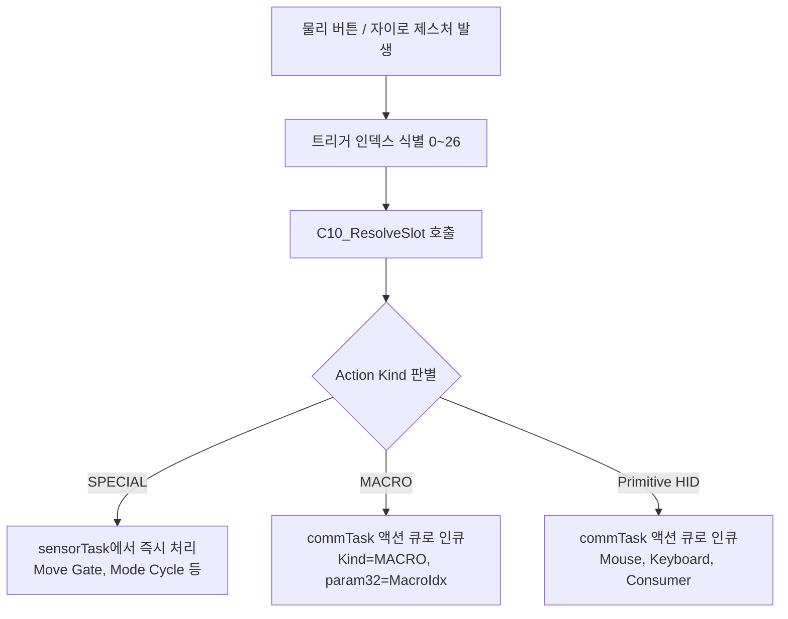

# 웹 기반 사용자 개별화 고도화 — 통합 구현 계획서 (v0410)

## 0. 관련 요구사항 문서
- [[10.ReqDoc_0410_02.md]]

---

## 1. 요구사항 정리 및 결정 요약

| 축 | 확정 사항 | 상세 내용 |
|---|---|---|
| **A. 프로파일 세트** | 다중 설정 환경 (최대 5개) | 상황별/사용자별 독립 설정 (Office, Gaming, Present, TV, Custom) |
| **B. 매크로** | 다단 액션 시퀀스 (최대 8개) | 프로파일당 8개 매크로, 매크로당 최대 8 step, 각 delay ≤ 2000ms |
| **D1. UI 자유도** | 3-View 통합 제공 | Option 1(Slot 중심) + Option 2(Action 중심) + Option 3(Macro Editor) |
| **D2. 트리거 라이브러리** | 확정 27개 (Tier A) | 물리 버튼 15개 + 자이로 제스처 8개 + Tilt 4개 (임계값은 프로파일 전역 관리) |
| **D3. 슬롯 구조** | Global + Mode별 Override | 공통 설정은 Global 슬롯에, Mode별 차이만 overrideMask(비트마스크)로 관리 |
| **D4. 안전 잠금** | 4대 필수 슬롯 잠금 | S1(좌클릭), S5(Move Gate), S12(Mode 전환), S13(페어링) UI 편집 차단 |
| **D5. 실시간 테스트** | Live Test (안전 다이얼로그) | 단일 액션 및 매크로 즉시 전송 테스트 (오작동 방지 확인 팝업 포함) |
| **D6 / R10. 마이그레이션** | 레거시 파일 직접 삭제 (Clean Setup) | 펌웨어 내 불필요한 감지/삭제 로직 없이, 기존 `config_0410.json` 파일 직접 삭제 후 v5 프로파일 시스템만 직접 운용 |

**핵심 설계 목표:**  
프로파일 시스템 × (Global + Mode Override 슬롯) × 매크로 시퀀서 × 3-View Web UI가 **동일한 단일 소스 데이터(Single Source of Truth)의 상호 변환 가능한 표현**으로 일관되게 동작해야 함.

---

## 2. 아키텍처 결정 (4대 핵심 축)

### 2-1. 데이터 계층 구조 (3-Tier Layer)

```
[Profile Layer]          최대 5개 (Office / Gaming / Present / TV / Spare)
   │
   ├─ [Global Slots]     27개 트리거 × Action (모든 Mode의 기본 상속값)
   │
   ├─ [Mode Overrides]   Mode 1, 2, 3별 예외 슬롯 (overrideMask로 필터링)
   │
   ├─ [Macro Library]    Profile별 매크로 시퀀스 (최대 8개, 각 8 step)
   │
   ├─ [E10 Params]       DPI, 가속도, 제스처 임계값, Bias, Sleep 등 전역 튜닝값
   │
   └─ [WiFi Config]      AP / STA / mDNS 네트워크 설정
```

- **설계 원칙:** 프로파일이 펌웨어의 완전한 독립 설정 단위이며, 프로파일 전환은 모든 런타임 파라미터와 슬롯 매트릭스를 원자적으로 스왑(Swap)함을 의미함.

---

### 2-2. Global + Override 슬롯 표현 (D3)

- **문제점:** Mode 3개 × 트리거 27개 = 총 81개 슬롯. 그러나 대부분의 트리거 동작은 모드 간에 동일하므로 중복 데이터가 발생하고 동기화 관리가 어려움.
- **해결책:** Global 슬롯 배열(27개) + Mode별 Override 배열(3×27개) + 32-bit `overrideMask` 조합.

```cpp
struct ST_C10_ProfileSlots_t {
    ST_C20_ActionSlot_t global[27];                      // 27 × 8B = 216B (기본 상속)
    ST_C20_ActionSlot_t modes[3][27];                    // 3 × 27 × 8B = 648B (오버라이드 값)
    uint32_t            overrideMask[3];                 // Mode별 27비트 플래그 (3 × 4B = 12B)
};  // 총 876 Bytes
```

- **런타임 슬롯 해석 규칙 ($O(1)$ 복잡도):**
```
slot(mode, trig) = (overrideMask[mode - 1] & (1 << trig)) ? modes[mode - 1][trig] : global[trig]
```

---

### 2-3. 매크로 자료구조 (B)

- 매크로 시퀀스 내에서는 무한 재귀 및 스택 오버플로를 방지하기 위해 **Primitive 액션(Kind 1~9)만 허용**하며 `MACRO (Kind 10)`의 중첩을 엄격히 금지함.

```cpp
#define MAX_MACRO_STEPS   8
#define MAX_MACROS        8

struct ST_C10_MacroStep_t {
    uint8_t  kind;       // 1~9 (Primitive 액션만 허용, 10=MACRO 금지)
    uint8_t  holdMode;   // 0=NONE, 1=PRESS (홀드 유지), 2=REPEAT
    uint16_t delayMs;    // 액션 실행 전 대기 시간 (0~2000 ms)
    uint16_t param16;    // 키 코드, Usage ID, 마우스 마스크 등
    uint16_t _pad;       // 4바이트 정렬 패딩
    uint32_t param32;    // Modifier 키, Consumer 마스크 등
};  // 정확히 16 Bytes

struct ST_C10_Macro_t {
    char     name[16];                       // 매크로 식별 이름 (UTF-8, null-terminated)
    uint8_t  stepCount;                      // 1~8
    uint8_t  _pad[3];                        // 4바이트 정렬 패딩
    ST_C10_MacroStep_t steps[MAX_MACRO_STEPS]; // 8 × 16B = 128B
};  // 16 + 4 + 128 = 148 Bytes

struct ST_C10_MacroLib_t {
    uint8_t        count;                    // 등록된 매크로 수 (0~8)
    uint8_t        _pad[3];                  // 정렬 패딩
    ST_C10_Macro_t macros[MAX_MACROS];       // 8 × 148B = 1184B
};  // 4 + 1184 = 1188 Bytes
```

---

### 2-4. Action Kind 확장

기존 `ST_C20_ActionSlot_t` (8 Bytes 구조체)의 레이아웃을 그대로 보존하면서 `EN_C20_ACT_MACRO`를 추가:

```cpp
enum EN_C20_ActionKind_t : uint8_t {
    EN_C20_ACT_NONE            = 0,
    EN_C20_ACT_MOUSE_CLICK     = 1,   // p16 = 마우스 버튼 마스크
    EN_C20_ACT_MOUSE_HOLD      = 2,   // p16 = 마우스 버튼 마스크
    EN_C20_ACT_MOUSE_WHEEL     = 3,   // p16 = 휠 방향/스텝
    EN_C20_ACT_KB_TAP          = 4,   // p16 = Usage ID, p32 = Modifier
    EN_C20_ACT_KB_COMBO        = 5,   // p32 = Mod | u1<<8 | u2<<16 | u3<<24
    EN_C20_ACT_KB_REPEAT       = 6,   // p16 = Usage ID, p32 = Modifier
    EN_C20_ACT_CONSUMER_TAP    = 7,   // p32 = Consumer Usage
    EN_C20_ACT_CONSUMER_REPEAT = 8,   // p32 = Consumer Usage
    EN_C20_ACT_SPECIAL         = 9,   // p16 = EN_C20_Special_t
    EN_C20_ACT_MACRO           = 10,  // [v0410 신규] param32 = 매크로 인덱스 (0~7)
    EN_C20_ACT_MAX
};
```

---

## 3. Config 스키마 (v5 통합 사양)

### 3-1. LittleFS 파일 구조

```
/json/
├── boot_state_0410.json         (SafeBoot 부팅 상태 추적)
├── active_profile.json          (현재 활성 프로파일 index 및 총 개수)
└── profiles/
    ├── profile_0.json           ("Office" 기본 프로파일)
    ├── profile_1.json           ("Gaming" 프로파일)
    ├── profile_2.json           ("Present" 프로파일)
    ├── profile_3.json           ("TV" 프로파일)
    └── profile_4.json           ("Custom" 프로파일)
```

> **[정책 반영]** 기존 `config_0410.json`은 파일 자체를 직접 삭제하여 정리함. 펌웨어는 레거시 파일 감지/삭제 로직을 구현하지 않고, `/json/profiles/` 디렉토리와 `active_profile.json`, `profile_0.json`으로 구성된 v5 스키마만 직접 처리함.

---

### 3-2. Profile JSON 스키마 (`profile_N.json`)

```json
{
  "ver": 500,
  "name": "Office",

  "wifi": {
    "mode": 0,
    "sta": { "ssid": "", "pass": "" },
    "ap": { "ssid": "EliteAirMouse", "pass": "12345678" },
    "mdns": { "host": "elite-airmouse" }
  },

  "e10_params": {
    "dpi_level": 2,
    "hard_click_lock": true,
    "scale_base": [0.55, 0.75, 1.0],
    "accel_gain": [0.35, 0.55, 0.85],
    "accel_threshold": 8.0,
    "scroll_cursor_damp": 0.25,
    "wheel": { "threshold_deg": 90.0, "step_max": 6 },
    "gesture": { "flick_deg": 200.0, "cooldown_ms": 600 },
    "precision": {
      "mode": 0, "deadzone": 0.5, "gain": 0.5, "accel": 1.0,
      "max_step": 10, "smooth": 0.2, "entry_ms": 150, "exit_ms": 100,
      "entry_still_deg": 1.5, "exit_move_deg": 5.0, "profile": 0
    },
    "led_brightness": 128,
    "battery_adc_enabled": true,
    "gyro_bias": { "still_th": 2.0, "still_win_ms": 250, "alpha": 0.001 },
    "linear": { "th": 0.3, "impulse_th": 0.5, "window_ms": 300 },
    "flick": { "p2p_th": 400.0, "window_ms": 200, "cooldown_ms": 600 },
    "tilt_hold": { "angle_deg": 15.0, "hold_ms": 300, "repeat_hz": 3 },
    "sleep_idle_timeout_ms": 60000,
    "active_mode": 1,
    "active_peer_index": 0
  },

  "global_slots": [
    { "k": 2, "h": 1, "p16": 1,  "p32": 0 },
    { "k": 4, "h": 0, "p16": 43, "p32": 4 },
    { "k": 0, "h": 0, "p16": 0,  "p32": 0 }
  ],

  "modes": {
    "1": {
      "override_mask": 0,
      "slots": []
    },
    "2": {
      "override_mask": 2,
      "slots": [
        { "trig": 1, "slot": { "k": 4, "h": 0, "p16": 75, "p32": 0 } }
      ]
    },
    "3": {
      "override_mask": 0,
      "slots": []
    }
  },

  "macros": [
    {
      "name": "Copy-Paste",
      "steps": [
        { "k": 4, "h": 0, "delayMs": 0,   "p16": 6,  "p32": 1 },
        { "k": 4, "h": 0, "delayMs": 100, "p16": 25, "p32": 1 }
      ]
    }
  ]
}
```

### 3-3. 활성 프로파일 인덱스 JSON (`active_profile.json`)

```json
{
  "active_index": 0,
  "profile_count": 5
}
```

---

## 4. 트리거 라이브러리 및 잠금 정책 (27개)

### 4-1. 인덱스 매핑 및 잠금 정의

- **1-based 표기 (S1~S15, G1~G8, T1~T4):** 사용자 매뉴얼 및 Web UI 레이블
- **0-based 인덱스 (0~26):** C/C++ 내부 enum, 배열 인덱스, 비트마스크 오프셋

| 0-based Idx | 1-based Label | 트리거명 | 분류 | 잠금 여부 | 고정/기본 기능 |
|:---:|:---:|---|---|:---:|---|
| **0** | **S1** | Top L Click | Button | 🔒 **잠금** | Mouse Left Hold (필수 드래그/선택) |
| **1** | **S2** | Top L Double | Button | | KB Tap: Alt+Tab |
| **2** | **S3** | Top L Long | Button | | NONE |
| **3** | **S4** | Top M Click | Button | | Mouse Middle Click |
| **4** | **S5** | Top M Hold | Button | 🔒 **잠금** | Special: Move Gate (포인터 활성화) |
| **5** | **S6** | Top R Click | Button | | Mouse Right Click |
| **6** | **S7** | Top R Double | Button | | NONE |
| **7** | **S8** | Top R Long | Button | | NONE |
| **8** | **S9** | Side F Click | Button | | Consumer: Volume Up |
| **9** | **S10** | Side F Long | Button | | Consumer: Volume Down |
| **10** | **S11** | Side C Click | Button | | NONE |
| **11** | **S12** | Side C Double | Button | 🔒 **잠금** | Special: Mode Cycle (PC ↔ PPT ↔ TV) |
| **12** | **S13** | Side C 2s Hold | Button | 🔒 **잠금** | Special: BLE Pairing (페어링 모드 진입) |
| **13** | **S14** | Side R Click | Button | | Consumer: Mute |
| **14** | **S15** | Side R Long | Button | | Special: Gyro Recalibration |
| **15** | **G1** | Flick Left | Gesture | | Browser/Page Back |
| **16** | **G2** | Flick Right | Gesture | | Browser/Page Forward |
| **17** | **G3** | Flick Up | Gesture | | KB Tap: Page Up |
| **18** | **G4** | Flick Down | Gesture | | KB Tap: Page Down |
| **19** | **G5** | Linear Left | Gesture | | NONE |
| **20** | **G6** | Linear Right | Gesture | | NONE |
| **21** | **G7** | Linear Up | Gesture | | NONE |
| **22** | **G8** | Linear Down | Gesture | | NONE |
| **23** | **T1** | Tilt Left | Gesture | | TV Ch Down (Mode 3 전용) |
| **24** | **T2** | Tilt Right | Gesture | | TV Ch Up (Mode 3 전용) |
| **25** | **T3** | Tilt Up | Gesture | | TV Vol Up (Mode 3 전용) |
| **26** | **T4** | Tilt Down | Gesture | | TV Vol Down (Mode 3 전용) |

> **안전 잠금 규칙:** 0, 4, 11, 12번 트리거는 펌웨어 유효성 검사에서 수정을 거부하며, Web UI에서도 컨트롤이 비활성화(Disabled + 🔒 배지)됨.

---

## 5. Global + Override 메커니즘

### 5-1. 저장 및 직렬화 최적화
1. 모든 기본 동작은 `global_slots[27]`에 저장됨.
2. 특정 Mode(1, 2, 3)에서 동작을 변경하고자 할 때만 해당 모드의 `override_mask` 해당 비트를 `1`로 세팅하고 `modes[mode-1].slots[trig]`에 값을 기록함.
3. Web UI에서 "Global 상속으로 복귀" 버튼을 누르면 `override_mask`의 비트가 `0`으로 클리어되고 슬롯이 초기화됨.

### 5-2. 런타임 슬롯 해석 ($O(1)$)
```cpp
static inline ST_C20_ActionSlot_t C10_ResolveSlot(
    const ST_C10_ProfileSlots_t& p_slots, uint8_t p_mode, uint8_t p_trig)
{
    if (p_mode < 1 || p_mode > C10_DEF::MODE_COUNT) p_mode = 1;
    if (p_trig >= EN_C10_TRIG_MAX) {
        ST_C20_ActionSlot_t v_none = { EN_C20_ACT_NONE, EN_C20_HOLD_NONE, 0, 0 };
        return v_none;
    }
    const uint8_t m = (uint8_t)(p_mode - 1);
    if (p_slots.overrideMask[m] & (1u << p_trig)) {
        return p_slots.modes[m][p_trig];
    }
    return p_slots.global[p_trig];
}
```

### 5-3. UI 시각적 피드백
- **Global 상속 슬롯:** 은은한 그레이 배경 + `[G]` 텍스트 배지 표시.
- **Mode Override 슬롯:** 강조 블루/보라 배경 + `[M1]`/`[M2]`/`[M3]` 배지 표시 + [Reset to Global] 버튼 활성화.
- **잠금 슬롯:** 자물쇠 🔒 아이콘 + 읽기 전용 처리.

---

## 6. 실행 흐름 (Runtime Flow)

### 6-1. 이벤트 디스패치 파이프라인



### 6-2. commTask 매크로 시퀀서 및 안전 취소

```cpp
void _runMacro(uint8_t p_macroIdx) {
    if (p_macroIdx >= _macroLib.count) return;
    const ST_C10_Macro_t& m = _macroLib.macros[p_macroIdx];

    _macroAbort = false;

    for (uint8_t i = 0; i < m.stepCount; i++) {
        if (_macroAbort) break;

        const ST_C10_MacroStep_t& s = m.steps[i];
        if (s.delayMs > 0) {
            const uint32_t t0 = millis();
            while ((millis() - t0) < s.delayMs) {
                if (_macroAbort) break;
                vTaskDelay(pdMS_TO_TICKS(10));
            }
        }
        if (_macroAbort) break;

        ST_C20_ActionSlot_t slot = { s.kind, s.holdMode, s.param16, s.param32 };
        _execPrimitive(slot, true);
    }
}
```

- **자동 취소 트리거 (R7):**
  1. Side C 더블클릭에 의한 Mode Cycle 발생 시
  2. BLE Disconnect 또는 통신 단절 감지 시
  3. Web API ForceRelease (`/api/control`) 호출 시
  4. SafeMode 또는 OTA Guard 진입 시  
  즉시 `_macroAbort = true` 플래그가 설정되고 `_actExec.releaseAll()`이 실행됨.

### 6-3. 프로파일 전환 시퀀스
1. 실행 중인 모든 HID 상태 및 Repeat 타이머 강제 해제 (`_actExec.releaseAll()`).
2. 매크로 중단 플래그 설정 (`_macroAbort = true`).
3. 버튼 디스패처 및 제스처 인식 상태 머신 초기화.
4. 요청된 프로파일(`profile_N.json`)을 LittleFS에서 비동기 안전하게 로드.
5. 런타임 E10 파라미터 및 슬롯 매트릭스 갱신.
6. `active_profile.json`에 활성 인덱스 영구 기록.
7. LED를 통해 프로파일 전환 완료 알림 (화이트 3회 점멸).

---

## 7. Web UI 3-View 통합 설계

```
┌────────────────────────────────────────────────────────────────────────┐
│ Profile: [ Office (기본) ▼ ]  [➕ 추가] [📋 복제] [✏️ 이름변경] [🗑️ 삭제] │
│ Tabs: [ 1. 슬롯 맵 (Mode) ]  [ 2. 액션 역방향 맵 ]  [ 3. 매크로 에디터 ]   │
└────────────────────────────────────────────────────────────────────────┘
```

### 7-1. View 1: Slot-centric View (트리거 중심)
- 상단 모드 탭: `[ Global 기본값 ] | [ Mode 1: PC ] | [ Mode 2: PPT ] | [ Mode 3: TV ]`
- 27개 트리거 목록이 테이블 형태로 나열됨.
- 각 행: 트리거명, 현재 배정 액션 선택 드롭다운, 상속 상태 배지(`[G]` vs `[M1]`), [Global 복귀] 버튼.
- 잠금 트리거는 회색 음영 처리 및 툴팁 제공.

### 7-2. View 2: Action-centric View (기능 중심 역방향 매핑)
- 액션 검색창 제공 (예: "Volume", "Alt+Tab", "매크로").
- 시스템에 정의된 모든 액션(프리셋 및 등록된 매크로)을 카드/테이블로 표시.
- 각 액션 카드 우측에 현재 할당된 트리거 목록을 태그 형태로 표시: `[S1 (Global)]`, `[S9 (Mode 2)]`.
- `[+ 트리거 할당]` 버튼을 눌러 모달 창에서 원하는 트리거로 즉시 바인딩 가능.

### 7-3. View 3: Macro Editor (매크로 시퀀스 편집기)
- 좌측: 등록된 매크로 목록 (최대 8개) 및 [새 매크로 생성] 버튼.
- 우측: 선택된 매크로의 상세 Step 편집기 (최대 8 Step).
  - Step별: Action Kind 선택, 키/마우스 파라미터 지정, 선행 딜레이 입력(0~2000ms), [삭제] 버튼, 드래그 순서 변경.
  - 하단 액션 바: `[저장]` | `[삭제]` | `[⚡ Live Test (확인 팝업)]`.

---

## 8. Web REST API 명세 (확장)

### 8-1. 프로파일 관리 API

| Method | Endpoint | 설명 및 파라미터 |
|---|---|---|
| `GET` | `/api/profiles` | 프로파일 목록, 활성 인덱스, 최대 개수 반환 |
| `POST` | `/api/profiles/switch` | Body: `{"index": 1}` — 런타임 전환 및 영구 저장 |
| `POST` | `/api/profiles/create` | Body: `{"name": "Gaming"}` — 기본값으로 새 프로파일 생성 |
| `POST` | `/api/profiles/duplicate`| Body: `{"srcIndex": 0, "name": "Office2"}` — 프로파일 복제 |
| `POST` | `/api/profiles/rename` | Body: `{"index": 1, "name": "NewName"}` — 이름 변경 |
| `DELETE`| `/api/profiles/{idx}` | 프로파일 삭제 (단, 0번 기본 프로파일 및 현재 활성 프로파일은 삭제 불가) |
| `GET` | `/api/profiles/{idx}` | 특정 프로파일 전체 설정 JSON 조회 |
| `POST` | `/api/profiles/{idx}` | 특정 프로파일 전체 설정 JSON 저장 |

### 8-2. 매크로 및 액션 API

| Method | Endpoint | 설명 및 파라미터 |
|---|---|---|
| `GET` | `/api/triggers` | 27개 트리거 메타데이터 (id, name, group, locked) 반환 |
| `GET` | `/api/actions/macros` | 현재 활성 프로파일의 매크로 목록 반환 |
| `POST` | `/api/actions/macros` | Body: `ST_C10_Macro_t` JSON — 새 매크로 추가 |
| `POST` | `/api/actions/macros/{idx}` | 특정 매크로 수정 |
| `DELETE`| `/api/actions/macros/{idx}` | 특정 매크로 삭제 |
| `POST` | `/api/action/test` | 단일 액션 Live Test (Body: `{kind, p16, p32}`) |
| `POST` | `/api/action/test_macro` | 매크로 Live Test (Body: `{steps: [...]}`) |

### 8-3. 슬롯 편집 및 레거시 API 정책
- `POST /api/slots/global/{trig}`: 특정 Global 슬롯 업데이트.
- `POST /api/slots/mode/{mode}/{trig}`: 특정 Mode의 Override 슬롯 설정.
- `DELETE /api/slots/mode/{mode}/{trig}`: Override 해제 (Global 상속으로 복귀).
- **레거시 `/api/ppt` 폐기 (R9):** 프로파일 중심 API로 일원화하여 코드 용량 절감 및 아키텍처 혼선 방지.

---

## 9. 검증 및 안전장치 (Validation & Safety)

### 9-1. 유효성 검사 규칙 (서버 사이드)
1. **잠금 슬롯 보호:** `p_trig`가 `G_C10_TRIG_LOCKED`에 해당하는 경우 슬롯 수정 요청 즉시 `403 Forbidden` 거절.
2. **매크로 중첩 차단:** 매크로 Step의 `kind`는 `1 <= kind <= 9` 범위만 허용. `kind == 10 (MACRO)` 전달 시 `400 Bad Request`.
3. **매크로 파라미터 경계:** `stepCount <= 8`, `delayMs <= 2000`, 매크로 수 `<= 8`.
4. **프로파일 안전 보장:** 프로파일 수 `1 <= count <= 5`, `activeIndex < count`, 이름 길이 `<= 15자`.
5. **동시성 잠금:** 프로파일 전환 처리 중(`_profileSwitchInProgress == true`)에는 저장/로드/테스트 API 요청 거부 (`503 Service Unavailable`).

### 9-2. Live Test 안전 다이얼로그 (R6)
- Web UI에서 [Live Test] 클릭 시 확인 모달 표시:
  > **"PC로 HID 입력 신호(키/마우스/매크로)가 즉시 전송됩니다. 계속하시겠습니까?"**
- 엔터키 또는 [실행] 클릭 시에만 실제 API 호출 진행.

---

## 10. 마이그레이션 및 기존 Config 처리 정책 (D6, R10)

- **결정: 레거시 파일 직접 삭제 (펌웨어 로직 미구현, Clean Setup)**
- **처리 원칙:**
  - 펌웨어 내부에 레거시 `config_0410.json` 감지 및 삭제 로직(`_cleanLegacyConfig()` 등)을 두지 않음 (불필요한 코드 및 Flash 용량 낭비 방지).
  - 프로젝트/배포 단계에서 `data_v0410/json/config_0410.json` 파일을 직접 삭제 완료.
  - 펌웨어는 v5 프로파일 체계만 처리:
    1. `/json/profiles/` 디렉토리가 없으면 생성 (`LittleFS.mkdir`).
    2. `active_profile.json`이 없으면 기본값(`{ "active_index": 0, "profile_count": 1 }`) 생성.
    3. `profile_0.json`이 없으면 기본 프로파일("Office") 생성 및 저장.

---

## 11. 시스템 자원 예산 분석

| 리소스 | 현재 소비량 | 신규 기능 추가 시 예상 증감 | 최종 수치 | 안전 마진 / 한도 |
|---|---|---|---|---|
| **Flash (ROM)** | 1.42 MB (45%) | +18 KB (코드, 유효성 검사, JSON) | ~1.44 MB (46%) | 3.14 MB 파티션 대비 54% 여유 |
| **SRAM (Static)** | 131 KB (40%) | +3.2 KB (매크로 버퍼, 활성 프로파일 캐시) | ~134.2 KB (41%) | 320 KB 대비 59% 여유 |
| **Heap (Dynamic)** | 120 KB 가용 | 프로파일 로드/저장 시 순간 +6 KB 피크 | ~114 KB 가용 | 메모리 단편화 위험 없음 |
| **LittleFS 저장소**| ~10 KB 사용 | 5개 프로파일 × 4 KB = 20 KB 추가 | ~30 KB | 1.5 MB 파티션 대비 98% 여유 |
| **HTTP Body Max** | 8192 Bytes | 단일 프로파일 JSON 크기: 약 4.5~6.5 KB | 8192 Bytes 유지 | 버퍼 오버플로 없음 |

---

## 12. 전체 개발 Phase 분할

| Sub-Phase | 세부 개발 범위 | 예상 LOC | 선행 의존성 |
|:---:|---|:---:|:---:|
| **P-A** | Config 스키마 v5 (`C10_Def_0410.h`, `C20_Action_0410.h`, `C10_Config_0410.h/cpp`) | ~800 | - |
| **P-B** | Profile 로드/저장/전환 원자적 처리 및 SafeBoot 연동 | ~350 | P-A |
| **P-C** | commTask 매크로 시퀀서 실행기 및 비동기 취소 메커니즘 | ~250 | P-A |
| **P-D** | E10 모션 및 버튼 디스패처의 Global+Override 해석기 연동 | ~150 | P-A, P-B |
| **P-E** | Web REST API 신규 핸들러 구현 (Profile, Macro, Slot, Test) | ~450 | P-B, P-C |
| **P-F** | Web UI — View 1 (Slot-centric 개편 및 상속 배지) | ~350 | P-E |
| **P-G** | Web UI — View 2 (Action-centric 역방향 매핑 신규) | ~300 | P-E |
| **P-H** | Web UI — View 3 (Macro Editor 신규 탭) | ~450 | P-E |
| **P-I** | Live Test 모달 및 안전장치 통합 | ~150 | P-E, P-H |
| **P-J** | 잠금 슬롯 및 서버/클라이언트 이중 유효성 검증 체계 확립 | ~150 | 전체 |
| **P-K** | 하드웨어 실기 통합 검증 및 회귀 테스트 | - | 전체 |

---

## 13. 핵심 설계 결정 사항 (R1~R10 확정)

| # | 항목 | 확정값 | 결정 이유 및 구현 반영 사항 |
|:---:|---|:---:|---|
| **R1** | 매크로 최대 개수 | **8개** | LittleFS 용량 및 UI 복잡도 최소화, 실사용 시나리오 충분 커버 |
| **R2** | 매크로 Step 수 | **8 Step** | 평균 매크로 길이(2~4 Step)를 상회하며 스크롤 지옥 방지 |
| **R3** | Step Delay 최대치 | **2000 ms** | 앱 로딩 대기 등 현실적 시나리오 수용 (5000ms는 지연 과다로 배제) |
| **R4** | 프로파일 최대 수 | **5개** | Office, Gaming, Present, TV, Custom의 5대 핵심 시나리오 커버 |
| **R5** | 프로파일 전환 트리거 | **Web UI 전용** | 버튼 조합 오입력 사고 방지 (하드웨어 제스처 조합은 v5.1에서 검토) |
| **R6** | Live Test 안전장치 | **확인 다이얼로그** | 의도치 않은 단축키/클릭 오동작 방지를 위한 2단계 확인 |
| **R7** | 매크로 실행 취소 | **자동 취소만** | 모드 변경, 연결 해제, ForceRelease 발생 시 즉시 중단하여 Stuck 방지 |
| **R8** | 슬롯 상속 UI 표시 | **배지 + 배경색** | Global: 회색+`[G]`, Override: 파랑+`[M#]`, 잠금: 어두운 회색+🔒 |
| **R9** | 레거시 `/api/ppt` | **폐기** | 프로파일 중심 API로 완전히 일원화하여 유지보수성 극대화 |
| **R10**| 레거시 config 파일 | **파일 직접 삭제** | 로직 미구현, 레거시 파일 직접 삭제 완료 후 v5 프로파일 단독 운용 |

---

## 14. Phase P-A 구현 명세 및 헤더 초안

### 14-1. `src/v0410/C20_Action_0410.h` 패치 (MACRO kind 추가)

```cpp
// ======================================================
// EN_C20_ActionKind_t 변경 사항
// ======================================================
enum EN_C20_ActionKind_t : uint8_t {
    EN_C20_ACT_NONE            = 0,
    EN_C20_ACT_MOUSE_CLICK     = 1,
    EN_C20_ACT_MOUSE_HOLD      = 2,
    EN_C20_ACT_MOUSE_WHEEL     = 3,
    EN_C20_ACT_KB_TAP          = 4,
    EN_C20_ACT_KB_COMBO        = 5,
    EN_C20_ACT_KB_REPEAT       = 6,
    EN_C20_ACT_CONSUMER_TAP    = 7,
    EN_C20_ACT_CONSUMER_REPEAT = 8,
    EN_C20_ACT_SPECIAL         = 9,
    EN_C20_ACT_MACRO           = 10,  // [v0410 신규] param32 = 매크로 인덱스 (0~7)
    EN_C20_ACT_MAX
};

// 매크로 액션 슬롯 생성 헬퍼
static inline ST_C20_ActionSlot_t C20_MakeMacro(uint8_t p_macroIdx) {
    ST_C20_ActionSlot_t s = { EN_C20_ACT_MACRO, EN_C20_HOLD_NONE, 0, (uint32_t)p_macroIdx };
    return s;
}
```

---

### 14-2. `src/v0410/C10_Def_0410.h`

```cpp
// =======================================================
// File: src/v0410/C10_Def_0410.h
// =======================================================
#pragma once
/*
 * ------------------------------------------------------
 * 소스명 : C10_Def_0410.h
 * 모듈약어 : C10
 * 모듈명 : Config Definitions (v0410 프로파일 + 매크로 + Global/Override)
 * ------------------------------------------------------
 * 기능 요약
 *  - 스키마 v5 (프로파일 × 매크로 × Global+Override 슬롯)
 *  - 트리거 라이브러리 (27개) + 잠금 플래그 (4개)
 *  - 매크로 자료구조 (8×8, delay ≤ 2000ms)
 *  - Profile 슬롯 매트릭스 (Global + Mode별 Override)
 *  - E10 파라미터 (modes 제외, 프로파일 단위 관리)
 * ------------------------------------------------------
 */

#include <Arduino.h>
#include <string.h>
#include <stdio.h>

#include "C20_Action_0410.h"

static constexpr uint16_t G_C10_CFG_VER = 500;

namespace C10_DEF {
    static constexpr uint8_t TRIG_COUNT  = 27;
    static constexpr uint8_t MODE_COUNT  = 3;
    static constexpr uint8_t PROFILE_MAX = 5;

    static constexpr uint8_t  MACRO_MAX          = 8;
    static constexpr uint8_t  MACRO_STEP_MAX     = 8;
    static constexpr uint16_t MACRO_DELAY_MAX_MS = 2000;
    static constexpr uint8_t  MACRO_NAME_LEN     = 16;
    static constexpr uint8_t  PROFILE_NAME_LEN   = 16;

    static constexpr const char* PROFILES_DIR       = "/json/profiles";
    static constexpr const char* PROFILE_ACTIVE     = "/json/active_profile.json";
    static constexpr const char* PROFILE_ACTIVE_TMP = "/json/active_profile.json.tmp";
    static constexpr const char* BOOT_PATH          = "/json/boot_state_0410.json";
    static constexpr const char* BOOT_TMP_PATH      = "/json/boot_state_0410.json.tmp";

    static constexpr uint8_t SAFE_FAIL_THRESHOLD = 2;

    static constexpr size_t STA_SSID_MAX = 32;
    static constexpr size_t STA_PASS_MAX = 64;
    static constexpr size_t AP_SSID_MAX  = 32;
    static constexpr size_t AP_PASS_MAX  = 64;
    static constexpr size_t MDNS_MAX     = 32;

    static inline bool makeProfilePath(char* p_dst, size_t p_dstSize, uint8_t p_idx) {
        if (!p_dst || p_dstSize < 32) return false;
        const int v_n = snprintf(p_dst, p_dstSize, "%s/profile_%u.json", PROFILES_DIR, (unsigned)p_idx);
        return (v_n > 0 && (size_t)v_n < p_dstSize);
    }

    static inline bool makeProfileTmpPath(char* p_dst, size_t p_dstSize, uint8_t p_idx) {
        if (!p_dst || p_dstSize < 40) return false;
        const int v_n = snprintf(p_dst, p_dstSize, "%s/profile_%u.json.tmp", PROFILES_DIR, (unsigned)p_idx);
        return (v_n > 0 && (size_t)v_n < p_dstSize);
    }
}

// 27개 트리거 enum (0~26)
enum EN_C10_Trigger_t : uint8_t {
    EN_C10_TRIG_TOP_L_CLICK      = 0,
    EN_C10_TRIG_TOP_L_DOUBLE     = 1,
    EN_C10_TRIG_TOP_L_LONG       = 2,
    EN_C10_TRIG_TOP_M_CLICK      = 3,
    EN_C10_TRIG_TOP_M_HOLD       = 4,
    EN_C10_TRIG_TOP_R_CLICK      = 5,
    EN_C10_TRIG_TOP_R_DOUBLE     = 6,
    EN_C10_TRIG_TOP_R_LONG       = 7,
    EN_C10_TRIG_SIDE_F_CLICK     = 8,
    EN_C10_TRIG_SIDE_F_LONG      = 9,
    EN_C10_TRIG_SIDE_C_CLICK     = 10,
    EN_C10_TRIG_SIDE_C_DOUBLE    = 11,
    EN_C10_TRIG_SIDE_C_HOLD_2S   = 12,
    EN_C10_TRIG_SIDE_R_CLICK     = 13,
    EN_C10_TRIG_SIDE_R_LONG      = 14,
    EN_C10_TRIG_FLICK_LEFT       = 15,
    EN_C10_TRIG_FLICK_RIGHT      = 16,
    EN_C10_TRIG_FLICK_UP         = 17,
    EN_C10_TRIG_FLICK_DOWN       = 18,
    EN_C10_TRIG_LINEAR_LEFT      = 19,
    EN_C10_TRIG_LINEAR_RIGHT     = 20,
    EN_C10_TRIG_LINEAR_UP        = 21,
    EN_C10_TRIG_LINEAR_DOWN      = 22,
    EN_C10_TRIG_TILT_LEFT        = 23,
    EN_C10_TRIG_TILT_RIGHT       = 24,
    EN_C10_TRIG_TILT_UP          = 25,
    EN_C10_TRIG_TILT_DOWN        = 26,
    EN_C10_TRIG_MAX
};

// 잠금 트리거 플래그 (0: Top L Click, 4: Top M Hold, 11: Side C Double, 12: Side C 2s Hold)
static constexpr bool G_C10_TRIG_LOCKED[EN_C10_TRIG_MAX] = {
    true,  false, false, false, true,
    false, false, false, false, false,
    false, true,  true,  false, false,
    false, false, false, false,
    false, false, false, false,
    false, false, false, false
};

static inline const char* C10_TriggerName(uint8_t p_trig) {
    switch ((EN_C10_Trigger_t)p_trig) {
        case EN_C10_TRIG_TOP_L_CLICK:    return "Top L Click";
        case EN_C10_TRIG_TOP_L_DOUBLE:   return "Top L Double";
        case EN_C10_TRIG_TOP_L_LONG:     return "Top L Long";
        case EN_C10_TRIG_TOP_M_CLICK:    return "Top M Click";
        case EN_C10_TRIG_TOP_M_HOLD:     return "Top M Hold";
        case EN_C10_TRIG_TOP_R_CLICK:    return "Top R Click";
        case EN_C10_TRIG_TOP_R_DOUBLE:   return "Top R Double";
        case EN_C10_TRIG_TOP_R_LONG:     return "Top R Long";
        case EN_C10_TRIG_SIDE_F_CLICK:   return "Side F Click";
        case EN_C10_TRIG_SIDE_F_LONG:    return "Side F Long";
        case EN_C10_TRIG_SIDE_C_CLICK:   return "Side C Click";
        case EN_C10_TRIG_SIDE_C_DOUBLE:  return "Side C Double";
        case EN_C10_TRIG_SIDE_C_HOLD_2S: return "Side C 2s Hold";
        case EN_C10_TRIG_SIDE_R_CLICK:   return "Side R Click";
        case EN_C10_TRIG_SIDE_R_LONG:    return "Side R Long";
        case EN_C10_TRIG_FLICK_LEFT:     return "Flick Left";
        case EN_C10_TRIG_FLICK_RIGHT:    return "Flick Right";
        case EN_C10_TRIG_FLICK_UP:       return "Flick Up";
        case EN_C10_TRIG_FLICK_DOWN:     return "Flick Down";
        case EN_C10_TRIG_LINEAR_LEFT:    return "Linear Left";
        case EN_C10_TRIG_LINEAR_RIGHT:   return "Linear Right";
        case EN_C10_TRIG_LINEAR_UP:      return "Linear Up";
        case EN_C10_TRIG_LINEAR_DOWN:    return "Linear Down";
        case EN_C10_TRIG_TILT_LEFT:      return "Tilt Left";
        case EN_C10_TRIG_TILT_RIGHT:     return "Tilt Right";
        case EN_C10_TRIG_TILT_UP:        return "Tilt Up";
        case EN_C10_TRIG_TILT_DOWN:      return "Tilt Down";
        default:                         return "?";
    }
}

static inline const char* C10_TriggerGroup(uint8_t p_trig) {
    if (p_trig <= 14) return "button";
    if (p_trig <= 22) return "gesture";
    return "tilt";
}

enum EN_C10_WIFI_MODE_t : uint8_t {
    EN_C10_WIFI_AUTO = 0,
    EN_C10_WIFI_AP   = 1,
    EN_C10_WIFI_STA  = 2
};

struct ST_C10_WiFiConfig_t {
    uint8_t mode;
    char sta_ssid[33];
    char sta_pass[65];
    char ap_ssid[33];
    char ap_pass[65];
    char mdns_host[33];
};

enum EN_C10_E10PrecisionMode_t : uint8_t {
    EN_C10_E10_PREC_OFF  = 0,
    EN_C10_E10_PREC_LOW  = 1,
    EN_C10_E10_PREC_MED  = 2,
    EN_C10_E10_PREC_HIGH = 3,
    EN_C10_E10_PREC_PPT  = 4,
    EN_C10_E10_PREC_MAX
};

struct ST_C10_E10Config_t {
    uint8_t dpi_level;
    bool    hard_click_lock;

    float scale_base[3];
    float accel_gain[3];
    float accel_threshold;

    float   wheel_threshold_deg;
    uint8_t wheel_step_max;

    float    gesture_flick_deg;
    uint16_t gesture_cooldown_ms;

    float scroll_cursor_damp;

    uint8_t  precision_mode;
    float    precision_deadzone;
    float    precision_gain;
    float    precision_accel;
    uint8_t  precision_max_step;
    float    precision_smooth;
    uint16_t prec_entry_ms;
    uint16_t prec_exit_ms;
    float    prec_entry_still_deg;
    float    prec_exit_move_deg;
    uint8_t  prec_profile;

    uint8_t led_brightness;
    bool    battery_adc_enabled;

    struct {
        float    still_th;
        uint16_t still_win_ms;
        float    alpha;
    } gyro_bias;

    struct {
        float    th;
        float    impulse_th;
        uint16_t window_ms;
    } linear;

    struct {
        float    p2p_th;
        uint16_t window_ms;
        uint16_t cooldown_ms;
    } flick;

    struct {
        float    angle_deg;
        uint16_t hold_ms;
        uint8_t  repeat_hz;
    } tilt_hold;

    uint32_t sleep_idle_timeout_ms;
    uint8_t  active_mode;
    uint8_t  active_peer_index;
};

// 매크로 Step (16 Bytes)
struct ST_C10_MacroStep_t {
    uint8_t  kind;       // 1~9 (Primitive만 허용)
    uint8_t  holdMode;   // 0=NONE, 1=PRESS, 2=REPEAT
    uint16_t delayMs;    // 0~2000 ms
    uint16_t param16;
    uint16_t _pad;
    uint32_t param32;
};

// 매크로 개별 정의 (148 Bytes)
struct ST_C10_Macro_t {
    char     name[C10_DEF::MACRO_NAME_LEN];
    uint8_t  stepCount;
    uint8_t  _pad[3];
    ST_C10_MacroStep_t steps[C10_DEF::MACRO_STEP_MAX];
};

// 프로파일 매크로 라이브러리 (1188 Bytes)
struct ST_C10_MacroLib_t {
    uint8_t  count;
    uint8_t  _pad[3];
    ST_C10_Macro_t macros[C10_DEF::MACRO_MAX];
};

// 슬롯 매트릭스 (876 Bytes)
struct ST_C10_ProfileSlots_t {
    ST_C20_ActionSlot_t global[EN_C10_TRIG_MAX];
    ST_C20_ActionSlot_t modes [C10_DEF::MODE_COUNT][EN_C10_TRIG_MAX];
    uint32_t            overrideMask[C10_DEF::MODE_COUNT];
};

// 런타임 슬롯 해석 인라인 함수
static inline ST_C20_ActionSlot_t C10_ResolveSlot(
    const ST_C10_ProfileSlots_t& p_slots, uint8_t p_mode, uint8_t p_trig)
{
    if (p_mode < 1 || p_mode > C10_DEF::MODE_COUNT) p_mode = 1;
    if (p_trig >= EN_C10_TRIG_MAX) {
        ST_C20_ActionSlot_t v_none = { EN_C20_ACT_NONE, EN_C20_HOLD_NONE, 0, 0 };
        return v_none;
    }
    const uint8_t m = (uint8_t)(p_mode - 1);
    if (p_slots.overrideMask[m] & (1u << p_trig)) {
        return p_slots.modes[m][p_trig];
    }
    return p_slots.global[p_trig];
}

// Profile 통합 구조체 (~2.4 KB)
struct ST_C10_ProfileConfig_t {
    uint16_t ver;
    char     name[C10_DEF::PROFILE_NAME_LEN];

    ST_C10_WiFiConfig_t   wifi;
    ST_C10_E10Config_t    e10;
    ST_C10_ProfileSlots_t slots;
    ST_C10_MacroLib_t     macros;
};

struct ST_C10_ProfileIndex_t {
    uint8_t activeIndex;
    uint8_t profileCount;
};

struct ST_C10_BootState_t {
    bool     safe_mode;
    uint8_t  fail_count;
    bool     pending;
    uint32_t boot_ms;
    uint8_t  last_reset_reason;
};
```

---

### 14-3. `src/v0410/C10_Config_0410.h`

```cpp
// =======================================================
// File: src/v0410/C10_Config_0410.h
// =======================================================
#pragma once
/*
 * ------------------------------------------------------
 * 소스명 : C10_Config_0410.h
 * 모듈약어 : C10
 * 모듈명 : Config Manager (v0410 프로파일 + 매크로)
 * ------------------------------------------------------
 * 기능 요약
 *  - 멀티 프로파일 CRUD 및 활성 프로파일 영구 전환
 *  - Global + Override 슬롯 관리 및 유효성 검증
 *  - 매크로 라이브러리 CRUD 및 Live Test 지원
 *  - 레거시 단일 config 파일 무시 삭제 및 클린 초기화
 *  - SafeBoot 및 원자적(Atomic) 파일 쓰기 보장
 * ------------------------------------------------------
 */

#include <Arduino.h>
#include <FS.h>
#include <LittleFS.h>
#include <ArduinoJson.h>
#include <string.h>
#include <esp_system.h>

#include "C10_Def_0410.h"
#include "D10_Logger_0410.h"

class CL_C10_Config {
  private:
    ST_C10_BootState_t     _boot;
    ST_C10_ProfileIndex_t  _index;
    ST_C10_ProfileConfig_t _activeProfile;   // 런타임 캐시

    uint32_t _bootOkRetryAtMs = 0;
    volatile bool _profileSwitchInProgress = false;

  public:
    CL_C10_Config();
    ~CL_C10_Config() = default;

    // ---------- Lifecycle ----------
    void begin(bool p_formatOnFail = true);

    // ---------- Profile Index ----------
    uint8_t getProfileCount() const { return _index.profileCount; }
    uint8_t getActiveIndex()  const { return _index.activeIndex;  }
    bool    setActiveIndex(uint8_t p_idx);

    // ---------- Profile CRUD ----------
    bool loadProfile(uint8_t p_idx, ST_C10_ProfileConfig_t& p_out);
    bool saveProfile(uint8_t p_idx, const ST_C10_ProfileConfig_t& p_in);
    bool createProfile(const char* p_newName, uint8_t& p_outIdx);
    bool duplicateProfile(uint8_t p_srcIdx, const char* p_newName, uint8_t& p_outIdx);
    bool deleteProfile(uint8_t p_idx);
    bool renameProfile(uint8_t p_idx, const char* p_newName);

    bool loadActiveProfile(ST_C10_ProfileConfig_t& p_out);
    bool saveActiveProfile(const ST_C10_ProfileConfig_t& p_in);
    const ST_C10_ProfileConfig_t& getActiveProfile() const { return _activeProfile; }

    // ---------- Defaults Generator ----------
    void makeDefaultsWiFi  (ST_C10_WiFiConfig_t&   p_out);
    void makeDefaultsE10   (ST_C10_E10Config_t&    p_out);
    void makeDefaultsSlots (ST_C10_ProfileSlots_t& p_out);
    void makeDefaultsMacros(ST_C10_MacroLib_t&     p_out);
    void makeDefaultsProfile(uint8_t p_idx, ST_C10_ProfileConfig_t& p_out);

    // ---------- Validation ----------
    bool validateWiFi     (const ST_C10_WiFiConfig_t&    p_w) const;
    bool validateE10      (const ST_C10_E10Config_t&     p_e) const;
    bool validateSlot     (const ST_C20_ActionSlot_t&    p_s, uint8_t p_macroCount = 0) const;
    bool validateSlots    (const ST_C10_ProfileSlots_t&  p_s) const;
    bool validateMacroStep(const ST_C10_MacroStep_t&     p_s) const;
    bool validateMacro    (const ST_C10_Macro_t&         p_m) const;
    bool validateMacros   (const ST_C10_MacroLib_t&      p_m) const;
    bool validateProfile  (const ST_C10_ProfileConfig_t& p_p) const;

    // ---------- SafeBoot ----------
    bool isSafeMode() const { return _boot.safe_mode; }
    void getBootState(ST_C10_BootState_t& p_out) const { p_out = _boot; }
    bool clearSafeMode();
    bool bootMarkOkIfGracePassed(uint32_t p_graceMs);

    // ---------- JSON Patcher / Builder ----------
    bool patchProfileFromJson(const String& p_json, ST_C10_ProfileConfig_t& p_io);
    bool buildProfileJson(const ST_C10_ProfileConfig_t& p_in, JsonDocument& p_out);

    // ---------- State Guard ----------
    bool isProfileSwitchInProgress() const { return _profileSwitchInProgress; }
    void setProfileSwitchInProgress(bool p_flag) { _profileSwitchInProgress = p_flag; }

    // ---------- Factory Reset ----------
    bool factoryReset(bool p_recreateDefault = true);

  private:
    bool _loadBootState(ST_C10_BootState_t& p_out);
    bool _saveBootState(const ST_C10_BootState_t& p_in);
    bool _loadIndex();
    bool _saveIndex();

    bool _verifyJsonFile(const char* p_path);
    bool _copyFile(const char* p_src, const char* p_dst);
    bool _atomicWriteJson(const char* p_path, const char* p_tmpPath, JsonDocument& p_doc);

    bool    _isBadResetReason(esp_reset_reason_t p_r);
    uint8_t _getResetReasonU8();


    void _buildWiFiJson    (JsonObject p_parent, const ST_C10_WiFiConfig_t& p_in);
    void _buildE10Json     (JsonObject p_parent, const ST_C10_E10Config_t&  p_in);
    void _buildSlotsJson   (JsonObject p_parent, const ST_C10_ProfileSlots_t& p_in);
    void _buildSlotArrayJson(JsonArray p_arr, const ST_C20_ActionSlot_t* p_arrSlots, uint8_t p_count);
    void _buildSlotJson    (JsonObject p_obj, const ST_C20_ActionSlot_t& p_in);
    void _buildMacrosJson  (JsonArray p_arr, const ST_C10_MacroLib_t& p_in);
    void _buildMacroJson   (JsonObject p_obj, const ST_C10_Macro_t& p_in);
    void _buildMacroStepJson(JsonObject p_obj, const ST_C10_MacroStep_t& p_in);

    bool _patchWiFiJson    (JsonVariantConst p_v, ST_C10_WiFiConfig_t&   p_io);
    bool _patchE10Json     (JsonVariantConst p_v, ST_C10_E10Config_t&    p_io);
    bool _patchSlotsJson   (JsonVariantConst p_v, ST_C10_ProfileSlots_t& p_io);
    bool _patchSlotArrayJson(JsonVariantConst p_v, ST_C20_ActionSlot_t* p_arr, uint8_t p_count);
    bool _patchSlotJson    (JsonVariantConst p_v, ST_C20_ActionSlot_t&   p_io);
    bool _patchMacrosJson  (JsonVariantConst p_v, ST_C10_MacroLib_t&     p_io);
    bool _patchMacroJson   (JsonVariantConst p_v, ST_C10_Macro_t&        p_io);
    bool _patchMacroStepJson(JsonVariantConst p_v, ST_C10_MacroStep_t&   p_io);
};
```

---

## 15. 검증 체크리스트 및 다음 개발 단계

### 15-1. P-A 선언부 사전 검증 체크리스트
- [x] `sizeof(ST_C10_MacroStep_t) == 16`
- [x] `sizeof(ST_C10_Macro_t) == 148`
- [x] `sizeof(ST_C10_MacroLib_t) == 1188`
- [x] `sizeof(ST_C10_ProfileSlots_t) == 876`
- [x] `EN_C10_TRIG_MAX == 27`
- [x] `G_C10_TRIG_LOCKED` 배열에서 정확히 4개 인덱스(0, 4, 11, 12)만 `true`
- [x] `C10_ResolveSlot` 인라인 함수 복잡도 $O(1)$ 검증
- [x] 모든 소스 헤더 및 인클루드 경로가 `src/v0410/` 및 `_0410`으로 통일

### 15-2. 다음 개발 단계 (Next Steps)
1. **`C20_Action_0410.h`에 `EN_C20_ACT_MACRO` 및 `C20_MakeMacro` 반영.**
2. **`C10_Def_0410.h` 신규 사양(스키마 v5)으로 교체 적용.**
3. **`C10_Config_0410.h` 및 `C10_Config_0410.cpp` 구현 진행 (Phase P-A 완성):**
   - 레거시 파일 직접 삭제 완료 확인 및 v5 프로파일 초기화 로직 구현
   - `active_profile.json` 및 `profile_N.json` 원자적 I/O
   - 4단계 엄격한 검증 로직 구현
4. **Phase P-B (런타임 프로파일 전환) 착수.**
