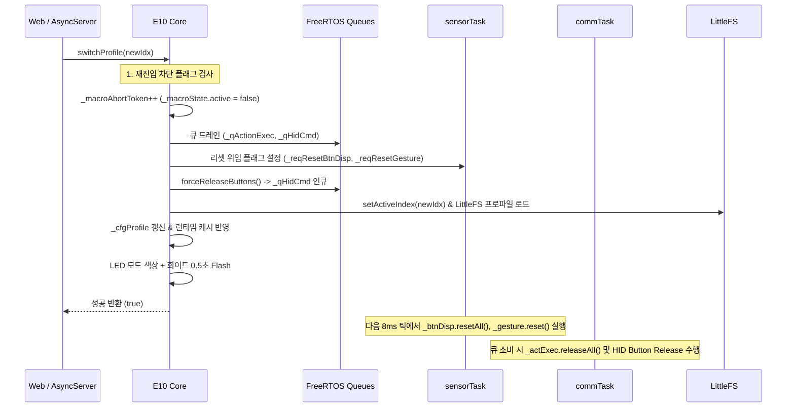

# FLOW.md — 기능별 데이터 흐름 및 파이프라인 명세

> 대상 버전: `v0410` (ESP32-S3-Zero + MPU6050 AirMouse)  
> 최종 갱신: 2026-10-01  
> 위치: `src/v0410/docs_v0410/contract_doc/FLOW.md`

---

## 1. 모션 처리 파이프라인 (`sensorTask` 내부, 8ms 주기)

MPU6050 센서 원시 데이터가 가공되어 최종 HID 전달 큐(`_qFrame`)로 출력되기까지의 직렬 파이프라인입니다.

```mermaid
flowchart TD
    A[MPU6050 Raw Gyro/Accel] --> B[BiasTracker 보정]
    B --> C[M10 AdvancedMotionProcessor]
    subgraph M10_Engine [M10 모션 엔진]
        C --> C1[적응형 EMA 필터]
        C1 --> C2[시그모이드 가속 곡선]
        C2 --> C3[DPI 스케일링]
        C3 --> C4[Zero-Snap & Hard Click-Lock]
    end
    C4 --> D{Front Hold (Side F)?}
    D -- 누름 상태 --> D1[커서 감쇠 scrollCursorDamp + Wheel/Pan 산출]
    D -- 미누름 --> E{Move Gate (Top M)?}
    D1 --> E
    E -- 미누름 --> E1[fx = 0, fy = 0]
    E -- 누름 상태 --> F{Precision 활성?}
    E1 --> F
    F -- 활성 --> F1[Precision 오버레이 필터]
    F -- 비활성 --> G[Snap-to-Axis FSM]
    F1 --> G
    G --> H[Click-Freeze FSM (최종 게이트)]
    H --> I[Welford RMS 통계 누적]
    I --> J[_qFrame FreeRTOS Overwrite 큐]
```

### 실패 및 예외 복구 경로
- **MPU NaN 감지 시**: `_errMpuNan++` 증가 후 `_recoverI2C()` 비동기 요청 플래그 설정 및 해당 틱 건너뜀.
- **Mutex Miss 발생 시 (`_state` 갱신 2ms 초과)**: `_errMutexMiss++` 증가 후 프레임 전송은 계속 진행 (커서 프레임 누락 방지).

---

## 2. 프로파일 전환 파이프라인 (`switchProfile(idx)`)

웹 태스크 또는 내부 요청에 의해 프로파일을 전환할 때 시스템 안전성을 보장하는 순차 시퀀스입니다.



---

## 3. 액션 및 제스처 디스패치 흐름

물리 버튼 이벤트와 센서 제스처가 슬롯 매핑을 거쳐 최종 실행되는 분기 구조입니다.

```mermaid
flowchart TD
    In[이벤트 입력: BtnDispatcher / Gesture 감지] --> CheckHard{하드코딩 동작인가?}
    CheckHard -- Yes --> HardExec[모드전환 / 페어링 / MoveGate / FrontHold]
    CheckHard -- No --> Resolve[_resolveSlot(_activeMode, trigger)]
    
    Resolve --> CheckKind{Action Slot Kind?}
    CheckKind -- EN_C20_ACT_NONE --> Drop[무시 / Drop]
    CheckKind -- EN_C20_ACT_SPECIAL --> SpecDirect[_handleSpecial(param16) 직접 실행]
    Note right of SpecDirect: sensorTask 컨텍스트에서만 동기 실행
    CheckKind -- 기타 (KEY, MOUSE, CONSUMER) --> EnqAct[_enqueueAction(slot, isDown)]
    EnqAct --> QAct[_qActionExec (size=8)]
    
    QAct --> CommCons[commTask 드레인 루프]
    CommCons --> CheckMacro{slot.kind == MACRO?}
    CheckMacro -- Yes --> StartM[_startMacro(param32)]
    CheckMacro -- No --> ExecAct[_actExec.exec(slot, isDown)]
    StartM --> MacroTick[_tickMacro() 상태머신 전진]
```
