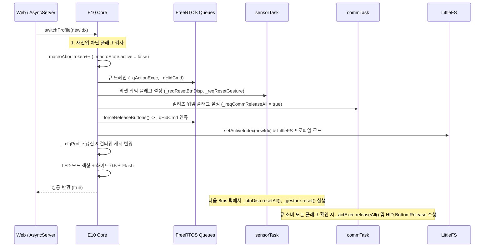
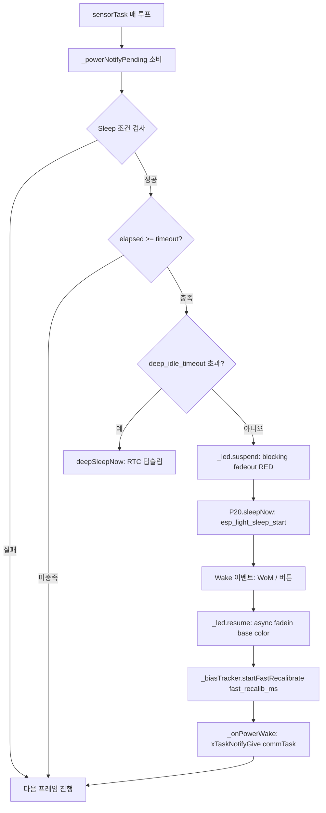

# FLOW.md — 기능별 데이터 흐름 및 파이프라인 명세

> 대상 버전: `v0410` (ESP32-S3-Zero + MPU6050 AirMouse)  
> 위치: `src/v0410/docs_v0410/contract_doc/FLOW.md`
> 최종 갱신: 2026-10-02 (rev4 — LED fadeout/fadein 흐름 반영)  

---

## 1. 모션 처리 파이프라인 (`sensorTask` 내부, 8ms 주기)

MPU6050 센서 원시 데이터가 가공되어 최종 HID 전달 큐(`_qFrame`)로 출력되기까지의 직렬 파이프라인입니다.

```mermaid
flowchart TD
    A[MPU6050 Raw Gyro/Accel] --> NaN{NaN 감지?}
    NaN -- NaN 발생 --> NaN_Err[_errMpuNan++ / I2C 복구 / Skip Tick]
    NaN -- 정상 수치 --> B[BiasTracker 보정]
    B --> C[M10 AdvancedMotionProcessor]
    subgraph M10_Engine [M10 모션 엔진]
        C --> C1[적응형 EMA 필터]
        C1 --> C2[시그모이드 가속 곡선]
        C2 --> C3[DPI 스케일링]
        C3 --> C4[Zero-Snap & Hard Click-Lock]
    end
    C4 --> D{Front Hold (Side F)?}
    D -- 누름 상태 --> D1[커서 감쇠 scrollCursorDamp + Wheel/Pan 산출]
    D -- 미누름 --> E{Move Gate (Top M)?}
    D1 --> E
    E -- 미누름 --> E1[fx = 0, fy = 0]
    E -- 누름 상태 --> F{Precision 활성?}
    E1 --> F
    F -- 활성 --> F1[Precision 오버레이 필터]
    F -- 비활성 --> G[Snap-to-Axis FSM]
    F1 --> G
    G --> H[Click-Freeze FSM (최종 게이트)]
    H --> I[Welford RMS 통계 누적]
    I --> J[_qFrame FreeRTOS Overwrite 큐]
```

### 파이프라인 순서 (v0410 확정)

| 순서 | 단계 | 담당 | 비고 |
|:---:|---|---|---|
| 1 | NaN Guard | `sensorTask` | BiasTracker 오염 원천 차단 |
| 2 | BiasTracker 보정 | `M20` | Fast Recalib (Wake 후 300ms) |
| 3 | Adaptive EMA + Reversal Reset | `M10` | Phase 2 (Phase 11.5) |
| 4 | Zero Snap + Sigmoid | `M10` | – |
| 5 | DPI Scaling + Accel Shaping | `E10` | – |
| 6 | Front Hold (Side F) | `E10` | 커서 감쇠 + Wheel/Pan, **전 Mode 일관** |
| 7 | Move Gate (Top M) | `E10` | 미누름 시 `fx=fy=0` |
| 8 | Precision FSM | `E10` | ENTRY/TRACK/EXIT |
| 9 | Snap-to-Axis | `E10` | Phase 3 (Phase 11.5) |
| 10 | Click-Freeze | `E10` | **최종 게이트** (Phase 1) |

### 실패 및 예외 복구 경로
- **MPU NaN 감지 시 (선제적 Guard)**: `BiasTracker` 및 `FSM` 유입 전에 NaN을 감지하여 `_errMpuNan++` 증가, 5회 연속 시 `_recoverI2C()` 실행 및 해당 틱 조기 건너뜀 (내부 누적 바이어스 오염 완벽 방지).
- **Mutex Miss 발생 시 (`_state` 갱신 2ms 초과)**: `_errMutexMiss++` 증가 후 프레임 전송은 계속 진행 (커서 프레임 누락 방지).

---

## 2. 프로파일 전환 파이프라인 (`switchProfile(idx)`)

웹 태스크 또는 내부 요청에 의해 프로파일을 전환할 때 시스템 안전성을 보장하는 순차 시퀀스입니다.



---

## 3. 액션 및 제스처 디스패치 흐름

물리 버튼 이벤트, 센서 제스처 및 웹 Live Test 요청이 슬롯 매핑을 거쳐 최종 실행되는 분기 구조입니다.

```mermaid
flowchart TD
    In[이벤트 입력: BtnDispatcher / Gesture 감지 / Web LiveTest] --> CheckHard{하드코딩 동작인가?}
    CheckHard -- Yes --> HardExec[모드전환 / 페어링 / MoveGate / FrontHold]
    CheckHard -- No --> Resolve[_resolveSlot(_activeMode, trigger)]
    
    Resolve --> CheckKind{Action Slot Kind?}
    CheckKind -- EN_C20_ACT_NONE --> Drop[무시 / Drop]
    CheckKind -- EN_C20_ACT_SPECIAL --> SpecOrigin{호출 컨텍스트?}
    SpecOrigin -- sensorTask 내부 --> SpecDirect[_handleSpecial(param16) 직접 실행]
    SpecOrigin -- Web Task (LiveTest) --> SpecDeleg[_reqSpecialAction = param16 위임]
    SpecDeleg --> SensorLoop[다음 sensorTask 루프에서 동기 실행]
    CheckKind -- 기타 (KEY, MOUSE, CONSUMER) --> EnqAct[_enqueueAction(slot, isDown)]
    EnqAct --> QAct[_qActionExec (size=8)]
    
    QAct --> CommCons[commTask 드레인 루프]
    CommCons --> CheckMacro{slot.kind == MACRO?}
    CheckMacro -- Yes --> StartM[_startMacro(param32) — 실행 중이면 대체]
    CheckMacro -- No --> ExecAct[_actExec.exec(slot, isDown)]
    StartM --> RunningM{이미 실행 중?}
    RunningM -- Yes --> WarnLog[WARN 로그 + 조용히 대체]
    RunningM -- No --> InitM[스냅샷 + 상태머신 초기화]
    InitM --> MacroTick[_tickMacro() 상태머신 전진]
    WarnLog --> MacroTick
```

> **매크로 대체(Replace) 정책**: 이미 매크로가 실행 중일 때 `_startMacro(newIdx)`가 호출되면 이전 매크로는 **abort 토큰을 증가시키지 않고 조용히 대체**된다. 이는 사용자 의도(최신 매크로 실행 우선)를 반영한 것으로, `switchProfile`/`_setActiveMode`/`forceReleaseButtons`/BLE disconnect/SafeMode 진입 시에는 반대로 `_macroAbortToken++`로 명시적 abort된다 (STATE.md §2.5 참조).

---

## 4. HID 커맨드 큐 처리 흐름 (commTask)

`_qHidCmd`를 통해 웹 태스크 및 내부 요청이 HID 실행을 위임하는 경로입니다. **오직 commTask만 `_mouse`/`_keyboard` 인스턴스를 제어**한다.

```mermaid
flowchart TD
    Producer[Web Task / Sensor Task] --> Enq[_enqueueHidCmd(cmd), timeout=0]
    Enq --> QHid[_qHidCmd size=4]
    QHid -- Full --> Drop1[Drop: false 반환]
    QHid -- OK --> Comm[commTask 매 루프]
    
    Comm --> Discard{QUEUE 비었나?}
    Discard -- 비었음 --> Next[다음 처리: _qActionExec]
    Discard -- 있음 --> CmdKind{cmd 종류}
    
    CmdKind -- RELEASE_ALL --> R1[_actExec.releaseAll + _doReleaseAllButtons]
    CmdKind -- TEST_CLICK --> R2[_doTestMouseClick]
    CmdKind -- TEST_PPT --> R3[_sendPptKey2]
    
    R1 --> Next
    R2 --> Next
    R3 --> Next
```

---

## 5. 매크로 실행 상태머신 흐름 (`_tickMacro`)

`commTask` 루프 내에서 프레임 지연 없이 스텝별 딜레이와 실행을 제어하는 비동기 상태머신입니다.

```mermaid
flowchart TD
    Tick[commTask 매 루프: _tickMacro()] --> Active{_macroState.active?}
    Active -- false --> End1[즉시 리턴]
    Active -- true --> TokenCheck{startToken == _macroAbortToken?}
    TokenCheck -- 불일치 --> Abort[ABORTED: active=false + WARN 로그]
    TokenCheck -- 일치 --> StepCheck{stepIdx >= stepCount?}
    StepCheck -- 초과/완료 --> End2[매크로 종료: active=false]
    StepCheck -- 진행중 --> DelayCheck{delayMs 경과?}
    DelayCheck -- 미경과 --> Wait[논블로킹 대기: 리턴]
    DelayCheck -- 경과 --> ExecStep[_actExec.exec(step, isDown=true)]
    ExecStep --> Advance[stepIdx++ / stepStartMs = now]
    Advance --> Tick
```

---

## 6. 전원 관리 흐름 (`sensorTask` 내부, Phase 11.6)

유휴 감지 → Light/Deep Sleep → Wake 복귀까지의 시퀀스입니다.



### Sleep 조건 (모두 만족)
- `!isSafeMode() && !isOtaGuard()`
- `!_moveGateHeld && !_frontHoldActive`
- `_qActionExec` 비어있음 + 매크로 미실행
- 유휴 시간 >= Mode/BLE/Pairing별 timeout

### Wake 소스 (EXT1, LOW Active)
- MPU6050 INT1 (GPIO 6, WoM)
- 6 버튼: Top L/M/R, Side F/C/R

---

## 7. OTA 및 안전 게이트 흐름 (W10)

````mermaid
flowchart TD
    OTAReq[/api/ota POST/] --> SafeCheck{SafeMode?}
    SafeCheck -- 예 --> Allow1[OTA 허용]
    SafeCheck -- 아니오 --> GuardCheck{OTA Guard?}
    GuardCheck -- 예 --> Block1[ota_guard_blocked 반환]
    GuardCheck -- 아니오 --> SizeCheck{total > freeSketchSpace?}
    SizeCheck -- 초과 --> Block2[size_invalid]
    SizeCheck -- OK --> Begin[Update.begin]
    Begin --> Write[Update.write 순차 수신]
    Write --> Final{final 청크?}
    Final -- 아니오 --> Write
    Final -- 예 --> End{Update.end}
    End -- 성공 --> Restart[ESP.restart]
    End -- 실패 --> Fail[ota_failed 반환]
```

### SafeMode 게이트 정책 (method-aware)
- **허용**: `/api/status`, `/api/diag`, `/api/keycodes`, `/api/safeboot`, `/api/ota`, `/api/factory_reset`, `/api/reboot`, `GET /api/profiles*`, `GET /api/triggers`, `/api/config/export`
- **차단**: `/api/config/save`, `/api/config/apply`, `/api/control`, `/api/action/test*`, `/api/profiles/{switch,create,delete,rename}`

---

## 8. Front Hold 스크롤 흐름 (Phase 11.5 이전 확정)

```mermaid
flowchart TD
    Frame[매 프레임] --> Check{Side F 누름?}
    Check -- 아니오 --> Normal[정상 커서 이동]
    Check -- 예 --> Damp[fx *= scrollCursorDamp, fy *= scrollCursorDamp]
    Damp --> Wheel[gy 기반 수직 휠 산출]
    Wheel --> Pan[gx 기반 수평 팬 산출]
    Pan --> Gate{Move Gate 누름?}
    Gate -- 아니오 --> Zero[fx=fy=0 (커서 억제), wheel/pan은 유지]
    Gate -- 예 --> Move[정상 이동 + wheel/pan 동시]
    Zero --> Out[프레임 출력]
    Move --> Out
```

### 규약
- **감쇠 계수**: `scroll_cursor_damp` (기본 0.25)
- **휠 축**: `gy` (Pitch, 앞뒤 기울기)
- **팬 축**: `gx` (Roll, 좌우 기울기)
- **전 Mode 일관** (D4-A 정책)
