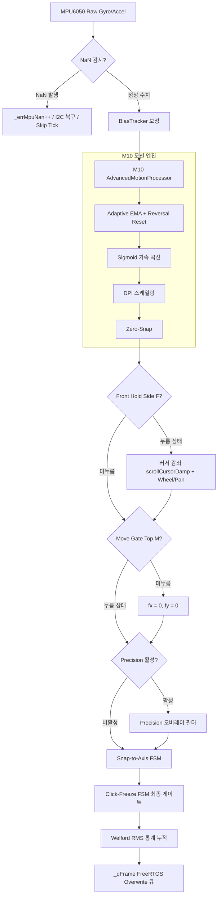
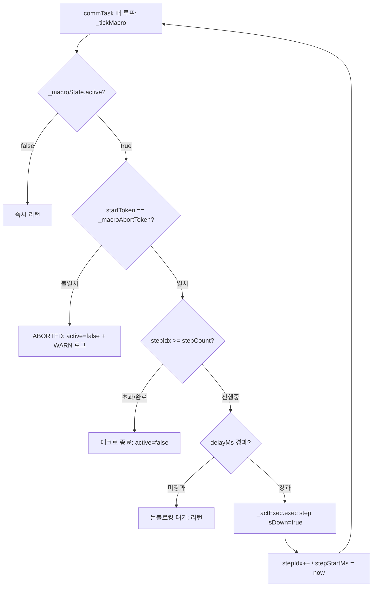
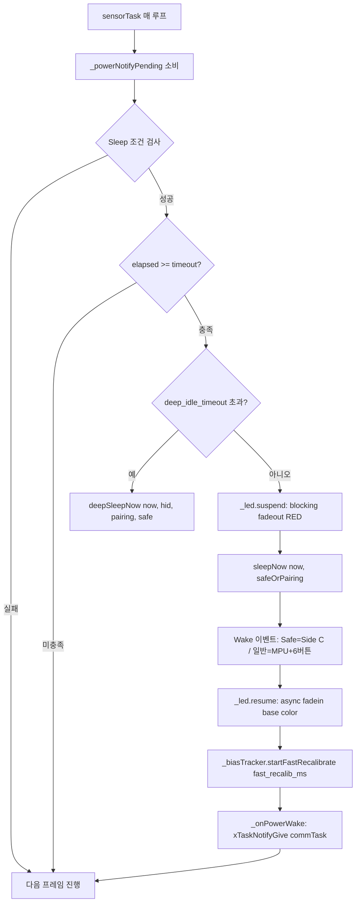
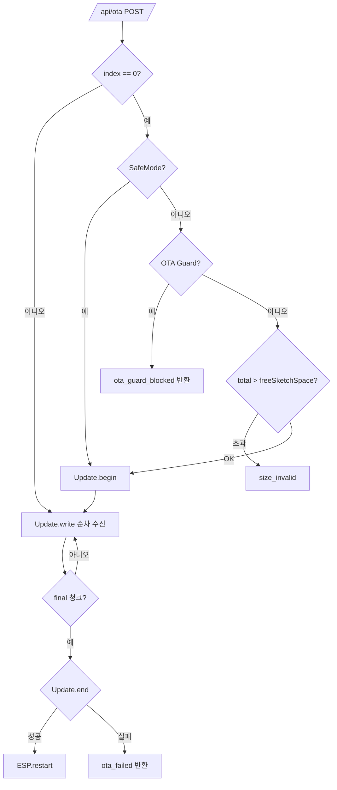
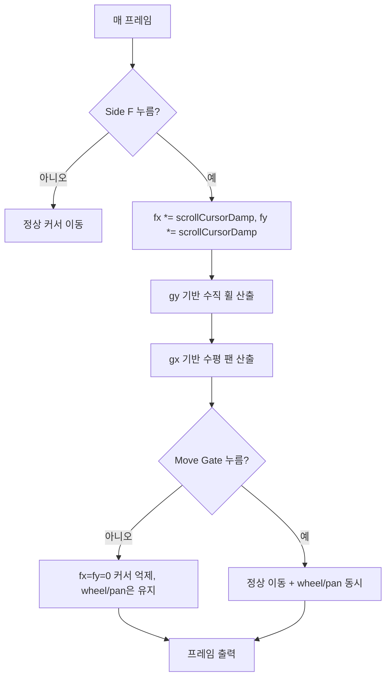
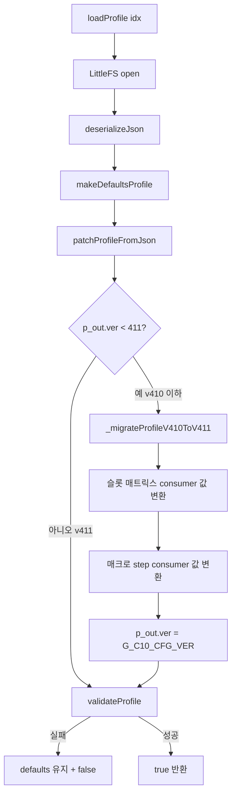
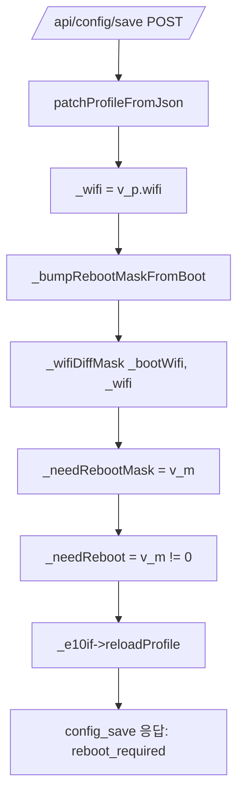

# FLOW_0415.md — 기능별 데이터 흐름 및 파이프라인 명세

> 대상 버전: `v0415` (ESP32-S3-Zero + MPU6050 AirMouse)  
> 위치: `src/v0415/docs_v0415/contract_doc/FLOW_0415.md`
> 최종 갱신: 2026-10-09 (rev8 — v0415: BB-1 제스처 sanitization, Consumer mask 마이그레이션, Safe/Pairing Wake Mask, `_fsmUpdate` 1-param)

---

## 1. 모션 처리 파이프라인 (`sensorTask` 내부, 8ms 주기)

MPU6050 센서 원시 데이터가 가공되어 최종 HID 전달 큐(`_qFrame`)로 출력되기까지의 직렬 파이프라인입니다.



### 파이프라인 순서 (v0415 확정, 10단계)

| 순서 | 단계 | 담당 | 비고 |
|:---:|---|---|---|
| 1 | NaN Guard | `sensorTask` | BiasTracker 오염 원천 차단 |
| 2 | BiasTracker 보정 | `M20` | Fast Recalib (Wake 후 config 지정 ms) |
| 3 | Adaptive EMA + Reversal Reset | `M10` | Phase 2 |
| 4 | Zero Snap + Sigmoid | `M10` | – |
| 5 | DPI Scaling + Accel Shaping | `E10` | – |
| 6 | Front Hold (Side F) | `E10` | 커서 감쇠 + Wheel/Pan, 전 Mode 일관 |
| 7 | Move Gate (Top M) | `E10` | 미누름 시 `fx=fy=0` |
| 8 | Precision FSM | `E10` | ENTRY/TRACK/EXIT |
| 9 | Snap-to-Axis | `E10` | Phase 3 |
| 10 | Click-Freeze | `E10` | **최종 게이트** (Phase 1) |

> **v0415 변경**: M10의 Click-Lock 삭제 (Phase 11.5에서 Click-Freeze가 대체). 파이프라인에서 Click-Lock 분기 완전 제거.

### 실패 및 예외 복구 경로
- **MPU NaN 감지 시**: `_errMpuNan++` 증가, 5회 연속 시 `_recoverI2C()` 실행 및 해당 틱 조기 건너뜀
- **Mutex Miss 발생 시 (`_state` 갱신 2ms 초과)**: `_errMutexMiss++` 증가 후 프레임 전송은 계속 진행

---

## 2. 프로파일 전환 파이프라인 (`switchProfile(idx)`)

웹 태스크 또는 내부 요청에 의해 프로파일을 전환할 때 시스템 안전성을 보장하는 순차 시퀀스입니다.

```mermaid
sequenceDiagram
    participant Web as Web / AsyncServer
    participant Core as E10 Core
    participant Q as FreeRTOS Queues
    participant Sensor as sensorTask
    participant Comm as commTask
    participant FS as LittleFS

    Web->>Core: switchProfile(newIdx)
    Note over Core: 1. 재진입 차단 플래그 검사
    Core->>Core: _lock(); _macroAbortToken++; active=false; _unlock()
    Core->>Q: 큐 드레인 (_qActionExec, _qHidCmd)
    Core->>Sensor: 리셋 위임 플래그 설정 (_reqResetBtnDisp, _reqResetGesture)
    Core->>Comm: 릴리즈 위임 플래그 설정 (_reqCommReleaseAll = true)
    Core->>Q: forceReleaseButtons() -> _qHidCmd 인큐
    Core->>FS: setActiveIndex(newIdx) & LittleFS 프로파일 로드
    Core->>Core: _cfgProfile 갱신 & 런타임 캐시 반영
    Core->>Core: _engine.resetEmaState() (v0415)
    Core->>Core: LED 모드 색상 + 화이트 0.5초 Flash
    Core-->>Web: 성공 반환 (true)
    Note over Sensor: 다음 8ms 틱에서 _btnDisp.resetAll(), _gesture.reset() 실행
    Note over Comm: 큐 소비 또는 플래그 확인 시 _actExec.releaseAll() 및 HID Button Release 수행
```

### v0415 변경
- `_macroAbortToken++` + `active=false`가 `_lock()` 하 원자적 (재정렬 방지)
- `_engine.resetEmaState()` 호출 추가 (Phase 5 Q2-a)
- `_reloadActiveProfile` 내 `static ST_C10_ProfileConfig_t` (스택 2.2KB 절감)

---

## 3. 액션 및 제스처 디스패치 흐름

물리 버튼 이벤트, 센서 제스처 및 웹 Live Test 요청이 슬롯 매핑을 거쳐 최종 실행되는 분기 구조입니다.

```mermaid
flowchart TD
    In[이벤트 입력: BtnDispatcher / Gesture 감지 / Web LiveTest] --> CheckHard{하드코딩 동작?}
    CheckHard -- Side F DOWN/UP --> F_Consume[_frontHoldActive 토글 후 즉시 소비 / return true]
    CheckHard -- Side C HOLD_3S --> HostCycle[_ble.exitPairing 후 Host Cycle]
    CheckHard -- 기타 하드동작 --> HardExec[모드전환 / 2s페어링 / MoveGate]
    CheckHard -- 일반 버튼/제스처 --> Resolve[_resolveSlot(_activeMode, trigger)]
    
    Resolve --> CheckKind{Action Slot Kind?}
    CheckKind -- EN_C20_ACT_NONE --> Drop[무시 / Drop]
    CheckKind -- EN_C20_ACT_SPECIAL --> SpecOrigin{호출 컨텍스트?}
    SpecOrigin -- sensorTask 내부 --> SpecDirect[_handleSpecial(param16) 직접 실행]
    SpecOrigin -- Web Task LiveTest --> SpecDeleg[_reqSpecialAction = param16 위임]
    SpecDeleg --> SensorLoop[다음 sensorTask 루프에서 동기 실행]
    CheckKind -- 기타 KEY/MOUSE/CONSUMER --> Sanitize[_sanitizeMomentarySlot: HOLD/REPEAT → TAP, isDown=true]
    Sanitize --> EnqAct[_enqueueAction(slot, isDown)]
    EnqAct --> QAct[_qActionExec (size=8)]
    
    QAct --> CommCons[commTask 드레인 루프]
    CommCons --> CheckMacro{slot.kind == MACRO?}
    CheckMacro -- Yes --> StartM[_startMacro(param32) — _lock 하 스냅샷 + replace]
    CheckMacro -- No --> ExecAct[_actExec.exec(slot, isDown)]
    StartM --> MacroTick[_tickMacro() 상태머신 전진]
```

### v0415 핵심 변경 — BB-1 공통 헬퍼 확장

**v0412 문제**: `_handleSlotButton`에만 sanitization 적용. `_handleGesture`(제스처)는 미적용 → Tilt Hold를 KB_REPEAT로 매핑 시 키 stuck.

**v0415 해결**: `_sanitizeMomentarySlot(slot)` namespace 정적 헬퍼로 통합:
- `MOUSE_HOLD` → `MOUSE_CLICK`
- `KB_REPEAT` → `KB_TAP`
- `CONSUMER_REPEAT` → `CONSUMER_TAP`
- `holdMode = EN_C20_HOLD_NONE` 강제

**적용 위치**:
- `_handleSlotButton` — 버튼 순간 이벤트(CLICK/DOUBLE/LONG)
- `_handleGesture` — 제스처 발동 (Flick/Linear/Tilt)

### Side C 이벤트 처리 (v0415)

| 이벤트 | 하드코딩 | 슬롯 매핑 |
|---|:---:|:---:|
| CLICK | – | ✓ (S11) |
| DOUBLE | ✓ (Mode Cycle) | – |
| LONG | **명시적 무시** (v0415) | – |
| HOLD_2S | ✓ (Pairing) | – |
| HOLD_3S | ✓ (Host Cycle + exitPairing) | – |

### Side F 이벤트 처리

| 이벤트 | 하드코딩 | 슬롯 매핑 |
|---|:---:|:---:|
| DOWN | ✓ (`_frontHoldActive = true` + return true) | – |
| UP | ✓ (`_frontHoldActive = false` + return true) | – |
| CLICK | – | ✓ (S9) |
| LONG | – | ✓ (S10) |

### 매크로 대체(Replace) 정책
- 이미 매크로가 실행 중일 때 `_startMacro(newIdx)` 호출 시 **abort 토큰 증가 없이 조용히 대체** (v0412 정책 유지)
- `switchProfile`/`_setActiveMode`/`forceReleaseButtons`/BLE disconnect/SafeMode 진입 시에는 반대로 `_lock()` 하 `_macroAbortToken++`로 명시적 abort

---

## 4. HID 커맨드 큐 처리 흐름 (commTask)

`_qHidCmd`를 통해 웹 태스크 및 내부 요청이 HID 실행을 위임하는 경로입니다. **오직 commTask만 `_mouse`/`_keyboard` 인스턴스를 제어**한다.

```mermaid
flowchart TD
    Producer[Web Task / Sensor Task] --> Enq[_enqueueHidCmd(cmd), timeout=0]
    Enq --> QHid[_qHidCmd size=4]
    QHid -- Full --> Fallback[RELEASE_ALL이면 _reqCommReleaseAll = true]
    QHid -- OK --> Comm[commTask 매 루프]
    Fallback --> Comm
    Comm --> GateCheck{_reqCommReleaseAll?}
    GateCheck -- Yes --> ForceRel[_actExec.releaseAll + _doReleaseAllButtons]
    GateCheck -- No --> Discard{QUEUE 비었나?}
    ForceRel --> Discard
    Discard -- 비었음 --> Next[다음 처리: _qActionExec]
    Discard -- 있음 --> CmdKind{cmd 종류}
    CmdKind -- RELEASE_ALL --> R1[_actExec.releaseAll + _doReleaseAllButtons]
    CmdKind -- TEST_PPT --> R3[_sendPptKey2]
    R1 --> Next
    R3 --> Next
```

### v0415 변경 — `ST_E10_HidCmd_t` 구조 축소
- `holdMs` 필드 삭제 (TEST_CLICK 삭제(rev5) 이후 Dead)

### commTask Gate 진입 시퀀스 (SafeMode / OTA Guard)

게이트 진입 시 commTask는 다음 순서로 큐를 정리:

1. `_lock()` 하 `_macroAbortToken++` + `active=false` (v0415 원자화)
2. `_qHidCmd` 드레인 (모든 대기 cmd 폐기)
3. `_qActionExec` 드레인 (모든 대기 액션 폐기)
4. `_qFrame` 1회 receive (stale frame 폐기 — gate 해제 후 1회 커서 점프 방지)
5. 최초 1회만 `_actExec.releaseAll` + `_doForceReleaseNow`
6. 20ms 대기 후 continue

---

## 5. 매크로 실행 상태머신 흐름 (`_tickMacro`)

`commTask` 루프 내에서 프레임 지연 없이 스텝별 딜레이와 실행을 제어하는 비동기 상태머신입니다.



### v0415 정책 명확화
- **"블로킹 없음"은 delay에 한정**. step 실행(`_actExec.exec`)은 HID tap 지속 (~28ms) 블로킹.
- 매크로 8 step × 28ms = 최대 224ms 누적 블로킹 (분산 실행).
- 커서 프레임 소비는 각 step 사이에 계속됨.

### `_startMacro` v0415 원자화

```
1. _lock()
2. prev active 검사 → WARN 로그 (replace)
3. profile valid + idx range 검증
4. _macroSnapshot = _cfgProfile.macros.macros[idx]
5. state 초기화 (macroIdx, stepIdx, stepStartMs, startToken)
6. _macroState.active = true   ← 마지막 write
7. _unlock()
```

### 취소 정책 (v0415 원자화)
- `_macroAbortToken` 카운터가 `_macroState.startToken`과 다르면 즉시 abort
- **`switchProfile`, `_setActiveMode`, `forceReleaseButtons`, BLE disconnect edge, SafeMode/OTA gate 진입** 시 `_lock()` 하 토큰 증가
- **`_startMacro(newIdx)` 자체는 토큰을 증가시키지 않음** (조용히 대체)

---

## 6. 전원 관리 흐름 (`sensorTask` 내부, v0415 Safe/Pairing 분기)



### Sleep 조건 (모두 만족)
- `!isSafeMode() && !isOtaGuard()`
- `!_moveGateHeld && !_frontHoldActive`
- `_qActionExec` 비어있음 + 매크로 미실행
- 유휴 시간 >= Mode/BLE/Pairing별 timeout

### v0415 Safe/Pairing Wake Mask 분기

| 시나리오 | 사용 마스크 |
|---|---|
| Light-sleep 일반 | `buildWakeMaskNormal()` (MPU + 6버튼) |
| Light-sleep Safe | `buildWakeMaskSafe()` (Side C 단독) |
| Light-sleep Pairing | `buildWakeMaskSafe()` |
| Deep-sleep 일반 | `buildWakeMaskButtons()` (6버튼, MPU 제외) |
| Deep-sleep Safe | `buildWakeMaskSafe()` (Side C 단독) |
| Deep-sleep Pairing | (sleep 금지 — `p_pairing` 시 return false) |

### SLEEP_NOW 즉시 진입 (v0415 Q4-a)

```
_handleSpecial(SLEEP_NOW):
  1. _led.suspend(snap)  — blocking fadeout RED
  2. safeOrPairing = (_safeMode || _ble.isPairing())
  3. _power.sleepNow(now, safeOrPairing)  — wake까지 blocking
  4. _led.resume(snap)  — async fadein
  5. if (didSleep && _cfgProfileValid)
         _biasTracker.startFastRecalibrate(_cfgProfile.e10.power.fast_recalib_ms)
```

**주의**: `fast_recalib_ms`는 **E10 config 단독 SSOT** (P20 필드 삭제, Round E).

---

## 7. OTA 및 안전 게이트 흐름 (W10)



### v0415 OTA Guard 체크 최적화 (Round M)
- **`index==0`에서만 Guard 체크** (매 청크마다 `getStatus()` 호출 제거)
- 성능 개선: N 청크 × getStatus() 락/CPU 부담 제거

### SafeMode 게이트 정책 (method-aware)
- **허용 (GET/POST)**: `/api/status`, `/api/diag`, `/api/keycodes`, `/api/safeboot`, `/api/ota`, `/api/factory_reset`, `/api/reboot`, `/api/config/export`, `/api/export`, `/api/config/rollback`
- **허용 (GET만)**: `/api/profiles/active`, `/api/profiles`, `/api/triggers`
- **차단**: `/api/config/save`, `/api/config/apply`, `/api/config/import`, `/api/control`, `/api/ppt/*`, `/api/profiles/{switch,create,delete,rename}`, `/api/action/test*`

---

## 8. Front Hold 스크롤 흐름



### 규약
- **감쇠 계수**: `scroll_cursor_damp` (기본 0.25)
- **휠 축**: `gy` (Pitch, 앞뒤 기울기)
- **팬 축**: `gx` (Roll, 좌우 기울기)
- **전 Mode 일관**

---

## 9. 스키마 마이그레이션 흐름 (v410 → v411)

v0412 프로파일을 v0415에서 로드할 때 자동 변환됩니다.



### Consumer 매핑 (G_C20_LEGACY_410_TO_415[16])

| old (v410) | new (v411) | 비고 |
|---|---|---|
| 0x0001 (VOL_UP) | 0x2000 (Bit 13) | – |
| 0x0002 (VOL_DOWN) | 0x4000 (Bit 14) | – |
| 0x0004 (MUTE) | 0x1000 (Bit 12) | – |
| 0x0008 (PLAY_PAUSE) | 0x0800 (Bit 11) | – |
| 0x0010 (STOP) | 0x0080 (Bit 7) | – |
| 0x0020 (NEXT_TRACK) | 0x0020 (unchanged) | – |
| 0x0040 (PREV_TRACK) | 0x0040 (unchanged) | – |
| 0x0080 (FF) | 0x0008 (Bit 3) | – |
| 0x0100 (REWIND) | 0x0010 (Bit 4) | – |
| 0x0200 (AC_BACK) | 0x200000 (WWW_BACK, Bit 21) | – |
| 0x0400 (AC_HOME) | 0x008000 (WWW_HOME, Bit 15) | – |
| 0x0800 (AC_SEARCH) | 0x080000 (WWW_SEARCH, Bit 19) | – |
| 0x1000 (POWER) | 0 (NONE) | Descriptor 미지원 → 사용자 재설정 |
| 0x2000 (TV_INPUT) | 0 (NONE) | Descriptor 미지원 |
| 0x4000 (CH_UP) | 0 (NONE) | Descriptor 미지원 |
| 0x8000 (CH_DOWN) | 0 (NONE) | Descriptor 미지원 |

### 영구 반영 정책
- `loadProfile`은 **메모리 내에서만** 마이그레이션 수행 (부작용 최소화)
- 디스크 반영은 다음 `saveProfile` 호출 시점 (lazy persist)
- `buildProfileJson`은 항상 `p_out["ver"] = G_C10_CFG_VER` (411) 기록

---

## 10. `_markNeedReboot` 되돌림 감지 흐름 (W10)



### v0415 정책
- `_bootWifi`: `begin()` 시점에 스냅샷 저장
- 매 저장 시 `boot` ↔ 현재 WiFi 상태 diff 재계산 → 되돌림 시 마스크 자동 클리어
- W10 8파일에서 `_bootWifi` 사용처: `begin()` (write), `_bumpRebootMaskFromBoot` (read)

---

## 11. 개정 이력

| 버전 | 날짜 | 변경 사항 |
|---|---|---|
| rev0 | 2026-09-15 | 최초 작성 (v0412) |
| rev1 | 2026-10-01 | §3 Macro 대체 정책, §1 모션 파이프라인 정합 |
| rev5 | 2026-10-02 | commTask Safe/OTA gate 드레인 시퀀스 |
| rev6 | 2026-10-07 | 매크로 삭제 시 슬롯 초기화 + 원자적 동반 저장 |
| rev7 | 2026-10-07 | 순간 트리거 단발화(BB-1), Host Cycle 페어링 취소(BB-2), Side F DOWN/UP 소비(BB-6) |
| **rev8** | **2026-10-09** | **v0415 리팩터**: BB-1 제스처 sanitization 공통 헬퍼, Consumer mask 마이그레이션(v410→v411), Safe/Pairing Wake Mask 분기, `_fsmUpdate(gyroAbs)` 1-param, M10 Click-Lock 삭제, `_startMacro` lock 원자화, `_bootWifi` 되돌림 감지 |
